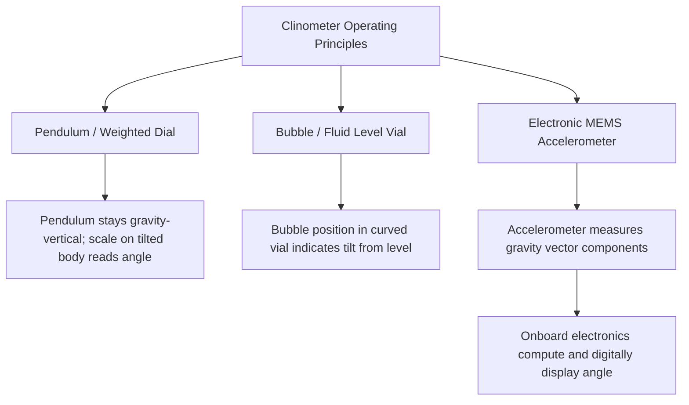

## Clinometers

### Overview

A clinometer (also called an inclinometer, tilt meter, or slope gauge in various application contexts) is an angular measuring instrument that determines the angle of inclination of a surface, line, or object **relative to the direction of gravity** (a horizontal or vertical reference), rather than relative to a second physical surface, as is the case with a bevel protractor. This distinction — measuring against a gravity-derived reference rather than a mechanically established second contact edge — defines the clinometer's fundamental operating principle and its characteristic application domain.

**Key Points**

- A clinometer requires only a single physical reference (its own body placed against or on the surface/object of interest); it does not require a second contact surface or blade, unlike a bevel protractor which measures the angle *between* two surfaces.
- Because the reference is gravity itself, a clinometer's accuracy and applicability are inherently tied to the local gravitational vertical/horizontal, making it well suited to measuring the slope, tilt, or inclination of a single surface or object relative to true level or true vertical, but not directly suited to measuring an angle between two arbitrary non-horizontal surfaces without additional geometric reasoning.

### Operating Principles

Clinometers employ one of several physical mechanisms to sense inclination relative to gravity:

#### Pendulum/Weighted Dial Mechanisms

A traditional mechanical clinometer uses a weighted pointer or dial (a pendulum) that remains oriented toward true vertical under gravity while the instrument body (and its graduated scale) is tilted with the object being measured; the angle between the pendulum's gravity-fixed orientation and the instrument body's scale directly indicates the inclination angle.

#### Bubble/Fluid Level Mechanisms

Similar in principle to a spirit level, a bubble-based clinometer uses a curved, fluid-filled vial with a graduated scale; the bubble's position within the curved vial indicates the angle of tilt relative to level, read directly against the scale markings.

#### Electronic (MEMS Accelerometer-Based) Mechanisms

Modern digital clinometers/inclinometers commonly use a **MEMS (Micro-Electro-Mechanical Systems) accelerometer**, an electronic sensor that measures the components of gravitational acceleration along its internal sensing axes; from these components, the device's onboard electronics calculate and digitally display the tilt angle relative to level or plumb.

**Key Points**

- MEMS accelerometer-based digital clinometers are, [Inference] based on their widespread commercial availability and integration into other tools (e.g., digital levels, smartphone-based inclinometer apps, and integrated angle-measurement functions on some digital protractors), the most common form found in modern industrial, construction, and quality control contexts, offering direct digital readout, typically finer resolution than mechanical pendulum or bubble types, and often additional features such as data logging, hold-value functions, and unit switching.
- All three mechanisms share the same fundamental limitation: since they reference gravity, they inherently measure angle relative to true horizontal/vertical, not relative to an arbitrary second surface — measuring the angle *between* two non-horizontal, non-vertical surfaces using a clinometer requires taking two separate readings (one against each surface) and computing the difference, rather than a single direct reading as a bevel protractor would provide.

### Construction (Typical Digital Clinometer)

- **Body/housing**: typically a rectangular or block-shaped body with one or more flat reference faces (bottom, and often one or more sides) designed to be placed directly against the surface being measured.
- **Sensing element**: the MEMS accelerometer (in digital types) or pendulum/bubble mechanism (in mechanical/analog types).
- **Display**: digital LCD readout (electronic types) or graduated dial/scale (mechanical types).
- **Magnetic base (common accessory feature)**: many digital clinometers designed for machine tool and metalworking applications include an integrated magnetic base, allowing the instrument to be securely attached to a ferrous machine surface, fixture, or workpiece for hands-free, stable angle measurement.
- **Zero/calibration adjustment**: a function (button on digital types, adjustable reference on mechanical types) allowing the instrument to be zeroed against a known reference surface, correcting for any inherent offset in the sensing mechanism.

### Applications

- **Machine tool setup and verification**: checking and setting the tilt of machine tool tables, spindles, or fixtures relative to true level or a specified reference angle, particularly common in machining, grinding, and boring applications requiring precise angular setup.
- **Sheet metal and fabrication work**: measuring bend angles, checking the slope of fabricated components, and verifying angular features on formed parts.
- **Construction and surveying**: measuring the slope of terrain, the pitch of roofs, or the inclination of structural elements — a widely recognized general-purpose application of clinometers outside strict precision metrology contexts.
- **Automotive and heavy equipment**: measuring caster, camber, or other angular alignment specifications relative to a level reference plane.
- **General quality control**: verifying that a manufactured surface or feature meets a specified angular tolerance relative to horizontal or vertical, particularly for larger workpieces or assemblies where a bevel protractor's blade-to-blade contact method would be impractical.

### Digital Clinometer Resolution and Accuracy

Commercial digital clinometers/inclinometers vary considerably in stated resolution and accuracy depending on grade and intended application:

| Grade/Application | Typical Resolution | Typical Accuracy |
| --- | --- | --- |
| General construction/DIY grade | $0.1°$ | $\pm 0.2°$–$0.5°$ |
| Precision machinist/toolroom grade | $0.01°$ or finer (some models to arc-minute or arc-second resolution) | $\pm 0.01°$–$0.05°$ |
| High-precision metrology-grade electronic level/clinometer | Arc-second resolution | Sub-arc-minute accuracy |

[Unverified — specific accuracy and resolution figures vary substantially by manufacturer and model; the table above represents general, illustrative order-of-magnitude ranges rather than figures applicable to any specific instrument, and a specific instrument's own manufacturer specification sheet should be consulted for its certified performance.]

### Sources of Error and Measurement Uncertainty

Applying the uncertainty budget framework (see: Uncertainty budgets), clinometer measurements are subject to:

- **Sensor resolution and quantization**: the fundamental digital display resolution (or, for mechanical types, the graduation interval) limits the finest distinguishable angular reading, contributing a Type B rectangular uncertainty analogous to other digital/graduated instruments.
- **Zero/calibration drift**: MEMS accelerometer-based sensors, and mechanical pendulum/bubble mechanisms alike, can exhibit drift or offset from their true zero reference over time, temperature change, or mechanical shock, necessitating periodic re-zeroing against a known level or vertical reference.
- **Base/contact surface flatness and cleanliness**: since the instrument's reading depends entirely on the orientation of its own reference face relative to the surface being measured, any gap, tilt, contamination, or irregularity between the instrument's base and the true surface being measured directly introduces a proportional angular error.
- **Sensor cross-axis sensitivity (electronic types)**: MEMS accelerometers can exhibit some sensitivity to acceleration or vibration along axes other than the intended sensing axis, particularly relevant if the instrument is used in an environment with mechanical vibration (e.g., near operating machinery) rather than a static setup.
- **Temperature sensitivity of the sensing element**: [Inference] both mechanical pendulum/bubble fluid viscosity/expansion characteristics and electronic MEMS sensor performance can exhibit some temperature dependence, though the magnitude of this effect varies by specific instrument design and is generally documented (if at all) in a specific manufacturer's technical specifications rather than being a universally quantifiable figure.
- **Local gravitational reference validity**: since the instrument references gravity, any local anomaly or the instrument's own mounting stability (e.g., resting on a non-rigid or vibrating support) can introduce apparent angular error unrelated to the true inclination of the surface being measured.

**Example**

A precision digital clinometer with a stated resolution of $0.01°$ and manufacturer-stated accuracy specification of $\pm 0.02°$ (treated as a rectangular Type B bound) is used to check a machine table tilt setting.

$$u_{res} = \frac{0.005°}{\sqrt{3}} \approx 0.00289°$$

$$u_{acc} = \frac{0.02°}{\sqrt{3}} \approx 0.01155°$$

Simplified combined standard uncertainty (these two components only):

$$u_c = \sqrt{0.00289^2 + 0.01155^2} \approx 0.0119°$$

$$U = 2 \times 0.0119 \approx 0.024° \quad (k=2)$$

Converting to arc-minutes for comparison with other angular instruments ($1° = 60'$):

$$U \approx 0.024° \times 60 \approx 1.4'$$

[Inference] This example uses illustrative manufacturer-specification-style figures for a precision-grade digital clinometer; a complete budget for a specific real-world application would also incorporate base-contact/flatness uncertainty for the specific surface being measured, zero-drift since the last calibration/re-zero, and, where relevant, vibration or thermal environmental factors specific to the measurement location — actual accuracy specifications should always be taken from the specific instrument's own certified documentation rather than assumed from general figures.

### Proper Use and Technique

- Ensure the clinometer's reference face is in full, clean contact with the surface being measured, free of debris, burrs, or contamination that could introduce a tilt offset.
- Zero/calibrate the instrument against a known level or vertical reference before critical measurements, particularly for mechanical pendulum/bubble types prone to gradual mechanical wear, and periodically for electronic types as part of routine verification.
- Where a magnetic base is used, verify secure, full contact with a clean, sufficiently flat ferrous surface to avoid introducing a mounting-related tilt error.
- Avoid taking readings in the presence of significant vibration (e.g., near running machinery) with sensor types sensitive to such disturbance, or allow the reading to stabilize per the manufacturer's guidance.
- Recognize that measuring the angle *between* two non-horizontal surfaces requires two separate clinometer readings and a subtraction calculation, rather than a single direct reading, and account for the combined uncertainty of both individual readings in any such derived angle.
- For precision metrology applications, verify the instrument's specific accuracy and resolution specifications from its own documentation rather than assuming general clinometer performance figures.

### Standards and Reference Documents

- **ISO 17123** series (surveying instrument accuracy testing procedures, referenced context for some clinometer/inclinometer applications, particularly construction/surveying-grade instruments)
- Manufacturer-specific accuracy and calibration specifications (dedicated, unified international standards specifically for precision machinist-grade clinometers are less extensive than for instruments such as gauge blocks or micrometers; governing practice for precision applications often derives from general angular metrology principles combined with manufacturer certification)

**Related Topics**

- Bevel protractors and universal bevel protractors (contrast: two-surface vs. gravity-referenced angle measurement)
- Spirit levels and precision levels
- Angle gauge blocks (calibration reference for clinometer zero verification)
- Autocollimators (high-precision angular measurement alternative)
- Uncertainty budgets (sensor-based digital instrument uncertainty components)
- MEMS accelerometer technology and sensor characteristics
- Machine tool geometric accuracy verification