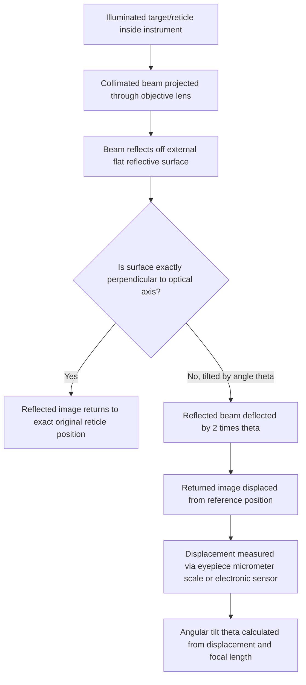

## Angle Dekkor

### Overview

The angle dekkor is a high-precision optical instrument used for measuring very small angular deviations, angular errors in machine tool components, and for calibrating angle gauge blocks and other high-accuracy angular reference standards. It operates on the **autocollimation principle**, making it a member of the broader autocollimator instrument family, but is specifically configured and commonly associated with workshop/toolroom-grade angular measurement of reflecting surfaces, particularly in the calibration and comparison of precision angle standards. The name "dekkor" derives from the instrument's original commercial naming (associated with early Hilger & Watts optical instruments) and has become a generic descriptive term within metrology for this class of autocollimating angle-measuring telescope.

**Key Points**

- The angle dekkor is fundamentally an application-specific autocollimator: it shares the same core optical principle (projecting a collimated beam and measuring the angular deflection of its reflection) as a general-purpose autocollimator, but is typically configured with features and accessories oriented toward angle gauge block and precision angular comparison work.
- Unlike contact-based angular instruments (bevel protractors, sine bars), the angle dekkor is a **non-contact optical instrument**, measuring angular deviation via reflected light rather than mechanical contact, making it capable of substantially finer angular resolution (typically to fractions of an arc-second) than mechanical or vernier-based angular instruments.

### The Autocollimation Principle

#### Basic Optical Concept

An autocollimator (and, specifically, the angle dekkor) projects a beam of collimated light (parallel rays) from an internal illuminated target/reticle, through an objective lens, toward a flat, reflective external surface (a mirror, or a highly polished reflective face on a workpiece, gauge, or angle gauge block). If that reflective surface is exactly perpendicular to the optical axis, the reflected light retraces its path back through the objective lens and forms an image of the target reticle exactly coincident with its own original position, as viewed through the instrument's eyepiece or measured electronically.

If the reflective surface is tilted by a small angle $\theta$ relative to perpendicular, the reflected beam is deflected by $2\theta$ (twice the surface tilt angle, a direct consequence of the law of reflection), causing the returned target image to be displaced from its original reference position by an amount proportional to this deflection and the instrument's focal length.

$$d = f \tan(2\theta) \approx 2f\theta \quad \text{(for small } \theta \text{, in radians)}$$

Where $d$ is the measured image displacement, $f$ is the objective lens focal length, and $\theta$ is the angular tilt of the reflecting surface. Solving for the tilt angle:

$$\theta \approx \frac{d}{2f}$$

**Key Points**

- The factor-of-2 relationship between surface tilt and beam deflection (from the law of reflection) means the autocollimation principle is inherently sensitive: a small physical tilt produces a proportionally larger optical deflection, contributing to the technique's characteristic high angular resolution.
- Because the measurement is based on light reflection rather than mechanical contact, there is no measuring force, contact wear, or mechanical backlash involved in the fundamental sensing mechanism — a significant advantage over contact-based angular instruments for very high-precision work, though the instrument's own optical and mechanical construction (mounting, focus mechanism, reading scale) introduces its own distinct sources of uncertainty.

### Construction

- **Light source and illuminated reticle/target**: internally illuminated graticule pattern (often a cross-line or similar target) that forms the basis of the projected and returned image.
- **Collimating objective lens**: converts the diverging light from the illuminated target into a parallel (collimated) beam directed toward the external reflecting surface.
- **Eyepiece with micrometer scale (visual/mechanical types)**: allows the operator to view the returned target image and measure its displacement from the reference position using a fine micrometer-drum-driven cross-hair or scale, converting the optical displacement measurement into a direct angular reading via the instrument's calibrated scale.
- **Electronic image sensor (digital/electronic autocollimator variants)**: in modern electronic instruments, a photodetector array or camera sensor replaces the visual eyepiece and manual micrometer measurement, providing direct digital angular readout and, commonly, data logging capability.
- **Rigid mounting stand/fixture**: the instrument itself must be mounted with high mechanical stability, since any movement of the instrument relative to the reflecting surface during measurement directly introduces spurious angular reading error.

### Applications

- **Angle gauge block calibration**: verifying the actual angle of angle gauge blocks against a master reference or by direct comparison, supporting the traceability chain for angular standards (see: Angle gauge blocks).
- **Machine tool geometric accuracy testing**: measuring small angular deviations in machine tool components — for example, checking the straightness of a machine tool way (slideway) by measuring the angular tilt of a reflective target mounted on a carriage as it traverses the way, with cumulative small-angle measurements at intervals used to reconstruct an overall straightness profile.
- **Squareness and parallelism verification**: checking the squareness of machine tool components or fixture surfaces relative to one another via sequential autocollimator readings against reflective targets on each surface.
- **Flatness measurement (in combination with an optical flat or reflective straightedge)**: sequential small-angle readings along a surface, combined with known measurement interval spacing, allow reconstruction of a surface's flatness profile — a technique related to, but distinct from, direct optical flat interferometry.
- **Comparative measurement of high-precision angular standards**: direct comparison between a master angle standard and a working angle standard, identifying small deviations between them.

### Angle Dekkor vs. General-Purpose Autocollimator

| Feature | Angle Dekkor (typical configuration) | General-Purpose Autocollimator |
| --- | --- | --- |
| Primary orientation | Angle gauge block and precision angular standard comparison | Broad range of angular/straightness/flatness metrology applications |
| Common accessories | Angle gauge block holding fixtures, comparison attachments | Wider range of application-specific targets and fixtures |
| Reading mechanism | Traditionally visual eyepiece with micrometer scale (classic instruments); electronic variants also exist | Both visual and electronic variants common across the broader autocollimator category |

**Key Points**

- [Inference] In contemporary usage, the specific term "angle dekkor" is often used somewhat interchangeably with "autocollimator" in general toolroom and metrology contexts, reflecting the historical prominence of the original Hilger & Watts angle dekkor instrument in defining this application category; the underlying optical principle and general construction are shared across the broader autocollimator instrument family, with "angle dekkor" persisting as a widely recognized descriptive/historical name particularly for workshop-grade angular comparison instruments.

### Sources of Error and Measurement Uncertainty

Applying the uncertainty budget framework (see: Uncertainty budgets), angle dekkor/autocollimator measurements are affected by:

- **Instrument reading resolution**: the finest distinguishable displacement on the eyepiece micrometer scale (visual types) or the digital resolution of the electronic sensor (digital types) directly caps the achievable angular resolution via the $\theta \approx d/(2f)$ relationship.
- **Reflecting surface quality**: the flatness, surface finish, and cleanliness of the external reflecting surface directly affect the sharpness and position accuracy of the returned target image; a poor-quality or contaminated reflective surface degrades achievable measurement precision.
- **Instrument and target mounting stability**: since the measurement depends on the relative angular relationship between the instrument's optical axis and the external reflective surface, any relative movement, vibration, or thermal drift between the instrument mount and the target during measurement directly introduces spurious angular error.
- **Focal length calibration**: the instrument's own effective focal length, $f$, used in the displacement-to-angle conversion, carries its own calibration uncertainty, which propagates directly (as a multiplicative factor) into every angular reading.
- **Atmospheric effects (air turbulence/refraction)**: over longer optical path lengths, particularly relevant to straightness or flatness measurements spanning larger distances, air temperature gradients or turbulence can introduce small optical beam deflections unrelated to the true angular deviation of the target surface — a consideration shared with other precision optical metrology techniques such as laser interferometry.
- **Operator judgment (visual instruments)**: precise identification of the returned target image's center/alignment position via the eyepiece micrometer involves an element of operator visual judgment, analogous in character to vernier coincidence-reading, though the specific technique and typical achievable repeatability differ from mechanical vernier reading.
- **Thermal stability of the instrument and target mount**: given the high angular resolution these instruments are capable of, thermal expansion of the mounting fixtures or instrument body over the course of an extended measurement sequence can introduce a slow drift unrelated to the true angular quantity being measured.

**Example**

An angle dekkor with an effective focal length of $f = 500\ \text{mm}$ has a stated eyepiece reading resolution of $d = 0.001\ \text{mm}$ (rectangular Type B distribution across this resolution interval).

$$u_d = \frac{0.0005}{\sqrt{3}} \approx 0.000289\ \text{mm}$$

Converting this displacement uncertainty to an angular uncertainty via $\theta \approx d/(2f)$:

$$u_\theta \approx \frac{u_d}{2f} = \frac{0.000289}{2 \times 500} \approx 0.000000289\ \text{rad}$$

Converting to arc-seconds:

$$u_\theta \approx 0.000000289 \times 206265 \approx 0.06\ \text{arc-seconds}$$

$$U_\theta \approx 2 \times 0.06 = 0.12\ \text{arc-seconds} \quad (k=2)$$

[Inference] This example illustrates the general order-of-magnitude angular resolution achievable from the eyepiece reading resolution alone in a well-focused, optically ideal setup; a complete production uncertainty budget for a real angle dekkor measurement would additionally incorporate reflecting surface quality, mounting stability, focal length calibration uncertainty, and — for longer optical paths — atmospheric effects, any of which could dominate over the pure reading-resolution contribution depending on the specific measurement setup and application.

### Proper Use and Technique

- Ensure the external reflecting surface (mirror, angle gauge block face, or target) is clean, undamaged, and of sufficient optical flatness/finish quality for the required measurement precision.
- Mount both the instrument and the target/reflecting surface on stable, vibration-isolated supports where high precision is required, minimizing any relative movement during the measurement sequence.
- Allow adequate thermal stabilization time for the instrument, mounting fixtures, and target before beginning precision measurements, particularly for extended measurement sequences.
- For longer optical path applications (e.g., machine way straightness testing), be aware of and, where feasible, control or account for atmospheric refraction/turbulence effects along the beam path.
- Periodically verify the instrument's focal length calibration and overall angular accuracy against a certified angle standard (such as a calibrated angle gauge block or master autocollimator), maintaining the traceability chain.
- For visual (eyepiece) instruments, practice consistent target image alignment technique to minimize operator-dependent reading variability, analogous to developing consistent technique for vernier coincidence reading.

### Standards and Reference Documents

- **ISO 10360** series (coordinate measuring machine and related precision instrument verification context, referenced where autocollimator-based geometric testing intersects with broader dimensional metrology standards)
- **ASME B5.54** and related machine tool geometric accuracy testing standards (autocollimator-based straightness/squareness testing procedures for machine tools)
- Manufacturer-specific angle dekkor and autocollimator accuracy specifications (dedicated, unified international standard coverage specifically for angle dekkor instruments is less extensive than for gauge blocks or micrometers; much governing practice derives from manufacturer certification and general optical angular metrology principles)

**Related Topics**

- Angle gauge blocks (primary calibration/comparison application)
- Sine bars and sine centers (alternative trigonometric angle-generation, contrasted non-contact vs. contact technique)
- Autocollimators (broader instrument category)
- Optical flats and light-band interferometric comparison techniques
- Machine tool geometric accuracy verification (straightness, squareness testing)
- Uncertainty budgets (optical angular measurement uncertainty propagation)
- Laser interferometry in precision length and angle metrology