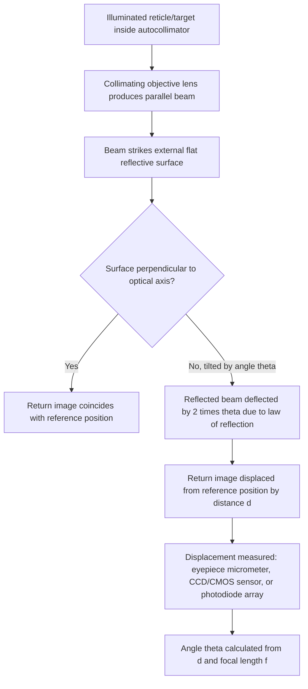
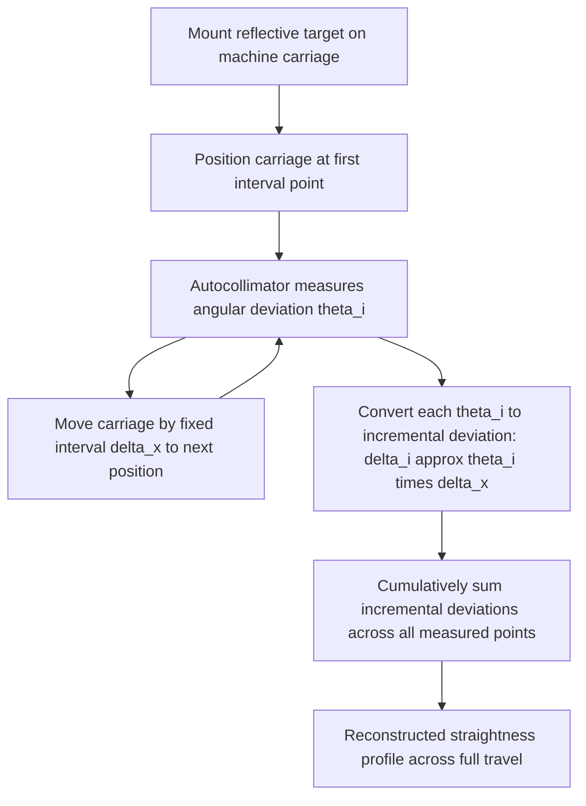

## Autocollimators

### Overview

An autocollimator is a high-precision optical instrument used to measure small angular displacements and deviations, most commonly of a flat reflective surface relative to the instrument's own optical axis, without physical contact between the instrument and the surface being measured. Autocollimators represent the broader instrument category within which the angle dekkor (see: Angle dekkor) is a specifically application-oriented member, and they serve as one of the highest-resolution angular measurement techniques generally available in dimensional and angular metrology, commonly capable of resolving fractions of an arc-second.

**Key Points**

- Autocollimators are **non-contact** instruments: they measure angular deviation via reflected collimated light, avoiding the mechanical contact force, wear, and backlash considerations inherent to contact-based angular instruments such as bevel protractors or sine bars.
- The technique measures **angular deviation of a surface relative to the instrument's optical axis**, not a direct angle between two arbitrary surfaces in the way a bevel protractor does; deriving other angular or geometric quantities (straightness, squareness, flatness) from autocollimator readings requires a defined measurement sequence and, typically, a mounted reflective target rather than a single direct reading.

### The Autocollimation Principle

#### Core Optical Concept

An autocollimator projects a beam of collimated (parallel) light from an internally illuminated target/reticle, through a collimating objective lens, onto an external flat, reflective surface. If this surface is exactly perpendicular to the optical axis, the reflected beam retraces its path and forms a return image of the reticle exactly coincident with its original position. If the reflective surface is tilted by a small angle $\theta$, the law of reflection causes the reflected beam to be deflected by $2\theta$, displacing the returned image by an amount:

$$d = f \tan(2\theta) \approx 2f\theta \quad \text{(small-angle approximation, } \theta \text{ in radians)}$$

Solving for the angle:

$$\theta \approx \frac{d}{2f}$$

Where $f$ is the instrument's effective focal length and $d$ is the measured displacement of the returned image from its reference (zero-tilt) position.

**Key Points**

- The doubling of the angular deflection relative to the physical surface tilt (a direct geometric consequence of reflection) is fundamental to the autocollimator's high sensitivity, effectively providing intrinsic angular amplification before any further optical or electronic magnification is applied.
- Because measurement is purely optical, the technique is fundamentally limited by the quality (flatness, reflectivity, cleanliness) of the external target surface and by atmospheric/environmental stability along the optical path, rather than by mechanical wear or contact force considerations relevant to contact-type angular instruments.

### Types of Autocollimators

#### Visual Autocollimators

The earliest and simplest form, using a human-viewed eyepiece with a graduated micrometer scale or drum to measure the displacement of the returned reticle image relative to a fixed reference cross-hair, with the operator manually adjusting the micrometer until visual coincidence/alignment is achieved.

#### Photoelectric (Electronic) Autocollimators

Replace the visual eyepiece with an electronic photodetector — historically a linear photodiode array or position-sensitive detector, and in modern instruments commonly a CCD or CMOS image sensor — providing:

- Direct digital angular readout without operator visual judgment of coincidence.
- Higher measurement speed, enabling dynamic or continuous angular monitoring rather than only static point-by-point readings.
- Data logging and computer interfacing capability, supporting automated measurement sequences (e.g., stepping along a machine way at defined intervals for straightness testing).
- Generally improved repeatability compared to visual reading, since operator-dependent coincidence judgment is eliminated.

#### Dual-Axis Autocollimators

Capable of simultaneously measuring angular deviation in two orthogonal axes (e.g., both pitch and yaw of a reflective target) from a single reading, rather than requiring the target or instrument to be reoriented between separate single-axis measurements — valuable for applications such as simultaneous verification of two perpendicular geometric error components on a single machine tool axis.

**Key Points**

- [Inference] Photoelectric and dual-axis autocollimators are increasingly favored in modern precision metrology and machine tool calibration contexts due to their measurement speed, reduced operator-dependent variability, and direct data logging capability, though visual autocollimators remain in use, particularly in contexts where instrument cost, simplicity, or independence from electronic components is prioritized.

### Applications

- **Angle gauge block calibration and comparison**: verifying angle gauge block angles against master references (see: Angle gauge blocks), a specific and historically prominent application closely associated with the angle dekkor configuration of autocollimator.
- **Machine tool geometric accuracy testing**: measuring angular errors (pitch, yaw, roll) of machine tool axes as a carriage or table traverses its travel, and reconstructing straightness profiles of machine ways by combining a sequence of small-angle readings taken at defined intervals along the travel.
- **Squareness verification**: comparing the angular orientation of two nominally perpendicular surfaces or machine axes by sequential autocollimator readings against reflective targets mounted on or aligned with each.
- **Flatness and parallelism measurement**: using a sequence of autocollimator readings combined with a reflective straightedge or a set of angularly-related reflective targets to reconstruct a surface's flatness or two surfaces' parallelism.
- **Optical component and system alignment**: verifying the alignment of optical elements (mirrors, lenses, prisms) in instrument manufacturing and precision optical assembly, an application area extending beyond conventional dimensional metrology.
- **Spindle and axis wobble/tilt measurement**: monitoring dynamic angular deviation of a rotating or translating machine element, particularly with photoelectric autocollimators capable of continuous or high-speed data acquisition.

### Reconstructing Straightness from Sequential Angular Readings

A characteristic and important autocollimator application is machine tool way (slideway) straightness measurement, which illustrates how a sequence of small-angle optical readings is converted into a linear straightness profile.

1. A reflective target (often incorporating a small precision mirror) is mounted on the machine carriage or table.
2. The carriage is moved to a sequence of defined positions at fixed intervals $\Delta x$ along its travel.
3. At each position, the autocollimator measures the small angular deviation $\theta_i$ of the target relative to the optical axis.
4. Each angular reading is converted to a corresponding small height/straightness deviation over that interval: $\delta_i \approx \theta_i \times \Delta x$ (for small angles, using the arc-length approximation).
5. These incremental deviations are cumulatively summed to reconstruct the overall straightness profile of the way across its full travel.

**Key Points**

- This cumulative summation approach means that any small error in an individual angular reading propagates and accumulates into the reconstructed straightness profile at all subsequent points along the sequence — making careful control of each individual reading's uncertainty particularly important for this specific application, since errors do not average out but compound progressively along the measured length.

### Sources of Error and Measurement Uncertainty

Applying the uncertainty budget framework (see: Uncertainty budgets), autocollimator measurements are affected by:

- **Instrument reading/display resolution**: the finest distinguishable displacement (visual micrometer) or digital angular increment (photoelectric types) directly caps achievable resolution via the $\theta \approx d/(2f)$ relationship.
- **Target reflective surface quality**: flatness, surface finish, and cleanliness of the external mirror/reflective target directly affect the sharpness and positional accuracy of the returned image.
- **Mounting and mechanical stability**: relative movement, vibration, or looseness between the instrument, its mount, and the target during a measurement sequence introduces spurious angular readings unrelated to the true quantity being measured — of particular concern for extended sequential measurements such as straightness reconstruction, where instability at any point compromises the entire subsequent profile.
- **Focal length calibration**: the instrument's effective focal length used in the displacement-to-angle conversion carries its own calibration uncertainty, propagating multiplicatively into every reading.
- **Atmospheric effects (air turbulence, refractive index gradients)**: particularly significant over longer optical path lengths, temperature gradients in the air along the beam path can introduce beam deflection unrelated to true target tilt — a well-recognized limitation shared with other long-path optical metrology techniques such as laser interferometry.
- **Cumulative/compounding error in sequential measurements**: as discussed above, straightness or profile reconstruction from a series of angular readings causes individual reading errors to accumulate rather than average out across the sequence, requiring careful attention to each individual measurement's quality.
- **Thermal stability of instrument and mounting fixtures**: over extended measurement sequences, thermal drift in the instrument body or mounting hardware can introduce a slow, systematic bias distinct from random reading-to-reading variation.
- **Operator judgment (visual instruments only)**: precise identification of return image coincidence via the eyepiece micrometer, analogous in character (though not mechanism) to vernier coincidence-reading uncertainty.

**Example**

An autocollimator with focal length $f = 500\ \text{mm}$ and photoelectric sensor resolution equivalent to $d = 0.0002\ \text{mm}$ displacement (rectangular Type B) is used for a single-point angular reading.

$$u_d = \frac{0.0001}{\sqrt{3}} \approx 0.0000577\ \text{mm}$$

$$u_\theta \approx \frac{u_d}{2f} = \frac{0.0000577}{1000} \approx 0.0000000577\ \text{rad}$$

Converting to arc-seconds:

$$u_\theta \approx 0.0000000577 \times 206265 \approx 0.012\ \text{arc-seconds}$$

$$U_\theta \approx 2 \times 0.012 = 0.024\ \text{arc-seconds} \quad (k=2)$$

[Inference] This example illustrates order-of-magnitude resolution-based uncertainty for a single reading under idealized conditions; for a sequential straightness measurement application specifically, the relevant reported uncertainty would need to additionally account for the cumulative propagation of each individual reading's uncertainty across the full measurement sequence (which generally combines via root-sum-square across the number of measured intervals, assuming independent errors at each point), rather than reflecting only the single-reading resolution-based figure shown here.

### Proper Use and Technique

- Ensure the external reflective target/mirror is clean, undamaged, and of adequate optical flatness and surface finish quality for the intended measurement precision.
- Mount both the instrument and the target on stable, ideally vibration-isolated supports, minimizing relative movement throughout the measurement sequence.
- Allow thorough thermal stabilization of the instrument, mounting fixtures, and measurement environment before beginning precision work, particularly for extended sequential measurements.
- For longer optical paths, be aware of and, where practical, control or characterize atmospheric turbulence/refraction effects along the beam.
- For sequential straightness or profile reconstruction measurements, take care with each individual reading's quality, since errors compound cumulatively rather than averaging out across the measurement sequence.
- Periodically verify the instrument's calibration (focal length, overall angular accuracy) against a certified angular reference such as a calibrated angle gauge block or master autocollimator.

### Standards and Reference Documents

- **ISO 230-1** — Test code for machine tools — Part 1: Geometric accuracy of machines operating under no-load or quasi-static conditions (autocollimator-based straightness and angular error testing methodology for machine tools)
- **VDI/VDE 2634** and related optical metrology standards (context for optical angular measurement instrument verification)
- Manufacturer-specific autocollimator accuracy and calibration specifications

**Related Topics**

- Angle dekkor (application-specific autocollimator configuration)
- Angle gauge blocks (calibration/comparison application)
- Sine bars and sine centers (contact-based trigonometric angle generation, contrasted with non-contact optical technique)
- Machine tool geometric accuracy verification (straightness, squareness, pitch/yaw/roll testing)
- Optical flats and light-band interferometric comparison techniques
- Laser interferometry in precision length and angle metrology
- Uncertainty budgets (cumulative error propagation in sequential measurement)