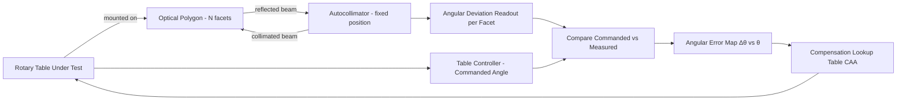

## Rotary and Indexing Tables

### Overview

Rotary and indexing tables are precision instruments used to position a workpiece or measurement probe at controlled angular increments about a fixed axis. They serve dual roles in metrology: as **manufacturing aids** for machining operations requiring precise angular division (drilling bolt circles, milling gear teeth, cutting splines), and as **calibration/inspection instruments** for measuring angular deviation, indexing accuracy, and angular positioning error in components such as gears, polygons, and optical encoders.

### Fundamental Types

#### Manual Indexing Tables (Dividing Heads)

**Key Points**

- Use a worm-and-worm-wheel mechanism, typically with ratios such as 40:1 or 90:1
- Angular position is set using an index plate with rings of equally spaced holes and a spring-loaded index pin
- Direct indexing, simple indexing, and differential indexing are the three classical methods for achieving divisions not directly obtainable from the index plate alone
- Primarily used in manual milling and workshop applications rather than high-precision metrology labs

#### Optical/Precision Rotary Tables

- Feature a hardened, ground worm and bronze worm wheel, or increasingly, direct-drive torque motors
- Angular readout via optical circular scale (glass or metal grating) read by one or more optical encoder heads
- Used on CMMs, gear measuring machines, and roundness testers as the primary rotational reference axis

#### Direct-Drive (Torque Motor) Rotary Tables

- Eliminate mechanical gear trains (worm/wheel, belts) entirely — the rotor is directly coupled to the table
- Removes backlash, hysteresis, and wind-up error inherent to geared systems
- Typically paired with high-resolution rotary encoders (inductive, optical, or capacitive) offering sub-arcsecond resolution
- [Inference] Preferred in modern high-precision applications (semiconductor inspection, gear metrology) due to superior dynamic response and elimination of periodic gear-tooth error, though at higher cost than worm-driven designs

#### Indexing Tables with Curvic or Hirth Couplings

- Use precision-ground radial face gear teeth (Curvic coupling — trademarked by Gleason) to achieve exact, repeatable angular positions
- Provide extremely high repeatability (sub-arcsecond) at discrete fixed angles, but not continuous positioning
- Common in aerospace/turbine manufacturing fixtures and gear-cutting index heads

### Key Performance Specifications

| Parameter | Description | Typical Range (Precision Tables) |
| --- | --- | --- |
| Resolution | Smallest addressable angular increment | 0.001° to 0.0001° (0.36 to 3.6 arcsec) |
| Positioning accuracy | Deviation between commanded and actual angle | ±1 to ±5 arcsec |
| Repeatability | Variation returning to the same commanded position | ±0.5 to ±2 arcsec |
| Wobble (axial runout) | Out-of-plane motion of the table face during rotation | < 1 μm |
| Radial runout (eccentricity) | Lateral deviation of the rotation axis | < 1–2 μm |
| Load capacity | Maximum axial/radial load without accuracy degradation | Application-dependent |

[Unverified] Exact specification values vary significantly by manufacturer, table diameter, and product tier; the ranges above represent commonly seen classes of precision rotary tables and should be confirmed against specific manufacturer datasheets for a given instrument.

### Angular Position Error Sources

**Key Points**

- **Eccentricity error**: The rotation axis of the table does not coincide with the geometric center of the graduated scale, producing a sinusoidal error component with one cycle per revolution
- **Graduation error**: Imperfections in the scale/encoder pattern itself, which can be periodic (repeating within one pitch of the grating) or non-periodic
- **Worm/wheel error** (geared tables only): Periodic error from manufacturing imperfections in the worm and worm wheel, plus backlash on direction reversal
- **Bearing error (wobble/tilt)**: Non-repeatable or systematic axial and radial runout from bearing imperfections
- **Thermal drift**: Angular readings drift due to thermal expansion of the table structure or encoder substrate

#### Eccentricity Error Model

For a scale/encoder disk mounted with a small eccentricity $e$ relative to the true rotation axis, the resulting angular reading error $\Delta\theta$ approximates:

$$\Delta\theta \approx \frac{e}{R}\sin(\theta - \theta_0)$$

where $R$ is the radius of the graduated scale, $\theta$ is the nominal angle, and $\theta_0$ is the phase angle of maximum eccentricity. This produces a first-harmonic (once-per-revolution) sinusoidal error pattern, which is why eccentricity calibration typically uses a **reversal technique** (comparing readings from two diametrically opposed encoder heads, or the "two-face" method) to cancel it out.

### Calibration Methods

#### Autocollimator + Polygon Method

The most common method for calibrating rotary table angular accuracy:

1. A precision optical polygon (typically 12, 24, or 72 facets) is mounted on the table
2. An autocollimator is fixed and aimed at each polygon facet in sequence as the table indexes through nominal angles
3. The autocollimator reads the angular deviation of each facet from its nominal position (facet angles are separately calibrated/certified)
4. Table indexing error at each nominal angle is derived by comparing the table's commanded rotation to the autocollimator-measured actual rotation between facets

$$\text{Error}(\theta_i) = \theta_{commanded,i} - \theta_{measured,i}$$

**Example**

For a 24-facet polygon (15° per facet), the table indexes in 15° steps; the autocollimator records the small angular deviation at each facet, building a full 360° error map with 24 data points, often interpolated into a continuous correction curve.

#### Laser-Based Angular Interferometry

- Uses a rotary/angular interferometer accessory (e.g., angular optics on a laser interferometer system) for continuous, high-resolution angular measurement
- Provides finer angular resolution than discrete polygon facets and can capture continuous error curves rather than discrete-point data
- [Inference] Generally offers better traceability directly to the wavelength standard, though setup complexity and alignment sensitivity are higher than the polygon/autocollimator method

#### Circular Grating/Encoder Comparison (Master-vs-Unit-Under-Test)

- A reference-grade rotary encoder (master) is coupled coaxially or compared against the table under test
- Differences between master and UUT readings across a full revolution reveal the table's error map
- Common in encoder manufacturer calibration labs and high-volume production calibration

### Reversal Technique for Self-Calibration

A specialized method that separates the table's own error from the error of the calibration artifact (e.g., polygon) without needing an independently pre-calibrated reference:

1. Measure the polygon at position 1 (0° table rotation reference)
2. Rotate the polygon 180° (or by a defined offset) relative to the table and re-measure
3. Combine the two data sets mathematically to isolate the table error function from the polygon error function, since they superimpose differently between the two setups

[Inference] This technique is analogous to reversal methods used in straightness and flatness calibration (e.g., the reversal method for granite surface plates), applying the same principle of separating instrument error from artifact error through geometric superposition.

### Error Map and Compensation

Once an error map $\Delta\theta(\theta)$ is established across the full 360° range, most modern rotary table controllers support **software error compensation**:

$$\theta_{corrected} = \theta_{commanded} - \Delta\theta(\theta_{commanded})$$

This compensation table (often called a CAA — Compensation for Angular Alignment — or lookup table) is loaded into the table's controller/firmware, and interpolation (typically linear or spline) is applied between calibrated points.

### Application in Gear Metrology

Rotary tables are the primary angular reference axis in **gear measuring machines (GMMs)**, where the table rotates a gear under test while a stylus probes each tooth flank. Table angular accuracy directly propagates into measured values such as:

- **Single pitch deviation** ($f_{pt}$)
- **Cumulative pitch deviation** ($F_p$)
- **Profile and helix deviations** (indirectly, through rotational synchronization with the axial probe motion)

[Inference] Because pitch measurement uncertainty is directly coupled to table angular uncertainty, GMM rotary tables typically require significantly tighter angular accuracy specifications than general-purpose rotary tables used for machining fixtures.

### Diagram: Autocollimator–Polygon Calibration Setup

### Visual: Eccentricity Error Geometry

<svg xmlns="http://www.w3.org/2000/svg" viewBox="0 0 600 400">
<text x="300" y="24" text-anchor="middle" font-size="16" font-weight="bold" fill="#1a1a1a">Rotary Table Eccentricity Error (svg_diagram)</text>
<circle cx="300" cy="220" r="140" fill="none" stroke="#2b6cb0" stroke-width="2" />
<circle cx="300" cy="220" r="3" fill="#2b6cb0" />
<text x="300" y="200" text-anchor="middle" font-size="11" fill="#2b6cb0">True rotation axis O</text>
<circle cx="312" cy="210" r="2.5" fill="#e53e3e" />
<text x="345" y="205" font-size="11" fill="#e53e3e">Scale center O'</text>
<line x1="300" y1="220" x2="312" y2="210" stroke="#e53e3e" stroke-width="2" />
<text x="320" y="235" font-size="11" fill="#e53e3e">e (eccentricity)</text>
<line x1="300" y1="220" x2="440" y2="220" stroke="#666" stroke-width="1" stroke-dasharray="3,2" />
<line x1="300" y1="220" x2="386" y2="121" stroke="#38a169" stroke-width="1.5" />
<text x="400" y="115" font-size="11" fill="#38a169">Facet at θ (nominal)</text>
<path d="M 340 220 A 40 40 0 0 0 331 191" fill="none" stroke="#666" stroke-width="1" />
<text x="345" y="205" font-size="10" fill="#666" />
<text x="150" y="370" font-size="12" fill="#333">Δθ ≈ (e / R) · sin(θ − θ₀) — sinusoidal, one cycle per revolution</text>
</svg>

### Common Pitfalls

- **Ignoring warm-up time**: Torque-motor and worm-drive tables can exhibit thermal drift during the first operational period; calibration performed cold vs. warm can show measurable discrepancies
- **Neglecting load-dependent deflection**: Heavy workpieces can introduce bearing deflection and tilt not present during a no-load calibration
- **Confusing resolution with accuracy**: A table with 0.0001° encoder resolution does not guarantee 0.0001° positioning accuracy — these are distinct specifications
- **Skipping bidirectional testing**: Backlash and hysteresis in geared tables only appear when approaching a target angle from both directions; unidirectional-only calibration can miss this error source

### Standards References

- **ISO 230-1 / ISO 230-7** — Test code for machine tools, including rotary axis accuracy (applicable to machine-tool-mounted rotary tables)
- **VDI/VDE 2617** — Accuracy of coordinate measuring machines, including rotary table axes as part of CMM systems
- **ANSI/AGMA 2015** — Accuracy classification system for gears, referencing GMM (and thus rotary table) measurement uncertainty
- **JCGM 100:2008 (GUM)** — Applies for propagating rotary table angular uncertainty into derived quantities like pitch deviation

**Related Topics**

- Autocollimator principles and calibration
- Optical polygon calibration and traceability
- Gear measuring machine (GMM) architecture
- Angular interferometry and laser-based angle measurement
- CMM rotary axis (4th/5th axis) calibration
- Reversal techniques in geometric calibration (straightness, flatness)
- Encoder technologies: optical, inductive, and capacitive rotary encoders
- Backlash and hysteresis in geared positioning systems