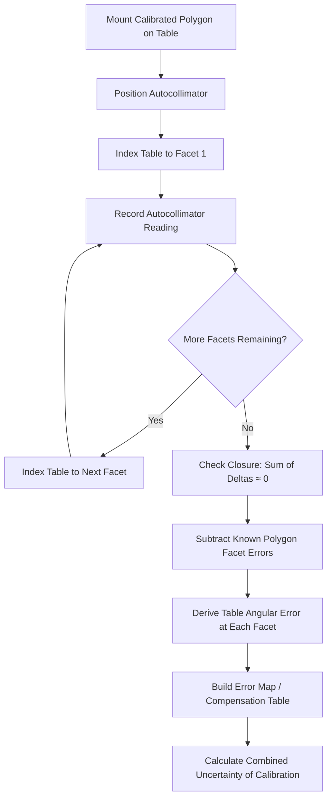

## Circular Division and Polygon Testing

### Overview

Circular division and polygon testing are the core methods for calibrating angular measuring instruments — particularly rotary tables, angle encoders, and indexing devices — by comparing measured angular subdivisions of a full 360° circle against known or self-derived references. The optical polygon serves as the primary physical artifact for this purpose, while circular division techniques encompass the broader family of methods for testing how accurately a full circle can be divided into equal or specified parts.

### The Optical Polygon Artifact

**Key Points**

- A precision-ground prism with multiple flat, highly reflective facets arranged around a central axis, each facet acting as a plane mirror
- Common facet counts: 4, 6, 8, 12, 24, 36, and 72 (chosen so 360° divides evenly — e.g., 24 facets = 15° per facet)
- Manufactured from glass, glass-ceramic (e.g., Zerodur), or optically-worked steel for dimensional stability
- Each facet's angular position relative to the others is individually calibrated and certified, typically to sub-arcsecond uncertainty by national metrology institutes (NMIs)
- Functions as the angular equivalent of a gauge block: a physical embodiment of known angular intervals

#### Facet Angle Notation

Facet angular position is defined relative to a reference facet (usually facet 1, set to 0°). For an $N$-facet polygon, nominal facet angles are:

$$\theta_i = \frac{360°}{N} \times (i - 1), \quad i = 1, 2, \ldots, N$$

The calibration certificate reports the **actual deviation** $\delta_i$ of each facet from this nominal position, typically in arcseconds, along with the associated expanded uncertainty.

### Autocollimator-Based Polygon Testing

The standard method for both calibrating a polygon and using a calibrated polygon to test a rotary table or index head.

#### Setup

1. Mount the polygon coaxially on the rotary table or index head under test
2. Position a fixed autocollimator so its collimated beam reflects off each facet in sequence as the table rotates
3. The autocollimator measures the small angular tilt of the reflected beam relative to its optical axis, reading the deviation of each facet from perfect alignment

#### Measurement Procedure

For each facet $i$, the table is indexed to the nominal angle $\theta_i$, and the autocollimator reading $\alpha_i$ (in arcseconds) is recorded. The angular error contributed between adjacent facets is:

$$\Delta_{i,i+1} = \alpha_{i+1} - \alpha_i$$

Summing these differences around the full circle provides a **closure check** — in a perfect measurement, the cumulative sum of all facet-to-facet differences around 360° should return to zero:

$$\sum_{i=1}^{N} \Delta_{i,i+1} = 0$$

Non-zero closure indicates measurement error, drift, or instability during the test sequence, and is a standard internal consistency check in circular division testing.

**Example**

For a 12-facet polygon (30° nominal spacing) tested against a rotary table, if measured autocollimator readings at facets 1 through 12 are recorded, and facet 1 is revisited at the end of a full rotation, any discrepancy between the first and final reading at facet 1 (which should coincide) quantifies drift error accumulated over the test — commonly required to be within a specified tolerance (e.g., a few tenths of an arcsecond) for the test to be considered valid.

### Circular Division Error Separation Methods

A central challenge in circular division testing is that a single autocollimator-polygon measurement conflates **two unknowns**: the error of the rotary table (or index head) and the error of the polygon itself. Several established techniques separate these.

#### Multi-Position (Reversal) Method

1. Measure the polygon on the table at an initial angular alignment (Position 0)
2. Rotate the polygon relative to the table by a defined offset (e.g., one facet spacing, or 180°) and repeat the measurement (Position 1)
3. Since the table error function is fixed relative to the table's own angular scale, while the polygon error function shifts with the polygon's physical rotation, combining the two data sets algebraically isolates each error function

This is mathematically analogous to the three-flat or reversal techniques used in flatness/straightness calibration, relying on superposition of two independent error sources measured from different relative orientations.

#### Multi-Reading-Head (Diametral) Method

- Two or more autocollimators, or optical encoder read heads, are positioned at diametrically opposite (or evenly distributed) points around the polygon/table
- Averaging readings from opposing heads cancels first-harmonic (eccentricity) error, since eccentricity produces equal-and-opposite contributions at diametrically opposed points

$$\theta_{corrected} = \frac{\theta_{head1} + \theta_{head2}}{2}$$

[Inference] This averaging specifically cancels odd-harmonic error components (dominated by eccentricity, the first harmonic); even-harmonic components such as ovality-type errors are not fully removed by two-head averaging alone and may require additional read heads (e.g., 3-head or 4-head configurations) for more complete cancellation.

#### Group Divided Circle Method (Multi-Polygon / Sub-Division)

Used historically and in some NMI-level calibration: combining measurements from polygons with different, coprime facet counts (e.g., 24-facet and 25-facet) to mathematically over-determine and cross-check individual facet errors through combinatorial analysis of overlapping angular positions.

### Circular Division Testing of Index Heads and Gratings

Beyond optical polygons, circular division testing methods extend to:

- **Rotary encoders/circular gratings**: Tested by comparing the encoder's internal angular scale against a master encoder or interferometric angle reference across the full 360° range, producing a continuous (rather than discrete-facet) error curve
- **Mechanical dividing heads**: Tested using the same autocollimator + polygon setup, but the discrete indexing positions (e.g., 40:1 worm ratio divisions) are the test points rather than a continuous sweep
- **Rotary tables with Curvic/Hirth couplings**: Tested at each fixed coupling position, since these tables cannot be continuously positioned between coupling teeth

### Angular Interferometry as an Alternative/Complementary Method

Laser-based angular interferometer optics can perform continuous circular division testing without a polygon artifact, by tracking angular displacement directly via interference fringe counting as the table rotates. This provides:

- Continuous error curves rather than discrete facet-count data points
- Direct traceability to the laser wavelength standard
- [Inference] Typically requires more careful alignment and is more sensitive to environmental turbulence over longer sight paths compared to the more robust autocollimator-polygon method, making the polygon method still widely preferred for routine shop-floor calibration

### Uncertainty Budget for Polygon Testing

A typical uncertainty budget for autocollimator-polygon-based circular division testing includes:

| Source | Typical Contribution |
| --- | --- |
| Polygon facet calibration uncertainty (from certificate) | Dominant term, often 0.1–0.5 arcsec |
| Autocollimator resolution/accuracy | 0.1–1 arcsec depending on instrument grade |
| Table/index head repeatability | Varies by table class |
| Environmental (air turbulence, thermal drift) | Can dominate over long test durations |
| Alignment error (polygon axis vs. table axis) | Cosine-error contribution, typically small if aligned carefully |

These combine using the standard root-sum-square method (see Combined and Expanded Uncertainty) to yield the overall expanded uncertainty $U$ reported for the rotary table's calibration.

### Diagram: Polygon Testing Data Flow

### Visual: Polygon Facet Numbering and Autocollimator Alignment

<svg xmlns="http://www.w3.org/2000/svg" viewBox="0 0 560 400">
<text x="280" y="24" text-anchor="middle" font-size="16" font-weight="bold" fill="#1a1a1a">12-Facet Optical Polygon Test Setup (svg_diagram)</text>
<g transform="translate(280,220)">
<polygon points="80,0 69.3,40 40,69.3 0,80 -40,69.3 -69.3,40 -80,0 -69.3,-40 -40,-69.3 0,-80 40,-69.3 69.3,-40" fill="none" stroke="#2b6cb0" stroke-width="2.5" />
<text x="95" y="5" font-size="11" fill="#2b6cb0">Facet 1</text>
<text x="45" y="-90" font-size="11" fill="#2b6cb0">Facet 4</text>
<text x="-95" y="5" font-size="11" fill="#2b6cb0">Facet 7</text>
<text x="-50" y="100" font-size="11" fill="#2b6cb0">Facet 10</text>
<circle cx="0" cy="0" r="2.5" fill="#e53e3e" />
<text x="6" y="-6" font-size="10" fill="#e53e3e">Rotation axis</text>
</g>
<line x1="480" y1="220" x2="365" y2="220" stroke="#38a169" stroke-width="2" />
<rect x="480" y="205" width="30" height="30" fill="none" stroke="#38a169" stroke-width="2" />
<text x="450" y="200" font-size="11" fill="#38a169">Autocollimator</text>
<text x="440" y="255" font-size="10" fill="#666">(fixed, reads reflected beam tilt)</text>
</svg>

### Common Pitfalls

- **Confusing polygon quality with table quality**: A poor measurement result can originate from either the polygon or the table; without an error-separation method, the two cannot be distinguished
- **Ignoring closure error**: Skipping the full-circle closure check can allow drift-related errors to go undetected and silently corrupt the error map
- **Facet-to-facet coupling misalignment**: Tilt or wobble between the polygon's mounting axis and the table's true rotation axis introduces cosine and sine errors not attributable to either artifact
- **Using an uncalibrated or expired-certificate polygon**: Facet angles can shift slightly over time or due to handling damage; traceability requires a current, valid calibration certificate

### Standards References

- **ISO 230-1** — Geometric accuracy of machines, including circular division testing methodology for rotary axes
- **VDI/VDE 2617 Blatt 4** — Rotary tables, includes polygon/autocollimator testing procedures for CMM rotary axes
- **JCGM 100:2008 (GUM)** — Uncertainty propagation framework applied to polygon calibration uncertainty budgets
- **NPL/NIST angle metrology guides** — Practical implementation references for autocollimator and polygon-based calibration

**Related Topics**

- Autocollimator principles and calibration
- Rotary and indexing tables
- Angular interferometry
- Gear measuring machine (GMM) angular reference systems
- Reversal and error-separation techniques in geometric calibration
- Rotary encoder technologies (optical, inductive, capacitive)
- Traceability chains for angular measurement to the SI radian