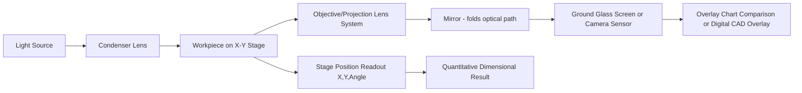

## Optical Comparators

### Overview

Optical comparators (also known as profile projectors or shadowgraphs) are non-contact inspection instruments that project a magnified silhouette or surface image of a workpiece onto a viewing screen, enabling dimensional and geometric comparison against an overlay chart or direct measurement via calibrated crosshairs and digital readouts. Unlike mechanical/electronic comparators, which measure a single-axis deviation from a master, optical comparators provide a full two-dimensional magnified profile view, making them especially suited to inspecting complex contours, thread forms, and small intricate parts.

### Operating Principle

**Key Points**

- A light source illuminates the workpiece, either in **transmission (shadow) mode** (backlighting the part to project its silhouette) or **surface (reflected) illumination mode** (front-lighting to reveal surface features)
- The projected image passes through a precision optical lens system that magnifies it by a fixed, calibrated ratio
- The magnified image is displayed on a large ground-glass screen or ring-light screen, or digitized via camera for on-screen/digital display
- Measurement is performed by comparing the projected profile to a **overlay chart** (a transparent template printed with the nominal part outline at the same magnification) or by traversing calibrated crosshairs/stage axes across specific feature edges

### Illumination Modes

#### Transmitted (Contour/Shadow) Illumination

- Light source positioned behind the workpiece, projecting a sharp silhouette of the part's outline
- Ideal for external profile inspection: thread forms, gear tooth profiles, stamped part contours, radii, angles
- Produces the highest edge-detection contrast since only the true physical silhouette blocks light

#### Surface (Reflected) Illumination

- Light source positioned above/in front of the workpiece, illuminating the top surface
- Used for inspecting surface features that don't appear in silhouette: engraved markings, scribed lines, surface texture, flat feature edges viewed from above
- Often combined with oblique or ring-light configurations to enhance contrast on specific feature types

Many optical comparators offer **combination illumination** (switchable or simultaneous surface and contour lighting) to inspect both silhouette and surface detail without repositioning the part.

### Optical System and Magnification

The magnification $M$ of the optical system relates image size to actual part size:

$$M = \frac{\text{Image dimension on screen}}{\text{Actual part dimension}}$$

Standard magnification lenses are typically available in fixed ratios such as 10×, 20×, 31.25×, 50×, and 100×, selected based on part size and required measurement resolution. Higher magnification allows finer detail discrimination but reduces the field of view, requiring the operator to reposition the part (via the X-Y stage) to inspect features outside the current field.

**Example**

A 20× lens projects a 0.5 mm feature as a 10 mm image on the screen — sufficiently large for accurate visual comparison against an overlay chart graduated in the same 20× scale, or for precise crosshair edge-detection.

### Overlay Charts

- Transparent (typically Mylar) templates printed with the nominal part geometry, precisely scaled to match the lens's magnification ratio
- Common standard charts include angle/radius charts, thread form charts (60° metric/UN, Acme, etc.), and custom part-specific charts made to the engineering drawing
- The operator superimposes the projected silhouette against the overlay and visually assesses whether the actual profile falls within tolerance zones drawn on the chart
- [Inference] Overlay chart comparison is inherently a qualitative/visual go-no-go style judgment unless combined with a calibrated stage and digital readout for quantitative measurement, since chart-based reading alone is limited by the operator's visual acuity and chart printing accuracy

### Measuring Stage and Axis System

Precision optical comparators incorporate a movable worktable (X-Y stage), often with:

- Linear glass scales or precision leadscrews providing digital or vernier readout of stage position
- A rotary stage/protractor table for angular measurement of features like chamfers, thread angles, and included angles
- Some models add a Z-axis (focus/height) readout for basic height comparison

By traversing a calibrated crosshair reticle from one feature edge to another using the stage's precision readout, the optical comparator functions as a **coordinate measuring instrument** in addition to a purely visual comparator, achieving quantitative results independent of overlay chart quality.

$$\Delta X = X_2 - X_1, \quad \Delta Y = Y_2 - Y_1$$

Feature dimensions (diameters, distances, angles) are derived from stage displacement readings between edge-detected points.

### Digital Optical Comparators

Modern instruments increasingly replace the ground-glass screen with a digital camera and monitor/software display, adding:

- Software-based edge detection (sub-pixel algorithms) for improved repeatability over manual crosshair alignment
- CAD overlay comparison (digital nominal outline overlaid on the live camera image, replacing physical Mylar charts)
- Automated measurement routines and SPC data export
- [Inference] Digital systems generally offer improved measurement repeatability and reduced operator-dependent variation compared to manual crosshair/overlay methods, since sub-pixel edge algorithms remove much of the subjectivity in visual edge judgment, though ultimate accuracy still depends on illumination quality and calibration of the optical system

### Key Specifications

| Parameter | Typical Range |
| --- | --- |
| Screen size | 300 mm to 600 mm (12" to 30") diameter, common shop-floor sizes |
| Magnification range | 10× to 100× (lens-dependent, interchangeable) |
| Stage travel (X-Y) | Commonly 100 mm × 50 mm to 300 mm × 150 mm depending on model |
| Stage resolution | 1 μm to 5 μm (digital readout systems) |
| Angular readout resolution | 1 arcminute to a few arcseconds (rotary table dependent) |

[Unverified] Specific ranges vary considerably across manufacturers and model tiers; values above represent commonly encountered shop-floor optical comparator classes and should be confirmed against manufacturer documentation for a specific instrument.

### Common Applications

- **Thread inspection**: Pitch diameter, thread angle, and form verification against standard thread overlay charts (V-threads, Acme, buttress)
- **Small part profile verification**: Stamped, molded, or machined small components with complex 2D contours
- **Gear tooth profile checks**: Basic visual/dimensional verification of tooth form (though dedicated gear measuring machines provide higher-precision quantitative analysis)
- **Radius and angle verification**: Fillets, chamfers, and angular features compared directly against radius/angle overlay charts
- **Tool and cutting edge inspection**: Checking wear, edge geometry, and form on cutting tools and inserts

### Calibration and Traceability

Optical comparators require periodic calibration of several independent subsystems:

1. **Magnification accuracy**: Verified using a calibrated stage micrometer or grid reticle of known dimension, confirming the projected image size matches the expected magnification ratio within tolerance
2. **Stage linear accuracy**: Verified using gauge blocks or a calibrated linear scale/interferometer along the X and Y travel
3. **Angular/rotary table accuracy**: Verified using an angle standard or precision protractor, similar in principle to rotary table calibration methods
4. **Screen/overlay chart alignment**: Confirming the optical axis is perpendicular to the screen and free from distortion (parallax, keystone effect) across the field of view

$$M_{error} = \frac{M_{measured} - M_{nominal}}{M_{nominal}} \times 100\%$$

### Error Sources

**Key Points**

- **Parallax and screen viewing angle**: Viewing the projected image off-axis introduces apparent position shift, particularly relevant for manual overlay comparison
- **Depth of field / focus error**: For parts with three-dimensional features, only the plane in sharp focus is accurately represented in silhouette; out-of-focus edges blur and reduce measurement precision
- **Lens distortion**: Especially toward the edges of the field of view, uncorrected optical distortion can introduce nonlinear magnification error away from the optical center
- **Thermal drift**: Extended illumination (especially older halogen light sources) can introduce localized heating of the part or stage, causing small thermal expansion errors during extended inspection sessions
- **Edge illumination artifacts**: Diffraction and light scatter at sharp edges can create a soft, fuzzy silhouette boundary, introducing subjective variability in exactly where the "edge" is judged to be

### Diagram: Optical Comparator Light Path

### Visual: Transmitted vs. Surface Illumination

<svg xmlns="http://www.w3.org/2000/svg" viewBox="0 0 600 340">
<text x="300" y="24" text-anchor="middle" font-size="16" font-weight="bold" fill="#1a1a1a">Optical Comparator Illumination Modes (svg_diagram)</text>

<text x="150" y="55" text-anchor="middle" font-size="13" font-weight="bold" fill="`#2b6cb0`">Transmitted (Shadow)</text>

<circle cx="150" cy="90" r="12" fill="`#f6ad55`" />

<text x="150" y="115" text-anchor="middle" font-size="9" fill="#666">Light source (below)</text>

<line x1="150" y1="102" x2="150" y2="150" stroke="`#f6ad55`" stroke-width="1.5" />

<rect x="130" y="150" width="40" height="20" fill="#333" />

<text x="150" y="185" text-anchor="middle" font-size="9" fill="#666">Workpiece</text>

<line x1="150" y1="170" x2="150" y2="230" stroke="`#2b6cb0`" stroke-width="1.5" stroke-dasharray="3,2" />

<rect x="110" y="230" width="80" height="10" fill="#ddd" stroke="#999" />

<text x="150" y="255" text-anchor="middle" font-size="9" fill="#666">Silhouette on screen</text>

<text x="450" y="55" text-anchor="middle" font-size="13" font-weight="bold" fill="`#38a169`">Surface (Reflected)</text>

<circle cx="400" cy="120" r="10" fill="`#f6ad55`" />

<text x="380" y="105" font-size="9" fill="#666">Light source (above)</text>

<line x1="400" y1="130" x2="450" y2="150" stroke="`#f6ad55`" stroke-width="1.5" />

<rect x="430" y="150" width="40" height="20" fill="`#a0aec0`" />

<text x="450" y="185" text-anchor="middle" font-size="9" fill="#666">Workpiece (top-lit)</text>

<line x1="450" y1="150" x2="450" y2="230" stroke="`#38a169`" stroke-width="1.5" stroke-dasharray="3,2" />

<rect x="410" y="230" width="80" height="10" fill="#ddd" stroke="#999" />

<text x="450" y="255" text-anchor="middle" font-size="9" fill="#666">Surface detail on screen</text>

</svg>

### Common Pitfalls

- **Incorrect focus plane selection on 3D parts**: Measuring a feature that lies outside the true focal plane introduces silhouette distortion and dimensional error
- **Chart-lens magnification mismatch**: Using an overlay chart scaled for a different magnification than the currently installed lens produces systematically wrong comparisons
- **Excessive ambient light contamination**: Stray room light reduces contrast on the projection screen, especially with lower-intensity shadow illumination, degrading edge definition
- **Operator parallax in manual crosshair alignment**: Viewing the screen from an angle introduces apparent misalignment between crosshair and feature edge

### Standards References

- **ASME B89.4.10** — Methods for performance evaluation of optical comparators (US)
- **ISO 10360 series** — While primarily for CMMs, related principles of optical measuring system verification are referenced for camera-based digital comparators
- **JJG (national verification regulations)** and equivalent NMI procedures — periodic verification requirements for profile projector magnification and stage accuracy

**Related Topics**

- Mechanical comparators
- Electronic (LVDT-based) comparators
- Thread measurement techniques (pitch diameter, thread gauges)
- Vision measuring systems (automated video/CNC comparators)
- Coordinate measuring machines (CMM) as a quantitative alternative
- Edge detection algorithms in digital metrology
- Angle and radius overlay chart standards