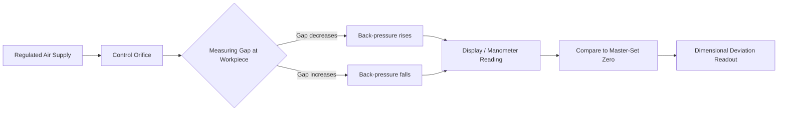

## Pneumatic Comparators

### Overview

Pneumatic comparators are precision dimensional measuring instruments that use variations in air pressure or air flow to determine minute deviations in a workpiece's size relative to a reference (master) setting. They are non-contact or near-contact gauging systems capable of resolving dimensional differences in the sub-micrometer range, making them indispensable in high-precision mass production environments such as bearing, fuel-injector, and hydraulic component manufacturing.

The fundamental principle relies on the fact that air escaping through a small orifice or gap experiences a measurable change in back-pressure or flow rate as that gap (the clearance between a gauging head and the workpiece surface) changes. Since air, unlike mechanical contact, exerts negligible force on the workpiece, pneumatic comparators avoid elastic deformation and wear issues associated with hard-contact instruments like dial indicators.

### Working Principle

Compressed air, regulated to a constant supply pressure, is passed through a restriction system before escaping through a jet (or jets) positioned close to the workpiece surface. As the gap between the jet and the workpiece changes, the resistance to air escape changes, which alters either:

1. **Back-pressure** in the measuring circuit (back-pressure type), or
2. **Flow rate/velocity** through the circuit (flow type)

This change is displayed on a calibrated scale, converting a pneumatic signal into a linear dimensional readout.

The governing relationship follows principles of fluid flow through orifices, where flow rate $Q$ through a restriction is related to the pressure differential $\Delta P$ across it:

$$Q = C_d \cdot A \cdot \sqrt{\frac{2 \Delta P}{\rho}}$$

where $C_d$ is the discharge coefficient, $A$ is the effective orifice area, and $\rho$ is air density. As the gauging gap (which behaves as a variable orifice) narrows, $A$ decreases, restricting flow and raising back-pressure upstream — this pressure change is what the instrument amplifies and displays.

### Types of Pneumatic Comparators

#### Back-Pressure Type

- Air passes through a fixed control orifice, then through the variable measuring orifice (the gauging gap) at the workpiece
- Pressure is measured *between* the two orifices (upstream of the measuring gap)
- As the gap decreases, back-pressure rises; as the gap increases, back-pressure falls
- Simpler construction, widely used for general shop-floor applications
- Response is non-linear near very small and very large gaps, so the useful measuring range is typically restricted to the linear portion of the pressure-gap curve

#### Flow (Velocity) Type

- Measures the *rate of flow* of air rather than pressure differential
- Commonly uses a tapered glass tube with a float (rotameter principle) — as flow increases, the float rises; as flow decreases, it falls
- The float position directly indicates the size of the measuring gap
- Offers a more linear response over a wider range than back-pressure types
- The visual float-in-tube display is intuitive for operators and allows continuous visual monitoring

#### Differential Pressure Type

- Compares pressure between a reference (master-set) circuit and the measuring circuit simultaneously
- Improves stability against supply pressure fluctuations, since both circuits are affected equally by supply variation and the difference remains representative of the dimensional deviation
- Often used in high-accuracy laboratory and inspection room comparators

### Key Components

- **Air supply and filtration unit**: filters, regulators, and water traps to deliver clean, dry, constant-pressure air (typically regulated well below line pressure, often in the range of 1–2 bar for the measuring circuit)
- **Pressure regulator/stabilizer**: maintains constant supply pressure since measurement accuracy is highly sensitive to supply fluctuations
- **Control (master) orifice**: a fixed, precisely sized restriction
- **Measuring head/gauging head**: contains the jet(s) directed at the workpiece; designs include plug gauges (for bores), ring/snap gauges (for shafts), and flat jet heads (for surfaces)
- **Display unit**: a manometer column, dial gauge (pressure-actuated), or float-tube scale, calibrated in linear units (µm or µin) rather than pressure units
- **Master setting rings/plugs**: used to zero and calibrate the instrument against known standard dimensions before use

### Setup and Calibration Procedure

1. Connect the air supply through the filter-regulator unit; verify supply pressure is stable and within specification
2. Allow air to flow and let the system stabilize thermally and pneumatically (a warm-up period is typically required)
3. Insert a master ring gauge (for external/bore measurement) or set against a master plug/reference block corresponding to nominal size
4. Adjust the zero-setting mechanism so the display reads zero (or nominal) at the master dimension
5. If checking a range, use two masters (upper and lower limit, or nominal plus a known deviation) to verify and adjust scale linearity/sensitivity
6. Insert the workpiece and read the deviation directly from the calibrated scale

**Key Points**

- Zero-setting against a master is mandatory before each measurement session; pneumatic comparators are *comparative*, not absolute, instruments
- Air supply cleanliness is critical — moisture or oil contamination introduces measurement noise and clogs jets
- Ambient temperature stability affects both the air properties and workpiece dimensions; comparator rooms are often temperature-controlled

### Typical Applications

- Bore gauging in precision-machined components (engine cylinders, hydraulic valve bodies, bearing races)
- Shaft and pin diameter checking in mass production
- Roundness and taper inspection using multi-jet gauging heads
- Checking of small, delicate, or soft-surfaced components where contact-type gauges risk marring or deforming the surface
- Automated in-process gauging integrated into machine tools for real-time size feedback during grinding or honing operations

### Advantages

- Extremely high sensitivity and amplification (magnification ratios often ranging from 1,000:1 to over 10,000:1, depending on design)
- Non-contact or near-zero contact force — negligible wear on gauge or workpiece, and suitable for soft or finished surfaces
- Self-cleaning effect: the air jet blows away dust and minor debris from the measuring zone, reducing the influence of surface contamination compared to mechanical contact gauges
- Can average out surface roughness effects since the jet senses the mean gap across the orifice area rather than a single contact point
- Suitable for simultaneous multi-parameter checks (e.g., diameter, ovality, taper) using multiple jets in one head
- Well suited to high-speed, repetitive inspection in mass production

### Limitations

- Requires a clean, dry, regulated compressed air supply — added infrastructure cost and maintenance
- Accuracy is sensitive to air temperature, humidity, and supply pressure fluctuations [Inference: sensitivity magnitude depends on specific instrument design and installation quality]
- Generally limited to comparative (relative) measurement, not absolute sizing, unless paired with separately calibrated masters
- Measuring range per setting is often narrower than mechanical comparators, requiring different jet heads or masters for different nominal sizes
- Jet orifices are small and can clog with airborne contaminants if filtration is inadequate
- Typically more expensive to install and maintain than simple mechanical dial comparators, due to the air supply system

### Example

A precision bore of nominal diameter 25.000 mm with a tolerance of ±0.005 mm is checked using a back-pressure pneumatic plug gauge:

1. The instrument is zeroed using a 25.000 mm master ring
2. The plug gauge is inserted into the production bore
3. The display reads +0.003 mm, meaning the actual bore is 25.003 mm
4. Since this falls within the ±0.005 mm tolerance band, the part is accepted

If the gauging head has two jets positioned 90° apart, simultaneous readings at different angular positions can also reveal ovality/out-of-roundness beyond simple diameter deviation.

### Illustration: Back-Pressure Pneumatic Comparator Circuit (svg_diagram)

<svg xmlns="http://www.w3.org/2000/svg" viewBox="0 0 720 340" font-family="Arial, sans-serif">
<text x="360" y="24" font-size="16" text-anchor="middle" font-weight="bold">Back-Pressure Pneumatic Comparator Circuit (svg_diagram)</text>

<rect x="20" y="140" width="90" height="40" fill="#dbe9f7" stroke="#333" />
<text x="65" y="164" font-size="11" text-anchor="middle">Air Supply</text>

<rect x="140" y="140" width="110" height="40" fill="#dbe9f7" stroke="#333" />
<text x="195" y="158" font-size="10" text-anchor="middle">Filter &amp;</text>
<text x="195" y="171" font-size="10" text-anchor="middle">Regulator</text>

<line x1="110" y1="160" x2="140" y2="160" stroke="#333" stroke-width="2" />
<line x1="250" y1="160" x2="300" y2="160" stroke="#333" stroke-width="2" />

<rect x="300" y="145" width="30" height="30" fill="#f7dbb0" stroke="#333" />
<text x="315" y="132" font-size="10" text-anchor="middle">Control</text>
<text x="315" y="200" font-size="10" text-anchor="middle">Orifice</text>

<line x1="330" y1="160" x2="380" y2="160" stroke="#333" stroke-width="2" />
<line x1="355" y1="160" x2="355" y2="90" stroke="#333" stroke-width="2" />

<rect x="320" y="30" width="70" height="60" fill="#fff" stroke="#333" />
<text x="355" y="20" font-size="10" text-anchor="middle">Display</text>
<line x1="340" y1="35" x2="340" y2="85" stroke="#999" stroke-width="4" />
<line x1="360" y1="45" x2="360" y2="85" stroke="#2a6fb0" stroke-width="4" />
<text x="355" y="100" font-size="9" text-anchor="middle">(pressure column)</text>

<line x1="380" y1="160" x2="470" y2="160" stroke="#333" stroke-width="2" />

<rect x="470" y="130" width="70" height="60" fill="#e6f0da" stroke="#333" />
<text x="505" y="120" font-size="10" text-anchor="middle">Gauging Head</text>
<line x1="540" y1="150" x2="580" y2="150" stroke="#333" stroke-width="1.5" />
<line x1="540" y1="170" x2="580" y2="170" stroke="#333" stroke-width="1.5" />

<line x1="580" y1="145" x2="580" y2="175" stroke="#333" stroke-width="1" />
<text x="592" y="163" font-size="9">gap</text>

<rect x="600" y="110" width="20" height="100" fill="#cccccc" stroke="#333" />
<text x="610" y="230" font-size="10" text-anchor="middle">Workpiece</text>

<polygon points="580,155 590,160 580,165" fill="#2a6fb0" />

<text x="40" y="270" font-size="10" font-weight="bold">Principle:</text>

<text x="40" y="288" font-size="10">Gap change at workpiece alters back-pressure</text>

<text x="40" y="303" font-size="10">between control orifice and gauging jet.</text>

<text x="40" y="318" font-size="10">Pressure change is read as linear dimension.</text>

</svg>

### Illustration: Measurement Signal Flow

### Maintenance and Best Practices

- Drain moisture traps regularly and inspect filter elements for contamination
- Periodically re-verify zero setting against masters, especially after any air supply interruption
- Avoid touching or contaminating jet orifices; clean with appropriate methods per manufacturer guidance
- Protect gauging heads from mechanical shock, as jet geometry is critical to calibration
- Recalibrate the entire system periodically against traceable standards as part of a documented quality system (e.g., ISO 9001 / IATF 16949 gauge calibration schedules)

**Related Topics**

- Electronic (LVDT-based) comparators
- Mechanical dial comparator stands and reed-type comparators
- Air gauging amplification and magnification ratio calculations
- Gauge R&R (Repeatability and Reproducibility) studies for comparative instruments
- Surface plate and master ring/plug gauge calibration standards
- Statistical Process Control (SPC) integration with automated pneumatic gauging
- Multi-dimensional pneumatic gauging (ovality, taper, concentricity checks)
- Temperature compensation techniques in precision dimensional metrology