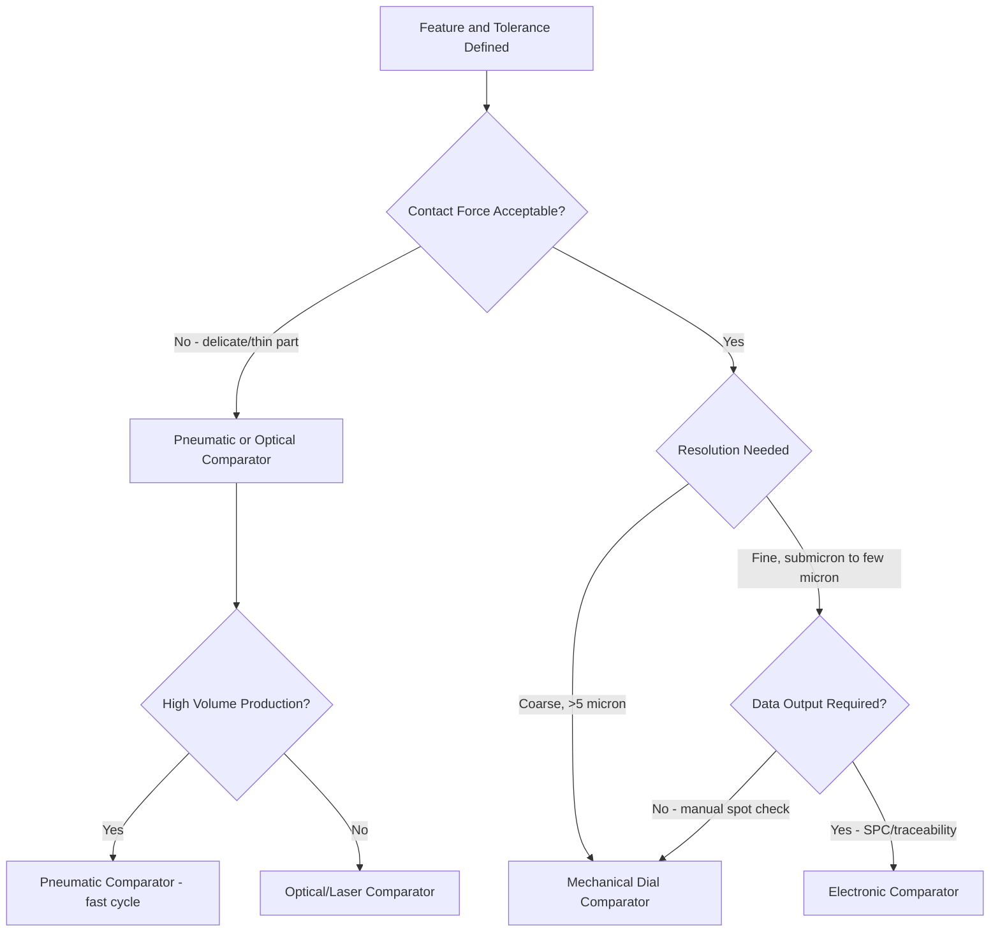

## Selection Criteria for Comparators

### Overview

A comparator is a metrology instrument that measures the deviation of a workpiece dimension from a reference standard (master/setting ring, gauge block stack, or setting master) rather than measuring an absolute dimension directly. Selecting the correct comparator for a given inspection task requires systematic evaluation of several interdependent technical, economic, and operational factors. Poor selection leads to either inadequate discrimination (false acceptance/rejection of parts) or unnecessary capital and operating cost from over-specification.

### Primary Selection Criteria

#### 1. Range of Measurement

- **Key Points**
  - The comparator's working range must encompass the tolerance zone of the feature being measured plus a reasonable margin for setup drift and wear monitoring.
  - Two distinct ranges must be considered: **mechanical range** (total physical travel of the sensing element/plunger) and **indicating range** (the scale or display span with useful resolution).
  - Electronic and pneumatic comparators typically offer a small indicating range (a few tenths of a millimeter or a few thousandths of an inch) but rely on gauge blocks or master rings to bring the nominal dimension into range, meaning the *comparator* range criterion concerns the deviation band, not the absolute part size.
  - Mechanical dial comparators (dial gauges, dial test indicators) have both a coarse range (multiple revolutions) and fine graduation increments; selection should match the graduation increment to at least 1/10 of the tolerance being verified (a common rule of thumb from gauge design standards).
- **Example**

  A shaft with a diameter tolerance of $\pm 5\,\mu m$ requires a comparator with resolution fine enough to reliably discriminate $0.5\,\mu m$ increments — ruling out a standard 0.01 mm graduated dial indicator (10 µm per division) in favor of an electronic probe or air gauge with sub-micron resolution.

#### 2. Resolution and Discrimination

- Resolution is the smallest scale increment the instrument displays; discrimination (or "readability") is the smallest change an operator can reliably perceive, which may be finer than the nominal scale division due to interpolation.
- As a general design rule, resolution should be **at least 10 times finer** than the tolerance band to be checked, consistent with the Gauge Repeatability and Reproducibility (GR&R) guideline that measurement system variation should consume no more than 10% of the tolerance.
- Amplification (mechanical, optical, pneumatic, or electronic) determines achievable resolution:
  - Mechanical dial comparators: amplification typically 100:1 to 5000:1 via gear trains or lever systems.
  - Optical comparators (optical lever, projected scale): amplification up to 10,000:1.
  - Pneumatic (air) comparators: amplification effectively 10,000:1 to 100,000:1 via back-pressure or flow differential.
  - Electronic (LVDT, capacitive, inductive probe) comparators: amplification is electronic gain, with resolution down to $0.01\,\mu m$ in high-end laboratory units.

#### 3. Accuracy and Repeatability

- **Accuracy** describes how close the indicated deviation is to the true deviation from the master.
- **Repeatability** (precision) describes the spread of readings on repeated measurement of the same feature under the same conditions — often the more critical parameter for comparators, since they are inherently a *relative* (null/deviation) measuring method and systematic errors partly cancel against the master.
- Repeatability should be validated statistically (standard deviation of repeat trials, or GR&R study) rather than assumed from a manufacturer's stated specification alone, since actual performance depends on operator technique, part cleanliness, and environmental stability. [Inference — actual field repeatability depends on installation and use conditions and may differ from catalog specifications.]

#### 4. Nature of the Feature Being Measured

| Feature type | Suitable comparator type | Rationale |
| --- | --- | --- |
| External diameter (shafts, plug gauges) | Dial/electronic bench comparator with V-block or roller fixture | Simple contact geometry, stable seating |
| Internal diameter (bores) | Pneumatic plug, electronic bore gauge, internal dial bore gauge | Access constraints favor air jets or small mechanical heads |
| Flatness/parallelism | Dial comparator on surface plate, or electronic height gauge | Requires reference surface plate as datum |
| Thin/flexible parts | Pneumatic (non-contact-force) or optical comparator | Avoids deflection from contact pressure |
| Soft or finished surfaces | Pneumatic or optical (non-contact) comparator | Contact probes risk scratching |
| High-volume production (100% or SPC sampling) | Electronic comparator with data output/SPC interface | Needs speed and digital integration |

#### 5. Contact Force and Part Deformation

- Mechanical dial comparators exert a measuring force (commonly 0.5–2 N, spring-loaded plunger) that can deflect thin-walled or low-stiffness parts, introducing measurement error.
- Pneumatic and optical comparators are effectively non-contact or use a low-pressure air jet, making them preferable for delicate, thin, or easily marred components.
- For rubber, thin foil, or compliant materials, contact-force comparators should generally be avoided; air gauging or laser/optical comparators are preferred. [Inference — the degree of deflection depends on the part's stiffness and geometry and should be verified for the specific application.]

#### 6. Environmental Sensitivity

- **Temperature**: All comparator types are sensitive to differential thermal expansion between the master, the part, and the instrument frame. High-amplification systems (pneumatic, electronic) are more sensitive to small temperature fluctuations because they resolve smaller absolute displacements.
- **Cleanliness/particulate contamination**: Pneumatic comparators are inherently self-cleaning (air purge clears debris from the gap) and tolerate dirtier shop-floor environments better than contact-type dial or electronic comparators, whose contact tips can be fouled by chips or coolant residue.
- **Vibration**: High-amplification optical and electronic systems mounted on a comparator stand require a stable bench, ideally with vibration isolation, in high-vibration production environments.

#### 7. Speed and Throughput Requirements

- Pneumatic comparators offer very fast cycle times (parts can be gauged in under a second) and are historically favored in mass-production bore/plug gauging (e.g., automotive engine components).
- Electronic comparators with automated part handling (indexing fixtures, multi-point probing) support high-throughput SPC data collection with direct digital output.
- Manual dial comparators are slower due to operator-dependent reading and part loading, suiting lower-volume or job-shop inspection.

#### 8. Data Output and Traceability Needs

- **Key Points**
  - Modern quality systems (IATF 16949, ISO 9001, AS9100) increasingly require electronic data capture for SPC, trend analysis, and full traceability.
  - Electronic comparators typically provide RS-232, USB, wireless (e.g., Mitutoyo Digimatic/U-WAVE style protocols), or direct SPC software integration.
  - Purely mechanical dial comparators require manual data transcription, which is slower and introduces transcription error risk unless supplemented by a data logger or camera-based reading system.
  - If statistical process control, automated go/no-go sorting, or paperless traceability is mandated, electronic comparators are the default selection; mechanical units remain viable for periodic spot-checks and simple in-process go/no-go gauging where digital record-keeping is not required. [Inference — the necessity of digital output depends on the specific quality management system and customer/regulatory requirements in force.]

#### 9. Cost and Economic Factors

- Capital cost ranking (typical, ascending): mechanical dial comparator < electronic comparator < pneumatic comparator system < optical/laser comparator, though pricing varies significantly by manufacturer, resolution class, and calibration traceability requirements.
- Total cost of ownership must include: master/setting ring cost (often significant, especially for high-precision bore gauging), calibration/recalibration frequency, air supply and filtration costs (pneumatic systems require clean, dry, regulated compressed air), and operator training.
- Batch size and part value influence acceptable amortized cost per part: high-value aerospace components may justify higher-cost optical/electronic systems; high-volume low-cost fasteners favor economical mechanical dial comparators or simple air gauges.

#### 10. Fixturing and Ergonomics

- The comparator must integrate with a suitable **fixture or stand** that provides repeatable part location (V-blocks, centers, flat anvils, indexing chucks) — fixture design quality often has more influence on overall measurement repeatability than the comparator head itself.
- Operator ergonomics (loading height, indicator visibility, cycle time per part) affect measurement consistency, particularly in manual, high-volume inspection stations.

### Comparator Type Summary Diagram

### Decision Matrix (Weighted Selection Approach)

| Criterion | Mechanical Dial | Electronic | Pneumatic | Optical |
| --- | --- | --- | --- | --- |
| Typical resolution | 1–10 µm | 0.01–1 µm | 0.05–1 µm | 0.1–1 µm |
| Contact force | Yes (moderate) | Yes (low–moderate) | Minimal/none | None |
| Environmental tolerance (dirt/coolant) | Moderate | Low–moderate | High | Low |
| Data output | Manual | Digital native | Digital (with transducer) | Digital native |
| Relative capital cost | Low | Medium | Medium–High | High |
| Cycle speed | Slow–moderate | Fast | Very fast | Moderate |

### Practical Selection Procedure

- **Next Steps**
  1. Define the feature, its tolerance, and required measurement uncertainty (target: measurement uncertainty ≤ 10% of tolerance).
  2. Identify part material, stiffness, and surface sensitivity to determine if contact force is acceptable.
  3. Assess production volume and required cycle time.
  4. Determine data/traceability requirements from the applicable quality system.
  5. Evaluate shop-floor environmental conditions (temperature stability, contamination, vibration).
  6. Shortlist candidate comparator types against the criteria above and perform a cost-of-ownership comparison including masters, fixturing, and calibration.
  7. Validate the selected system with a GR&R study before releasing it into production use.

### Related Topics

- Setting rings, gauge blocks, and reference masters used with comparators
- Pneumatic (air) gauging principles and back-pressure vs. flow measurement
- Electronic (LVDT/inductive) probe theory and signal conditioning
- Dial indicator and dial test indicator construction and gear-train amplification
- Gauge Repeatability and Reproducibility (GR&R) studies for comparator validation
- Environmental control requirements in dimensional metrology laboratories
- Calibration and traceability of comparator masters to national standards