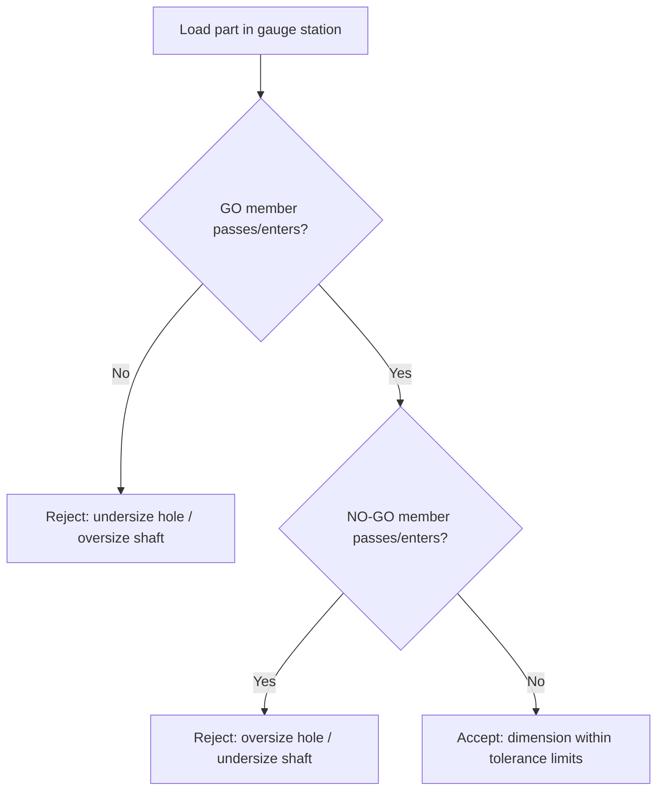

## Plug, Ring, and Snap Limit Gauges

### Overview

Limit gauges are fixed (non-adjustable, in their simplest form) inspection tools used to verify that a manufactured dimension falls within a specified tolerance zone without providing a numerical value of the actual size. They implement the **Taylor principle of gauging**, using a "GO" member that checks the maximum-material limit and a "NO-GO" (NOT GO) member that checks the minimum-material limit. Plug gauges check internal features (holes, bores), ring gauges check external features (shafts, cylindrical bosses), and snap gauges check external features using an open frame rather than a full ring — primarily for larger diameters or where a full encircling ring is impractical.

### Fundamental Principle: Taylor's Principle

- **Key Points**
  - The **GO gauge** is made to the maximum material limit (MML) of the feature and must check the full length/form of the feature in one insertion (full-form gauging), ensuring both size and geometric errors (roundness, straightness) are captured.
  - The **NO-GO gauge** is made to the least material limit (LML) and should check size at a single point/short engagement, deliberately avoiding form-checking, since its purpose is only to catch oversize (for holes) or undersize (for shafts) conditions.
  - A part is accepted only if the GO gauge enters/passes freely and the NO-GO gauge does not enter/pass.
  - Deviation from Taylor's principle (e.g., using progressive/segmental NO-GO gauges) is common in practice for practical and economic reasons, and is generally acceptable provided the risk of accepting out-of-round or tapered parts is understood and controlled elsewhere in the process. [Inference — acceptability of departing from full Taylor's principle depends on the specific process capability and the criticality of form errors for the application.]

### Plug Gauges (for Holes/Internal Features)

#### Construction

- A plug gauge consists of a handle with two gauging members: a **GO plug** (checks minimum hole diameter — full cylindrical form, longer engagement length) and a **NO-GO plug** (checks maximum hole diameter — shorter, sometimes stepped/reduced-length member).
- Common configurations:
  - **Double-ended plug gauge**: GO and NO-GO members on opposite ends of a single handle — common for smaller diameters.
  - **Progressive (duplex) plug gauge**: GO and NO-GO members combined on the same end, with the NO-GO member as a shorter, smaller-diameter step behind the GO member — allows one-handed, one-motion checking, commonly used in production gauging.
- Gauge length of the GO member typically follows standards (e.g., ANSI/ASME B89.1.5, or national plug/ring gauge standards) relating gauge length to hole diameter, since a GO plug that is too short fails to fully verify straightness/taper.

#### Example

For a hole specified as $\varnothing 20.00^{+0.021}_{0} \, \text{mm}$ (H7 fit):

- GO plug diameter = 20.000 mm (lower limit, must enter)
- NO-GO plug diameter = 20.021 mm (upper limit, must not enter)
- Gauge tolerances themselves (gauge maker's tolerance) are applied per standards such as ISO 286 or BS 969, typically at roughly 10% of the workpiece tolerance, positioned within the workpiece tolerance zone (GO gauge tolerance applied wearing-allowance-adjusted toward the MML).

#### Wear Allowance

- GO plug gauges wear during repeated insertion into holes at the minimum limit, gradually reducing effective diameter. A **wear allowance** is added to the GO gauge (making it very slightly oversize relative to the theoretical minimum, within a defined wear zone) to extend service life while the gauge is still within its functional tolerance.
- NO-GO gauges see minimal wear (infrequent, brief contact only near rejection) and generally receive no wear allowance.

### Ring Gauges (for Shafts/External Cylindrical Features)

#### Construction

- A ring gauge is a hardened steel ring with a precisely bored and lapped internal diameter, used to check external diameters of shafts, pins, and similar cylindrical parts.
- **GO ring gauge**: bored to the maximum shaft diameter limit; must slide over the shaft.
- **NO-GO ring gauge**: bored to the minimum-clearance limit corresponding to the shaft's minimum acceptable size boundary on the oversize side; must not slide over the shaft (for a shaft, NO-GO checks the *upper* limit of the shaft, opposite convention to a hole's NO-GO).
- Ring gauges are typically identified by a groove machined on the outer surface of the NO-GO ring (and sometimes red paint/marking) to distinguish it from the GO ring, since both look similar externally.
- Ring gauges require an external check via a **setting plug gauge** or comparator during manufacture/calibration, since their internal bore cannot be measured as conveniently as a plug's external diameter with a standard micrometer once installed in service — though inside micrometers, bore gauges, or CMM measurement are used for calibration.

#### Example

For a shaft specified as $\varnothing 25.00^{0}_{-0.021}\, \text{mm}$ (h7 fit):

- GO ring bore = 25.000 mm (upper limit, must slide over shaft)
- NO-GO ring bore = 24.979 mm (lower limit, must not slide over shaft)

#### Wear Considerations

- Since the ring is the "female" gauge, wear allowance conventions are typically minimal or handled differently than plug gauges; ring gauges are recalibrated periodically against slip gauges/setting plugs to confirm the bore has not worn oversize from repeated shaft insertion. [Inference — specific wear-allowance practice can vary between national/company gauge standards.]

### Snap Gauges (for Shafts/External Features, Open-Frame Type)

#### Construction and Rationale

- A snap gauge (also called a caliper gauge or gap gauge) is a C-shaped or horseshoe-shaped frame with two sets of fixed gauging jaws/anvils: one set at the GO dimension, one at the NO-GO dimension.
- Used in place of a full ring gauge when:
  - The shaft diameter is large, making a full ring gauge heavy, costly, and awkward to handle.
  - The feature to be checked is not a full circumference (e.g., a shaft segment adjacent to a shoulder or flange where a ring cannot be slid on).
  - Faster, single-motion checking of both limits is desired (progressive snap gauges combine GO/NO-GO in one frame pass).
- **Types**:
  - **Single-end (plain) snap gauge**: one pair of anvils only (either GO or NO-GO), requiring two separate gauges or two ends of a double-ended frame.
  - **Double-ended (caliper) snap gauge**: GO gap on one end of the frame, NO-GO gap on the other.
  - **Progressive snap gauge**: GO and NO-GO anvils arranged on the same end, allowing a single pass over the shaft to check both limits (analogous to the progressive plug gauge).
  - **Adjustable snap gauge**: anvils can be set and locked using slip gauges/gauge blocks, allowing one frame to be re-configured for multiple sizes — economical for job-shop or lower-volume use, though less rigid/stable than fixed limit gauges. [Inference — adjustable gauge stability depends on lock mechanism quality and periodic re-verification against slip gauges is standard practice.]

#### Example

For a shaft of $\varnothing 50.00^{0}_{-0.025}\,\text{mm}$:

- GO gap = 50.000 mm (must pass over the shaft)
- NO-GO gap = 49.975 mm (must not pass over the shaft)

### Comparison Table

| Attribute | Plug Gauge | Ring Gauge | Snap Gauge |
| --- | --- | --- | --- |
| Feature checked | Internal (holes, bores) | External (shafts, full circumference) | External (shafts, open profile) |
| Form checked by GO member | Full cylindrical form (length engagement) | Full circumference | Only diametral points contacted by anvils |
| Typical size range | Small to medium bores | Small to medium shafts | Medium to large shafts |
| Identification convention | NO-GO shorter/stepped member | Groove on NO-GO ring OD | Marked/labeled GO and NO-GO ends |
| Portability/handling for large sizes | Good | Poor (heavy, costly at large diameter) | Good |
| Wear allowance applied to | GO member | Typically minimal, periodic recalibration | GO anvils |

### Materials and Manufacture

- Common gauge materials: hardened alloy tool steel (e.g., a chrome-based tool steel), tungsten carbide (for high-wear, high-volume production gauges), or chrome-plated tool steel to improve wear resistance and corrosion resistance.
- Gauging surfaces are ground and lapped to fine surface finish (low Ra) to minimize measurement error from surface roughness interaction and to reduce wear rate.
- Gauges are typically stress-relieved after hardening and stabilized (aged) to minimize long-term dimensional drift from residual stress relaxation.

### Illustrative Diagram: Plug and Ring Gauge Relationship to Tolerance Zone

<svg xmlns="http://www.w3.org/2000/svg" viewBox="0 0 760 360">
<title>Plug and Ring Gauge Limits Relative to Hole and Shaft Tolerance Zones (svg_diagram)</title>
\<style\>
text { font-family: Arial, sans-serif; font-size: 13px; fill: #1a1a1a; }
.label { font-size: 12px; }
.dim { stroke: #333; stroke-width: 1; }
\</style\>
<rect x="0" y="0" width="760" height="360" fill="#ffffff" />

<text x="60" y="30" font-size="15" font-weight="bold">Hole (Plug Gauge)</text>

<line x1="60" y1="50" x2="60" y2="160" class="dim" />

<line x1="220" y1="50" x2="220" y2="160" class="dim" />

<rect x="60" y="70" width="160" height="30" fill="`#cfe8ff`" stroke="`#2f6fab`" />

<text x="65" y="65" class="label">Max limit (LML) - NO-GO plug</text>

<rect x="60" y="100" width="160" height="0" stroke="`#2f6fab`" />

<line x1="60" y1="100" x2="220" y2="100" stroke="`#2f6fab`" stroke-width="2" />

<text x="65" y="135" class="label">Min limit (MML) - GO plug</text>

<line x1="60" y1="130" x2="220" y2="130" stroke="`#0b5aa5`" stroke-width="2" />

<text x="65" y="150" class="label">Tolerance zone (hole)</text>

<line x1="30" y1="70" x2="30" y2="130" stroke="#000" stroke-width="1" marker-start="url(#arrow)" marker-end="url(#arrow)" />

<text x="480" y="30" font-size="15" font-weight="bold">Shaft (Ring/Snap Gauge)</text>

<rect x="480" y="70" width="160" height="30" fill="`#ffe0cc`" stroke="`#c46a1e`" />

<text x="485" y="65" class="label">Max limit (MML) - GO ring/snap</text>

<line x1="480" y1="100" x2="640" y2="100" stroke="`#c46a1e`" stroke-width="2" />

<text x="485" y="150" class="label">Min limit (LML) - NO-GO ring/snap</text>

<line x1="480" y1="130" x2="640" y2="130" stroke="`#a34e00`" stroke-width="2" />

<text x="485" y="155" class="label">Tolerance zone (shaft)</text>

<line x1="450" y1="70" x2="450" y2="130" stroke="#000" stroke-width="1" marker-start="url(#arrow)" marker-end="url(#arrow)" />

<rect x="60" y="220" width="640" height="110" fill="#f7f7f7" stroke="#999" />
<text x="75" y="245" font-weight="bold">Notes</text>
<text x="75" y="268" class="label">Hole: GO plug = smaller (MML), enters freely; NO-GO plug = larger (LML), must not enter.</text>
<text x="75" y="288" class="label">Shaft: GO ring/snap = larger (MML), passes freely; NO-GO ring/snap = smaller (LML), must not pass.</text>
<text x="75" y="308" class="label">GO members verify full form/length engagement (Taylor's Principle); NO-GO members verify size only at a point.</text>
</svg>

### GO/NO-GO Decision Flow

### Applicable Standards (Representative)

- ISO 1938 (Gauges for holes and shafts to ISO tolerance system)
- BS 969 (Limit gauges for engineering workpieces — plug, ring, and gap gauges)
- ANSI/ASME B89.1.5 (Measurement of plain internal and external diameters for use as master discs or cylindrical plug and ring gauges)
- Company- or industry-specific gauge tolerance charts often derive gauge tolerance and wear allowance as a percentage of the workpiece tolerance band (commonly cited around 10% for gauge tolerance, with an additional wear allowance zone for GO members).

### Advantages and Limitations

- **Key Points**
  - **Advantages**: fast pass/fail inspection, low skill requirement, no calibration drift concerns during use (fixed reference), well-suited to high-volume 100% inspection, robust in shop-floor environments.
  - **Limitations**: provides no quantitative size value (only accept/reject), cannot support SPC trend analysis directly, subject to wear requiring periodic recalibration or replacement, does not by itself guarantee full geometric form conformance when Taylor's principle is only partially applied (e.g., progressive/segmental NO-GO gauges), and gauge cost/lead time scales with the number of distinct sizes required in a mixed-part environment.

### Related Topics

- Taylor's principle of gauging and its practical exceptions
- Gauge tolerance and wear allowance calculation (ISO 1938 / BS 969 methods)
- Calibration and periodic verification of plug, ring, and snap gauges using slip gauges and setting masters
- Progressive vs. double-ended gauge design trade-offs
- Functional gauging vs. variable (measuring) gauging strategies
- Attribute-based statistical process control using GO/NO-GO gauge data
- Air/pneumatic plug and ring gauges as a hybrid between fixed limit gauges and variable comparators