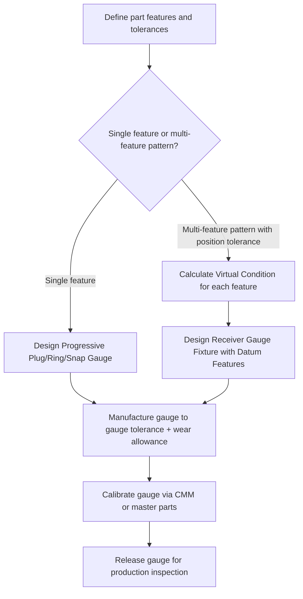

## Receiver and Progressive Gauge Design

### Overview

Receiver gauges and progressive gauges are specialized forms of composite functional gauging used primarily for checking assemblies of multiple related features (such as multi-hole patterns, splines, threads, or combinations of size and position) in a single fixture, and for combining GO/NO-GO checks into an efficient single-motion inspection sequence. Both approaches extend the basic limit-gauging concept (plug, ring, snap) to more complex geometric relationships and higher-throughput inspection scenarios.

### Receiver Gauges

#### Definition and Purpose

- A **receiver gauge** (also called a composite functional gauge or receiver-type functional gauge) is a fixture-type gauge designed to simulate the mating assembly condition for a part with multiple interrelated features — most commonly multiple holes, a hole pattern combined with an outer profile, or a component that must fit into a mating receptacle at several points simultaneously.
- The gauge "receives" the part (or the part is placed into/onto the gauge) and functionally verifies that all checked features are simultaneously within their combined tolerance zones relative to each other, rather than checking each feature independently.
- This directly extends Taylor's principle to the composite (multi-feature) case: a receiver GO gauge checks the maximum-material composite condition of a group of features at maximum material condition, verifying both individual size and mutual location/orientation in one operation.

#### Typical Applications

- **Key Points**
  - Multi-hole patterns on a bracket or plate, where the true position of each hole relative to the others (and to a datum) must be verified as an assembly-fit condition, not just individually toleranced diameters.
  - Components with a locating pin pattern that must mate with a fixed mating part (e.g., a gearbox cover with multiple bolt holes that must align with corresponding studs).
  - Combination gauges verifying both a bore's size and its positional/orientation relationship to an external profile or a keyway.
  - Receiver gauges are the composite-tolerance equivalent of a plug gauge: instead of one cylindrical feature, an entire pattern of features is checked against a single functional GO gauge that embodies the maximum-material virtual condition of the whole pattern.

#### Design Principles

- The GO receiver gauge is manufactured at the **virtual condition** of the feature pattern — the combined effect of size limit at maximum material condition (MMC) plus the positional tolerance specified, per geometric dimensioning and tolerancing (GD&T) principles (ASME Y14.5 / ISO 1101).
- Gauge pins representing each hole are sized at the virtual condition diameter:

$$\text{Gauge pin diameter} = \text{MMC hole diameter} - \text{positional tolerance}$$

- If the part's actual hole pattern (sizes and true positions, worst-case combined) is within the specified tolerances, all gauge pins will simultaneously enter their corresponding holes — confirming both individual size compliance and pattern-location compliance in a single functional check.
- NO-GO checking for individual hole sizes (least material condition) is typically performed separately using conventional NO-GO plug gauges on each hole individually, since — consistent with Taylor's principle — the NO-GO function need only check single-point size, not composite form/position.

#### Example

A bracket has four $\varnothing 10.0^{+0.20}_{0}\,\text{mm}$ holes with a positional tolerance of $\varnothing 0.30\,\text{mm}$ at MMC relative to datum features A and B.

- Virtual condition diameter for each gauge pin: $10.0 - 0.30 = 9.70\,\text{mm}$
- The receiver gauge plate carries four fixed pins of $\varnothing 9.70\,\text{mm}$, positioned at the exact nominal (basic) hole locations, along with datum features replicating A and B.
- If the bracket seats fully on the datum features and all four pins enter their respective holes without interference, the part is accepted for the combined size-and-position requirement.

#### Advantages and Limitations

- **Key Points**
  - **Advantages**: verifies true functional assembly condition directly (does it fit the mating part), captures interaction effects between multiple features that independent single-feature gauging would miss, fast single-motion inspection for complex patterns, eliminates the need for CMM-based positional calculation on the shop floor for simple accept/reject decisions.
  - **Limitations**: gauge design and manufacturing cost is significantly higher than simple plug/ring gauges due to the need for precise multi-feature fixturing; gauge itself requires careful calibration (typically via CMM) since its own pin positions and diameters must be verified to tight tolerances; provides no quantitative data on the degree of positional error, only pass/fail; a design change to hole pattern or tolerance requires a new (or reworked) receiver gauge, unlike CMM-based inspection which is simply reprogrammed.

### Progressive Gauge Design

#### Definition and Purpose

- A **progressive gauge** combines the GO and NO-GO checking functions into a single tool or a single motion sequence, typically by arranging the GO member ahead of (or alongside) the NO-GO member so that the operator can check both limits with one insertion or one pass, rather than requiring two separate handling operations with a double-ended gauge.
- The term "progressive" refers to the sequential engagement: the GO section engages first (and fully, per Taylor's principle), followed immediately by the shorter NO-GO section which should not engage.

#### Progressive Plug Gauges

- Constructed with the GO diameter as the leading (longer) section of the plug and the NO-GO diameter as a stepped-down (or stepped-up, depending on convention) shorter section immediately behind it on the same end of the gauge body.
- In a single insertion: if the GO section enters fully and the NO-GO section (now presented at the hole mouth) does not enter, the hole is within tolerance.
- Reduces operator handling time significantly compared to a double-ended plug gauge, which requires removing and reinserting the opposite end.

#### Progressive Ring/Snap Gauges

- For external features, a progressive snap gauge places GO and NO-GO anvil pairs on the same end of the C-frame, allowing the shaft to be checked by a single swipe/pass across both anvil pairs rather than flipping the gauge.
- Progressive ring gauges are less common due to the practical difficulty of combining two different bore diameters coaxially in a single ring member; stepped-bore designs exist but are less standard than progressive plug or snap designs. [Inference — progressive ring gauge designs are comparatively rare in general industrial practice compared to plug and snap types, based on general gauge design convention.]

#### Progressive Thread Gauges

- Progressive (or "GO/NO-GO combination") thread plug and thread ring gauges are widely used, combining a full-form GO thread section (checking pitch diameter, form, and lead over several threads, per Taylor's principle for threads) with a short NO-GO thread section (checking pitch diameter at effectively one or two threads only, avoiding a form check).

#### Illustration: Progressive Plug Gauge Layout

<svg xmlns="http://www.w3.org/2000/svg" viewBox="0 0 700 260">
<title>Progressive Plug Gauge - GO and NO-GO Sections on One End (svg_diagram)</title>
\<style\>
text { font-family: Arial, sans-serif; font-size: 13px; fill: #1a1a1a; }
.label { font-size: 12px; }
\</style\>
<rect x="0" y="0" width="700" height="260" fill="#ffffff" />

<rect x="40" y="110" width="180" height="40" fill="#d9d9d9" stroke="#333" stroke-width="2" />
<text x="70" y="135" class="label">Handle</text>

<rect x="220" y="105" width="220" height="50" fill="#cfe8ff" stroke="#2f6fab" stroke-width="2" />
<text x="255" y="90" font-weight="bold">GO section</text>
<text x="240" y="180" class="label">Full length: checks size + form</text>

<rect x="440" y="118" width="70" height="24" fill="#ffd9b3" stroke="#c46a1e" stroke-width="2" />
<text x="430" y="90" font-weight="bold">NO-GO</text>
<text x="415" y="180" class="label">Short: checks size only</text>

<line x1="530" y1="130" x2="600" y2="130" stroke="#000" stroke-width="2" marker-end="url(#arrow2)" />
<text x="535" y="115" class="label">Insertion direction</text>
</svg>

### Receiver vs. Progressive Gauge — Conceptual Distinction

| Aspect | Receiver Gauge | Progressive Gauge |
| --- | --- | --- |
| Primary purpose | Check multiple interrelated features (position + size) simultaneously | Combine GO and NO-GO of a single feature into one motion |
| Typical feature count | Multiple (hole patterns, multi-feature assemblies) | Single feature (one hole, one shaft, one thread) |
| Basis | Virtual condition (MMC + positional tolerance) per GD&T | Taylor's principle (full-form GO, point NO-GO) |
| Relative complexity/cost | High (custom fixture per part/pattern) | Low–moderate (standard plug/ring/snap variant) |
| Data output | Pass/fail for whole pattern only | Pass/fail for one dimension |

### Design and Verification Process Flow

### Calibration Considerations

- **Key Points**
  - Receiver gauges, due to their multi-feature nature, are most reliably calibrated using a coordinate measuring machine (CMM) to verify each pin's diameter and true position against the nominal virtual-condition values.
  - Progressive gauges are calibrated similarly to their simple plug/ring/snap counterparts — each GO and NO-GO section is measured independently (e.g., using a bench comparator, micrometer, or CMM) against its respective gauge tolerance.
  - Both gauge types require periodic recalibration and wear monitoring; GO sections/pins accumulate wear from repeated part loading and should be tracked against the defined wear allowance limit before gauge replacement or refurbishment. [Inference — recalibration intervals are typically set by the organization's quality system based on gauge usage frequency and observed wear rate, rather than a single universal figure.]

### Related Topics

- Taylor's principle of gauge design (foundation for progressive gauge logic)
- Virtual condition and maximum material condition (MMC) in GD&T (ASME Y14.5 / ISO 1101)
- Positional tolerancing and functional gauging of hole patterns
- Plug, ring, and snap limit gauges (base gauge types extended by progressive design)
- Thread gauging (GO/NO-GO thread plug and ring gauges)
- CMM-based verification of composite functional gauges
- Gauge wear allowance and recalibration scheduling