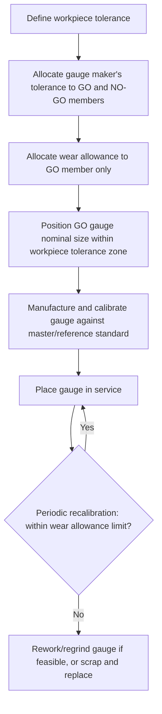

## Wear Allowance in Gauge Design

### Overview

Wear allowance is a deliberate, small addition to the tolerance of specific gauge members — primarily GO gauges — intended to extend the useful service life of the gauge before it must be scrapped, reworked, or reset due to dimensional wear from repeated contact with production parts. It represents a controlled sacrifice of a portion of the workpiece tolerance to gauge manufacturing/wear economics, positioned so that the gauge remains functionally reliable throughout its allowable wear life.

### Why Wear Allowance Is Needed

- **Key Points**
  - GO gauges (plug, ring, snap) make repeated, often sliding or rubbing, contact with production parts during use — a GO plug is inserted into thousands of holes, a GO ring is slid over thousands of shafts.
  - This repeated contact causes gradual abrasive wear on the gauging surface, causing the GO gauge's effective size to drift toward the "safe" direction slowly over its service life:
    - A GO plug gauge wears smaller (loses material from its outer diameter).
    - A GO ring gauge wears larger (loses material from its bore, effectively "opening up").
  - Without an allowance, a GO gauge manufactured exactly at the maximum material limit (MML) would immediately begin rejecting acceptable parts as soon as any wear occurred, since a worn GO plug would no longer represent the true MML and might falsely indicate a part as undersize/oversize at the boundary.
  - Wear allowance manages this by initially manufacturing the GO gauge slightly inside the workpiece tolerance zone (i.e., toward the mid-tolerance side, "safer" from the wear-drift direction), giving the gauge a defined margin before its accumulated wear would cause it to falsely accept or reject.

### Which Gauge Members Receive Wear Allowance

- **GO gauges**: receive wear allowance, because they are in frequent, high-contact use (full-form engagement per Taylor's principle, longer surface contact area, higher usage frequency in production).
- **NO-GO gauges**: generally do **not** receive wear allowance, because by design and intended use they should rarely make significant contact with an acceptable part (a NO-GO gauge is expected to be rejected by most in-tolerance parts, so wear accumulation is minimal); some standards specify a minimal or zero wear allowance for NO-GO members for this reason. [Inference — the degree to which NO-GO wear allowance is specified as strictly zero versus a small nominal value can vary between national standards and company practice.]

### Placement of Wear Allowance Within the Tolerance Zone

- The workpiece tolerance zone is conceptually divided into three regions for GO gauge design purposes:
  1. **Gauge maker's tolerance (manufacturing tolerance)** — the permitted variation in manufacturing the gauge itself to its nominal target size.
  2. **Wear allowance zone** — additional margin reserved to accommodate gradual dimensional drift from wear during the gauge's service life.
  3. **Remaining workpiece tolerance** — the portion of the tolerance band not consumed by gauge tolerance or wear allowance, which remains available to the actual part.
- The GO gauge's *nominal* target size is therefore set slightly inside the theoretical maximum material limit, and the gauge tolerance plus wear allowance band is positioned entirely within the workpiece tolerance zone (never extending beyond it), per common standards such as BS 969 and ISO 1938.

#### Diagram: GO Plug Gauge Tolerance Zone Breakdown

<svg xmlns="http://www.w3.org/2000/svg" viewBox="0 0 700 320">
<title>GO Gauge Tolerance Zone: Gauge Tolerance and Wear Allowance within Workpiece Tolerance (svg_diagram)</title>
\<style\>
text { font-family: Arial, sans-serif; font-size: 13px; fill: #1a1a1a; }
.label { font-size: 12px; }
\</style\>
<rect x="0" y="0" width="700" height="320" fill="#ffffff" />

<text x="40" y="30" font-size="15" font-weight="bold">Hole Workpiece Tolerance Zone (example)</text>

<rect x="60" y="60" width="500" height="60" fill="#eef6ff" stroke="#333" stroke-width="2" />
<text x="65" y="55" class="label">LML (max hole size, NO-GO limit)</text>
<text x="440" y="55" class="label">MML (min hole size, true GO limit)</text>

<rect x="490" y="60" width="70" height="60" fill="#ffe9cc" stroke="#c46a1e" stroke-width="2" />
<text x="495" y="140" class="label">Wear allowance</text>

<rect x="530" y="60" width="30" height="60" fill="#cfe8ff" stroke="#2f6fab" stroke-width="2" />
<text x="500" y="160" class="label">Gauge maker's tolerance</text>

<line x1="60" y1="180" x2="490" y2="180" stroke="#0b5aa5" stroke-width="2" />
<text x="65" y="200" class="label">Remaining workpiece tolerance available to actual part</text>
<line x1="60" y1="230" x2="560" y2="230" stroke="#333" stroke-width="1" marker-start="url(#arrowW)" marker-end="url(#arrowW)" />
<text x="230" y="250" class="label">Full workpiece tolerance band</text>
</svg>

### Calculation Approach (Representative Convention)

- **Key Points**
  - Gauge tolerance is commonly specified as a percentage of the workpiece tolerance — a widely cited convention allocates approximately **10% of the workpiece tolerance to gauge maker's tolerance**, with a further allocation (often another ~5–10%, depending on the applicable standard) reserved for wear allowance on the GO member. [Unverified — exact percentages vary by standard (e.g., BS 969 vs. ISO 1938) and by gauge class/grade specified; the organization's applicable gauge standard should be consulted for the specific figures required.]
  - Standards typically define multiple gauge tolerance grades (e.g., different classes for inspection gauges vs. working/production gauges vs. reference/master gauges), with tighter tolerance-and-wear-allowance bands assigned to reference-grade gauges and looser bands to working gauges intended for high-volume shop-floor use.

#### Example

For a hole with tolerance $\varnothing 20.000$ to $\varnothing 20.050\,\text{mm}$ (workpiece tolerance $= 0.050\,\text{mm}$):

- Gauge maker's tolerance (illustrative, ~10% of workpiece tolerance): $0.005\,\text{mm}$
- Wear allowance (illustrative, ~5% of workpiece tolerance): $0.0025\,\text{mm}$
- GO plug gauge nominal target size: set at the MML ($20.000\,\text{mm}$) plus the wear allowance, so the gauge is manufactured slightly larger than the absolute minimum hole size, e.g., nominal $20.0025\,\text{mm} \pm 0.0025\,\text{mm}$ gauge tolerance — keeping the entire GO gauge tolerance-plus-wear band within the workpiece tolerance zone.
- NO-GO plug gauge: manufactured at the LML ($20.050\,\text{mm}$) with only gauge maker's tolerance applied (no wear allowance), typically with the tolerance band directed inward (toward the workpiece tolerance zone) to avoid ever exceeding the LML.

[Note: the specific numeric percentage split shown above is illustrative of the general method; actual values must be taken from the specific gauge design standard in force for the application.]

### Effect of Wear Allowance on Gauge Service Life

- A GO gauge is considered fit for continued service as long as its measured (worn) size remains within the wear allowance zone; once wear causes the gauge to drift beyond this zone (i.e., it would begin passing genuinely out-of-tolerance parts), the gauge must be:
  - **Reworked/reground** (for gauges designed to permit resizing, where sufficient material remains), or
  - **Scrapped and replaced** (for gauges at or near minimum permissible size, or where resizing is impractical/uneconomical).
- Periodic recalibration (checking the GO gauge's actual size against a master/reference standard, such as slip gauges or a calibrated bore/plug comparator) is required to track wear progression and determine remaining service life. [Inference — recalibration frequency is generally determined by the organization's quality system based on gauge usage rate and historical wear data, rather than a single fixed interval mandated universally.]

### Wear Allowance and Ring/Snap Gauges

- Ring gauges (checking shafts) wear in the opposite direction relative to plug gauges: repeated shaft insertion gradually enlarges the ring's bore, so the GO ring is manufactured slightly *smaller* than the absolute maximum shaft size (MML for a shaft), reserving the wear allowance margin toward the ring becoming slightly larger over its service life.
- Snap gauge GO anvils wear similarly (contact surfaces wear away, effectively increasing the gap over time), so GO anvils are also typically set slightly smaller than the absolute MML target, within the wear allowance band.

### Wear Allowance Decision Flow

### Summary Table

| Gauge member | Wear direction | Wear allowance applied? | Nominal size positioning |
| --- | --- | --- | --- |
| GO plug | Wears smaller (loses OD) | Yes | Slightly larger than absolute MML, within tolerance zone |
| NO-GO plug | Minimal wear expected | Typically no / minimal | At or very near the LML |
| GO ring | Wears larger (bore opens) | Yes | Slightly smaller than absolute MML |
| NO-GO ring | Minimal wear expected | Typically no / minimal | At or very near the LML |
| GO snap anvils | Wears larger (gap increases) | Yes | Slightly smaller than absolute MML |
| NO-GO snap anvils | Minimal wear expected | Typically no / minimal | At or very near the LML |

### Related Topics

- Taylor's principle of gauge design (defines which members require full-form/high-contact use, driving wear allowance need)
- Plug, ring, and snap limit gauges (gauge types to which wear allowance is applied)
- Gauge calibration procedures and recalibration interval determination
- Gauge tolerance grades and classes per ISO 1938 / BS 969
- Statistical tracking of gauge wear trends for predictive replacement scheduling
- Reference/master gauges used to calibrate working gauges and monitor wear