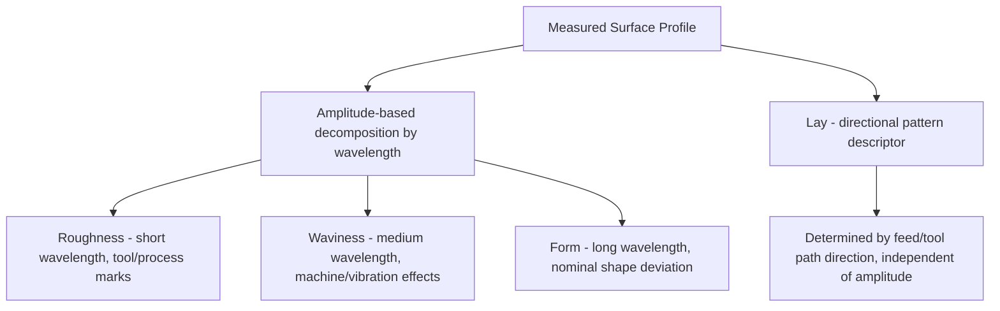

## Roughness, Waviness, and Lay

### Overview

Surface texture describes the geometric irregularities present on a manufactured surface, distinct from the nominal (intended) form of the part. Classical surface texture analysis decomposes the measured surface profile into three primary components — **roughness**, **waviness**, and **lay** — each arising from different physical causes during manufacture and each affecting different functional aspects of the part (friction, wear, sealing, fatigue life, coating adhesion, optical appearance, etc.).

### The Surface Profile Hierarchy

- **Key Points**
  - A real machined surface, when measured at high magnification, shows superimposed irregularities of multiple spatial wavelengths (frequencies) and amplitudes.
  - Classical surface metrology (per ISO 4287, ISO 4288, and historically ASME B46.1) separates the total measured profile into components by spatial wavelength using filtering:
    - **Roughness**: short-wavelength (high-frequency) irregularities, generally attributed to the machining process itself (tool marks, feed marks, built-up edge, grain effects).
    - **Waviness**: longer-wavelength (lower-frequency) irregularities, generally attributed to machine or process-related periodic effects (spindle wobble, vibration, chatter, workholding deflection, thermal effects).
    - **Form/Error of form**: the underlying nominal geometric shape deviation (deviation from flatness, roundness, cylindricity, etc.), representing the longest-wavelength component, typically treated as a separate discipline (form/geometric tolerancing) rather than part of "texture" per se.
  - **Lay** describes the predominant direction of the surface pattern, resulting from the method of production (e.g., the direction of tool feed marks), and is a directional/orientation descriptor rather than an amplitude parameter.

#### Diagram: Profile Decomposition by Wavelength

<svg xmlns="http://www.w3.org/2000/svg" viewBox="0 0 760 380">
<title>Decomposition of a Measured Surface Profile into Form, Waviness, and Roughness (svg_diagram)</title>
\<style\>
text { font-family: Arial, sans-serif; font-size: 13px; fill: #1a1a1a; }
.label { font-size: 12px; }
\</style\>
<rect x="0" y="0" width="760" height="380" fill="#ffffff" />

<text x="30" y="25" font-size="15" font-weight="bold">Total Measured Profile (sum of all components)</text>

<path d="M40,80 Q100,40 160,80 T280,80 T400,80 T520,80 T640,80 T720,80" stroke="#333" stroke-width="1" fill="none" />

<path d="M40,80 C60,70 55,90 70,95 C85,100 95,65 110,90 C125,100 135,70 150,92 C165,100 175,72 190,90" stroke="#333" stroke-width="1" fill="none" />

<text x="30" y="150" font-size="15" font-weight="bold">Form (long-wavelength shape deviation)</text>

<path d="M40,200 Q400,140 720,200" stroke="`#0b5aa5`" stroke-width="2" fill="none" />

<text x="30" y="240" font-size="15" font-weight="bold">Waviness (medium-wavelength, process-induced)</text>

<path d="M40,280 Q100,260 160,280 T280,280 T400,280 T520,280 T640,280 T720,280" stroke="`#c46a1e`" stroke-width="2" fill="none" />

<text x="30" y="320" font-size="15" font-weight="bold">Roughness (short-wavelength, tool-mark scale)</text>

<path d="M40,350 C48,345 52,355 60,350 C68,345 72,355 80,350 C88,345 92,355 100,350 C108,345 112,355 120,350 C128,345 132,355 140,350 C148,345 152,355 160,350 C168,345 172,355 180,350 C188,345 192,355 200,350 C208,345 212,355 220,350" stroke="`#2f6fab`" stroke-width="1.5" fill="none" />

<path d="M220,350 C228,345 232,355 240,350 C248,345 252,355 260,350 C268,345 272,355 280,350 C288,345 292,355 300,350 C308,345 312,355 320,350 C328,345 332,355 340,350" stroke="`#2f6fab`" stroke-width="1.5" fill="none" />

</svg>

### Roughness

#### Definition

- Roughness comprises the finest (shortest-wavelength) irregularities in a surface, typically resulting directly from the cutting, grinding, or forming action of the manufacturing process — individual tool tip marks, feed marks, abrasive grit tracks, or crystallographic effects.
- Isolated from waviness and form using a high-pass filter (roughness cutoff wavelength, denoted $\lambda_c$), per ISO 4288 / ISO 16610 filtering standards.

#### Common Roughness Parameters (ISO 4287)

| Parameter | Description |
| --- | --- |
| $Ra$ | Arithmetic mean deviation of the roughness profile from the mean line — most widely used general-purpose parameter |
| $Rz$ (ISO) | Maximum height of the profile — average of peak-to-valley heights over sampling lengths (definition varies by standard/region) |
| $Rq$ ($RMS$) | Root-mean-square deviation of the profile from the mean line |
| $Rt$ | Total height of the profile — largest peak-to-valley distance over the entire evaluation length |
| $Rp$ | Maximum profile peak height |
| $Rv$ | Maximum profile valley depth |
| $Rsk$ | Skewness — asymmetry of the height distribution |
| $Rku$ | Kurtosis — peakedness of the height distribution |

$$Ra = \frac{1}{l}\int_0^l |z(x)|\,dx$$

where $z(x)$ is the profile height relative to the mean line and $l$ is the sampling/evaluation length.

#### Example

A ground shaft surface might specify $Ra \le 0.4\,\mu m$ for a bearing journal, while a rough-turned casting surface might have $Ra$ in the range of $3$–$6\,\mu m$. A superfinished or lapped surface (e.g., gauge block working surfaces) may achieve $Ra$ values below $0.025\,\mu m$.

#### Functional Significance

- Roughness governs friction and wear behavior, lubricant film retention, sealing performance (gasket/O-ring interfaces), fatigue crack initiation susceptibility, corrosion initiation sites, coating/plating adhesion, and optical/cosmetic appearance.

### Waviness

#### Definition

- Waviness comprises longer-wavelength surface irregularities than roughness, generally arising from machine-related periodic or quasi-periodic effects rather than the immediate cutting action: spindle runout, vibration/chatter, workpiece or fixture deflection under cutting force, thermal distortion during machining, or slow feed-rate variations.
- Isolated using a band-pass filter combination: high-pass at the roughness cutoff $\lambda_c$ (removing shorter wavelengths, i.e., roughness) and low-pass at the waviness cutoff $\lambda_f$ (removing longer wavelengths, i.e., form), per ISO 4287/ISO 4288.

#### Common Waviness Parameters

| Parameter | Description |
| --- | --- |
| $Wa$ | Arithmetic mean deviation of the waviness profile |
| $Wt$ | Total height of the waviness profile |
| $Wz$ | Maximum height of the waviness profile |
| $WSm$ | Mean spacing of waviness profile peaks |

#### Example

A turned surface exhibiting periodic "chatter marks" from insufficient machine rigidity would show elevated waviness amplitude at a wavelength corresponding to the chatter frequency divided by spindle speed/feed rate — distinct from (and often larger in wavelength than) the underlying tool-feed-mark roughness.

#### Functional Significance

- Waviness affects contact area distribution under load (bearing/seating surfaces), optical flatness for precision optical components, sealing surface conformance, and can be an early indicator of machine tool condition (worn spindle bearings, loose fixturing, resonance issues) — making waviness monitoring valuable for process/machine health diagnostics, not solely part quality.

### Lay

#### Definition

- Lay is the direction of the predominant surface pattern, determined by the production method (direction of tool feed, grinding wheel traverse, or forming die pattern) rather than an amplitude/height parameter.
- Lay is specified using standardized symbols on engineering drawings (per ISO 1302 / ASME Y14.36) appended to the surface texture symbol.

#### Standard Lay Symbols (ISO 1302 / ASME Y14.36)

| Symbol | Lay direction | Typical process example |
| --- | --- | --- |
| $=$ | Parallel to the line representing the surface in the drawing view | Shaping, planing (feed direction parallel to surface edge) |
| $\perp$ | Perpendicular to the line representing the surface in the drawing view | Shaping, planing (feed direction perpendicular) |
| $\times$ | Crossed, angular in two directions | Cross-hatched honing, some milling patterns |
| $M$ | Multidirectional | Grinding with random orbital motion, some polishing |
| $C$ | Approximately circular relative to the center of the surface | Facing on a lathe, some grinding operations |
| $R$ | Approximately radial relative to the center of the surface | Radial grinding, some spot-facing operations |
| $P$ | Non-directional, protuberant/particulate | Some cast, sintered, or textured surfaces |

#### Functional Significance

- Lay direction critically affects directional friction and sealing behavior (e.g., a sealing surface with radial lay may leak more readily along the lay direction than a circular-lay surface of similar $Ra$), fluid flow characteristics in hydraulic/pneumatic components, and the visual/reflective appearance of finished surfaces (brushed metal finishes rely on controlled lay direction).
- Two surfaces with identical $Ra$ but different lay orientation can exhibit substantially different functional performance, which is why lay must be specified independently of amplitude parameters on critical drawings.

### Relationship Diagram: Roughness, Waviness, Lay, and Form

### Filtering and Cutoff Selection

- **Key Points**
  - The choice of roughness cutoff wavelength $\lambda_c$ (Gaussian filter, per ISO 16610-21) determines where roughness ends and waviness begins; ISO 4288 provides recommended $\lambda_c$ values based on the expected $Ra$ range of the surface (finer surfaces use shorter cutoffs, coarser surfaces use longer cutoffs).
  - Selecting an inappropriate cutoff can cause waviness components to leak into the reported roughness value (cutoff too long) or cause genuine roughness detail to be excessively filtered out (cutoff too short), so cutoff selection should follow the applicable standard's guidance for the surface's expected roughness range rather than an arbitrary default. [Inference — the specific consequences of cutoff mismatch depend on the actual spatial frequency content of the surface being measured and should be verified for atypical or highly periodic surfaces.]
  - Modern digital surface metrology commonly uses the **Gaussian regression filter** as the standard filter type for separating roughness, waviness, and form, superseding older 2RC analog filters used in early profilometer designs.

### Measurement Methods

- Contact stylus profilometry (diamond-tipped stylus traversing the surface, per ISO 3274) remains the most common method for obtaining the profile from which roughness/waviness/lay parameters are calculated.
- Non-contact optical methods (confocal microscopy, white-light interferometry, focus-variation microscopy) are increasingly used, particularly for soft, delicate, or non-metallic surfaces where stylus contact force could cause damage or measurement artifacts.
- Areal (3D) surface texture measurement (per ISO 25178) extends the 2D profile-based roughness/waviness/lay concepts to full-surface characterization, providing additional parameters (e.g., $Sa$, $Sq$, and texture direction analysis) that more completely capture lay and anisotropic surface behavior than a single 2D profile trace.

### Related Topics

- Surface texture parameters per ISO 4287 ($Ra$, $Rz$, $Rq$, $Rt$, and others) and their calculation methods
- Filtering standards for surface profile separation (ISO 4288, ISO 16610 Gaussian regression filters)
- Areal (3D) surface texture measurement per ISO 25178
- Stylus profilometry principles, stylus tip geometry effects, and measurement uncertainty
- Non-contact optical surface metrology (white-light interferometry, confocal, focus variation)
- Surface texture drawing indication and symbols per ISO 1302 / ASME Y14.36
- Relationship between surface texture and functional performance (friction, sealing, fatigue, coating adhesion)