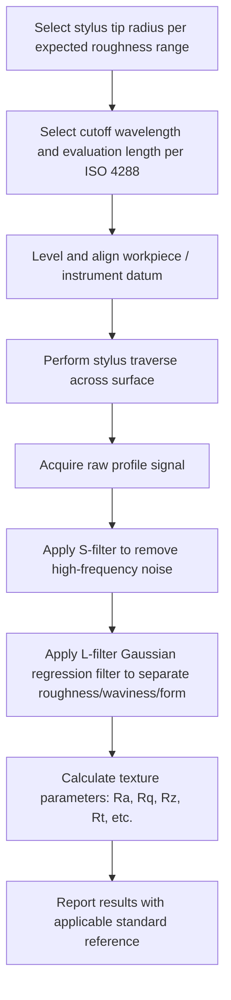

## Stylus Based Profilometry

### Overview

Stylus profilometry is the most established and widely used contact method for measuring surface texture (roughness, waviness) and, in some configurations, form. A fine-tipped diamond stylus is traversed across the surface under a small, controlled force while its vertical displacement is recorded, producing a profile trace from which surface texture parameters ($Ra$, $Rq$, $Rz$, $Rt$, and others) are calculated per ISO 4287/ISO 3274. It remains the reference technique against which many optical/non-contact methods are validated, owing to its long metrological history, direct traceability, and mechanical simplicity.

### Basic Principle

- **Key Points**
  - A stylus with a defined tip geometry (commonly a conical diamond tip with a specified tip radius, typically $2\,\mu m$ or $5\,\mu m$ per ISO 3274, though $10\,\mu m$ tips are also used for coarser surfaces) is drawn across the surface at a constant traverse speed.
  - The stylus is mounted on a pivoted or linear-bearing arm connected to a displacement transducer (commonly an inductive/LVDT-type or piezoelectric transducer), which converts vertical stylus movement into an electrical signal proportional to surface height variation.
  - A small, controlled static contact force (typically in the range of tens to a few hundred micronewtons to a few millinewtons, depending on instrument and stylus type) is maintained to keep the stylus in contact with the surface without causing excessive surface damage or stylus wear.
  - The resulting analog/digital signal is processed through filtering (Gaussian regression filter per ISO 16610) to separate roughness, waviness, and form components, from which the standard texture parameters are calculated.

### Instrument Architecture

#### Diagram: Stylus Profilometer System Overview

<svg xmlns="http://www.w3.org/2000/svg" viewBox="0 0 760 340">
<title>Stylus Profilometer System - Key Components (svg_diagram)</title>
\<style\>
text { font-family: Arial, sans-serif; font-size: 13px; fill: #1a1a1a; }
.label { font-size: 12px; }
\</style\>
<rect x="0" y="0" width="760" height="340" fill="#ffffff" />

<rect x="60" y="240" width="640" height="20" fill="#d9d9d9" stroke="#333" stroke-width="1" />
<rect x="90" y="60" width="20" height="180" fill="#c9c9c9" stroke="#333" stroke-width="1" />
<text x="40" y="55" class="label">Column</text>

<rect x="110" y="130" width="160" height="30" fill="#cfe8ff" stroke="#2f6fab" stroke-width="2" />
<text x="115" y="120" class="label">Traverse unit (drive motor, linear guide)</text>

<line x1="270" y1="145" x2="360" y2="200" stroke="#333" stroke-width="3" />
<text x="280" y="180" class="label">Pickup arm</text>

<rect x="230" y="130" width="40" height="30" fill="#ffe0cc" stroke="#c46a1e" stroke-width="2" />
<text x="150" y="180" class="label">Displacement transducer (LVDT/inductive)</text>

<polygon points="360,200 355,220 365,220" fill="#333" />
<text x="370" y="225" class="label">Diamond stylus tip</text>

<rect x="200" y="220" width="400" height="20" fill="#eeeeee" stroke="#333" stroke-width="2" />
<text x="380" y="238" class="label">Workpiece surface</text>

<line x1="270" y1="145" x2="620" y2="100" stroke="#999" stroke-width="1" stroke-dasharray="4,3" />
<rect x="600" y="60" width="140" height="60" fill="#f7f7f7" stroke="#999" stroke-width="1" />
<text x="610" y="85" class="label">Signal conditioning</text>
<text x="610" y="105" class="label">and data processing</text>
</svg>

### Key Instrument Parameters

| Parameter | Typical Range/Consideration |
| --- | --- |
| Stylus tip radius | $2\,\mu m$, $5\,\mu m$, $10\,\mu m$ (per ISO 3274; finer tip resolves finer detail but is more prone to wear/damage) |
| Stylus cone angle | Commonly $60°$ or $90°$ included angle |
| Measuring force | Small, controlled static force (instrument-dependent; sufficient for contact without excessive surface deformation) |
| Traverse speed | Instrument-dependent, chosen to balance measurement time against dynamic response/noise |
| Vertical (height) resolution | Sub-nanometer to nanometer scale in high-end laboratory instruments |
| Traverse length | Set to accommodate the required evaluation length (sampling length × number of sampling lengths, per ISO 4288) |

### Stylus Tip Geometry Effects (Filtering/Mechanical Effect)

- **Key Points**
  - The stylus tip has a finite radius and cannot perfectly follow arbitrarily sharp valleys or narrow features on the surface — it mechanically "filters" the true surface profile, effectively rounding sharp valley bottoms and being unable to fully penetrate narrow grooves whose width is comparable to or smaller than the tip diameter.
  - This mechanical filtering means measured roughness values (particularly valley-depth-sensitive parameters like $Rv$, $Rz$, $Rt$) can understate the true surface valley depth if the tip radius is too large relative to the surface's finest features.
  - Selecting a stylus tip radius appropriate to the expected surface roughness range (per ISO 3274 guidance) is necessary to avoid this systematic understatement; a $2\,\mu m$ tip is generally required for fine/smooth surfaces, while a larger tip may be acceptable (and more durable) for coarser surfaces. [Inference — the specific magnitude of understatement for a given surface depends on its actual groove geometry relative to the stylus tip radius and should be evaluated case by case for critical measurements.]

### Measurement Procedure (General Workflow)

### Sampling and Evaluation Length Selection

- Per ISO 4288, the roughness cutoff wavelength $\lambda_c$ (which defines the sampling length $lr$) is selected based on the expected $Ra$ range of the surface — smoother surfaces use shorter cutoffs, rougher surfaces use longer cutoffs, since the cutoff must be long enough to capture the relevant roughness wavelengths but short enough to exclude waviness.
- The evaluation length $ln$ is conventionally five sampling lengths (per default ISO 4288 practice), providing a statistically representative average across multiple sampling lengths, though this can be adjusted for specific applications or shorter features.
- An additional traverse length beyond the evaluation length is required at each end to allow the filtering algorithm to stabilize (avoiding edge effects from the filter), meaning the total physical traverse length exceeds the reported evaluation length.

### Advantages and Limitations

- **Key Points**
  - **Advantages**: well-established, standardized, directly traceable measurement principle; high vertical resolution; relatively straightforward calibration using certified roughness reference specimens; effective across a wide range of surface materials (metals, ceramics, polymers) provided the surface can tolerate light contact.
  - **Limitations**: contact-based measurement can damage or mark soft, delicate, or coated surfaces; measurement is inherently a 2D line trace (a single profile), which may not represent the full 3D surface unless multiple traces or areal (3D) stylus scanning is performed; relatively slow compared to optical areal methods when large-area or 3D characterization is required; stylus tip wear over time changes the effective tip radius and requires periodic tip inspection/replacement and instrument recalibration; measurement can be affected by surface contamination (dust, oil film) unless surfaces are properly cleaned prior to measurement.

### Calibration and Traceability

- Stylus profilometers are calibrated using certified reference specimens (roughness comparison/calibration specimens with known, traceable $Ra$, $Rz$, or other parameter values) to verify both the vertical amplification/gain of the transducer and the horizontal traverse accuracy.
- Periodic verification against these reference standards, along with stylus tip radius inspection/verification, is necessary to maintain measurement traceability to national/international standards. [Inference — specific recalibration intervals are typically set by the organization's quality system based on usage frequency and manufacturer recommendations rather than a single universally mandated interval.]

### Extension to Areal (3D) Stylus Measurement

- Stylus instruments can be configured to perform a series of closely spaced parallel line traces across a defined area, building up a 3D height map analogous to optical areal methods — enabling calculation of areal parameters ($Sa$, $Sq$, $Sz$, and others per ISO 25178) from stylus-acquired data, though this is significantly slower than single-line 2D profile measurement or optical areal scanning due to the mechanical raster-scanning process involved.

### Related Topics

- Roughness, waviness, and lay (the texture components stylus profilometry measures)
- Profile parameters $Ra$, $Rq$, $Rz$, $Rt$ (calculated from stylus-acquired profile data)
- Filtering standards for profile separation (ISO 4288, ISO 16610 Gaussian regression filters)
- Areal surface texture parameters and non-contact optical alternatives (white-light interferometry, confocal microscopy)
- Stylus tip geometry standards and selection guidance (ISO 3274)
- Calibration of surface roughness instruments using certified reference specimens
- Measurement uncertainty sources in contact-based surface texture metrology