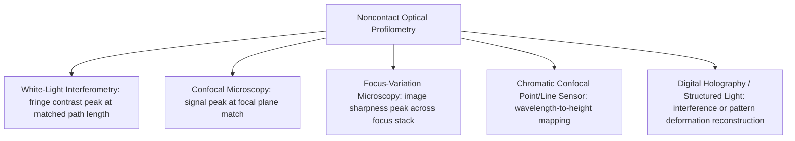

## Noncontact Optical Profilometry

### Overview

Non-contact optical profilometry encompasses a family of surface measurement techniques that use light — rather than physical stylus contact — to characterize surface topography. These methods measure surface height by exploiting optical phenomena such as interference, focus response, or depth-of-field variation, and have become increasingly prevalent for surface texture and form metrology due to their speed, ability to acquire full areal (3D) data sets, and suitability for delicate, soft, or highly reflective surfaces that stylus contact could damage or measure inaccurately.

### Motivation Relative to Stylus Profilometry

- **Key Points**
  - Optical methods avoid physical contact force entirely, eliminating the risk of surface damage, scratching, or elastic/plastic deformation of soft materials (polymers, thin coatings, biological samples) that a stylus's contact force could otherwise cause.
  - Most optical techniques natively acquire full areal (2D grid / 3D point cloud) data in a single measurement, directly supporting ISO 25178 areal parameter calculation, whereas a stylus instrument must perform slow sequential line-by-line raster scanning to build equivalent areal data.
  - Optical methods are generally faster for large-area or full-field measurement, making them attractive for production inspection and research applications requiring rapid full-surface characterization.
  - Trade-offs exist: optical methods can be more sensitive to surface reflectivity, steep local slopes, and material optical properties (transparency, color, texture-induced speckle) than mechanical stylus contact, and can exhibit different systematic behavior/artifacts than stylus measurement — meaning cross-comparison between optical and stylus results on the same surface should be validated rather than assumed equivalent. [Inference — the degree of correlation between optical and stylus results is surface- and instrument-dependent and is typically established through comparative studies for specific applications.]

### Principal Optical Techniques

#### 1. White-Light (Coherence Scanning) Interferometry

- **Principle**: A broadband (white) light source is split into a reference beam and a measurement beam directed at the surface; as the objective (or reference mirror) is scanned vertically through the focal/coherence region, interference fringes of maximum contrast occur precisely where the optical path lengths match, at each pixel location, allowing the surface height at that point to be determined with very high precision.
- **Characteristics**: extremely high vertical resolution (sub-nanometer to a few nanometers in well-controlled conditions), suitable for smooth to moderately rough surfaces; measurement speed depends on the vertical scan range required.
- **Typical applications**: precision optical components, semiconductor wafers, smooth machined/ground/polished surfaces, thin-film step-height measurement.

#### 2. Confocal Microscopy (Laser Scanning / Chromatic Confocal)

- **Principle**: Light is focused through a pinhole (or equivalent confocal aperture) such that only light reflected from the precise focal plane contributes strongly to the detected signal; by scanning the focal plane vertically (or, in chromatic confocal systems, using wavelength-dependent focal depth), the surface height at each lateral position is determined from the position of peak signal intensity.
- **Characteristics**: effective across a broader range of surface reflectivity and roughness than interferometry in many cases; commonly used for engineered/textured surfaces, biological samples, and surfaces with moderate slope.
- **Typical applications**: textured/engineered functional surfaces, biomedical surface characterization, general-purpose areal roughness measurement in industrial labs.

#### 3. Focus-Variation Microscopy

- **Principle**: A series of images is captured at incrementally different focus (vertical) positions; for each lateral pixel, the vertical position at which local image contrast/sharpness is maximized is taken as the surface height at that point, effectively reconstructing a full 3D surface from the stack of 2D focus images.
- **Characteristics**: capable of measuring surfaces with relatively steep local slopes and complex geometry (compared to interferometry, which can struggle with steep slopes causing fringe signal loss); works across a wide range of surface materials and roughness, including textured, structured, and additively manufactured surfaces.
- **Typical applications**: additive manufacturing (3D-printed) surface characterization, complex freeform and textured surfaces, surfaces with steep features or undercuts within optical line-of-sight limits.

#### 4. Chromatic Confocal / Spectral Interferometry Point Sensors

- **Principle**: A specialized lens design produces axial chromatic dispersion, focusing different wavelengths at different heights; the wavelength of light reflected in best focus at a given point corresponds directly to surface height, allowing single-point or line-scanning height measurement without mechanical vertical scanning at each point.
- **Characteristics**: fast point/line measurement suitable for in-line/production gauging applications; often used as a fast single-axis height sensor rather than for full areal image reconstruction, though line/array versions exist.

#### 5. Digital Holography and Structured-Light Methods

- **Principle**: Holographic methods reconstruct surface height information from recorded interference patterns of a coherent light field; structured-light (fringe projection) methods project known patterns onto the surface and calculate height from pattern deformation observed by a camera.
- **Characteristics**: capable of very fast, single-shot or near-single-shot full-field 3D acquisition in some configurations, useful for dynamic or large-area measurement, though typically with coarser lateral/vertical resolution than interferometry or confocal methods for fine surface texture work. [Inference — the specific resolution and suitability for fine surface texture measurement versus larger-scale form/shape measurement varies significantly by specific instrument design and is best confirmed against the manufacturer's specification for the intended application.]

### Diagram: Comparison of Optical Height-Sensing Principles

### Illustration: General Optical Profilometer Measurement Concept

<svg xmlns="http://www.w3.org/2000/svg" viewBox="0 0 700 320">
<title>Non-Contact Optical Profilometer - General Measurement Concept (svg_diagram)</title>
\<style\>
text { font-family: Arial, sans-serif; font-size: 13px; fill: #1a1a1a; }
.label { font-size: 12px; }
\</style\>
<rect x="0" y="0" width="700" height="320" fill="#ffffff" />

<rect x="60" y="40" width="80" height="30" fill="#ffe9cc" stroke="#c46a1e" stroke-width="2" />
<text x="65" y="35" class="label">Light source</text>

<rect x="220" y="90" width="60" height="30" fill="#d9d9d9" stroke="#333" stroke-width="2" />
<text x="200" y="85" class="label">Optics / beam splitter</text>

<polygon points="250,120 230,170 270,170" fill="#cfe8ff" stroke="#2f6fab" stroke-width="2" />
<text x="200" y="185" class="label">Objective lens</text>

<line x1="290" y1="130" x2="290" y2="200" stroke="#000" stroke-width="1" marker-start="url(#arrowO)" marker-end="url(#arrowO)" />
<text x="300" y="165" class="label">Vertical scan / focus variation</text>

<path d="M100,230 Q150,220 200,235 T300,232 T400,236 T500,230 T600,234" stroke="#333" stroke-width="2" fill="none" />
<text x="100" y="260" class="label">Sample surface (height varies laterally)</text>

<rect x="450" y="60" width="100" height="40" fill="#f7f7f7" stroke="#999" stroke-width="2" />
<text x="455" y="55" class="label">Camera / detector array</text>

<rect x="450" y="130" width="180" height="60" fill="#eef6ff" stroke="#2f6fab" stroke-width="1" />
<text x="460" y="150" class="label">Height map reconstruction</text>
<text x="460" y="168" class="label">(per-pixel height from peak signal</text>
<text x="460" y="184" class="label">or focus/interference metric)</text>
</svg>

### Comparison of Optical Techniques

| Technique | Vertical resolution | Slope handling | Speed | Typical best-fit application |
| --- | --- | --- | --- | --- |
| White-light interferometry | Very high (sub-nm to few nm) | Limited on steep slopes | Moderate | Smooth precision optical/semiconductor surfaces |
| Confocal microscopy | High | Moderate | Moderate–fast | Textured, engineered, biomedical surfaces |
| Focus-variation microscopy | Moderate–high | Good on steep/complex geometry | Moderate | Additive manufacturing, complex freeform surfaces |
| Chromatic confocal point sensor | High (point/line) | Moderate | Fast (point/line) | In-line/production height gauging |
| Digital holography / structured light | Variable (often coarser) | Variable | Very fast (full-field) | Dynamic/large-area rapid 3D capture |

### Factors Affecting Optical Measurement Accuracy

- **Key Points**
  - **Surface reflectivity and material properties**: highly specular (mirror-like), highly transparent, or very low-reflectivity (dark, absorptive) surfaces can challenge certain optical methods, causing signal dropout or measurement artifacts; surface preparation (e.g., temporary coating) is sometimes used for otherwise difficult-to-measure materials in controlled laboratory conditions. [Inference — the specific need for and acceptability of surface preparation depends on the application and whether it is permitted to alter the surface being characterized.]
  - **Local slope limitations**: each optical technique has a maximum surface slope angle beyond which reflected/scattered light no longer returns sufficient signal to the detector, causing localized measurement dropout on steep features; focus-variation microscopy generally tolerates higher local slopes than interferometry.
  - **Environmental vibration and thermal stability**: like all high-precision metrology, optical profilometers benefit from vibration-isolated, thermally stable environments, particularly for interferometric methods sensitive to sub-wavelength path length changes.
  - **Lateral resolution vs. field of view trade-off**: higher magnification objectives provide finer lateral resolution but a smaller field of view, requiring image stitching for larger-area measurement — introducing potential stitching-related uncertainty that should be assessed for large-area areal characterization.

### Calibration and Traceability

- Optical profilometers are calibrated using certified step-height standards, roughness reference specimens, and/or pitch/lateral calibration artifacts to verify vertical and lateral measurement accuracy, analogous to stylus instrument calibration practice but using optically traceable reference artifacts.
- Cross-validation against stylus profilometry measurements on the same reference specimens is a common practice to establish confidence in optical measurement results for a given surface type, particularly when transitioning a specification or process from stylus-based to optical-based inspection. [Inference — the necessity and frequency of such cross-validation depends on the criticality of the application and applicable quality system requirements.]

### Advantages and Limitations Summary

- **Key Points**
  - **Advantages**: no contact force/damage risk, fast full areal (3D) data acquisition, well-suited to soft/delicate/coated surfaces, directly supports ISO 25178 areal parameter calculation without slow raster-scanning.
  - **Limitations**: sensitivity to surface optical properties (reflectivity, transparency, color) and local slope; potential for measurement artifacts (dropout points, noise) requiring careful data validation; generally higher capital cost than basic stylus instruments for comparable precision class; cross-comparison with legacy stylus-based specifications may require validation rather than direct substitution.

### Related Topics

- Areal surface texture parameters (ISO 25178) — the parameter framework most directly supported by optical areal data
- Stylus based profilometry — the contact-method counterpart and historical reference technique
- Roughness, waviness, and lay — the underlying texture concepts measured by both contact and optical methods
- Coherence scanning interferometry system design and calibration standards
- Additive manufacturing surface characterization challenges and techniques
- Measurement uncertainty and cross-method validation in surface texture metrology