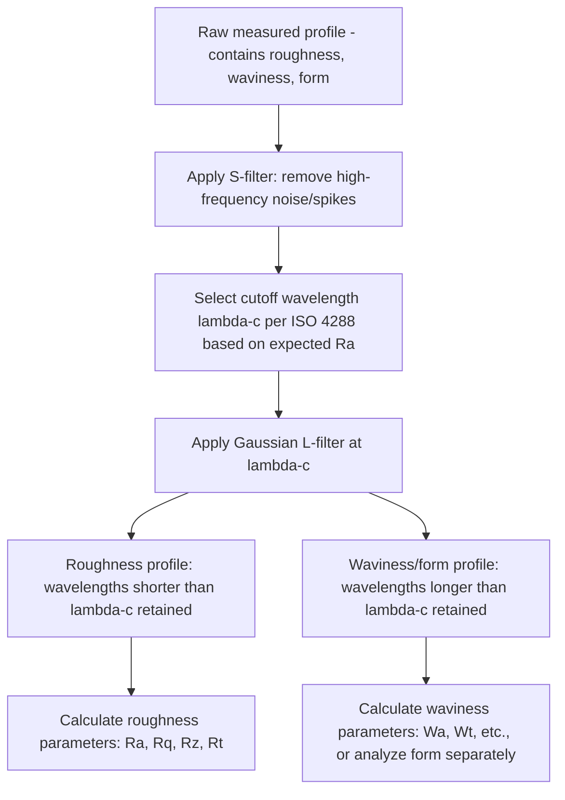

## Cutoff Length and Filtering

### Overview

Cutoff length and filtering define how a raw measured surface profile is mathematically separated into its roughness, waviness, and form components. Because these components occupy overlapping ranges of spatial wavelength, a properly chosen filter and cutoff length are essential to obtaining meaningful, standard-compliant, and reproducible surface texture parameters ($Ra$, $Rz$, $Rt$, and others). This topic covers the filtering theory, the standardized cutoff selection rules (ISO 4288), and the modern Gaussian filtering method (ISO 16610) that has largely superseded older analog filter designs.

### Why Filtering Is Necessary

- **Key Points**
  - A raw traced or scanned surface profile contains a continuous spectrum of spatial wavelengths, from very fine tool-mark-scale irregularities (roughness) through machine-vibration-scale irregularities (waviness) up to the underlying nominal shape deviation (form).
  - Without filtering, calculated parameters would mix these components together, producing $Ra$/$Rz$ values that do not correspond to any single standardized concept and are not comparable between different measurements or instruments.
  - Filtering separates the profile by spatial wavelength using a defined cutoff, isolating the roughness profile (short wavelengths), the waviness profile (medium wavelengths), and removing/separating form (long wavelengths), consistent with the roughness/waviness/lay decomposition framework.

### The Roughness Cutoff Wavelength ($\lambda_c$)

#### Definition

- $\lambda_c$ (lambda-c) is the cutoff wavelength that defines the boundary between roughness and waviness: spatial wavelengths shorter than $\lambda_c$ are retained in the roughness profile; wavelengths longer than $\lambda_c$ are attenuated/removed (assigned to waviness/form).
- The sampling length $lr$ used for per-sampling-length parameters (such as $Rz$) is numerically equal to $\lambda_c$.
- The evaluation length $ln$ is conventionally five sampling lengths ($ln = 5 \times lr$) by default per ISO 4288, though this can be adjusted for specific short features or specialized applications.

#### Standard Cutoff Selection (ISO 4288 Default Table Logic)

- ISO 4288 provides a standardized table relating the expected roughness range (e.g., an estimated or previously known $Ra$ value) to a recommended cutoff wavelength $\lambda_c$ and corresponding stylus tip radius — smoother (lower $Ra$) surfaces use shorter cutoffs, rougher (higher $Ra$) surfaces use longer cutoffs.
- This relationship exists because the cutoff must be long enough relative to the spacing of roughness features to include the relevant roughness wavelength content, while remaining short enough to exclude waviness-scale variation — coarser surfaces inherently have longer characteristic roughness wavelengths, requiring a longer cutoff to capture them fully.

#### Illustrative Relationship (Representative, Not Exhaustive)

| Expected $Ra$ range | Typical $\lambda_c$ (sampling length) | Typical evaluation length ($5\times\lambda_c$) |
| --- | --- | --- |
| Very fine ($Ra$ below approx. $0.1\,\mu m$) | Shorter cutoff (e.g., $0.08\,mm$) | Shorter evaluation length |
| Fine–moderate ($Ra$ approx. $0.1$–$2\,\mu m$) | Intermediate cutoff (e.g., $0.25\,mm$ or $0.8\,mm$) | Correspondingly scaled |
| Coarser ($Ra$ above approx. $2$–$10\,\mu m$) | Longer cutoff (e.g., $2.5\,mm$ or $8\,mm$) | Correspondingly scaled |

[Unverified — exact numeric cutoff/$Ra$ correspondence values must be taken directly from the current edition of ISO 4288, as specific boundary values and the complete table are defined precisely in the standard rather than approximated here.]

### Effect of Incorrect Cutoff Selection

- **Key Points**
  - **Cutoff too long** (relative to the surface's actual roughness wavelength content): waviness-scale variation leaks into the reported roughness profile, artificially inflating roughness parameter values ($Ra$, $Rz$, etc.) beyond the true roughness content, and reducing separation from waviness.
  - **Cutoff too short**: genuine roughness wavelength content longer than the chosen cutoff gets excluded/attenuated, causing the reported roughness parameters to understate the true roughness present on the surface.
  - Because of this sensitivity, consistent and standard-compliant cutoff selection is essential for measurement comparability between different labs, instruments, and time periods — an unspecified or arbitrarily chosen cutoff undermines the traceability and repeatability of reported surface texture values. [Inference — the magnitude of error introduced by cutoff mismatch depends on the specific spatial frequency content of the surface in question and can vary considerably between surface types.]

### Filter Types

#### 1. Gaussian Regression Filter (Current Standard — ISO 16610-21)

- The Gaussian filter is the current internationally standardized filter type for separating roughness from waviness/form in both 2D profile and areal surface texture analysis.
- Its weighting function follows a Gaussian (normal distribution) form, applied as a convolution across the profile:

$$s(x) = \frac{1}{\lambda_c \alpha}\exp\left[-\pi\left(\frac{x}{\lambda_c \alpha}\right)^2\right]$$

where $\alpha = \sqrt{\ln 2/\pi} \approx 0.4697$, chosen such that the filter's transmission characteristic reaches 50% at the cutoff wavelength $\lambda_c$.

- **Key characteristics**:
  - Symmetric weighting function with no phase distortion (does not shift feature positions along the profile), an important advantage over older analog filter designs.
  - Applied via digital convolution (or equivalent regression-based computation), well-suited to modern digital profilometer data processing.
  - The Gaussian filter's 50% transmission point at $\lambda_c$ means it does not create an abrupt cutoff — some content above and below $\lambda_c$ is partially transmitted/attenuated in a smooth transition, which is a defining and standardized characteristic of the method rather than a flaw.

#### 2. Older 2RC (Analog) Filter (Historical/Legacy)

- The 2RC filter is an older analog electronic filter design (two resistor-capacitor stages) historically used in early roughness measurement instruments before digital Gaussian filtering became standard.
- **Key limitations relative to the Gaussian filter**:
  - Introduces phase distortion (shifts the apparent position of profile features), which can distort the true shape of peaks and valleys in the filtered profile.
  - Has a less sharply defined cutoff transition and different transmission characteristics than the Gaussian filter, meaning results from 2RC-filtered and Gaussian-filtered measurements of the same surface are not directly numerically equivalent. [Inference — the specific magnitude of difference between 2RC and Gaussian filtered results on a given surface depends on that surface's specific wavelength content and would need to be assessed for legacy-versus-current data comparison.]
- Largely superseded by the Gaussian filter in current standards and modern instrumentation, though legacy data and older instruments using 2RC filtering may still be encountered in practice, requiring awareness when comparing historical measurement records to current Gaussian-filtered results.

#### 3. Spline and Robust Filters (Specialized Cases)

- Spline filters and robust Gaussian regression filters (per ISO 16610-22 and related parts) are specialized variants designed to handle specific measurement challenges, such as surfaces with deep, isolated scratches or defects where a standard Gaussian filter's response could be unduly influenced by the outlier feature.
- Robust filtering approaches reduce the influence of such isolated outlier features on the computed mean/reference line, providing a more representative separation of roughness/waviness for surfaces containing occasional defects. [Inference — the appropriateness of robust vs. standard Gaussian filtering for a specific surface depends on the nature and frequency of defects present and is typically determined by measurement software configuration options rather than a universal default choice.]

### Filtering Process Flow

### Diagram: Filter Transmission Characteristic

<svg xmlns="http://www.w3.org/2000/svg" viewBox="0 0 700 320">
<title>Gaussian Filter Transmission Characteristic Around Cutoff Wavelength (svg_diagram)</title>
\<style\>
text { font-family: Arial, sans-serif; font-size: 13px; fill: #1a1a1a; }
.label { font-size: 12px; }
\</style\>
<rect x="0" y="0" width="700" height="320" fill="#ffffff" />

<line x1="60" y1="260" x2="640" y2="260" stroke="#333" stroke-width="2" />
<line x1="60" y1="260" x2="60" y2="40" stroke="#333" stroke-width="2" />
<text x="330" y="290" class="label">Spatial wavelength</text>
<text x="20" y="150" class="label" transform="rotate(-90 20 150)">Transmission (%)</text>

<path d="M60,60 C200,65 280,90 340,150 C400,210 500,250 640,255" stroke="#2f6fab" stroke-width="2" fill="none" />
<text x="90" y="55" class="label" fill="#2f6fab">Roughness profile transmission</text>

<path d="M60,258 C200,255 280,230 340,150 C400,90 500,60 640,58" stroke="#c46a1e" stroke-width="2" fill="none" />
<text x="450" y="55" class="label" fill="#c46a1e">Waviness/form profile transmission</text>

<line x1="340" y1="40" x2="340" y2="260" stroke="#999" stroke-width="1" stroke-dasharray="4,3" />
<text x="345" y="35" class="label">lambda-c (50% crossover)</text>
<circle cx="340" cy="150" r="4" fill="#000" />
<text x="350" y="145" class="label">50% transmission point</text>
</svg>

### Standard Reference Framework

| Standard | Scope |
| --- | --- |
| ISO 4287 | Terms, definitions, and profile parameters ($Ra$, $Rz$, $Rt$, etc.) |
| ISO 4288 | Rules and procedures for surface texture assessment, including cutoff selection tables |
| ISO 16610-21 | Linear (Gaussian regression) profile filters |
| ISO 16610-22 | Linear splines and profile filters (specialized variants) |
| ISO 16610-29 | Robust Gaussian regression filters |
| ISO 25178-3 | Areal surface texture specification — filtering (S-filters, L-filters, F-operations for 3D data) |

### Practical Guidance for Selecting Cutoff

- **Key Points**
  - If the approximate expected $Ra$ of the surface is known (from process knowledge, prior measurement, or drawing specification), select the corresponding standardized cutoff per ISO 4288's table rather than an arbitrary or instrument-default value, to ensure comparability with other standard-compliant measurements.
  - If the expected roughness is unknown, an iterative approach is sometimes used: an initial measurement with a provisional cutoff is taken, the resulting $Ra$ is checked against the standard's cutoff-selection table, and the cutoff is adjusted and the measurement repeated if the initial cutoff does not correspond to the measured $Ra$ range. [Inference — the specific iterative procedure and tolerance for acceptable mismatch can vary by organizational measurement procedure and are not always explicitly prescribed by the standard itself for every case.]
  - When comparing measurement results across different instruments, laboratories, or time periods, confirming that the same cutoff wavelength and filter type (Gaussian vs. legacy 2RC) were used is essential before drawing conclusions from apparent differences in reported roughness values.

### Related Topics

- Roughness, waviness, and lay (the components separated by cutoff filtering)
- Profile parameters $Ra$, $Rq$, $Rz$, $Rt$ (calculated from the filtered roughness profile)
- Stylus based profilometry (the measurement method that acquires the raw profile subsequently filtered)
- Areal surface texture parameters and areal filtering (ISO 25178-3 S-filters, L-filters)
- Gaussian regression filter mathematics and robust filter variants for defect-tolerant analysis
- Measurement uncertainty contributions from cutoff and filter selection in surface texture metrology