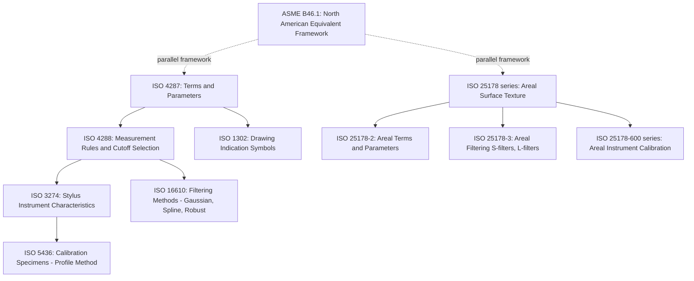

## Surface Texture Measurement Standards

### Overview

Surface texture measurement standards define the terminology, parameters, measurement procedures, filtering methods, calibration requirements, and drawing indication conventions needed to ensure that surface texture measurements are consistent, comparable, and traceable across instruments, laboratories, and international boundaries. The two principal standards families governing this domain are the **ISO Geometrical Product Specifications (GPS)** series (predominant internationally) and the **ASME B46.1** standard (predominant in North America), with additional supporting standards covering drawing symbols, calibration, and specialized measurement techniques.

### Principal Standards Families

#### ISO GPS Surface Texture Standards

| Standard | Scope |
| --- | --- |
| ISO 4287 | Terms, definitions, and surface texture parameters for profile method (roughness, waviness, and related parameters) |
| ISO 4288 | Rules and procedures for the assessment of surface texture using the profile method, including cutoff selection tables |
| ISO 3274 | Nominal characteristics of contact (stylus) instruments |
| ISO 1302 | Indication of surface texture in technical product documentation (drawing symbols) |
| ISO 16610 (series) | Filtration methods (Gaussian regression filters, spline filters, robust filters) for profile and areal data |
| ISO 25178 (series) | Areal surface texture: terms, parameters, calibration, and measurement methods for 3D surface characterization |
| ISO 5436 | Calibration specimens and measurement standards for stylus instruments |
| ISO 21920 (series) | Newer profile method standard progressively replacing/consolidating parts of ISO 4287/4288 (representing an ongoing standards revision) |

#### ASME (North American) Standards

| Standard | Scope |
| --- | --- |
| ASME B46.1 | Surface Texture (Surface Roughness, Waviness, and Lay) — the principal North American standard, broadly analogous in scope to the combined ISO 4287/4288/1302 framework, though with some differing definitions and conventions in specific areas |
| ASME Y14.36 | Surface texture symbols for engineering drawings |

- **Key Points**
  - ISO and ASME standards are broadly aligned in overall concept (roughness/waviness/lay decomposition, similar parameter definitions for $Ra$, $Rq$) but have historically differed in some specific definitions (notably $Rz$, as discussed under profile parameters) and in drawing symbol conventions, making it important to specify which standard governs a given drawing or specification. [Inference — the degree of ongoing convergence between ISO and ASME conventions in current and future editions should be verified against the specific current editions in force, as harmonization efforts continue over time.]
  - International organizations continue to revise and consolidate these standards (e.g., the ISO 21920 series represents an evolution intended to modernize and partially replace the long-standing ISO 4287/4288 framework), so practitioners should confirm which edition and part of a standard is cited on any governing drawing or specification.

### ISO 4287 — Terms, Definitions, and Parameters

- Establishes the fundamental vocabulary of profile-method surface texture analysis: the mean line, sampling length, evaluation length, and the full set of profile parameters ($Ra$, $Rq$, $Rz$, $Rt$, $Rp$, $Rv$, $Rsk$, $Rku$, and spacing/hybrid parameters).
- Forms the definitional foundation referenced by nearly all subsequent profile-based surface texture standards and instrument software.

### ISO 4288 — Rules and Procedures

- Provides the practical measurement procedure framework: cutoff wavelength ($\lambda_c$) selection tables based on expected roughness range, default evaluation length conventions (typically five sampling lengths), and rules for interpreting measured results against specified tolerance limits (e.g., the "16% rule" and "maximum rule" for determining conformance).

#### The 16% Rule and Maximum Rule (Conformance Assessment)

- **16% rule** (default conformance rule unless otherwise specified): a surface is considered to conform to a specified parameter limit if no more than 16% of all measured values (across multiple sampling lengths/measurements) exceed the specified limit — allowing some individual measured values to exceed the nominal limit while the surface overall is still judged conforming.
- **Maximum rule**: when explicitly specified (denoted by adding "max" to the parameter symbol, e.g., $Ra_{max}$), no single measured value across the entire evaluated surface may exceed the specified limit — a stricter, absolute conformance criterion used when even isolated exceedances are functionally unacceptable.
- Selection between these rules should be made explicitly on the drawing/specification based on the functional criticality of the surface; defaulting to the 16% rule without functional justification for surfaces where isolated excursions matter (e.g., sealing surfaces) could permit functionally inadequate parts to pass inspection. [Inference — the specific functional risk of relying on the default 16% rule depends on the application, and the choice between rules is a design/specification decision informed by the failure mode being controlled.]

### ISO 1302 / ASME Y14.36 — Drawing Indication

- Defines the graphical surface texture symbol used on engineering drawings, including the basic symbol (indicating any surface finish process is acceptable), the machining-required symbol, and the material-removal-prohibited symbol, along with placement conventions for parameter values, cutoff length, sampling length, lay direction symbols, and manufacturing process notes.
- Establishes the standardized lay symbols ($=$, $\perp$, $\times$, $M$, $C$, $R$, $P$) discussed under the roughness/waviness/lay topic.

### ISO 25178 Series — Areal Surface Texture

- A multi-part standard series covering areal (3D) surface texture terminology (ISO 25178-2), specification operators/filtering (ISO 25178-3), calibration of instruments (ISO 25178-600 series and related calibration parts), and specific measurement technique standards for areal instruments (contact, optical).
- Represents the modern extension of profile-based standards into full 3D surface characterization, as discussed under areal surface texture parameters.

### Calibration Standards

- **ISO 5436** (and related parts): defines calibration specimens (Type A — for calibrating parameter values such as groove-type specimens with known $Ra$/$Rz$; Type B — for verification of specific instrument functions such as resolution or form) and measurement standards used to verify stylus instrument performance.
- **ISO 25178-600 series**: calibration and verification procedures specifically for areal (3D) surface texture measuring instruments, addressing the additional calibration considerations (lateral resolution across an area, areal filter verification) not covered by profile-only calibration standards.
- Traceability of surface texture measurements ultimately depends on periodic calibration against these certified reference specimens, linked through a calibration chain to national metrology institute (NMI) primary standards. [Inference — the specific calibration interval and certificate requirements are typically governed by the organization's quality management system (e.g., ISO 9001, IATF 16949) rather than mandated as a fixed universal interval by the measurement standards themselves.]

### Standards Relationship Diagram

### Newer Consolidation: ISO 21920 Series

- The ISO 21920 series represents a more recent standards development intended to update and consolidate elements of the long-standing ISO 4287/4288 framework, reflecting ongoing revision of the profile-method standards landscape.
- Practitioners working with current specifications should verify which specific standard (and edition/part) is cited, since drawings and specifications referencing older editions of ISO 4287/4288 remain in wide use even as newer consolidated standards become available. [Unverified — the precise scope, transition timeline, and degree to which ISO 21920 fully supersedes versus supplements ISO 4287/4288 in a given jurisdiction or industry sector should be confirmed against current published standard documentation, given the evolving nature of standards revision.]

### Practical Implications for Specification and Inspection

- **Key Points**
  - A complete, unambiguous surface texture specification on a drawing should identify: the parameter (e.g., $Ra$, $Rz$), the numerical limit, the applicable conformance rule (16% rule by default, or maximum rule if specified), the cutoff/sampling length (if non-default), the lay requirement (if functionally significant), and the governing standard/edition.
  - When quality documentation, inspection reports, or supplier agreements reference surface texture results, confirming the standard and parameter definition in use (particularly for historically ambiguous parameters like $Rz$) prevents misinterpretation between customer and supplier or between different measurement systems.
  - Instrument software should be configured to the correct governing standard/edition for the application, since default settings in commercial profilometer software can vary between manufacturers and may not automatically match the specific standard cited on a given drawing. [Inference — the specific default behavior of any given instrument/software combination should be verified against its documentation rather than assumed.]

### Related Topics

- Roughness, waviness, and lay (concepts formally defined in ISO 4287/ASME B46.1)
- Profile parameters $Ra$, $Rq$, $Rz$, $Rt$ (defined per ISO 4287, historically variable per standard)
- Cutoff length and filtering (governed by ISO 4288 and ISO 16610)
- Areal surface texture parameters (governed by the ISO 25178 series)
- Stylus based profilometry and non-contact optical profilometry (instrument characteristics per ISO 3274 and related areal instrument standards)
- Calibration specimens and traceability chains for surface texture instruments (ISO 5436, ISO 25178-600 series)