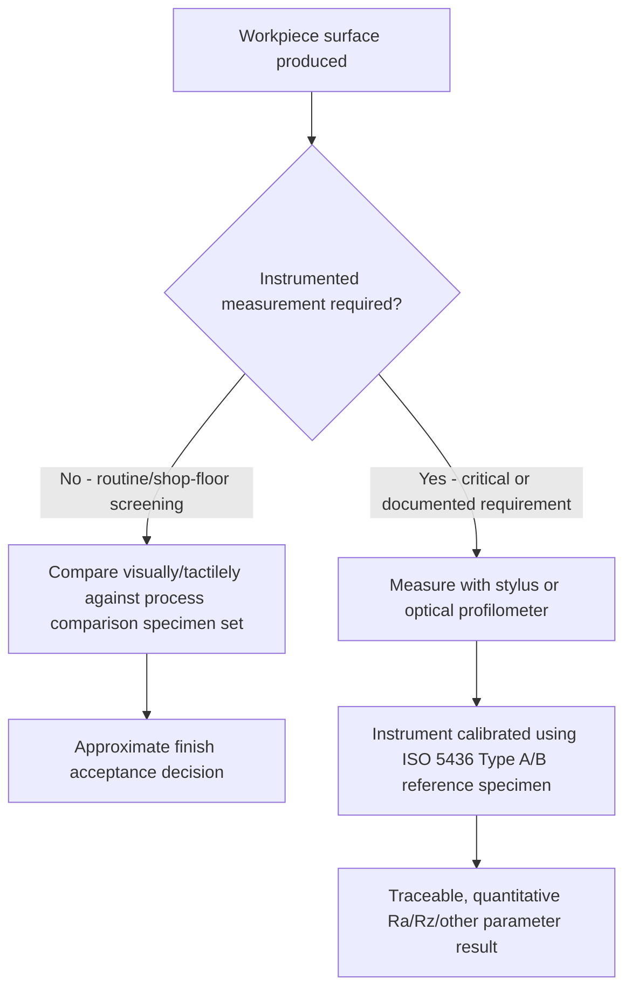

## Surface Finish Comparison Specimens

### Overview

Surface finish comparison specimens are physical reference blocks or plates bearing surfaces of known, representative texture produced by a specific manufacturing process (turning, grinding, milling, shot blasting, etc.) at defined roughness values. They serve two related but distinct purposes: providing a tactile/visual reference for rapid shop-floor assessment of surface finish by comparison, and, in the form of calibrated reference specimens, providing traceable calibration artifacts for surface roughness measuring instruments.

### Purpose and Rationale

- **Key Points**
  - Not every inspection point in a production environment justifies the time and cost of a full profilometer measurement; comparison specimens allow a trained inspector to quickly judge whether a machined surface's texture is approximately consistent with a target finish by visual and tactile (fingernail) comparison against a known reference.
  - This comparison method is inherently subjective and lower in resolution/accuracy than instrumented measurement, but it offers a fast, low-cost, non-instrumented go/no-go-style assessment suitable for routine shop-floor screening, especially where the specified tolerance band is relatively wide or where 100% instrumented inspection would be impractical.
  - Distinct from comparison specimens (used for subjective assessment) are **calibration reference specimens**, which are precisely characterized (with certified traceable parameter values) and used specifically to calibrate and verify the performance of stylus or optical roughness measuring instruments — these serve an instrument-verification function rather than a direct part-inspection function.

### Types of Comparison Specimens

#### Process-Representative Comparison Sets

- Sets of small reference plates or blocks, each manufactured by a specific process (e.g., turning, shaping, milling, grinding, honing, lapping, shot blasting, sand casting) at a range of graded roughness values (e.g., a series spanning from a coarse $Ra$ value down to a fine $Ra$ value in defined steps).
- Organized so an inspector can select the specimen manufactured by the same (or a comparable) process as the workpiece and visually/tactilely compare the workpiece surface against the graded series to estimate its approximate $Ra$ (or equivalent) value.
- Because visual/tactile perception of roughness is influenced by the specific texture pattern characteristic of each process (e.g., turned surfaces have a helical lay pattern distinct from ground surfaces' predominantly linear lay), comparison specimens are typically process-specific — comparing a turned workpiece against a ground reference specimen of nominally the same $Ra$ can produce a misleading subjective impression, since the two surfaces' textures differ in character even at similar amplitude parameters. [Inference — the degree of perceptual mismatch between differing process types at similar Ra values depends on the specific processes being compared and the experience of the inspector.]

#### Calibration Reference Specimens (ISO 5436 Type A / Type B)

- **Type A specimens**: precision reference specimens with a defined, calibrated geometric groove or surface pattern used to verify and calibrate the numerical parameter output (e.g., $Ra$, $Rz$) of a roughness measuring instrument against a certified traceable value.
  - Subtypes commonly include sinusoidal-groove specimens (smoothly varying periodic profile) and triangular/sawtooth-groove specimens (angular periodic profile), each providing a known, certified $Ra$/$Rz$ value against which the instrument's reading is checked.
- **Type B specimens**: used to verify specific functional aspects of instrument performance rather than absolute parameter accuracy — for example, specimens designed to verify the instrument's spatial (lateral) resolution, its ability to correctly resolve fine features, or its stylus tip radius effect, through specially designed groove geometries (e.g., specimens with a range of groove widths/depths to test resolving capability).
- Calibration specimens of this type are manufactured and certified to tight tolerances, with traceable calibration certificates referencing national metrology institute (NMI) or accredited calibration laboratory measurement, distinguishing them clearly from the coarser, non-certified comparison specimen sets used for shop-floor subjective assessment.

### Comparison Table: Comparison Specimens vs. Calibration Reference Specimens

| Aspect | Process comparison specimens | Calibration reference specimens (ISO 5436) |
| --- | --- | --- |
| Purpose | Subjective shop-floor visual/tactile assessment of workpiece finish | Objective, traceable calibration/verification of measuring instrument |
| Certification | Typically nominal/representative, not individually certified | Individually certified with traceable calibration values |
| Precision | Approximate, process-representative | Tight, certified tolerance |
| Typical use location | Machine shop floor, incoming inspection | Metrology lab, instrument calibration station |
| Assessment method | Visual and tactile comparison by trained inspector | Instrumented measurement and comparison to certified value |

### Diagram: Roles of Comparison and Calibration Specimens in the Inspection Workflow

### Practical Use Considerations

- **Key Points**
  - Comparison specimens should be matched as closely as possible to the workpiece's manufacturing process, material, and expected lay direction to minimize perceptual mismatch during subjective comparison.
  - Comparison specimens wear and can become contaminated (oil, dirt, fingerprints) with repeated handling, potentially degrading the fidelity of the reference surface over time; periodic inspection or replacement of heavily used comparison specimen sets is good practice, though this is a matter of internal quality procedure rather than a formal calibration requirement. [Inference — since these specimens are not typically subject to formal certified recalibration, the specific replacement criteria are generally determined by organizational quality procedure rather than a standardized interval.]
  - Calibration reference specimens (ISO 5436 type), by contrast, require the same rigor as other calibrated metrology reference standards: protected storage, periodic recalibration/recertification against traceable standards, and careful handling to avoid damaging the certified reference surface.
  - Subjective comparison methods are not a substitute for instrumented measurement when a drawing specifies a numerical roughness parameter and tolerance — comparison specimens are best used as a preliminary screening tool or for processes/applications where a numerical specification is not formally required.

### Illustration: Typical Comparison Specimen Set Layout

<svg xmlns="http://www.w3.org/2000/svg" viewBox="0 0 720 260">
<title>Process-Graded Surface Finish Comparison Specimen Set (svg_diagram)</title>
\<style\>
text { font-family: Arial, sans-serif; font-size: 12px; fill: #1a1a1a; }
.label { font-size: 11px; }
\</style\>
<rect x="0" y="0" width="720" height="260" fill="#ffffff" />

<text x="20" y="25" font-size="15" font-weight="bold">Comparison Plate - Ground Process Series</text>

<rect x="20" y="50" width="120" height="90" fill="#eef6ff" stroke="#2f6fab" stroke-width="1" />
<text x="35" y="150" class="label">Ra approx 0.1 um</text>
<rect x="160" y="50" width="120" height="90" fill="#dcecff" stroke="#2f6fab" stroke-width="1" />
<text x="175" y="150" class="label">Ra approx 0.4 um</text>
<rect x="300" y="50" width="120" height="90" fill="#cadfff" stroke="#2f6fab" stroke-width="1" />
<text x="315" y="150" class="label">Ra approx 0.8 um</text>
<rect x="440" y="50" width="120" height="90" fill="#b6d1ff" stroke="#2f6fab" stroke-width="1" />
<text x="455" y="150" class="label">Ra approx 1.6 um</text>
<rect x="580" y="50" width="120" height="90" fill="#a2c3ff" stroke="#2f6fab" stroke-width="1" />
<text x="595" y="150" class="label">Ra approx 3.2 um</text>

<text x="20" y="185" class="label">Fingernail/visual comparison direction: sweep across each panel and compare tactile response to workpiece</text>

<text x="20" y="205" class="label">Note: values shown are illustrative graded steps, not certified calibration values</text>

</svg>

### Related Topics

- Roughness, waviness, and lay (the underlying texture concepts these specimens represent)
- Profile parameters $Ra$, $Rq$, $Rz$, $Rt$ (the quantitative parameters comparison specimens approximate and calibration specimens certify)
- Stylus based profilometry and non-contact optical profilometry (instruments calibrated using ISO 5436 reference specimens)
- Surface texture measurement standards (ISO 5436, ISO 4287/4288 governing framework)
- Calibration traceability chains for surface texture measuring instruments
- Visual and tactile inspection methods in general quality control practice