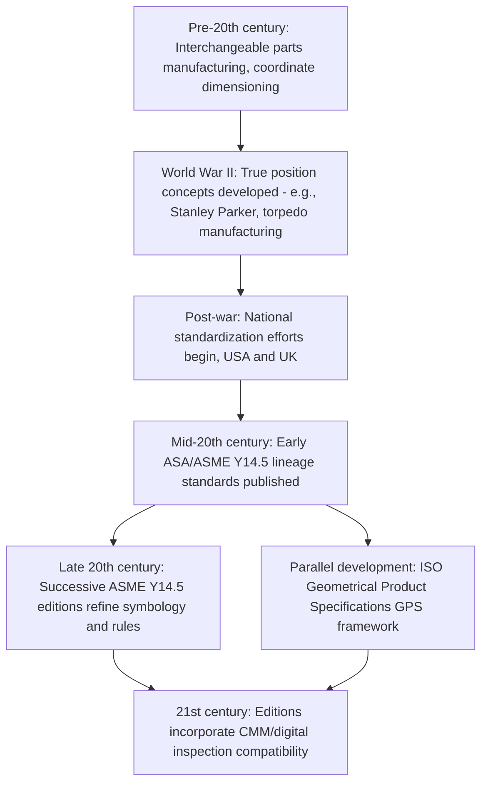

## History and Purpose of GD&T

### Overview

Geometric Dimensioning and Tolerancing (GD&T) is a symbolic language used on engineering drawings and in digital product definitions to specify the allowable variation in the size, form, orientation, and location of part features, based on their actual function and relationship to mating parts. It developed over the 20th century as a response to the limitations of purely coordinate-based (plus/minus) dimensioning, driven by wartime interchangeable manufacturing needs, and matured into the formally standardized systems in use today (ASME Y14.5 in North America, ISO GPS internationally).

### Origins and Historical Development

#### Early Interchangeable Manufacturing (Pre-20th Century)

- The broader concept of interchangeable parts manufacturing predates GD&T itself, tracing to 18th- and 19th-century armory practice (e.g., musket manufacturing) where parts needed to be interchangeable between units without individual hand-fitting.
- Early dimensioning practice relied primarily on plus/minus (coordinate) tolerances applied to linear and angular dimensions, which proved adequate for simple geometry but increasingly inadequate as products grew more complex and functional fit requirements became more sophisticated.

#### World War II and Post-War Formalization

- **Key Points**
  - The pressures of wartime mass production — requiring parts made in geographically dispersed factories to assemble correctly without rework — exposed significant limitations in plus/minus dimensioning, particularly for features involving position, orientation, and form that interact with each other in assembly.
  - Stanley Parker, a British engineer working for the Royal Torpedo Factory in Alexandria, Scotland, is widely credited with developing early true-position tolerancing concepts during World War II to address torpedo manufacturing interchangeability problems, representing one of the foundational contributions to what became modern positional tolerancing. [Unverified — specific historical attribution details are drawn from commonly cited GD&T history accounts; readers seeking definitive historical verification should consult primary historical sources.]
  - Post-war standardization efforts in the United States, United Kingdom, and other industrialized nations sought to formalize these emerging geometric tolerancing concepts into consistent national standards, driven by continuing needs in defense, aerospace, and automotive manufacturing for reliable interchangeability.

#### Formal Standardization (Mid-to-Late 20th Century)

- The American Society of Mechanical Engineers (ASME) — then American Standards Association (ASA) — published early formal standards for dimensioning and tolerancing, with the lineage that became **ASME Y14.5** (originally ANSI Y14.5) evolving through successive editions from the mid-20th century onward, progressively incorporating and refining geometric tolerancing concepts alongside traditional coordinate dimensioning.
- Internationally, the **ISO** developed its own parallel framework, ultimately consolidated under the **ISO GPS (Geometrical Product Specifications)** umbrella of standards, which addresses similar concepts using its own terminology, symbology conventions, and mathematical framework — related to but not always identical in detail to the ASME Y14.5 approach.
- Successive editions of ASME Y14.5 (including notable revisions such as ASME Y14.5-1982, Y14.5M-1994, Y14.5-2009, and Y14.5-2018) progressively refined definitions, added new symbology (e.g., for specific advanced tolerancing concepts), and clarified interpretation rules in response to industry experience and evolving manufacturing/inspection technology (including the growing use of coordinate measuring machines). [Inference — the specific content changes introduced in each edition are documented in the respective standard revisions and should be consulted directly for edition-specific detail.]

### Purpose of GD&T

#### Limitations of Coordinate (Plus/Minus) Tolerancing That GD&T Addresses

- **Key Points**
  - Plus/minus tolerancing applied independently to X and Y coordinate dimensions of a feature (e.g., a hole's location) creates a **square or rectangular tolerance zone**, which does not correspond to the actual functional (typically circular) zone within which a mating fastener or pin must fall to assemble correctly — this mismatch means coordinate tolerancing can either be unnecessarily restrictive (rejecting functionally acceptable parts) or fail to fully define the true functional boundary.
  - Coordinate tolerancing does not inherently address orientation and form requirements (perpendicularity, flatness, roundness, straightness) independently of size — a feature could satisfy its size tolerance while still being unacceptable due to form or orientation error, a gap that plus/minus dimensioning alone does not close.
  - Coordinate tolerancing provides no standardized mechanism analogous to the **maximum material condition (MMC)** bonus tolerance concept, which allows additional positional tolerance as a feature departs from its worst-case (maximum material) size — a functionally significant relationship that GD&T formalizes explicitly.
  - Ambiguity in interpretation (e.g., how datums/reference features are established, how tolerance zones are oriented) is reduced by GD&T's explicit, standardized symbolic language, compared to the greater interpretive latitude inherent in purely numeric coordinate dimensioning with informal notes.

#### Core Purposes GD&T Fulfills

1. **Functional definition of tolerance**: tolerances are defined based on how the part must actually function/assemble, rather than purely on convenient measurement axes, aligning the inspection criterion with the true functional requirement.
2. **Unambiguous, standardized communication**: a consistent symbolic language communicates design intent precisely between designers, manufacturers, and inspectors, reducing misinterpretation across organizational and international boundaries.
3. **Datum reference framework**: establishes a formal, hierarchical system of datums (reference features) from which all other features are measured, ensuring the part is measured and inspected relative to the same reference frame used in its functional assembly context.
4. **Optimized tolerance allocation (bonus tolerance)**: mechanisms such as MMC and least material condition (LMC) modifiers allow tolerance to expand as a feature's actual size departs from its worst-case condition, permitting more parts to be functionally acceptable without loosening the nominal tolerance specification.
5. **Support for automated/CMM-based inspection**: GD&T's mathematically precise definitions (particularly under the ISO GPS mathematical framework and modern ASME Y14.5 editions) are well suited to computation by coordinate measuring machines and inspection software, supporting the shift from manual gauge-based inspection to computer-aided dimensional metrology.
6. **Cost reduction through realistic tolerancing**: by tying tolerance zones to actual functional requirements rather than convenient but arbitrary coordinate axes, GD&T can reduce unnecessary rejection of functionally acceptable parts and can clarify where tighter or looser tolerance is genuinely required, supporting more economical manufacturing without compromising function.

### Historical Development Timeline (Illustrative)

### Relationship Between ASME Y14.5 and ISO GPS

- **Key Points**
  - ASME Y14.5 and the ISO GPS framework share the same broad conceptual foundation (functional tolerancing, datum reference frames, geometric tolerance zones) but differ in specific terminology, some symbol conventions, and certain detailed interpretation rules.
  - Products and drawings intended for international supply chains must specify which standard (and edition) governs the drawing, since direct interchangeability of interpretation between the two frameworks is not guaranteed in all cases without explicit correlation. [Inference — the degree of practical interpretive difference between the two frameworks varies by specific tolerance type and application, and organizations operating internationally often maintain internal correlation guidance between the two systems.]
  - Ongoing international harmonization efforts continue to influence the evolution of both standard families, though complete convergence has not been achieved to date. [Unverified — the current state and pace of harmonization should be confirmed against the most recent published editions and any relevant standards-body announcements.]

### Summary Table: Coordinate Tolerancing vs. GD&T

| Aspect | Coordinate (Plus/Minus) Tolerancing | GD&T |
| --- | --- | --- |
| Tolerance zone shape (e.g., for hole location) | Rectangular/square (from independent X/Y tolerances) | Cylindrical/circular (matches actual functional fit zone) |
| Form/orientation control | Not inherently addressed | Explicitly controlled via dedicated symbols (flatness, perpendicularity, etc.) |
| Reference frame | Informal, drawing-view dependent | Formal datum reference frame hierarchy |
| Bonus tolerance mechanism | Not available | MMC/LMC modifiers provide functionally justified bonus tolerance |
| Suitability for CMM/automated inspection | Limited, often requires manual reinterpretation | Designed for direct mathematical/computational evaluation |
| Standardization body | General drafting convention | ASME Y14.5 (US) / ISO GPS (international) |

### Related Topics

- ASME Y14.5 standard structure and editions
- ISO GPS (Geometrical Product Specifications) framework and terminology
- Datum reference frames and datum feature selection
- Maximum material condition (MMC) and least material condition (LMC) bonus tolerancing
- True position tolerancing and virtual condition calculations
- Coordinate measuring machine (CMM) based GD&T inspection and evaluation software