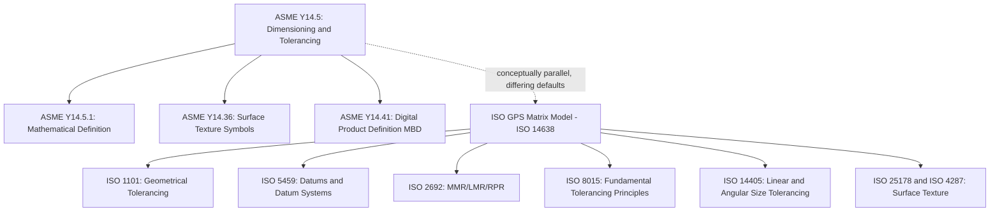

## Dimensioning and Tolerancing Standards

### Overview

Dimensioning and tolerancing standards define the formal rules, symbols, definitions, and mathematical basis governing how part geometry, size, and permissible variation are specified on engineering drawings and in digital product definitions. Two principal, related but distinct standards families dominate global practice: the **ASME Y14.5** series (predominant in North America) and the **ISO GPS (Geometrical Product Specifications)** family of standards (predominant internationally). This topic surveys the structure, scope, and key content of each.

### ASME Y14.5 — Dimensioning and Tolerancing

#### Scope and Structure

- **ASME Y14.5** ("Dimensioning and Tolerancing") is the principal North American standard defining the rules, symbols, and definitions for both traditional dimensioning practice and geometric dimensioning and tolerancing (GD&T).
- It defines the complete set of geometric characteristic symbols (straightness, flatness, circularity, cylindricity, profile of a line/surface, angularity, perpendicularity, parallelism, position, concentricity/coaxiality, symmetry, circular runout, total runout), along with modifying symbols (MMC, LMC, RFS, projected tolerance zone, free state, tangent plane, and others).
- Establishes fundamental rules governing the interpretation of size dimensions and their relationship to form (notably, the classic "Rule #1" / envelope principle, discussed further under Taylor's principle-adjacent GD&T topics), datum reference frame construction, and tolerance zone definition for each geometric characteristic.

#### Editions and Evolution

| Edition (representative) | Notable characteristics |
| --- | --- |
| ANSI Y14.5-1966 / 1973 (early lineage) | Early formal codification of geometric tolerancing symbology |
| ANSI Y14.5M-1982 | Significant modernization, metric-focused revision |
| ASME Y14.5M-1994 | Widely used and referenced edition for several decades; refined definitions and rules |
| ASME Y14.5-2009 | Removed the "M" designation from the title; further clarifications and additions |
| ASME Y14.5-2018 | Most recent major edition at time of writing, with continued refinement of definitions, added symbology, and clarified interpretation rules |

- [Unverified — the specific content differences between editions are documented in each edition's revision summary and should be consulted directly for edition-specific interpretation, particularly when reconciling drawings referencing different editions within the same product lifecycle.]

#### Related ASME Standards

| Standard | Scope |
| --- | --- |
| ASME Y14.5.1 | Mathematical definition of dimensioning and tolerancing principles (formal mathematical basis for Y14.5 concepts) |
| ASME Y14.36 | Surface texture symbols |
| ASME Y14.100 | General engineering drawing practices |
| ASME Y14.41 | Digital product definition data practices (model-based definition, MBD) |
| ASME B4.1/B4.2 | Preferred limits and fits for cylindrical parts (inch/metric) |

### ISO GPS — Geometrical Product Specifications

#### Scope and Structure

- The **ISO GPS** (Geometrical Product Specifications) framework is a comprehensive, multi-part family of ISO standards addressing dimensional and geometric specification, verification, and the underlying mathematical/statistical basis for tolerancing, measurement uncertainty, and conformance assessment.
- Unlike ASME Y14.5 (a single consolidated standard), ISO GPS is deliberately structured as a coordinated matrix of individual standards, each addressing a specific aspect (e.g., linear sizes, form tolerances, datums, surface texture, uncertainty) within an overarching consistent mathematical framework — sometimes referred to as the "GPS matrix model."

#### Key Constituent Standards (Representative, Not Exhaustive)

| Standard | Scope |
| --- | --- |
| ISO 1101 | Geometrical tolerancing — tolerances of form, orientation, location, and run-out (the core geometric tolerancing symbol/zone standard, roughly analogous to the geometric portion of ASME Y14.5) |
| ISO 5459 | Datums and datum systems |
| ISO 2692 | Maximum material requirement (MMR), least material requirement (LMR), and reciprocity requirement (RPR) — the ISO equivalents of MMC/LMC/bonus tolerance concepts |
| ISO 8015 | Fundamental tolerancing principles (including the independency principle, a notable point of conceptual difference from ASME's envelope-based default) |
| ISO 14405 (series) | Dimensional tolerancing of linear and angular sizes |
| ISO 286 | ISO system of limits and fits |
| ISO 1660 | Profile tolerancing |
| ISO 5458 | Positional tolerancing |
| ISO 4287 / ISO 25178 | Surface texture (profile and areal, respectively) |
| ISO 14638 | GPS matrix model — the overarching structural framework relating all GPS standards to one another |

### Key Conceptual Differences Between ASME Y14.5 and ISO GPS

- **Key Points**
  - **Default size/form relationship**: ASME Y14.5 defaults to the **envelope principle** (Rule #1 — a feature's size tolerance and form must both be satisfied within the size limits, i.e., the surface must not violate a perfect-form boundary at MMC), whereas the ISO GPS framework, per **ISO 8015**, defaults to the **independency principle** — where size and form are considered independent unless explicitly linked by an added tolerance indicator. This is one of the most functionally significant differences between the two frameworks, since drawings prepared under one default assumption without explicit modifiers may be interpreted differently if evaluated under the other framework's default. [Inference — the practical impact of this difference depends on whether the specific feature's function requires the envelope relationship, and correct interpretation requires knowing which standard/edition governs the drawing.]
  - **Terminology differences**: ASME's "maximum material condition (MMC)" and "least material condition (LMC)" correspond conceptually to ISO's "maximum material requirement (MMR)" and "least material requirement (LMR)," though the precise formal definitions and associated symbology are not always perfectly identical between the two systems.
  - **Standard structure**: ASME Y14.5 is a single consolidated standard covering most dimensioning/tolerancing needs, whereas ISO GPS is a coordinated matrix of many individual standards, requiring cross-referencing multiple documents to assemble a complete specification framework for a given application.
  - **Datum referencing conventions**: both systems use datum features and datum reference frames, but specific rules for datum feature simulation, degrees of freedom constraint, and datum target specification have historically differed in detail between the two frameworks, though harmonization efforts have narrowed some gaps over successive editions. [Unverified — the current degree of alignment on datum referencing specifics should be confirmed against the latest editions of both ASME Y14.5 and the relevant ISO 5459 edition.]

### Standards Relationship Diagram

### Historical/Regional Adoption Patterns

- **Key Points**
  - ASME Y14.5 is predominant in the United States and in industries with strong US aerospace/defense/automotive supply chain heritage.
  - ISO GPS standards are predominant across much of Europe, Asia, and other regions following ISO-based national standards adoption; many countries have historically maintained their own national standards (e.g., British Standards, DIN in Germany, JIS in Japan) that have progressively aligned with or adopted ISO GPS content over recent decades.
  - Multinational companies and global supply chains often require internal guidance documents correlating the two frameworks, or explicit drawing notes specifying which standard and edition governs interpretation, to avoid ambiguity when parts move between suppliers operating under different national/regional conventions. [Inference — the specific correlation approach and level of formality required depends on the organization's quality system and the criticality of the parts/tolerances involved.]

### Practical Implications for Drawing Preparation and Inspection

- **Key Points**
  - Every drawing or digital product definition should explicitly state the governing dimensioning/tolerancing standard and edition (e.g., "Dimensioning and tolerancing per ASME Y14.5-2018" or "per ISO 1101:2017") in the general notes or title block, since default interpretation rules (particularly the envelope vs. independency principle default) differ materially between frameworks.
  - CMM inspection software and GD&T evaluation tools typically require configuration to the correct governing standard, since default settings and calculation methods (e.g., default MMC/bonus tolerance handling) can vary between software packages and may not automatically match the standard cited on a specific drawing. [Inference — the specific default configuration of any given CMM software package should be verified against its documentation and set explicitly for each project rather than assumed.]
  - Training and certification programs (e.g., those aligned with ASME Y14.5 GDTP certification) are typically standard-specific, and personnel working across both frameworks in a global supply chain context benefit from explicit cross-training on both systems' terminology and default rule differences.

### Related Topics

- History and purpose of GD&T (the developmental background leading to these standards)
- Envelope principle (Rule #1) vs. independency principle (ISO 8015) — a key default-rule distinction
- Maximum material condition/requirement (MMC/MMR) and bonus tolerance concepts
- Datum reference frames and datum feature simulation (ASME vs. ISO conventions)
- ISO system of limits and fits (ISO 286) and its ASME B4.1/B4.2 counterparts
- Model-based definition (MBD) and digital product definition practices (ASME Y14.41)
- Coordinate measuring machine (CMM) software configuration for standard-specific GD&T evaluation