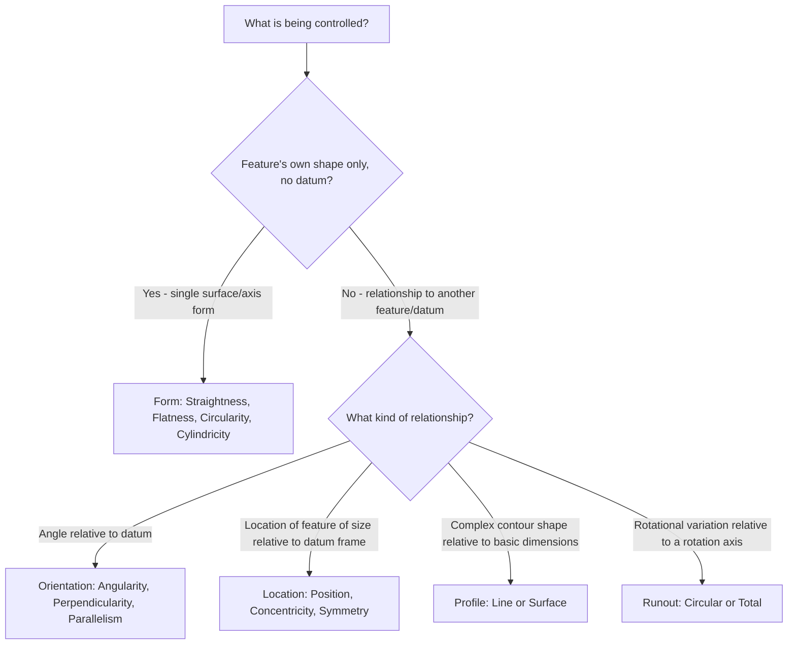

## Geometric Characteristic Symbols

### Overview

Geometric characteristic symbols are the standardized graphical symbols used within a feature control frame to specify the type of geometric tolerance being applied to a feature — form, orientation, location, or runout. Defined primarily under ASME Y14.5 (with closely related equivalents under ISO 1101), these fourteen symbols form the core vocabulary of geometric dimensioning and tolerancing, each corresponding to a specific tolerance zone shape, datum requirement, and functional meaning.

### The Five Categories of Geometric Characteristics

| Category | Characteristics | Datum reference required? |
| --- | --- | --- |
| Form | Straightness, Flatness, Circularity (Roundness), Cylindricity | No |
| Orientation | Angularity, Perpendicularity, Parallelism | Yes |
| Location | Position, Concentricity/Coaxiality, Symmetry | Yes |
| Profile | Profile of a Line, Profile of a Surface | Optional (can apply with or without datum reference) |
| Runout | Circular Runout, Total Runout | Yes |

### Form Tolerances

#### Straightness

- **Symbol**: a single straight horizontal line.
- **Purpose**: controls how much a line element of a surface, or a derived median line/axis, may deviate from a theoretically perfect straight line.
- **Tolerance zone**: for a line element, two parallel lines separated by the tolerance value; for an axis (derived median line), a cylindrical zone.
- **Example**: a shaft's axis specified with a straightness tolerance of $0.05\,mm$ over its length must have its derived median line contained within a cylinder of $0.05\,mm$ diameter.

#### Flatness

- **Symbol**: a parallelogram (slanted rectangle).
- **Purpose**: controls the deviation of an entire surface from a theoretically perfect flat plane, independent of any datum reference.
- **Tolerance zone**: two parallel planes separated by the specified tolerance value, within which the entire surface must lie.

#### Circularity (Roundness)

- **Symbol**: a circle.
- **Purpose**: controls the deviation of a circular cross-section (of a cylinder, cone, or sphere) from a theoretically perfect circle at any single cross-sectional plane, evaluated independently at each cross-section along the feature.
- **Tolerance zone**: two concentric circles in the plane of measurement, separated radially by the tolerance value.

#### Cylindricity

- **Symbol**: a circle with two tangent diagonal lines (resembling a circle with an inscribed slanted cross or "cylindricity" glyph).
- **Purpose**: controls the deviation of an entire cylindrical surface simultaneously from a theoretically perfect cylinder, combining circularity, straightness of the axis, and taper into a single composite control.
- **Tolerance zone**: two coaxial cylinders separated radially by the tolerance value, within which the entire surface must lie.

### Orientation Tolerances

#### Angularity

- **Symbol**: an angled/slanted line (resembling a checkmark or open angle).
- **Purpose**: controls the deviation of a surface, line, or axis from a specified angle (other than 0° or 90°) relative to a datum.
- **Tolerance zone**: two parallel planes (or lines) oriented at the specified basic angle to the referenced datum, separated by the tolerance value.

#### Perpendicularity

- **Symbol**: an upright perpendicular (⊥) symbol.
- **Purpose**: controls the deviation of a surface, line, or axis from being exactly 90° relative to a datum.
- **Tolerance zone**: two parallel planes (or a cylindrical zone, for an axis) oriented exactly perpendicular to the datum, separated by the tolerance value.

#### Parallelism

- **Symbol**: two parallel diagonal lines.
- **Purpose**: controls the deviation of a surface, line, or axis from being exactly parallel to a datum.
- **Tolerance zone**: two parallel planes (or a cylindrical zone, for an axis) oriented exactly parallel to the datum, separated by the tolerance value.

### Location Tolerances

#### Position (True Position)

- **Symbol**: a circle with a cross through it (⊕).
- **Purpose**: controls the location of a feature of size (hole, boss, slot) relative to its true (theoretically exact) position as defined by basic dimensions and a datum reference frame — the most widely used and functionally significant of the location tolerances.
- **Tolerance zone**: typically a cylinder (for a round feature such as a hole) or a defined zone shape centered on the true position, within which the feature's axis (or center plane, for a slot) must lie; the zone size can expand via MMC/LMC bonus tolerance depending on the feature's actual size.

#### Concentricity / Coaxiality

- **Symbol**: two concentric circles (one inside the other).
- **Purpose**: controls the coincidence of the median points (or axis) of a feature with the axis of a datum feature — a relatively rarely specified control in current practice, as position tolerancing with appropriate datum referencing is generally preferred for most practical location control needs due to concentricity's difficult verification requirements (requiring evaluation of opposed point median locations rather than a simple, directly measurable surface).
- **Tolerance zone**: a cylindrical zone centered on the datum axis, within which the median points of the controlled feature at each cross-section must lie.

#### Symmetry

- **Symbol**: a horizontal line with a vertical line through its center, flanked by two additional short marks (resembling a stylized "S" structural glyph specific to GD&T).
- **Purpose**: controls the coincidence of the median points of two features (or a feature and a datum plane) with a center plane — analogous to concentricity but for planar/symmetric features rather than axisymmetric ones; similarly less commonly specified than position tolerancing in current practice for the same practical verification difficulty reasons.

### Profile Tolerances

#### Profile of a Line

- **Symbol**: an open, unequal-armed curved arc.
- **Purpose**: controls the two-dimensional profile deviation of a line element of a surface from a theoretically exact profile defined by basic dimensions, typically evaluated at various cross-sections.

#### Profile of a Surface

- **Symbol**: a similar open arc symbol, applied to control the entire surface rather than a single line element (the two share a visually similar base glyph, distinguished by context/application, per ASME Y14.5 convention).
- **Purpose**: controls the three-dimensional deviation of an entire surface from a theoretically exact profile — widely used for complex, contoured, or freeform surfaces (e.g., sheet metal panels, castings, aerodynamic surfaces) where simple form/orientation/location controls would be inadequate to define the full surface shape requirement.
- **Tolerance zone**: a zone following the theoretically exact profile shape, offset by the specified tolerance value (either equally on both sides, or unequally/unilaterally if specified).

### Runout Tolerances

#### Circular Runout

- **Symbol**: a single arrow pointing toward the surface at an angle (resembling a single diagonal arrow).
- **Purpose**: controls the variation of a surface (measured as a single circular element/cross-section at a time) relative to a datum axis, as the part is rotated 360° about that datum axis — commonly used for controlling wobble/eccentricity of rotating features relative to their rotational axis.
- **Tolerance zone**: at each measured cross-section, two concentric circles centered on the datum axis, within which that cross-section's measured points must lie.

#### Total Runout

- **Symbol**: two arrows pointing toward the surface at an angle (resembling a double diagonal arrow, distinguishing it from circular runout's single arrow).
- **Purpose**: controls the variation of an entire surface simultaneously (not just individual circular cross-sections) relative to a datum axis, as the part is rotated 360° about that axis, combining both circular (radial) and axial (straightness/taper along the axis) variation into one composite control.
- **Tolerance zone**: two cylinders coaxial with the datum axis, within which the entire surface must lie, evaluated over the full rotation and full length simultaneously.

### Summary Table of All Fourteen Symbols

| Category | Characteristic | Datum required |
| --- | --- | --- |
| Form | Straightness | No |
| Form | Flatness | No |
| Form | Circularity | No |
| Form | Cylindricity | No |
| Orientation | Angularity | Yes |
| Orientation | Perpendicularity | Yes |
| Orientation | Parallelism | Yes |
| Location | Position | Yes |
| Location | Concentricity/Coaxiality | Yes |
| Location | Symmetry | Yes |
| Profile | Profile of a Line | Optional |
| Profile | Profile of a Surface | Optional |
| Runout | Circular Runout | Yes |
| Runout | Total Runout | Yes |

### Symbol Selection Logic

### Illustrative Diagram: Representative Tolerance Zone Shapes

<svg xmlns="http://www.w3.org/2000/svg" viewBox="0 0 760 320">
<title>Representative Tolerance Zone Shapes for Selected Geometric Characteristics (svg_diagram)</title>
\<style\>
text { font-family: Arial, sans-serif; font-size: 12px; fill: #1a1a1a; }
.label { font-size: 11px; }
\</style\>
<rect x="0" y="0" width="760" height="320" fill="#ffffff" />

<text x="40" y="30" font-weight="bold">Flatness</text>

<line x1="40" y1="60" x2="220" y2="60" stroke="`#2f6fab`" stroke-width="2" />

<line x1="40" y1="90" x2="220" y2="90" stroke="`#2f6fab`" stroke-width="2" />

<path d="M40,75 Q90,65 130,78 T220,75" stroke="#333" stroke-width="1.5" fill="none" />

<text x="40" y="110" class="label">Two parallel planes, tolerance apart</text>

<text x="290" y="30" font-weight="bold">Circularity</text>

<circle cx="360" cy="90" r="50" fill="none" stroke="`#2f6fab`" stroke-width="2" />

<circle cx="360" cy="90" r="40" fill="none" stroke="`#2f6fab`" stroke-width="2" />

<path d="M360,50 Q400,70 410,90 Q400,120 360,130 Q320,120 315,90 Q320,60 360,50" stroke="#333" stroke-width="1" fill="none" />

<text x="300" y="150" class="label">Two concentric circles, radial tolerance</text>

<text x="530" y="30" font-weight="bold">Position</text>

<circle cx="600" cy="90" r="35" fill="none" stroke="`#2f6fab`" stroke-width="2" />

<circle cx="600" cy="90" r="6" fill="#333" />

<line x1="580" y1="90" x2="620" y2="90" stroke="#999" stroke-dasharray="3,2" />

<line x1="600" y1="70" x2="600" y2="110" stroke="#999" stroke-dasharray="3,2" />

<text x="540" y="150" class="label">Cylindrical zone at true position</text>

<text x="40" y="200" font-weight="bold">Circular Runout (single cross-section)</text>

<circle cx="130" cy="260" r="45" fill="none" stroke="#333" stroke-width="1" stroke-dasharray="2,2" />

<circle cx="130" cy="260" r="50" fill="none" stroke="`#c46a1e`" stroke-width="2" />

<circle cx="130" cy="260" r="40" fill="none" stroke="`#c46a1e`" stroke-width="2" />

<text x="40" y="315" class="label">Concentric zone about datum axis, per cross-section</text>

<text x="420" y="200" font-weight="bold">Profile of a Surface</text>

<path d="M420,260 Q480,230 540,255 T660,258" stroke="`#0b5aa5`" stroke-width="1" fill="none" stroke-dasharray="3,2" />

<path d="M420,270 Q480,240 540,265 T660,268" stroke="`#c46a1e`" stroke-width="2" fill="none" />

<path d="M420,250 Q480,220 540,245 T660,248" stroke="`#c46a1e`" stroke-width="2" fill="none" />

<text x="420" y="300" class="label">Zone follows exact profile shape, offset by tolerance</text>

</svg>

### Practical Notes on Symbol Application

- **Key Points**
  - Each geometric characteristic symbol is placed in the leftmost compartment of a feature control frame, followed by the tolerance value (with any modifiers such as diameter symbol or MMC/LMC), and, where applicable, one or more datum letter references in subsequent compartments.
  - Form tolerances (straightness, flatness, circularity, cylindricity) never reference a datum, since they control a feature's own shape independent of its relationship to any other feature.
  - Profile tolerances are unique in being usable either with or without datum references, depending on whether the profile's location/orientation relative to other features needs to be controlled (with datums) or only its own shape independent of location (without datums).
  - Position, though categorized under "location," is frequently the single most commonly applied geometric tolerance in practice, due to its direct applicability to the extremely common design requirement of locating holes, pins, and similar features of size relative to a datum reference frame.

### Related Topics

- History and purpose of GD&T
- Dimensioning and tolerancing standards (ASME Y14.5 / ISO 1101 symbol definitions)
- Datum reference frames and datum feature selection
- Maximum material condition (MMC) and bonus tolerance application to position tolerancing
- Feature control frame structure and reading conventions
- Profile tolerancing for complex/freeform surfaces
- Runout tolerancing for rotating components