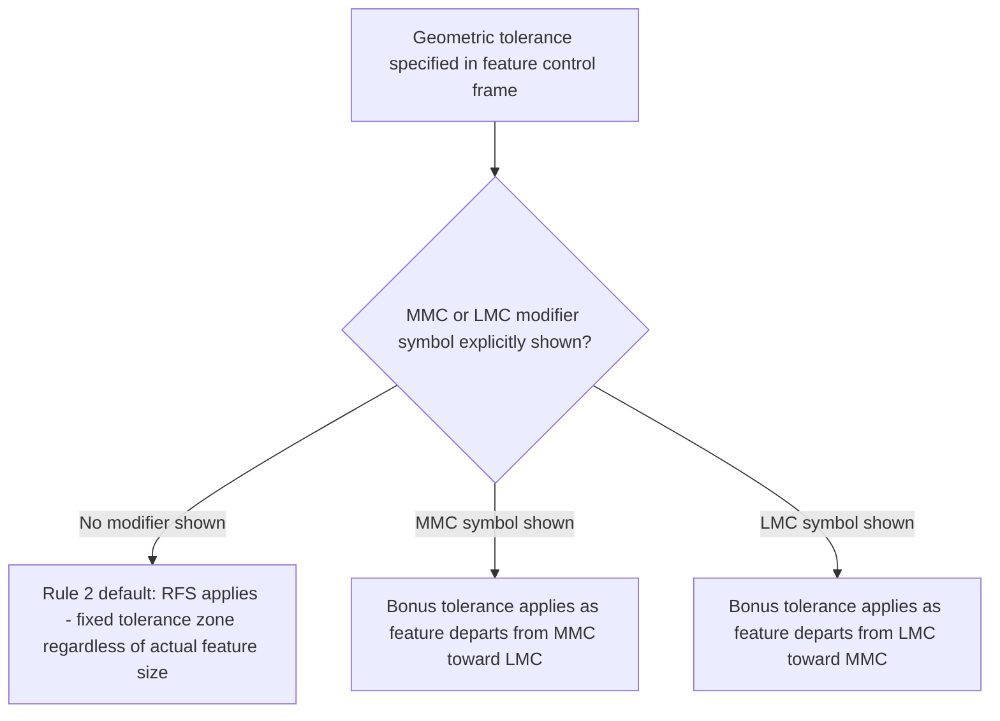

## Rule 1 and Rule 2

### Overview

Rule #1 and Rule #2 are two of the fundamental interpretation rules defined in ASME Y14.5 that govern the default relationship between a feature's size tolerance and its permissible form/geometric variation, and between a geometric tolerance and the measurement basis (MMC, LMC, or RFS) applied to it when no explicit modifier is stated. These rules establish the default assumptions that apply whenever a drawing does not explicitly override them, and correctly understanding them is essential to accurate interpretation of any dimensioned drawing.

### Rule #1 — The Envelope Principle

#### Statement

Rule #1 (also called the **Envelope Principle** or the **Taylor Principle** in some contexts, though it should not be confused with the gauge-specific Taylor's principle of GO/NO-GO gauge design) states that where only a tolerance of size is specified for an individual feature of size, the **form of the feature must also fall within the specified size limits**. Specifically:

- The feature's actual local size must fall within the specified size tolerance at every cross-section, **and**
- The feature must not violate a theoretical perfect-form envelope at its **maximum material condition (MMC)** boundary, meaning the feature cannot be so out-of-form that any part of it exceeds the perfect-form boundary at MMC, even if all individual local size measurements are within tolerance.

#### Rationale

- **Key Points**
  - Rule #1 exists to ensure that a feature specified only with a size tolerance (no explicit form control) will still assemble/mate correctly, since a feature that is in-tolerance at every individually measured cross-section could still be significantly bowed, tapered, or out-of-round in a way that would prevent proper mating if form were entirely unconstrained.
  - The perfect-form-at-MMC boundary effectively links size tolerance to an implicit, minimal form control without requiring an explicit form tolerance (flatness, straightness, circularity, cylindricity) to be separately specified for basic assembly-fit assurance — an explicit form tolerance is only needed when a tighter form requirement than what Rule #1 provides is functionally necessary.
  - This concept directly parallels the logic of Taylor's principle in fixed-limit gauging (GO gauge checks full form at MML) — both frameworks recognize that maximum material condition combined with full-form checking is what guarantees assembly, and both allow the minimum-material condition to be checked with a simpler, size-only criterion.

#### Example

A shaft is specified as $\varnothing 20.00^{0}_{-0.05}\,mm$ with no additional form tolerance called out.

- Under Rule #1: the shaft's actual local diameter must be between $19.95\,mm$ and $20.00\,mm$ at every cross-section, **and** the shaft's actual surface must fit within a perfect cylindrical envelope of $\varnothing 20.00\,mm$ (the MMC boundary) over its length.
- This means a bowed shaft that measures within $19.95$–$20.00\,mm$ at every individual cross-section could still be rejected under Rule #1 if its overall bowed shape would not fit within the $\varnothing 20.00\,mm$ perfect-form envelope — since a bowed shaft, even if locally within diameter tolerance everywhere, would not slide into a straight $\varnothing 20.00\,mm$ mating hole.

#### Diagram: Rule #1 Envelope Concept

<svg xmlns="http://www.w3.org/2000/svg" viewBox="0 0 700 300">
<title>Rule 1 Envelope Principle - Size Tolerance Plus Perfect Form at MMC (svg_diagram)</title>
\<style\>
text { font-family: Arial, sans-serif; font-size: 12px; fill: #1a1a1a; }
.label { font-size: 11px; }
\</style\>
<rect x="0" y="0" width="700" height="300" fill="#ffffff" />

<text x="40" y="30" font-weight="bold">Perfect-form envelope at MMC</text>

<rect x="40" y="60" width="560" height="60" fill="none" stroke="`#2f6fab`" stroke-width="2" rx="30" />

<text x="330" y="55" class="label">Diameter = MMC limit</text>

<text x="40" y="160" font-weight="bold">Actual bowed feature (locally within size tolerance)</text>

<path d="M40,220 Q200,180 350,215 Q500,250 600,210" stroke="`#c46a1e`" stroke-width="8" fill="none" stroke-linecap="round" />

<path d="M40,235 Q200,195 350,230 Q500,265 600,225" stroke="`#c46a1e`" stroke-width="8" fill="none" stroke-linecap="round" opacity="0" />

<text x="40" y="270" class="label">Even though every local diameter reading is within tolerance, the bowed shape</text>

<text x="40" y="285" class="label">may violate the perfect-form envelope, failing Rule 1 despite passing size checks alone.</text>

</svg>

#### Scope and Limitations of Rule #1

- **Key Points**
  - Rule #1 applies only to individual, regular features of size (a cylindrical or spherical surface, or a set of two parallel opposed surfaces) — it does not apply to non-size features (e.g., a plane surface with no opposing feature), nor does it apply automatically when other overriding conditions or notes are present (e.g., "perfect form at MMC not required," a note sometimes used for specific functional exceptions).
  - Rule #1 does **not** apply between features (it doesn't control the relationship or location of one feature to another) — it applies only to the individual feature's own size-versus-form relationship; orientation and location relationships between features still require explicit geometric tolerances (perpendicularity, position, etc.) even when Rule #1 governs each feature's own form.
  - Rule #1 does not apply to non-rigid parts in their free (unrestrained) state under certain conditions (addressed by the free-state variation concept, a related but distinct modifier), and does not automatically apply to stock/bar/tubing material sizes as furnished, which are typically governed by separate industry/mill tolerance standards unless a drawing dimension is specifically applied.
  - The ISO GPS framework's default is fundamentally different (the **independency principle** under ISO 8015), where size and form are considered independent by default unless explicitly linked — meaning a drawing prepared without specifying the governing standard could be interpreted very differently depending on whether ASME Y14.5's Rule #1 or ISO 8015's independency principle is assumed to apply, making explicit standard designation critical.

### Rule #2 — Regardless of Feature Size (RFS) Default

#### Statement

Rule #2 states that for all applicable geometric tolerances (specifically position and other tolerances that can apply a material condition modifier), **Regardless of Feature Size (RFS)** applies to both the individual tolerance and to any datum feature referenced in the feature control frame, unless **MMC** or **LMC** is explicitly specified by placing the appropriate modifier symbol in the feature control frame.

#### Rationale

- **Key Points**
  - Prior to Rule #2's establishment as the default, ambiguity could arise as to whether a stated geometric tolerance value was meant to apply strictly (RFS — the tolerance zone size does not change regardless of the feature's actual size) or with an implied bonus tolerance (MMC/LMC) — Rule #2 removes this ambiguity by making RFS the explicit default absent a stated modifier.
  - Under RFS, the specified tolerance value applies as a fixed zone size regardless of where the feature's actual size falls within its size tolerance — no bonus (additional) tolerance is granted as the feature departs from MMC or LMC, in contrast to the MMC/LMC bonus tolerance mechanism which explicitly does grant such bonus tolerance when those modifiers are specified.
  - This default reflects a historical evolution in the standard: earlier editions of Y14.5 defaulted to MMC in some contexts without explicit modifier symbols, and Rule #2's formalization of RFS as the default (requiring explicit MMC/LMC symbols when bonus tolerance is intended) increased interpretation consistency and reduced ambiguity across drawings and editions. [Unverified — the precise historical evolution of default modifier assumptions across specific early Y14.5 editions should be confirmed against the specific edition history for rigorous historical reference.]

#### Example

A position tolerance is specified as $\varnothing 0.25$ with no MMC or LMC symbol shown in the feature control frame, applied to a hole with a size tolerance of $\varnothing 10.0$ to $\varnothing 10.2\,mm$.

- Under Rule #2 (RFS default): the $\varnothing 0.25$ positional tolerance zone applies as a fixed value regardless of whether the actual hole measures $10.0\,mm$, $10.1\,mm$, or $10.2\,mm$ — no bonus tolerance is granted at any actual size.
- If the drawing instead specified $\varnothing 0.25\,\text{(M)}$ (MMC modifier), the tolerance zone would expand beyond $0.25\,mm$ as the hole's actual size departs from its MMC value ($10.0\,mm$ in this case, the smallest hole size) toward its LMC value, granting bonus positional tolerance as the hole departs from worst-case material condition.

#### RFS vs. MMC vs. LMC Comparison

| Modifier | Tolerance zone behavior | Typical application rationale |
| --- | --- | --- |
| RFS (default, Rule #2) | Fixed tolerance zone size regardless of actual feature size | Used when tight, size-independent control is functionally required (e.g., precision alignment applications) |
| MMC | Tolerance zone expands (bonus tolerance) as feature size departs from MMC toward LMC | Used for most general assembly/clearance applications, permitting more parts to be accepted without loosening the nominal callout |
| LMC | Tolerance zone expands as feature size departs from LMC toward MMC | Used for specific functional requirements tied to maintaining minimum wall thickness or similar minimum-material-driven concerns |

#### Diagram: Rule #2 Default Logic

### Rule #1 and Rule #2 Together

- **Key Points**
  - Rule #1 governs the relationship between a feature's own size tolerance and its own form (an intra-feature relationship, applying automatically to individual features of size).
  - Rule #2 governs the default measurement basis (RFS unless MMC/LMC is explicitly stated) for geometric tolerances that relate one feature to another or to a datum reference frame (an inter-feature/datum relationship).
  - Both rules exist to establish sensible, standardized defaults that apply automatically in the absence of explicit override, reducing ambiguity and ensuring a baseline level of functional assurance (basic form control via Rule #1; unambiguous tolerance-zone-size interpretation via Rule #2) even on drawings that do not specify every possible modifier explicitly.
  - Both rules can be explicitly overridden when the designer's functional intent requires it: Rule #1 can be overridden by specifying "perfect form at MMC not required" or by other explicit provisions; Rule #2's RFS default can be overridden simply by adding the MMC or LMC modifier symbol to the feature control frame.

### Summary Table

| Rule | Governs | Default behavior | How to override |
| --- | --- | --- | --- |
| Rule #1 (Envelope Principle) | Size tolerance vs. form of an individual feature of size | Feature must respect size tolerance at every cross-section AND fit within perfect-form envelope at MMC | Explicit note (e.g., "perfect form at MMC not required") or specific standard provisions |
| Rule #2 | Measurement basis for geometric tolerances (position, etc.) and referenced datum features | RFS (fixed tolerance zone, no bonus tolerance) | Add MMC or LMC modifier symbol to the feature control frame |

### Related Topics

- Geometric characteristic symbols (the tolerances to which Rule #2's RFS/MMC/LMC default applies)
- Maximum material condition (MMC) and least material condition (LMC) bonus tolerancing
- Independency principle (ISO 8015) as the contrasting default under the ISO GPS framework
- Virtual condition and its calculation for functional gauging under MMC/LMC modifiers
- Datum reference frames and datum feature modifiers (MMC/LMC/RFS applied to datum features)
- Free-state variation for non-rigid parts as an exception consideration to Rule #1