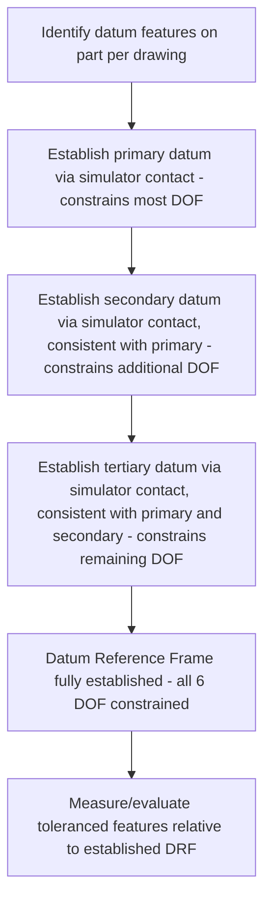

## Datums and the Datum Reference Frame

### Overview

Datums and the datum reference frame (DRF) form the foundational reference system in GD&T against which geometric tolerances (orientation, location, runout, and applicable profile tolerances) are measured and evaluated. A datum is a theoretically exact reference (point, line, axis, or plane) established from a physical feature on the part, and the datum reference frame is the mutually perpendicular set of three planes/axes constructed from selected datum features that fully constrains a part's position and orientation for measurement purposes.

### Fundamental Concepts

#### Datum Feature vs. Datum

- **Key Points**
  - A **datum feature** is the actual physical feature on the part (a surface, hole, edge) identified on the drawing with a datum feature symbol (a boxed letter connected to the feature).
  - A **datum** is the theoretically perfect, idealized geometric counterpart (point, line, axis, or plane) derived from the datum feature — the datum itself is abstract and exact, while the datum feature is the real, imperfect physical surface used to establish it.
  - The datum is established by contact between the datum feature and a theoretically perfect **datum feature simulator** (in physical inspection, an actual precision surface plate, mandrel, or fixture element; in CMM-based inspection, a best-fit or constrained mathematical construction applied to measured points).

#### The Six Degrees of Freedom

- Every rigid body in three-dimensional space has six degrees of freedom: three translational (movement along the X, Y, and Z axes) and three rotational (rotation about the X, Y, and Z axes).
- The purpose of the datum reference frame is to fully constrain (or partially constrain, as needed) these six degrees of freedom by referencing an appropriately chosen set of datum features, so that a consistent, repeatable measurement reference exists for evaluating all other toleranced features on the part.

### The Primary-Secondary-Tertiary Datum System

#### Concept

- **Key Points**
  - When multiple datum features are referenced in a feature control frame, they are listed in a specific left-to-right order of precedence: **primary**, **secondary**, and **tertiary** — this order directly determines how the datum reference frame is constructed and how many degrees of freedom each datum feature constrains.
  - **Primary datum**: established first, typically constraining the most degrees of freedom — commonly 3 degrees of freedom (one translation and two rotations) when the primary datum feature is a planar surface contacting a simulated flat plane.
  - **Secondary datum**: established second, constraining additional degrees of freedom not already constrained by the primary datum, while remaining consistent with (perpendicular/aligned to) the primary datum's established plane/axis — commonly constraining 2 more degrees of freedom (one translation and one rotation) for a planar secondary datum feature.
  - **Tertiary datum**: established last, constraining the remaining degree(s) of freedom not already constrained by the primary and secondary datums — commonly the final translational degree of freedom.
  - This sequential, hierarchical construction ensures a fully repeatable and unambiguous reference frame: changing the order of datum precedence for the same set of datum features can produce a different, non-equivalent datum reference frame and different measurement results — meaning datum precedence order is a critical design decision, not an arbitrary listing convention.

#### Example: 3-2-1 Datum Scheme

A rectangular plate with a primary planar bottom surface (Datum A), a secondary planar side surface (Datum B), and a tertiary planar end surface (Datum C):

- **Datum A (primary)**: the plate rests on a simulated flat plane; this constrains 3 degrees of freedom (translation along the axis perpendicular to A, and rotation about the two axes within the plane of A).
- **Datum B (secondary)**: the plate is pushed against a simulated plane perpendicular to A; this constrains 2 more degrees of freedom (translation along the axis perpendicular to B within the plane established by A, and rotation about the axis perpendicular to both A and B).
- **Datum C (tertiary)**: the plate is pushed against a simulated plane perpendicular to both A and B; this constrains the final remaining degree of freedom (translation along the axis perpendicular to C).
- Together, A, B, and C fully constrain all six degrees of freedom, establishing a complete, repeatable datum reference frame — commonly referred to as a "3-2-1" scheme reflecting the degrees of freedom constrained by each datum in sequence.

### Diagram: Datum Reference Frame Construction

<svg xmlns="http://www.w3.org/2000/svg" viewBox="0 0 700 380">
<title>Primary, Secondary, and Tertiary Datum Reference Frame Construction (svg_diagram)</title>
\<style\>
text { font-family: Arial, sans-serif; font-size: 12px; fill: #1a1a1a; }
.label { font-size: 11px; }
\</style\>
<rect x="0" y="0" width="700" height="380" fill="#ffffff" />

<rect x="60" y="280" width="400" height="14" fill="#cfe8ff" stroke="#2f6fab" stroke-width="2" />
<text x="60" y="270" class="label" font-weight="bold">Datum A (primary) - constrains 3 DOF</text>

<rect x="120" y="180" width="280" height="100" fill="#f0f0f0" stroke="#333" stroke-width="2" />

<rect x="106" y="150" width="14" height="150" fill="#ffe0cc" stroke="#c46a1e" stroke-width="2" />
<text x="20" y="145" class="label" font-weight="bold">Datum B (secondary)</text>
<text x="20" y="160" class="label">constrains 2 more DOF</text>

<rect x="120" y="130" width="280" height="14" fill="#d9f2d9" stroke="#3a9a3a" stroke-width="2" />
<text x="430" y="140" class="label" font-weight="bold">Datum C (tertiary)</text>
<text x="430" y="155" class="label">constrains final 1 DOF</text>

<line x1="500" y1="330" x2="560" y2="330" stroke="#000" stroke-width="1.5" marker-end="url(#axArrow)" />
<text x="565" y="335" class="label">X</text>
<line x1="500" y1="330" x2="500" y2="270" stroke="#000" stroke-width="1.5" marker-end="url(#axArrow)" />
<text x="505" y="265" class="label">Z</text>
<line x1="500" y1="330" x2="460" y2="300" stroke="#000" stroke-width="1.5" marker-end="url(#axArrow)" />
<text x="440" y="295" class="label">Y</text>
<text x="60" y="360" class="label">Total: 3 + 2 + 1 = 6 degrees of freedom fully constrained (3-2-1 datum scheme)</text>

</svg>

### Types of Datum Features

- **Planar datum features**: flat surfaces, the most common and straightforward datum type, simulated by a flat reference surface (surface plate in physical inspection, best-fit plane in CMM software).
- **Cylindrical/axis datum features**: round holes, bosses, or shafts, where the datum is the derived axis of the feature — simulated by an expanding/contracting mandrel or chuck in physical inspection, or a best-fit cylinder axis calculation in CMM software; the applicable material condition modifier (RFS, MMC, LMC) affects how this axis is established relative to the feature's actual size.
- **Datum targets**: specific points, lines, or small areas on a feature (rather than the entire feature) used to establish a datum, commonly applied to large, non-planar, warped, or non-rigid features (e.g., large sheet metal panels, castings) where using the entire surface as a datum feature would be impractical or would not provide a repeatable reference due to surface irregularity.
- **Datum feature patterns**: multiple datum features (e.g., a pattern of holes) collectively treated as a single, compound datum feature establishing an axis/center-plane reference for the pattern as a whole.

### Datum Precedence and Its Functional Significance

- **Key Points**
  - Datum precedence order should be selected to reflect the part's actual functional assembly sequence — the primary datum is typically the feature that provides the most fundamental functional reference in assembly (e.g., a mounting face that seats against a mating structure), with secondary and tertiary datums reflecting the subsequent functional constraints (e.g., a locating pin, then a rotational-clocking feature).
  - Reversing datum precedence order (e.g., making a locating pin the primary datum instead of a mounting face) can produce a materially different, non-equivalent datum reference frame, potentially leading to different (and possibly functionally inappropriate) inspection results even for the same physical part and the same set of datum features. [Inference — the specific functional consequences of a given datum precedence choice depend on the part's actual assembly and functional requirements and should be determined through design analysis rather than convention alone.]
  - Datum feature selection and precedence should therefore be a deliberate design decision made in coordination with the part's functional assembly requirements, not simply assigned based on convenient drawing view orientation or arbitrary alphabetical labeling.

### Material Condition Modifiers Applied to Datum Features

- Datum features that are features of size (cylindrical holes/bosses, slots) can have RFS (default per Rule #2), MMC, or LMC modifiers applied to them in the feature control frame's datum reference compartments, affecting how the datum axis/center-plane is established relative to the datum feature's actual size.
- When MMC is applied to a datum feature reference, additional **datum feature shift** (analogous conceptually to bonus tolerance) can occur, allowing the simulated datum feature to shift within its own size tolerance during evaluation — a further layer of flexibility that must be correctly understood and applied to avoid misinterpretation of inspection results. [Inference — the specific magnitude and functional acceptability of datum feature shift depends on the specific application's tolerance stack and should be assessed via tolerance analysis rather than assumed negligible.]

### Datum Reference Frame Construction Process Flow

### Common Errors and Misinterpretations

- **Key Points**
  - Confusing a datum feature (the physical surface) with the datum itself (the theoretical exact reference) can lead to incorrect assumptions about achievable measurement precision, since the datum feature simulator's own precision and the actual physical feature's form errors both contribute to how faithfully the theoretical datum is realized in practice.
  - Applying an inconsistent or physically impossible datum precedence order (e.g., attempting to establish a secondary datum feature in a way that is not physically consistent with the already-established primary datum) leads to ambiguous or non-repeatable measurement results.
  - Overlooking material condition modifiers on datum features (assuming RFS when MMC is actually specified, or vice versa) can produce incorrect interpretation of the effective datum feature shift and, consequently, incorrect conformance conclusions for toleranced features referenced to that datum. [Inference — the frequency and practical impact of such misinterpretation errors in a given organization depends on training level and drawing review practices and is not itself a universal metrological constant.]

### Related Topics

- Geometric characteristic symbols (orientation, location, and runout tolerances that require datum references)
- Rule #1 and Rule #2 (Rule #2's RFS default applies to datum feature references as well as to the tolerance itself)
- Maximum material condition (MMC) and datum feature shift
- Datum targets for non-rigid or large/warped part datum establishment
- Position tolerancing and virtual condition (built upon the datum reference frame)
- Coordinate measuring machine (CMM) datum simulation and best-fit algorithms