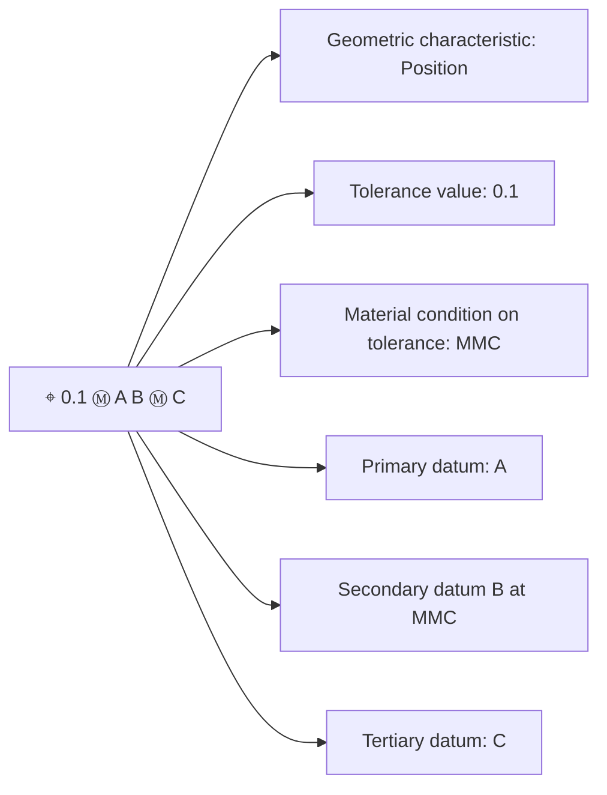

## Material Condition Modifiers

### Overview

Material condition modifiers are symbols applied to geometric tolerances in GD&T (per ASME Y14.5) that establish a relationship between the size of a feature and its allowable geometric tolerance. They define how the tolerance value changes (or does not change) as the feature's actual size departs from its specified limits. Three modifiers exist: Maximum Material Condition (MMC), Least Material Condition (LMC), and Regardless of Feature Size (RFS).

### Maximum Material Condition (MMC)

**Definition:** The condition where a feature contains the maximum amount of material within its stated size limits.

- For an external feature (shaft, pin, boss): MMC = upper size limit (largest shaft)
- For an internal feature (hole, slot): MMC = lower size limit (smallest hole)

Symbol: Ⓜ

**Key Points**

- MMC represents the "worst case" for assembly — largest shaft, smallest hole
- When applied to a tolerance of position or orientation, MMC permits **bonus tolerance**: as the feature departs from MMC toward LMC, the geometric tolerance increases by the same amount
- Bonus tolerance = |Actual feature size − MMC size|

$$T_{total} = T_{specified} + T_{bonus}$$

**Example**

A hole has a diameter limit of $10.0$–$10.2$ mm, with a position tolerance of $0.1$ mm at MMC.

- MMC of hole = $10.0$ mm (smallest hole)
- If the produced hole measures $10.15$ mm:

$$T_{bonus} = 10.15 - 10.0 = 0.15\text{ mm}$$

$$T_{total} = 0.1 + 0.15 = 0.25\text{ mm}$$

The part is acceptable with a positional deviation up to $0.25$ mm at that actual hole size.

### Least Material Condition (LMC)

**Definition:** The condition where a feature contains the minimum amount of material within its stated size limits.

- External feature: LMC = lower size limit (smallest shaft)
- Internal feature: LMC = upper size limit (largest hole)

Symbol: Ⓛ

**Key Points**

- LMC is used when the concern is maintaining minimum wall thickness or edge distance rather than assembly clearance
- Common application: position tolerance on a hole near a part edge, to prevent breakout
- Bonus tolerance accrues as the feature departs from LMC toward MMC (opposite direction from MMC bonus logic)

**Example**

A hole diameter limit is $8.0$–$8.3$ mm with a position tolerance of $0.05$ mm at LMC, controlling minimum wall thickness to a part edge.

- LMC of hole = $8.3$ mm (largest hole = thinnest wall)
- If produced hole measures $8.1$ mm:

$$T_{bonus} = |8.3 - 8.1| = 0.2\text{ mm}$$

$$T_{total} = 0.05 + 0.2 = 0.25\text{ mm}$$

### Regardless of Feature Size (RFS)

**Definition:** The geometric tolerance applies at whatever actual size the feature happens to be — no bonus tolerance is granted regardless of size deviation.

- No symbol is used; RFS is the **default condition** for all geometric tolerances under ASME Y14.5-2009 and later unless MMC or LMC is explicitly specified
- Prior to Y14.5-1994, RFS was denoted by the symbol Ⓢ, now obsolete in current standard practice

**Key Points**

- RFS provides the tightest, most conservative control since the stated tolerance never increases
- Common for features controlled independently of assembly interaction, such as runout, concentricity (historically), or when a tight fit is functionally required regardless of size
- [Unverified] Some older drawings or company-specific standards may still show the Ⓢ symbol explicitly; drawing notes should confirm which edition of Y14.5 governs.

### Comparison Table

| Modifier | Symbol | External Feature | Internal Feature | Bonus Tolerance Direction |
| --- | --- | --- | --- | --- |
| MMC | Ⓜ | Largest size | Smallest size | Increases toward LMC |
| LMC | Ⓛ | Smallest size | Largest size | Increases toward MMC |
| RFS | (none, default) | N/A | N/A | None — fixed tolerance |

### Application Rules

- Material condition modifiers apply **only** to feature-of-size callouts (holes, slots, pins, tabs, widths) — never to surfaces, flat features without opposed points, or datum planes derived from a single surface
- The modifier is placed immediately after the tolerance value in the feature control frame, and may also be applied to a datum reference within the same frame
- When applied to a datum reference (e.g., Ⓜ next to datum B), a **shifting tolerance** may result, allowing the part to shift relative to the datum feature simulator as the datum feature departs from MMC/LMC

**Feature Control Frame Notation Example**

### Virtual Condition

Virtual condition (VC) is the worst-case boundary generated by the combined effect of MMC/LMC and the geometric tolerance, used for functional gaging and fixed-fit assembly analysis.

- Internal feature at MMC: $VC = MMC_{size} - T_{geo}$
- External feature at MMC: $VC = MMC_{size} + T_{geo}$

**Example**

Hole MMC = $10.0$ mm, position tolerance = $0.1$ mm at MMC:

$$VC = 10.0 - 0.1 = 9.9\text{ mm}$$

This $9.9$ mm defines the minimum functional gage pin diameter that must pass through the hole in its worst-case position and size condition.

### Functional Gaging Implication

- MMC callouts allow the use of fixed-pin functional (hard) gages, since the virtual condition boundary is constant regardless of the actual produced size — this is a primary economic driver for choosing MMC over RFS in high-volume production
- RFS callouts require variable gaging (CMM, indicators) since the allowable tolerance zone shifts with actual size, and no single fixed gage can represent all valid size/position combinations

### Common Errors

- Applying MMC/LMC to a tolerance on a non-feature-of-size (e.g., a flatness callout on a flat surface) — invalid per Y14.5
- Confusing MMC with "maximum material" in a colloquial sense — always define per the size limit direction (internal vs. external) explicitly
- Omitting the modifier and assuming RFS was intended by legacy readers of pre-1994 drawings using the obsolete Ⓢ symbol

**Related Topics**

- Bonus tolerance calculations in positional tolerancing
- Virtual condition and resultant condition
- Functional (fixed-limit) gage design
- Datum feature shift under MMC/LMC
- Feature of size definitions (Rule #1, Rule #2)
- Projected tolerance zones
- Composite positional tolerancing