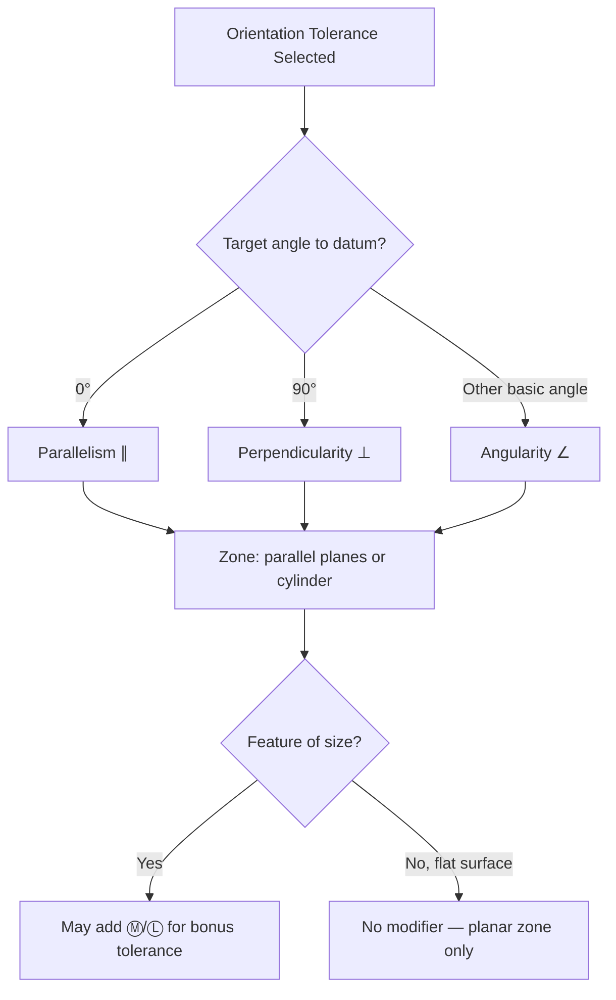

## Orientation Tolerances

### Overview

Orientation tolerances control the angular relationship of a feature relative to one or more datums, without controlling location. Per ASME Y14.5, the three orientation tolerances are Perpendicularity, Parallelism, and Angularity. All orientation tolerances require at least one datum reference in the feature control frame, distinguishing them from form tolerances.

### Category Summary

| Characteristic | Symbol | Target Angle to Datum | Datum Reference Required |
| --- | --- | --- | --- |
| Parallelism | ∥ | 0° | Yes |
| Perpendicularity | ⊥ | 90° | Yes |
| Angularity | ∠ | Any specified angle (basic) | Yes |

### Parallelism

**Definition:** All points of a surface, line, or axis must lie within a tolerance zone that is parallel to a referenced datum plane or axis.

**Key Points**

- Applied to surfaces (zone = two parallel planes) or to an axis/median line of a feature of size (zone = cylindrical, when Ø is specified)
- Can control parallelism of a surface to a datum plane, or an axis to a datum axis
- Material condition modifiers (Ⓜ/Ⓛ) may apply when controlling a feature of size axis

**Example — Surface Parallelism**

Feature control frame: `∥ 0.05 A`

A top surface must lie within two parallel planes $0.05$ mm apart, both parallel to datum plane A.

**Example — Axis Parallelism**

Feature control frame: `∥ Ø0.1 Ⓜ A` applied to a pin's diameter dimension.

The pin's axis must lie within a cylindrical zone $0.1$ mm in diameter at MMC, oriented parallel to datum axis A, with bonus tolerance available as the pin departs from its MMC size.

### Perpendicularity

**Definition:** All points of a surface, line, or axis must lie within a tolerance zone oriented at exactly 90° to a referenced datum.

**Key Points**

- Most commonly used orientation control; applies to mounting faces, shaft shoulders, and pins/bores that must sit square to a datum
- Zone can be two parallel planes (surface-to-datum), two parallel lines (line element), or a cylinder (axis-to-datum, when Ø specified)
- Frequently paired with flatness as a refinement callout on the same surface

**Example**

Feature control frame: `⊥ 0.02 A` applied to a side face.

The referenced face must lie within two parallel planes $0.02$ mm apart, both planes oriented exactly perpendicular to datum plane A.

**Example — Axis Perpendicularity**

Feature control frame: `⊥ Ø0.05 Ⓜ A` applied to a hole's diameter.

The hole's axis must lie within a $0.05$ mm diameter cylindrical zone at MMC, perpendicular to datum plane A — commonly used for dowel holes or bolt holes that must sit square to a mounting face.

### Angularity

**Definition:** All points of a surface, line, or axis must lie within a tolerance zone oriented at a specified basic angle (other than 0° or 90°) relative to a referenced datum.

**Key Points**

- The angle itself is a **basic (untoleranced) dimension**, boxed on the drawing; only the tolerance zone width is toleranced
- Commonly applied to angled faces, chamfers requiring precise control, dovetails, and angled mounting brackets
- Compound angularity (controlling a surface angled relative to two datums simultaneously) requires careful basic dimension setup in 3D

**Example**

Feature control frame: `∠ 0.08 A` with a basic angle of $30°$ boxed on the related dimension.

The angled surface must lie within two parallel planes $0.08$ mm apart, both planes oriented at exactly $30°$ (basic) from datum plane A.

### Tolerance Zone Geometry (svg_diagram)

<svg xmlns="http://www.w3.org/2000/svg" viewBox="0 0 780 240" font-family="Arial, sans-serif">
<text x="390" y="20" text-anchor="middle" font-size="15" font-weight="bold">Orientation Tolerance Zones (svg_diagram)</text>

<g>
<text x="120" y="45" text-anchor="middle" font-size="12" font-weight="bold">Parallelism</text>
<line x1="40" y1="150" x2="200" y2="150" stroke="#2c3e50" stroke-width="3" />
<text x="210" y="154" font-size="10">Datum A</text>
<line x1="40" y1="90" x2="200" y2="90" stroke="#333" stroke-width="1.5" stroke-dasharray="4,3" />
<line x1="40" y1="110" x2="200" y2="110" stroke="#333" stroke-width="1.5" stroke-dasharray="4,3" />
<path d="M45,95 Q120,112 195,98" stroke="#c0392b" stroke-width="2" fill="none" />
</g>

<g>
<text x="360" y="45" text-anchor="middle" font-size="12" font-weight="bold">Perpendicularity</text>
<line x1="300" y1="150" x2="460" y2="150" stroke="#2c3e50" stroke-width="3" />
<text x="465" y="154" font-size="10">Datum A</text>
<line x1="340" y1="150" x2="330" y2="60" stroke="#333" stroke-width="1.5" stroke-dasharray="4,3" />
<line x1="360" y1="150" x2="350" y2="60" stroke="#333" stroke-width="1.5" stroke-dasharray="4,3" />
<path d="M336,140 Q345,100 345,65" stroke="#c0392b" stroke-width="2" fill="none" />
<path d="M336,150 L336,140 M336,140 L346,140" stroke="#555" stroke-width="1" fill="none" />
</g>

<g>
<text x="640" y="45" text-anchor="middle" font-size="12" font-weight="bold">Angularity</text>
<line x1="570" y1="150" x2="730" y2="150" stroke="#2c3e50" stroke-width="3" />
<text x="735" y="154" font-size="10">Datum A</text>
<line x1="610" y1="150" x2="670" y2="65" stroke="#333" stroke-width="1.5" stroke-dasharray="4,3" />
<line x1="630" y1="150" x2="690" y2="65" stroke="#333" stroke-width="1.5" stroke-dasharray="4,3" />
<path d="M615,140 Q650,105 675,72" stroke="#c0392b" stroke-width="2" fill="none" />
<path d="M610,150 A30,30 0 0,1 636,128" stroke="#555" stroke-width="1" fill="none" />
<text x="618" y="140" font-size="9">30°</text>
</g>

<text x="390" y="200" text-anchor="middle" font-size="10" fill="#555">Dashed lines = tolerance zone boundaries; red = actual surface/axis; solid = datum plane</text>

</svg>

### Composite and Compound Applications

- Orientation tolerances may reference multiple datums in sequence (primary, secondary, tertiary) to fully constrain rotational degrees of freedom
- **Compound angularity** occurs when a surface is angled relative to two or more datum planes simultaneously, requiring basic dimensions in multiple directions to fully define the theoretical orientation before the tolerance zone is applied

### Relationship to Form and Location Tolerances

- Orientation tolerances are hierarchically positioned between form tolerances (no datum) and location tolerances (position, concentricity, symmetry — which require both orientation and location control relative to datums)
- An orientation tolerance zone **implicitly limits** the form error of the controlled feature to within the same zone boundary, since the entire surface/axis must fit inside the oriented zone — a separate form callout is only needed when a tighter form control than the orientation zone provides is required
- When both an orientation and a tighter form tolerance are specified on the same feature, the form tolerance zone must fit entirely within the orientation tolerance zone (nested tolerance hierarchy)

### Verification Methods

- **Surface orientation (parallelism/perpendicularity/angularity of a face):** CMM planar fit relative to established datum, sine bar + indicator (angularity), granite square + indicator (perpendicularity)
- **Axis orientation (feature of size to datum):** CMM with derived axis calculation, functional gage with angled/perpendicular gage pin when MMC is specified

**Related Topics**

- Form tolerances (flatness, straightness, circularity, cylindricity)
- Position tolerance and its dependency on orientation control
- Datum reference frames and datum precedence order
- Basic dimensions and their role in true position/orientation
- Bonus tolerance and virtual condition under MMC/LMC
- Compound angularity and 3D basic dimension schemes