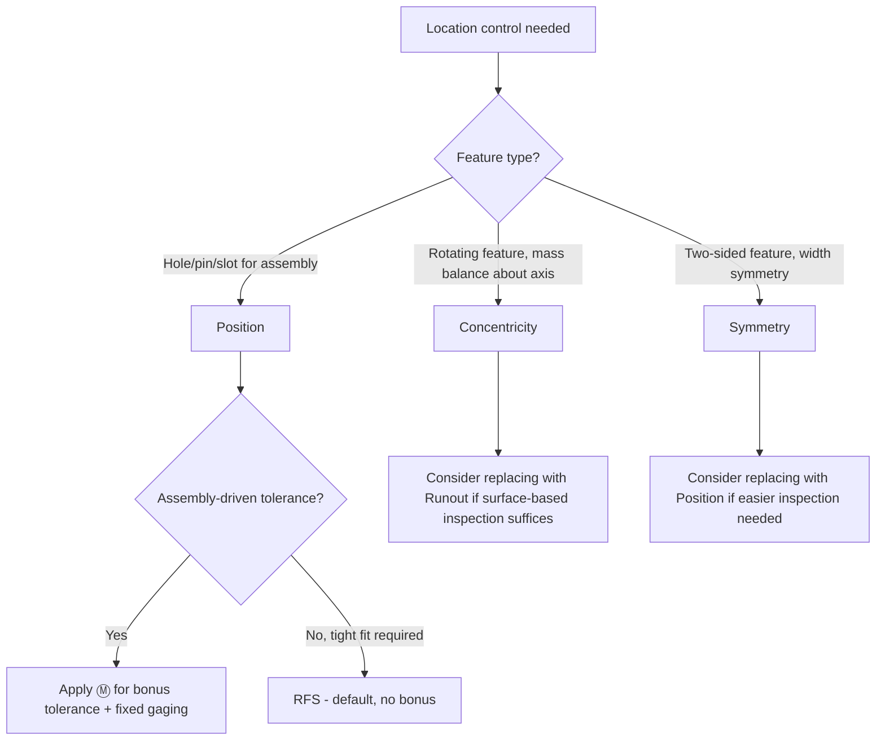

## Location Tolerances

### Overview

Location tolerances control the position of a feature relative to one or more datums, constraining both location and, implicitly, orientation and form within the same zone. Per ASME Y14.5, the location tolerances are Position, Concentricity, and Symmetry. Position is by far the most widely used of the three in modern practice; concentricity and symmetry are now less commonly specified due to inspection difficulty and are often replaced with position or runout controls.

### Category Summary

| Characteristic | Symbol | Controls | Datum Reference Required |
| --- | --- | --- | --- |
| Position | ⌖ | Location of a feature of size relative to true position | Yes |
| Concentricity | ◎ | Coincidence of median points with a datum axis | Yes |
| Symmetry | ⌯ | Coincidence of median points with a datum center plane | Yes |

### Position

**Definition:** Controls the location of a feature of size (hole, pin, slot, tab) relative to its theoretically exact location, defined by basic dimensions from specified datums.

**Key Points**

- The tolerance zone is cylindrical (Ø specified) for round features, or a pair of parallel planes/lines for slots and elongated features
- True position is established by **basic dimensions** (boxed, untoleranced) from the datum reference frame
- Material condition modifiers (Ⓜ, Ⓛ, or RFS by default) are almost always applied, since position is typically used to guarantee assembly fit
- Can control a pattern of features (bolt patterns) using composite or multiple single-segment position tolerancing

**Example**

A hole is located at basic dimensions $X = 40$ mm, $Y = 25$ mm from datums A, B, C.

Feature control frame: `⌖ Ø0.2 Ⓜ A B C`

The hole's axis must fall within a $0.2$ mm diameter cylindrical zone centered at true position, at MMC (hole at its smallest allowed diameter), with bonus tolerance as the hole grows toward LMC.

**Calculating Actual Deviation**

For a hole measured at $X = 40.08$, $Y = 25.06$ from true position $(40, 25)$:

$$D = 2\sqrt{(\Delta X)^2 + (\Delta Y)^2} = 2\sqrt{(0.08)^2 + (0.06)^2} = 2(0.1) = 0.2\text{ mm}$$

This equals the diametral positional deviation, which must not exceed the total allowable tolerance (specified + bonus) for the part to be accepted.

### Concentricity

**Definition:** Requires that the median points of all diametrically opposed elements of a feature of revolution be within a specified tolerance zone (a cylinder) whose axis coincides with the datum axis.

**Key Points**

- Controls the derived median line of a feature relative to a datum axis — not the surface directly
- Extremely difficult and costly to verify, since it requires establishing median points across multiple cross-sections rather than measuring the surface directly
- No material condition modifier is permitted (always evaluated RFS in effect, since it addresses mass/balance distribution, not assembly)
- Largely superseded in modern practice by **runout** (simpler, surface-based inspection) or **position** when the functional requirement is assembly-related rather than mass balance

**Example**

Feature control frame: `◎ 0.05 A` applied to an outer diameter relative to datum axis A (an inner bore).

The median points of all diametrically opposed surface elements of the OD must fall within a cylindrical zone of $0.05$ mm diameter, coaxial with datum axis A.

**When to Use**

- [Inference] Concentricity is typically reserved for rotating assemblies where mass distribution/balance about an axis is the governing functional requirement, such as flywheels or rotating shafts with tight dynamic balance needs, rather than general coaxiality control.

### Symmetry

**Definition:** Requires that the median points of all opposed or corresponding elements of two or more feature surfaces be congruent with a specified center plane derived from a datum.

**Key Points**

- Controls the derived median plane of a feature (e.g., a slot or tab width) relative to a datum center plane
- Like concentricity, evaluated using median points rather than the surface directly, making verification difficult without a CMM
- No material condition modifier permitted
- Often replaced in modern drawings by **position** applied to the feature of size, which achieves a similar practical result with far easier and standardized inspection (fixed-limit gaging, simpler CMM routines)

**Example**

Feature control frame: `⌯ 0.1 A` applied to a slot relative to datum center plane A.

The median points across the slot's width, taken at corresponding opposed points, must lie within a tolerance zone of two parallel planes $0.1$ mm apart, symmetrically disposed about datum center plane A.

### Tolerance Zone Geometry (svg_diagram)

<svg xmlns="http://www.w3.org/2000/svg" viewBox="0 0 780 260" font-family="Arial, sans-serif">
<text x="390" y="20" text-anchor="middle" font-size="15" font-weight="bold">Location Tolerance Zones (svg_diagram)</text>

<g>
<text x="120" y="45" text-anchor="middle" font-size="12" font-weight="bold">Position</text>
<rect x="40" y="60" width="160" height="140" fill="none" stroke="#333" stroke-width="1" />
<circle cx="120" cy="130" r="35" fill="none" stroke="#333" stroke-dasharray="4,3" />
<circle cx="126" cy="136" r="20" fill="none" stroke="#c0392b" stroke-width="2" />
<line x1="120" y1="130" x2="126" y2="136" stroke="#555" stroke-width="1" />
<text x="150" y="128" font-size="9">true pos.</text>
<text x="120" y="215" text-anchor="middle" font-size="10">cylindrical zone at basic loc.</text>
</g>

<g>
<text x="390" y="45" text-anchor="middle" font-size="12" font-weight="bold">Concentricity</text>
<circle cx="390" cy="130" r="60" fill="none" stroke="#2c3e50" stroke-width="2" />
<circle cx="390" cy="130" r="3" fill="#2c3e50" />
<text x="390" y="105" text-anchor="middle" font-size="9">Datum axis</text>
<circle cx="390" cy="130" r="15" fill="none" stroke="#333" stroke-dasharray="4,3" />
<path d="M382,122 Q395,128 385,138 Q378,142 388,135" stroke="#c0392b" stroke-width="2" fill="none" />
<text x="390" y="215" text-anchor="middle" font-size="10">median points vs. axis</text>
</g>

<g>
<text x="650" y="45" text-anchor="middle" font-size="12" font-weight="bold">Symmetry</text>
<line x1="580" y1="70" x2="720" y2="70" stroke="#333" stroke-width="1.5" stroke-dasharray="4,3" />
<line x1="580" y1="190" x2="720" y2="190" stroke="#333" stroke-width="1.5" stroke-dasharray="4,3" />
<line x1="580" y1="130" x2="720" y2="130" stroke="#2c3e50" stroke-width="1" stroke-dasharray="2,2" />
<text x="725" y="134" font-size="9">datum ctr. plane</text>
<path d="M590,80 Q650,110 590,130 Q650,150 590,180" stroke="#c0392b" stroke-width="2" fill="none" />
<text x="650" y="215" text-anchor="middle" font-size="10">median points vs. plane</text>
</g>
</svg>

### Selection Logic

### Verification Methods

- **Position:** Functional (fixed-pin) gage when MMC specified; CMM with derived feature axis/center calculation for RFS or general inspection
- **Concentricity:** CMM only (median point calculation across multiple cross-sections); not practically verifiable with conventional gaging
- **Symmetry:** CMM with median point calculation; occasionally approximated with V-blocks and indicators for simple symmetric features

### Relationship to Other Tolerance Types

- Location tolerances (particularly position) implicitly limit both orientation and form error of the controlled feature to within the same zone boundary — a separate orientation or form callout is only needed for tighter refinement
- Position is generally preferred over concentricity/symmetry in modern practice due to significantly lower inspection cost and complexity, despite concentricity/symmetry offering theoretically more precise mass-symmetry control

**Related Topics**

- Orientation tolerances (perpendicularity, parallelism, angularity)
- Runout tolerances as an alternative to concentricity
- Composite and multiple-single-segment position tolerancing
- Datum reference frames and basic dimensions
- Bonus tolerance, virtual condition, and functional gage design
- True position calculation methods (rectangular vs. polar coordinate)