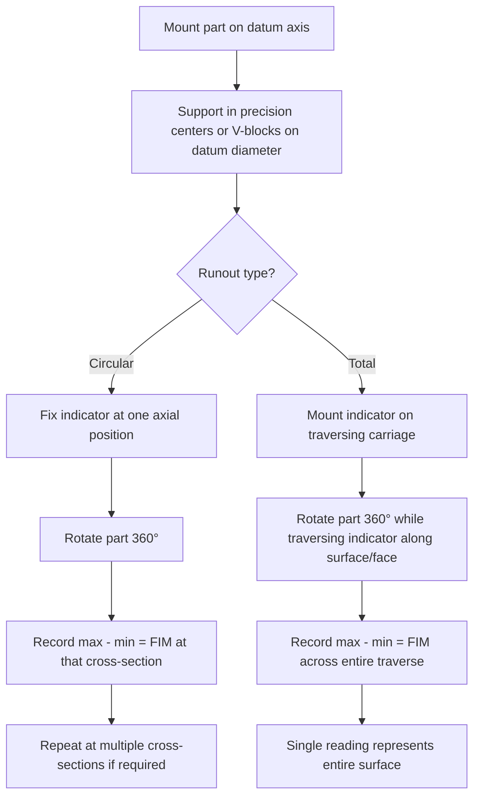

## Runout Tolerances

### Overview

Runout tolerances control the variation of a surface relative to a datum axis during a full 360° rotation about that axis. Per ASME Y14.5, there are two types: Circular Runout and Total Runout. Both are composite controls that simultaneously limit circularity, coaxiality, and (for total runout) straightness/taper errors, making them a practical, gageable alternative to concentricity and cylindricity in many applications.

### Category Summary

| Characteristic | Symbol | Evaluation | Datum Reference Required |
| --- | --- | --- | --- |
| Circular Runout | ↗ (single arrow) | Individual circular cross-sections | Yes |
| Total Runout | ↗↗ (double arrow) | Entire surface simultaneously | Yes |

### Circular Runout

**Definition:** Controls the variation of a single circular cross-section as the part is rotated 360° about a datum axis, with the indicator held stationary at a fixed axial location.

**Key Points**

- Evaluated independently at each cross-section along the feature — similar in evaluation approach to circularity, but referenced to a datum axis rather than being a standalone form control
- Applied to surfaces of revolution (cylinders, cones) and to flat surfaces constructed perpendicular to the datum axis (face runout)
- Tolerance zone is the full indicator movement (FIM) at that cross-section — the difference between the maximum and minimum indicator reading during one full rotation
- No material condition modifier permitted (always evaluated at RFS in effect)

**Example**

Feature control frame: `↗ 0.03 A` applied to a shaft's outer diameter, with datum A being the shaft's bearing journal.

At any single cross-section along the shaft, when rotated 360° about datum axis A with a dial indicator held at that fixed location, the total indicator reading must not exceed $0.03$ mm.

### Total Runout

**Definition:** Controls the variation of the entire surface simultaneously as the part is rotated 360° about a datum axis, with the indicator traversed along the full length or across the full face of the feature during rotation.

**Key Points**

- Combines circular runout at every cross-section with straightness and taper of the surface, making it a more restrictive, composite 3D control compared to circular runout
- For cylindrical surfaces: controls circularity, straightness, taper, and coaxiality simultaneously
- For flat (face) surfaces: controls flatness and perpendicularity to the datum axis simultaneously
- Effectively the gageable equivalent of cylindricity referenced to a datum axis, and often specified in place of cylindricity for that reason

**Example**

Feature control frame: `↗↗ 0.05 A` applied to a shaft's full outer diameter.

As the part rotates 360° about datum axis A, with the indicator simultaneously traversed along the entire length of the surface, the full indicator movement must not exceed $0.05$ mm at any point on the surface.

### Circular vs. Total Runout — Cylindrical Surface Comparison (svg_diagram)

<svg xmlns="http://www.w3.org/2000/svg" viewBox="0 0 780 260" font-family="Arial, sans-serif">
<text x="390" y="20" text-anchor="middle" font-size="15" font-weight="bold">Circular vs. Total Runout (svg_diagram)</text>

<g>
<text x="180" y="45" text-anchor="middle" font-size="12" font-weight="bold">Circular Runout</text>
<line x1="80" y1="90" x2="80" y2="200" stroke="#2c3e50" stroke-width="1" stroke-dasharray="3,2" />
<rect x="80" y="100" width="200" height="90" fill="none" stroke="#333" stroke-width="2" rx="8" />
<line x1="150" y1="100" x2="150" y2="190" stroke="#c0392b" stroke-width="2" />
<polygon points="150,95 145,105 155,105" fill="#c0392b" />
<text x="150" y="88" text-anchor="middle" font-size="9">indicator, fixed position</text>
<text x="80" y="215" text-anchor="middle" font-size="9">datum axis A</text>
<text x="180" y="235" text-anchor="middle" font-size="10">measures one cross-section at a time</text>
</g>

<g>
<text x="600" y="45" text-anchor="middle" font-size="12" font-weight="bold">Total Runout</text>
<line x1="500" y1="90" x2="500" y2="200" stroke="#2c3e50" stroke-width="1" stroke-dasharray="3,2" />
<rect x="500" y="100" width="200" height="90" fill="none" stroke="#333" stroke-width="2" rx="8" />
<line x1="530" y1="100" x2="530" y2="190" stroke="#c0392b" stroke-width="2" stroke-dasharray="1,0" />
<polygon points="530,95 525,105 535,105" fill="#c0392b" />
<line x1="670" y1="100" x2="670" y2="190" stroke="#c0392b" stroke-width="1" opacity="0.4" />
<polygon points="670,95 665,105 675,105" fill="#c0392b" opacity="0.4" />
<path d="M530,105 L670,105" stroke="#555" stroke-width="1" stroke-dasharray="2,2" marker-end="url(#arrow)" />
<text x="600" y="88" text-anchor="middle" font-size="9">indicator traverses full length</text>
<text x="500" y="215" text-anchor="middle" font-size="9">datum axis A</text>
<text x="600" y="235" text-anchor="middle" font-size="10">measures entire surface simultaneously</text>
</g>
</svg>

### Measurement Setup

### Face Runout

**Application:** Both circular and total runout can be applied to a flat face constructed perpendicular to a datum axis (e.g., a shoulder face on a shaft).

- **Circular face runout:** Indicator fixed at a specific radius, part rotated 360° — controls wobble at that radius only
- **Total face runout:** Indicator traversed radially across the face while rotating — controls flatness and perpendicularity to the datum axis across the entire face simultaneously

**Example**

Feature control frame: `↗↗ 0.04 A` applied to a shoulder face, datum A being the shaft's centerline axis.

As the part rotates about datum axis A with the indicator traversed from the shaft OD to the face's inner edge, the full indicator movement must not exceed $0.04$ mm anywhere on the face.

### Relationship to Other GD&T Characteristics

- Runout is a practical, directly gageable substitute for concentricity (circular runout, evaluated per cross-section) and cylindricity (total runout, evaluated across the full surface)
- Unlike concentricity/symmetry, runout is measured directly off the **actual surface**, not derived median points — making it significantly easier and cheaper to verify with standard shop-floor equipment (dial indicator, precision centers, rotary table)
- Runout implicitly limits circularity and, for total runout, straightness/flatness of the controlled feature, similar to how orientation tolerances implicitly limit form

### Datum Requirements

- Runout **always requires a datum axis** (established from one or two datum features, e.g., two bearing journals defining a common axis) — it cannot be specified without a datum reference, unlike form tolerances
- When two datum features establish a common datum axis, both are referenced together in the feature control frame (e.g., `↗↗ 0.03 A-B`), and the part must be supported on both during inspection

### Common Applications

- Shafts and rotating components: journals, bearing seats, seal surfaces
- Shoulder faces requiring squareness to a rotational axis (thrust faces, seal faces)
- Components mating with rotating assemblies where balance and smooth rotation are functionally critical

**Related Topics**

- Concentricity and its relationship to circular runout
- Cylindricity and its relationship to total runout
- Datum axis construction from two datum features
- Circularity (form tolerance) as a component of runout evaluation
- Dial indicator and precision center inspection setups
- CMM-based runout simulation vs. traditional rotational gaging