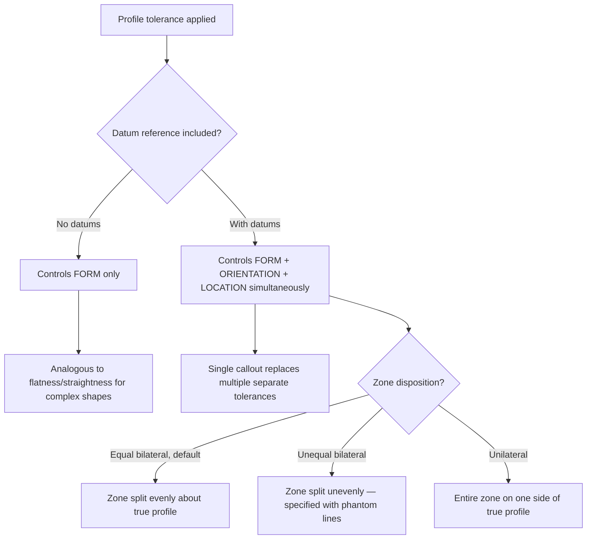

## Profile Tolerances

### Overview

Profile tolerances control the form, and optionally the orientation and location, of a surface or line relative to its true profile defined by basic dimensions. Per ASME Y14.5, there are two profile characteristics: Profile of a Line and Profile of a Surface. Profile is the most versatile GD&T control, capable of substituting for nearly every other characteristic type depending on how it is applied and whether datums are referenced.

### Category Summary

| Characteristic | Symbol | Zone Dimensionality | Datum Reference |
| --- | --- | --- | --- |
| Profile of a Line | ⌒ | 2D — two parallel curved lines | Optional |
| Profile of a Surface | ⌓ | 3D — two parallel offset surfaces | Optional |

### Profile of a Line

**Definition:** Controls a 2D cross-sectional element of a surface within a tolerance zone consisting of two parallel curved lines that follow the true profile, defined by basic dimensions, at each cross-section independently.

**Key Points**

- Evaluated at individual cross-sections, similar in scope to circularity but for non-circular (arbitrary) profiles
- Commonly used for airfoil sections, cam profiles, and other 2D contour controls where each cross-section is independently significant
- May be specified with or without a datum reference

**Example**

Feature control frame: `⌒ 0.1` applied to a cam profile cross-section, with the true profile defined by a series of basic dimensions (radii and angles) from datum features.

At the specified cross-section, the actual profile must lie within a zone bounded by two curved lines, each offset $0.05$ mm from the true profile (total zone width $0.1$ mm), following the theoretical contour.

### Profile of a Surface

**Definition:** Controls a full 3D surface within a tolerance zone consisting of two parallel surfaces that follow the true profile, offset equally (or unequally, if specified) from the theoretically exact surface defined by basic dimensions.

**Key Points**

- The most comprehensive and widely applicable GD&T characteristic — capable of controlling form, orientation, and location simultaneously in a single callout when datums are referenced
- Applied to complex contoured surfaces (sheet metal panels, castings, molded parts, aerospace skins) as well as flat and simple surfaces
- Can be specified as **unilateral** (all tolerance on one side of true profile), **bilateral unequal**, or **bilateral equal** (default, split evenly) using phantom lines or explicit notation

**Example**

Feature control frame: `⌓ 0.3 A B C` applied to a complex contoured surface.

The entire surface must lie within a zone bounded by two surfaces, each offset $0.15$ mm from the true profile (total zone width $0.3$ mm), with the true profile's location and orientation established relative to datums A, B, C.

### Profile Without Datums vs. With Datums

**Key Points**

- **Profile without datum references:** controls only the *form* of the surface relative to its own true profile — analogous to a form tolerance, but for non-planar/non-cylindrical geometry
- **Profile with datum references:** simultaneously controls form, orientation, AND location relative to the datum reference frame — functioning as a composite control equivalent to combining flatness/form + orientation + position in a single callout

### Unilateral and Unequal Profile Zones

**Example — Unilateral Profile**

Feature control frame: `⌓ 0.2 A B` with a phantom (dashed) line on the outboard side of the true profile in the drawing view, indicating all $0.2$ mm of tolerance lies outside the true profile.

The surface may deviate up to $0.2$ mm outward from true profile, with zero tolerance permitted inward — used when material must never be removed below true profile (e.g., a mating surface with a minimum stock requirement).

**Example — Unequal Bilateral Profile**

Feature control frame: `⌓ 0.3 A B` with phantom line notation splitting the zone as $0.2$ mm outward / $0.1$ mm inward from true profile.

Used when functional requirements differ on each side of the surface, such as a cast surface needing more stock allowance in one direction due to draft or shrinkage tendencies.

### Tolerance Zone Geometry (svg_diagram)

<svg xmlns="http://www.w3.org/2000/svg" viewBox="0 0 780 260" font-family="Arial, sans-serif">
<text x="390" y="20" text-anchor="middle" font-size="15" font-weight="bold">Profile Tolerance Zone Types (svg_diagram)</text>

<g>
<text x="130" y="45" text-anchor="middle" font-size="12" font-weight="bold">Equal Bilateral</text>
<path d="M40,140 Q130,90 220,140" stroke="#2c3e50" stroke-width="1" stroke-dasharray="3,2" fill="none" />
<path d="M40,130 Q130,80 220,130" stroke="#333" stroke-width="1.5" fill="none" />
<path d="M40,150 Q130,100 220,150" stroke="#333" stroke-width="1.5" fill="none" />
<path d="M45,138 Q130,92 215,135" stroke="#c0392b" stroke-width="2" fill="none" />
<text x="130" y="185" text-anchor="middle" font-size="9">true profile centered in zone</text>
</g>

<g>
<text x="390" y="45" text-anchor="middle" font-size="12" font-weight="bold">Unequal Bilateral</text>
<path d="M300,140 Q390,90 480,140" stroke="#2c3e50" stroke-width="1" stroke-dasharray="3,2" fill="none" />
<path d="M300,110 Q390,60 480,110" stroke="#333" stroke-width="1.5" fill="none" />
<path d="M300,155 Q390,105 480,155" stroke="#333" stroke-width="1.5" fill="none" />
<path d="M305,135 Q390,88 475,132" stroke="#c0392b" stroke-width="2" fill="none" />
<text x="390" y="185" text-anchor="middle" font-size="9">zone offset unevenly, more outward</text>
</g>

<g>
<text x="650" y="45" text-anchor="middle" font-size="12" font-weight="bold">Unilateral</text>
<path d="M560,140 Q650,90 740,140" stroke="#2c3e50" stroke-width="1" stroke-dasharray="3,2" fill="none" />
<path d="M560,140 Q650,90 740,140" stroke="#333" stroke-width="1.5" fill="none" />
<path d="M560,90 Q650,40 740,90" stroke="#333" stroke-width="1.5" fill="none" />
<path d="M565,138 Q650,88 735,138" stroke="#c0392b" stroke-width="2" fill="none" />
<text x="650" y="185" text-anchor="middle" font-size="9">full zone on one side only</text>
</g>
</svg>

### Composite Profile Tolerancing

- Similar to composite position tolerancing, profile can be specified with two stacked segments in one feature control frame: an upper segment controlling location/orientation of the overall pattern relative to datums (looser tolerance), and a lower segment refining the form/orientation of the profile itself relative to fewer or no datums (tighter tolerance)
- This allows the surface to shift/rotate as a group within the looser zone while holding a tighter internal shape tolerance

### Verification Methods

- **CMM contour scanning:** dense point-cloud comparison against nominal CAD surface, most common method for complex 3D profiles
- **Optical/laser scanning:** structured light or laser scanning for full-surface digitization, compared against CAD model
- **Contour gages/templates:** physical go/no-go templates for simple 2D profiles, checked by light-gap inspection
- **Coordinate measurement with sectioning:** for profile of a line, individual cross-sections measured and compared to the theoretical curve at each station

### Common Applications

- Sheet metal stampings and formed panels (automotive body panels, brackets)
- Castings and forgings with complex contours
- Turbine blades and airfoil sections (profile of a line, per cross-section)
- Injection-molded plastic parts with free-form surfaces
- Gaskets and seals requiring controlled contour matching

**Related Topics**

- Composite profile tolerancing and multi-segment feature control frames
- Basic dimensions and true profile definition (CAD-based vs. dimensioned)
- Datum reference frames for complex/contoured datum features
- Position tolerancing composite methods (parallel structure to profile)
- CMM programming for free-form surface inspection
- Relationship between profile and form/orientation/location tolerance types