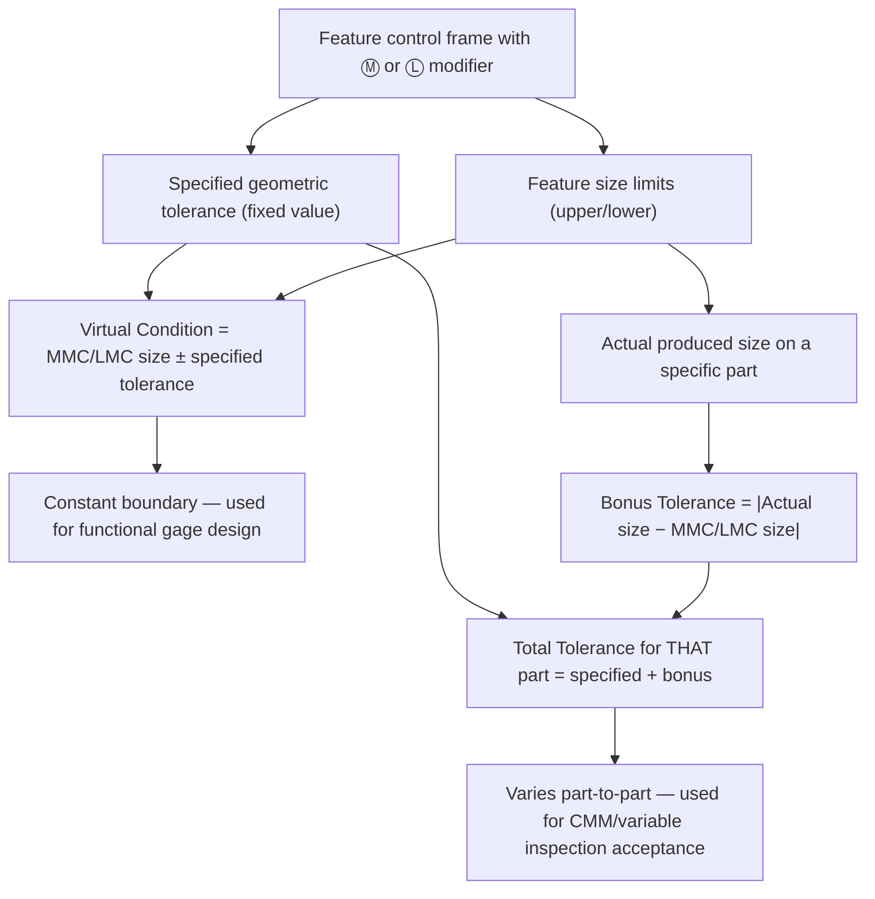

## Virtual Condition and Bonus Tolerance

### Overview

Virtual condition and bonus tolerance are two related concepts that govern how material condition modifiers (MMC/LMC) interact with geometric tolerances applied to features of size. Bonus tolerance describes the additional geometric tolerance a feature earns as its actual size departs from the modifier's reference size. Virtual condition describes the fixed worst-case boundary generated by combining a feature's MMC/LMC size with its geometric tolerance, used for functional gage design and fixed-fit analysis.

### Bonus Tolerance

**Definition:** The amount by which a specified geometric tolerance (position, orientation, or axis straightness) may increase as the actual produced size of a feature of size departs from the material condition boundary referenced in the feature control frame.

**Key Points**

- Only applies when MMC or LMC is explicitly invoked in the feature control frame — never under RFS (the default), which permits no size-based tolerance increase
- Bonus tolerance is calculated per-part, based on the *actual local size* of that specific feature at the time of inspection
- The direction of accrual depends on the modifier: MMC bonus grows as the feature moves toward LMC; LMC bonus grows as the feature moves toward MMC

$$T_{bonus} = |S_{actual} - S_{MC}|$$

where $S_{actual}$ is the actual local size and $S_{MC}$ is the MMC or LMC size referenced.

$$T_{total} = T_{specified} + T_{bonus}$$

**Example — MMC Bonus**

Hole size limits: $12.0$–$12.3$ mm. Feature control frame: `⌖ Ø0.1 Ⓜ A B C`

- MMC (smallest hole) = $12.0$ mm
- Actual produced hole = $12.2$ mm

$$T_{bonus} = 12.2 - 12.0 = 0.2\text{ mm}$$

$$T_{total} = 0.1 + 0.2 = 0.3\text{ mm}$$

At this actual size, the hole's axis may deviate up to $0.3$ mm diameter from true position and still be acceptable.

**Example — LMC Bonus**

Hole size limits: $6.0$–$6.2$ mm. Feature control frame: `⌖ Ø0.05 Ⓛ A B` (edge-distance/wall-thickness control)

- LMC (largest hole) = $6.2$ mm
- Actual produced hole = $6.05$ mm

$$T_{bonus} = |6.2 - 6.05| = 0.15\text{ mm}$$

$$T_{total} = 0.05 + 0.15 = 0.2\text{ mm}$$

### Bonus Tolerance vs. Actual Size Relationship (svg_diagram)

<svg xmlns="http://www.w3.org/2000/svg" viewBox="0 0 700 320" font-family="Arial, sans-serif">
<text x="350" y="20" text-anchor="middle" font-size="15" font-weight="bold">Bonus Tolerance vs. Actual Hole Size — MMC Case (svg_diagram)</text>
<line x1="80" y1="260" x2="620" y2="260" stroke="#333" stroke-width="1.5" />
<line x1="80" y1="260" x2="80" y2="50" stroke="#333" stroke-width="1.5" />
<text x="350" y="295" text-anchor="middle" font-size="11">Actual Hole Size (mm)</text>
<text x="30" y="150" text-anchor="middle" font-size="11" transform="rotate(-90 30 150)">Total Position Tolerance (mm)</text>

<text x="130" y="275" text-anchor="middle" font-size="10">12.0 (MMC)</text>

<text x="570" y="275" text-anchor="middle" font-size="10">12.3 (LMC)</text>

<line x1="130" y1="260" x2="130" y2="220" stroke="#999" stroke-width="1" stroke-dasharray="3,2" />
<line x1="570" y1="260" x2="570" y2="90" stroke="#999" stroke-width="1" stroke-dasharray="3,2" />
<line x1="130" y1="220" x2="570" y2="90" stroke="#c0392b" stroke-width="2.5" />
<circle cx="130" cy="220" r="4" fill="#2c3e50" />
<circle cx="570" cy="90" r="4" fill="#2c3e50" />

<text x="130" y="210" text-anchor="middle" font-size="9">T = 0.1 (specified only)</text>

<text x="570" y="80" text-anchor="middle" font-size="9">T = 0.4 (0.1 + 0.3 bonus)</text>

<line x1="80" y1="220" x2="130" y2="220" stroke="#999" stroke-dasharray="2,2" />
<line x1="80" y1="90" x2="570" y2="90" stroke="#999" stroke-dasharray="2,2" />

<text x="350" y="150" text-anchor="middle" font-size="10" fill="`#c0392b`">Tolerance increases linearly as size departs from MMC</text>

</svg>

### Virtual Condition

**Definition:** The constant boundary generated by the collective effect of a feature of size's specified material condition (MMC or LMC) combined with its applicable geometric tolerance at that material condition. Virtual condition represents the worst-case mating envelope and does not vary regardless of the feature's actual produced size.

**Key Points**

- Virtual condition is what defines the design size of a functional (fixed-limit) gage
- Calculation direction depends on both the feature type (internal/external) and the modifier (MMC/LMC)

| Feature Type | Modifier | Virtual Condition Formula |
| --- | --- | --- |
| Internal (hole) | MMC | $VC = MMC_{size} - T_{geo}$ |
| Internal (hole) | LMC | $VC = LMC_{size} + T_{geo}$ |
| External (pin/shaft) | MMC | $VC = MMC_{size} + T_{geo}$ |
| External (pin/shaft) | LMC | $VC = LMC_{size} - T_{geo}$ |

**Example — Internal Feature at MMC**

Hole: $12.0$–$12.3$ mm, position tolerance $0.1$ mm at MMC.

$$VC = 12.0 - 0.1 = 11.9\text{ mm}$$

The smallest boundary the hole (combined with its worst-case position error) will ever present is $11.9$ mm — this is the diameter of the fixed gage pin that must pass through the hole under all valid size/position combinations.

**Example — External Feature at MMC**

Pin: $9.8$–$10.0$ mm, position tolerance $0.05$ mm at MMC.

$$VC = 10.0 + 0.05 = 10.05\text{ mm}$$

The largest boundary the pin will ever present is $10.05$ mm — this defines the minimum bore diameter of a mating gage/part that must always accept the pin.

### Resultant Condition

**Related but distinct concept:** Resultant condition is the opposite-extreme boundary — the worst-case envelope generated at LMC size combined with maximum bonus tolerance (for an MMC-referenced tolerance), used in some stack-up and minimum-wall-thickness analyses.

- Internal feature, MMC-referenced tolerance: $RC = LMC_{size} + T_{geo} + T_{bonus,max}$
- [Inference] Resultant condition is used less frequently in standard functional gaging than virtual condition, appearing primarily in detailed tolerance stack-up or minimum-material analyses rather than routine gage design.

### Relationship Between Bonus Tolerance and Virtual Condition

### Functional Gaging Application

**Key Points**

- Because virtual condition is a single, fixed value regardless of actual produced size, MMC-referenced position tolerances allow the use of simple, low-cost fixed-pin (go/no-go) functional gages
- The gage pin diameter equals virtual condition; if the gage passes through the hole (or over the pin) at every point across its full length, the part is accepted regardless of the specific combination of size and location error present
- RFS-referenced tolerances cannot use fixed functional gages, since the allowable zone shifts with actual size — variable measurement (CMM, indicators) is required instead

### Datum Features and Bonus/Shift

- When a material condition modifier is applied to a **datum reference** within the feature control frame (not just the tolerance value), a **datum feature shift** may occur — analogous to bonus tolerance but applied to the datum feature simulator's engagement, allowing the part to shift relative to the datum as the datum feature departs from its MMC/LMC size
- This shift is calculated the same way as bonus tolerance but affects how much the entire pattern or feature may translate/rotate relative to the datum during functional gage engagement, rather than the size of the tolerance zone itself

### Practical Design Implications

- Specifying MMC where functionally acceptable (i.e., when the design intent is assembly clearance, not a tight fit at every size) reduces manufacturing cost by allowing more parts to pass inspection at larger deviations when the feature size compensates
- Specifying LMC is chosen specifically when a minimum wall thickness or edge distance is the governing functional concern, since it ties bonus tolerance accrual to protecting that minimum material condition
- RFS should be reserved for cases where the tolerance must remain constant regardless of size — typically balance-critical or precision-fit features where no size-based relaxation is functionally acceptable

**Related Topics**

- Material condition modifiers (MMC, LMC, RFS)
- Position tolerance and true position calculations
- Functional (fixed-limit) gage design principles
- Datum feature shift under material condition modifiers
- Resultant condition and minimum wall thickness stack-up
- Rule #1 (Envelope Principle) and its interaction with bonus tolerance on straightness