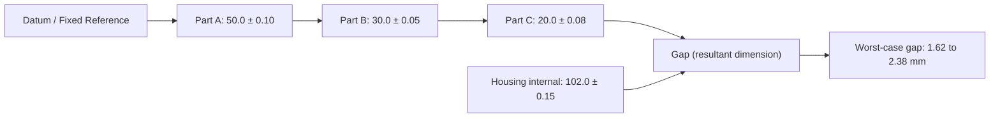
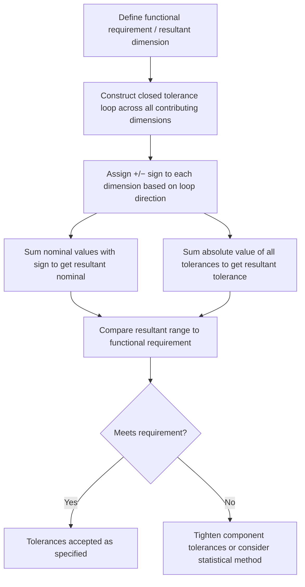

## Worst Case Tolerance Stacking

### Overview

Worst case tolerance stacking (also called worst-case analysis or arithmetic stacking) is a tolerance analysis method that calculates the extreme possible variation of an assembly dimension by summing the individual component tolerances at their absolute limits. It guarantees 100% interchangeability of parts under all possible combinations of tolerance extremes, at the cost of typically producing the widest (most conservative) resultant tolerance among common stack-up methods.

### Fundamental Principle

**Key Points**

- Assumes every dimension in the stack simultaneously occurs at its worst-case limit (all at maximum, all at minimum, or the specific combination that maximizes/minimizes the resultant dimension)
- Guarantees that 100% of assembled parts will meet the functional requirement, provided all individual components are within their specified tolerances
- Does not account for the statistical improbability of all dimensions simultaneously landing at their extremes — this conservatism is both its principal strength (certainty) and its principal weakness (unnecessarily tight component tolerances, higher manufacturing cost)

### Basic Formula

For a 1D linear stack of $n$ dimensions, where each dimension $i$ has a nominal value $\bar{X_i}$ and a tolerance $\pm T_i$:

$$X_{resultant} = \sum_{i=1}^{n} (\pm\bar{X_i})$$

$$T_{resultant} = \sum_{i=1}^{n} |T_i|$$

The resultant worst-case tolerance is the **arithmetic sum** of the absolute values of all individual tolerances in the loop, regardless of sign convention on the nominal values.

### Example — Simple Linear Stack

An assembly gap is formed by three stacked components:

| Component | Nominal (mm) | Tolerance (mm) |
| --- | --- | --- |
| Part A (length) | 50.0 | ±0.10 |
| Part B (length) | 30.0 | ±0.05 |
| Part C (length) | 20.0 | ±0.08 |
| Housing (internal) | 102.0 | ±0.15 |

Assuming the gap = Housing − (A + B + C):

$$Gap_{nominal} = 102.0 - (50.0 + 30.0 + 20.0) = 2.0\text{ mm}$$

$$T_{gap} = 0.15 + 0.10 + 0.05 + 0.08 = 0.38\text{ mm}$$

$$Gap_{range} = 2.0 \pm 0.38 = 1.62\text{ to }2.38\text{ mm}$$

Every possible combination of parts within their individual tolerances is guaranteed to produce a gap within $1.62$–$2.38$ mm.

### Stack-Up Chain Diagram

### Sign Convention and Direction of Contribution

**Key Points**

- Each dimension in a stack contributes either positively (+) or negatively (−) to the resultant dimension, depending on whether it adds to or subtracts from the loop, established by a vector/loop diagram
- Regardless of the +/− sign of the nominal contribution, the **tolerance always adds** (absolute value) — a tolerance never subtracts from the stack, since both the +Δ and −Δ directions of a dimension's variation must be accounted for in the worst case
- A properly constructed tolerance loop must close (start and end at the same reference point/surface) to be valid

### 2D and Angular Stacks (Vector Loop Method)

**Key Points**

- For stacks involving angular or 2D/3D geometry, dimensions are resolved into orthogonal (X, Y) components before summing
- Each dimension is decomposed using trigonometric relationships, and the worst-case resultant is computed by summing the worst-case component tolerances in each axis, then combining axes as needed for the functional requirement (e.g., radial clearance)

**Example**

A pin location has a nominal angle of $30°$ from a reference edge, with a length of $40 \pm 0.1$ mm and an angular tolerance of $\pm 0.5°$.

$$X = L\cos(\theta), \quad Y = L\sin(\theta)$$

Worst-case X and Y variation must account for both the length tolerance and the angular tolerance's projected effect at the given radius — angular tolerance in radians times length approximates the arc displacement:

$$\Delta_{angular} \approx L \times \theta_{tol}(\text{rad}) = 40 \times (0.5 \times \pi/180) \approx 0.35\text{ mm}$$

This is combined (worst-case addition) with the direct length tolerance component in the relevant axis.

### When to Use Worst Case Analysis

**Key Points**

- Low production volume, where statistical assumptions about distribution are unreliable due to small sample sizes
- Safety-critical or high-consequence-of-failure assemblies (aerospace fasteners, medical devices, life-support interfaces) where 100% conformance is mandatory regardless of cost
- Simple stacks with few contributors, where the conservatism penalty is small and the analysis is quick to perform
- Contractual or regulatory requirements mandating guaranteed interchangeability

### Comparison to Statistical Methods

| Aspect | Worst Case | Statistical (RSS) |
| --- | --- | --- |
| Resultant tolerance | Sum of absolute values | Square root of sum of squares |
| Conformance guarantee | 100% | Typically 99.73% (±3σ) or specified confidence |
| Component tolerance impact | Tightest (most conservative) | Looser, allows wider component tolerances |
| Computation complexity | Simple arithmetic | Requires distribution assumptions, process capability data |
| Risk | None (by design) | Small statistical probability of out-of-spec assembly |

$$T_{RSS} = \sqrt{\sum_{i=1}^{n} T_i^2} \quad \text{(for comparison — always} \leq T_{worst\ case}\text{)}$$

[Inference] For the example above, the RSS tolerance would be $\sqrt{0.15^2+0.10^2+0.05^2+0.08^2} \approx 0.20$ mm — roughly half the worst-case value of $0.38$ mm — illustrating the typical conservatism gap between the two methods, though the actual ratio depends on the number and relative magnitude of contributors in a given stack.

### Advantages and Limitations

**Advantages**

- Simple, transparent, and easy to audit or explain to customers/regulators
- No assumptions required about manufacturing process distribution or capability
- Absolute guarantee of fit/function across 100% of production

**Limitations**

- Produces the tightest possible individual component tolerances for a given assembly requirement, often driving unnecessary manufacturing cost
- Can render a design infeasible (tolerances tighter than achievable process capability) in stacks with many contributors, even when the design is functionally sound under realistic (statistical) conditions
- Does not reflect real-world production behavior, where simultaneous worst-case alignment of all dimensions is statistically rare

### Practical Workflow

**Related Topics**

- Root Sum Square (RSS) statistical tolerance analysis
- Monte Carlo simulation for tolerance stack-up
- Tolerance loop diagrams and datum chains
- Process capability (Cp, Cpk) and its role in statistical stacking
- 1D, 2D, and 3D tolerance stack-up methods
- Six Sigma tolerance allocation strategies