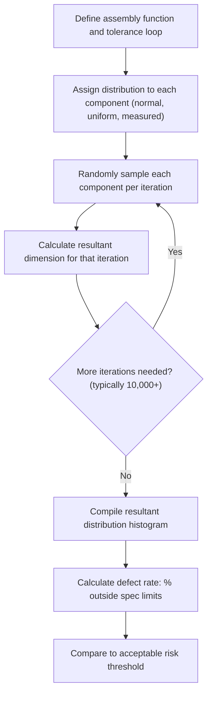

## Statistical Tolerance Stack Up

### Overview

Statistical tolerance stack-up is a family of analysis methods that predict the variation of an assembly dimension based on the statistical distribution of its individual component tolerances, rather than assuming all components simultaneously reach their worst-case limits. It produces a looser, more economically achievable resultant tolerance than worst-case analysis, at the cost of accepting a small, quantifiable probability that some assemblies will fall outside specification.

### Fundamental Principle

**Key Points**

- Assumes each component dimension varies according to a probability distribution (most commonly normal/Gaussian) around its nominal value, rather than sitting fixed at a tolerance extreme
- Because it is statistically improbable for all dimensions in a stack to simultaneously align at their worst-case limits, the resultant assembly variation is treated probabilistically, allowing individual component tolerances to be relaxed while still meeting the functional requirement at a specified confidence level
- Requires the assumption (or measured evidence) that manufacturing processes are stable, centered, and reasonably well-approximated by the chosen distribution — validity depends heavily on this assumption holding true in production

### Root Sum Square (RSS) Method

**Definition:** The most common statistical stacking method, which combines individual tolerances by taking the square root of the sum of their squares, assuming each dimension is normally distributed and tolerances represent a consistent number of standard deviations (commonly ±3σ).

$$T_{RSS} = \sqrt{\sum_{i=1}^{n} T_i^2}$$

**Key Points**

- Always produces a result less than or equal to the worst-case sum for the same set of tolerances, with the gap widening as the number of contributors increases
- Assumes each $T_i$ represents the same confidence level (e.g., all ±3σ) — mixing tolerance conventions without conversion introduces error
- The resultant confidence level is approximately the same as the input tolerances' confidence level (e.g., combining ±3σ inputs yields an approximately ±3σ resultant, assuming normality and independence)

**Example**

Using the same stack as a worst-case comparison:

| Component | Nominal (mm) | Tolerance (mm, ±3σ) |
| --- | --- | --- |
| Part A | 50.0 | 0.10 |
| Part B | 30.0 | 0.05 |
| Part C | 20.0 | 0.08 |
| Housing | 102.0 | 0.15 |

$$T_{RSS} = \sqrt{0.10^2 + 0.05^2 + 0.08^2 + 0.15^2} = \sqrt{0.01+0.0025+0.0064+0.0225} = \sqrt{0.0414} \approx 0.203\text{ mm}$$

$$Gap_{range} = 2.0 \pm 0.203 = 1.797\text{ to }2.203\text{ mm}$$

Compared to the worst-case range of $1.62$–$2.38$ mm, RSS predicts a substantially tighter realistic assembly variation for the same component tolerances.

### Assumptions Underlying RSS

**Key Points**

- **Normality:** each component dimension follows (or approximates) a normal distribution
- **Independence:** component dimension variations are statistically independent of one another (no correlated error sources)
- **Centering:** each process is centered on its nominal target, with the tolerance representing a symmetric ±3σ (or other consistent multiple) spread
- **Stability:** the manufacturing process remains in statistical control over time (no drift, no bimodal behavior)

[Unverified] Real-world processes may violate one or more of these assumptions (skewed distributions, mean shift, non-independence from shared tooling/fixturing) — analysts often apply correction factors or use Monte Carlo simulation when these assumptions are known to be invalid for a given process.

### Motorola/Six Sigma Correction Factors

**Key Points**

- Because real processes may not be perfectly centered, a **mean shift factor** (commonly denoted $C_f$ or a 1.5σ shift assumption from Six Sigma methodology) can be added to the RSS calculation to account for long-term process drift
- Adjusted formula (one common convention):

$$T_{adjusted} = \sqrt{\sum_{i=1}^{n} T_i^2} + \sum_{i=1}^{n}(\text{shift}_i)$$

- [Inference] The specific correction approach and shift magnitude vary by industry standard and internal company practice; the commonly cited 1.5σ shift originates from Six Sigma literature and is not universally applied in all statistical tolerancing contexts.

### Process Capability Integration

**Key Points**

- Statistical stacking is strengthened when individual component tolerances are backed by actual process capability data ($C_p$, $C_{pk}$) rather than assumed distributions
- $C_p$ compares the tolerance spread to the actual process spread:

$$C_p = \frac{USL - LSL}{6\sigma}$$

- $C_{pk}$ additionally accounts for process centering:

$$C_{pk} = \min\left(\frac{USL - \mu}{3\sigma}, \frac{\mu - LSL}{3\sigma}\right)$$

- A $C_{pk} \geq 1.33$ is a common industry threshold indicating a well-controlled process suitable for statistical tolerancing assumptions; lower values suggest the process may not support the assumed confidence level

### Monte Carlo Simulation

**Definition:** A computational statistical method that randomly samples each component dimension according to its specified (or measured) distribution across thousands to millions of simulated assembly iterations, directly calculating the resultant distribution rather than relying on closed-form formulas like RSS.

**Key Points**

- Does not require the linearity or normality assumptions inherent to RSS — can model non-normal distributions, non-linear relationships (e.g., trigonometric stacks), and correlated variables directly
- Well suited to complex, non-linear, or 3D stacks where closed-form statistical formulas become impractical
- Output is typically a histogram or cumulative distribution of the resultant dimension, from which the defect rate (percentage outside spec limits) is read directly

### Method Comparison

| Method | Formula Basis | Assumptions | Best Use Case |
| --- | --- | --- | --- |
| Worst Case | Sum of absolute values | None | Low volume, safety-critical, few contributors |
| RSS | Square root of sum of squares | Normal, independent, centered | Medium-high volume, linear stacks, well-characterized processes |
| RSS with correction | RSS + mean shift factor | Normal with known/assumed drift | Processes with documented centering drift |
| Monte Carlo | Simulated random sampling | Distribution-flexible | Complex, non-linear, or correlated stacks |

### RSS vs. Worst Case Visual Comparison (svg_diagram)

<svg xmlns="http://www.w3.org/2000/svg" viewBox="0 0 700 260" font-family="Arial, sans-serif">
<text x="350" y="20" text-anchor="middle" font-size="15" font-weight="bold">Worst Case vs. RSS Resultant Tolerance (svg_diagram)</text>
<line x1="80" y1="200" x2="620" y2="200" stroke="#333" stroke-width="1.5" />
<text x="350" y="225" text-anchor="middle" font-size="11">Gap Dimension (mm)</text>

<text x="130" y="240" text-anchor="middle" font-size="10">1.62</text>

<text x="570" y="240" text-anchor="middle" font-size="10">2.38</text>

<text x="200" y="240" text-anchor="middle" font-size="10">1.797</text>

<text x="495" y="240" text-anchor="middle" font-size="10">2.203</text>

<text x="350" y="240" text-anchor="middle" font-size="10">2.0</text>

<rect x="130" y="80" width="440" height="30" fill="none" stroke="#c0392b" stroke-width="2" />
<text x="350" y="75" text-anchor="middle" font-size="10" fill="#c0392b">Worst Case: 1.62 – 2.38 (T = 0.38)</text>
<path d="M200,150 Q350,110 500,150 Z" fill="#2c3e50" opacity="0.15" stroke="#2c3e50" stroke-width="2" />
<text x="350" y="170" text-anchor="middle" font-size="10" fill="#2c3e50">RSS (~3σ): 1.797 – 2.203 (T ≈ 0.203)</text>
<line x1="350" y1="60" x2="350" y2="200" stroke="#999" stroke-dasharray="3,2" />
</svg>

### Advantages and Limitations

**Advantages**

- Allows significantly looser individual component tolerances for the same functional requirement compared to worst-case, reducing manufacturing cost
- Better reflects actual production behavior when processes are stable and well-characterized
- Scalable to complex assemblies where worst-case tolerances would otherwise be economically or physically unachievable

**Limitations**

- Accepts a nonzero probability of out-of-specification assemblies — unsuitable where 100% conformance is mandatory
- Validity depends entirely on the accuracy of the underlying distribution assumptions; unverified or incorrect assumptions can understate real assembly risk
- Requires more data (process capability studies, historical measurement data) and statistical expertise than worst-case analysis to implement correctly

### When to Use Statistical Stacking

- Medium-to-high production volume, where measured process data supports distribution assumptions
- Non-safety-critical assemblies where an acceptable defect rate can be tolerated and managed through inspection or rework
- Stacks with many contributors, where worst-case tolerances would be prohibitively tight or physically unachievable
- Mature manufacturing processes with demonstrated capability ($C_{pk}$ data available)

**Related Topics**

- Worst case tolerance stacking (comparison baseline)
- Process capability indices ($C_p$, $C_{pk}$)
- Monte Carlo simulation methodology and software tools
- Six Sigma mean shift and correction factors
- Normal distribution and standard deviation fundamentals
- Tolerance loop diagrams and datum chain construction