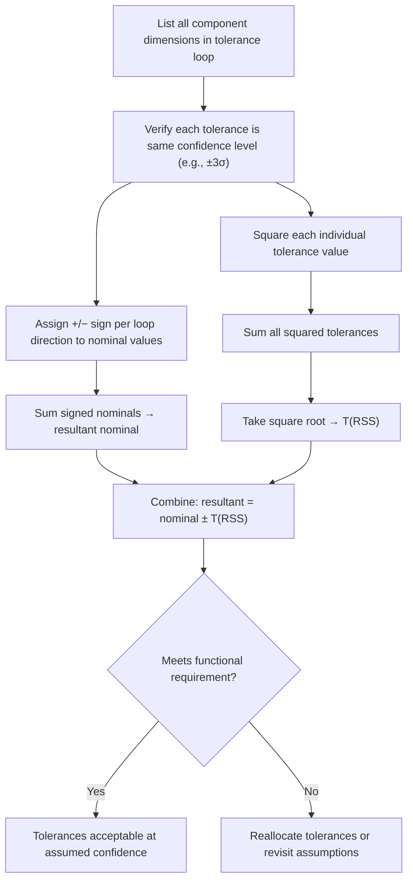

## Root Sum Square Method

### Overview

The Root Sum Square (RSS) method is a closed-form statistical tolerance stacking technique that combines individual component tolerances by taking the square root of the sum of their squares. It is the most widely used statistical stacking formula due to its computational simplicity and its foundation in well-established probability theory for combining independent, normally distributed random variables.

### Mathematical Foundation

**Key Points**

- RSS derives from the statistical principle that the variance of a sum of independent random variables equals the sum of their individual variances
- If each component tolerance $T_i$ represents a fixed number of standard deviations (commonly $\pm 3\sigma$) of a normal distribution, the resultant standard deviation follows the same square-root-of-sum-of-squares relationship

$$\sigma_{resultant}^2 = \sum_{i=1}^{n} \sigma_i^2$$

$$\sigma_{resultant} = \sqrt{\sum_{i=1}^{n} \sigma_i^2}$$

Since $T_i = k\sigma_i$ for a consistent multiplier $k$ (e.g., $k=3$) across all components:

$$T_{RSS} = k\sigma_{resultant} = k\sqrt{\sum_{i=1}^{n} \left(\frac{T_i}{k}\right)^2} = \sqrt{\sum_{i=1}^{n} T_i^2}$$

### Core Formula

$$T_{RSS} = \sqrt{T_1^2 + T_2^2 + T_3^2 + \cdots + T_n^2}$$

The resultant nominal (mean) value is still calculated by simple algebraic (signed) summation, identical to the worst-case method — only the tolerance combination changes:

$$X_{resultant} = \sum_{i=1}^{n} (\pm\bar{X_i})$$

### Required Assumptions

**Key Points**

1. **Normal distribution:** each component dimension is assumed to follow a Gaussian distribution
2. **Statistical independence:** no correlation between component variations (e.g., not all machined on the same tool with shared systematic error)
3. **Consistent confidence level:** all input tolerances represent the same multiple of sigma (mixing a $\pm 3\sigma$ tolerance with a $\pm 2\sigma$ tolerance without conversion produces an invalid result)
4. **Process centering:** each component's distribution is centered on its nominal dimension, with no systematic mean shift

[Unverified] The degree to which real manufacturing processes satisfy the independence and normality assumptions varies by process and part family; RSS results should be treated as estimates unless validated against measured production data or supplemented with capability studies.

### Worked Example

A shaft assembly stack consists of four components contributing to an axial end-play gap:

| Component | Nominal (mm) | Tolerance (±3σ, mm) | Sign |
| --- | --- | --- | --- |
| Housing bore depth | 85.00 | 0.12 | + |
| Bearing A width | 15.00 | 0.03 | − |
| Shaft shoulder-to-shoulder | 62.00 | 0.08 | − |
| Bearing B width | 7.50 | 0.02 | − |

**Step 1 — Resultant Nominal**

$$X_{resultant} = 85.00 - 15.00 - 62.00 - 7.50 = 0.50\text{ mm}$$

**Step 2 — Resultant RSS Tolerance**

$$T_{RSS} = \sqrt{0.12^2 + 0.03^2 + 0.08^2 + 0.02^2}$$

$$= \sqrt{0.0144 + 0.0009 + 0.0064 + 0.0004} = \sqrt{0.0221} \approx 0.1487\text{ mm}$$

**Step 3 — Resultant Range**

$$Gap = 0.50 \pm 0.149\text{ mm} \rightarrow 0.351\text{ to }0.649\text{ mm}$$

For comparison, the worst-case sum would have been $0.12+0.03+0.08+0.02 = 0.25$ mm — nearly 68% wider than the RSS result.

### RSS Calculation Flow

### Contribution Weighting

**Key Points**

- Because tolerances are squared before summing, larger individual tolerances disproportionately dominate the RSS result — a component with double the tolerance of another contributes four times as much to the sum of squares
- This has a practical design implication: tightening the single largest tolerance contributor in a stack yields a greater RSS reduction than proportionally tightening several smaller contributors

**Example — Dominant Contributor Effect**

Using the shaft example, the housing bore depth ($0.12$ mm) contributes:

$$\frac{0.12^2}{0.0221} \approx 65\%$$

of the total variance in the stack, despite being only one of four dimensions — illustrating why RSS-based tolerance allocation often focuses tightening efforts on the largest single contributor first.

### Tolerance Allocation Using RSS (Reverse Application)

**Key Points**

- RSS can be used in reverse to *allocate* tolerances across components when a target resultant tolerance is known but individual component tolerances are not yet fixed
- **Equal tolerance method:** assumes all $n$ components share equal tolerance, solving for $T_i$:

$$T_i = \frac{T_{RSS,target}}{\sqrt{n}}$$

- **Proportional scaling method:** allocates tolerance proportionally based on each dimension's relative difficulty or nominal magnitude, then scales the full set until the RSS sum matches the target

**Example**

Target resultant tolerance: $0.15$ mm across 4 equally-weighted components:

$$T_i = \frac{0.15}{\sqrt{4}} = \frac{0.15}{2} = 0.075\text{ mm per component}$$

Each component could be allocated $\pm 0.075$ mm and still meet the target $0.15$ mm RSS resultant.

### Limitations and Common Errors

- **Non-normal distributions:** RSS becomes inaccurate for components with significantly skewed or non-Gaussian distributions (e.g., features controlled by a hard physical limit on one side)
- **Correlated variations:** shared tooling, fixturing, or process steps across components violate the independence assumption and can cause RSS to understate actual resultant variation
- **Mixed confidence levels:** combining a $\pm 3\sigma$ tolerance with a drawing tolerance that represents a different (or unstated) confidence level without normalizing first produces a mathematically invalid result
- **Small sample sizes:** RSS's statistical basis is weakest when component tolerances are not backed by sufficient production data to validate the normality assumption

### RSS vs. Worst Case — When RSS Understates Risk

[Inference] In stacks with few contributors (fewer than approximately 4–5), the statistical benefit of RSS over worst-case is often modest, and the added complexity/risk of relying on unverified distribution assumptions may not be justified compared to simply using worst-case analysis for such small stacks.

**Related Topics**

- Statistical tolerance stack up (parent methodology)
- Worst case tolerance stacking (comparison baseline)
- Monte Carlo simulation for non-linear/non-normal stacks
- Process capability indices ($C_p$, $C_{pk}$) and their role in validating RSS assumptions
- Six Sigma mean shift correction factors applied to RSS
- Tolerance allocation strategies in design for manufacturability