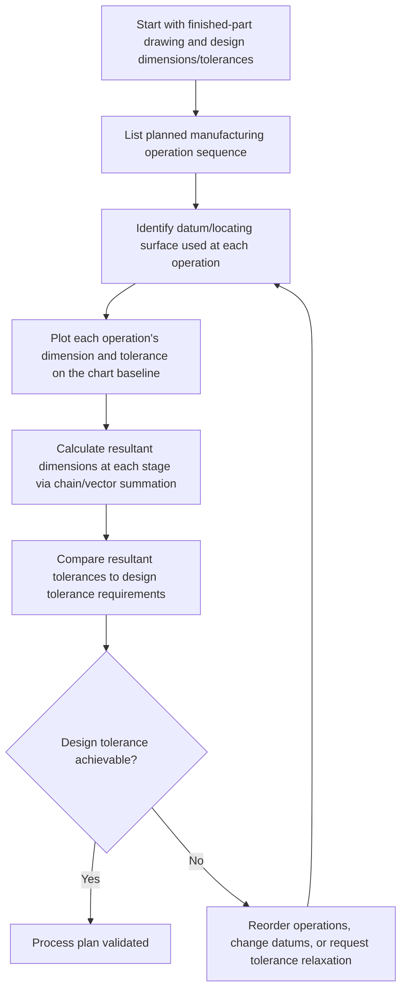

## Tolerance Charts

### Overview

Tolerance charts are a graphical and tabular process-planning tool used to track how dimensional tolerances accumulate across a sequence of manufacturing operations, particularly through multiple machining setups that reference different datum surfaces. Originally developed for process planning of multi-operation machined parts, tolerance charts (also called process charts or dimension charts) reconcile design dimensions with the actual sequence of manufacturing datums, revealing stack-up conditions that are not obvious from the finished-part drawing alone.

### Purpose and Function

**Key Points**

- Bridges the gap between design-intent dimensions (referenced from design datums on the drawing) and the actual manufacturing sequence (which may reference different setup datums at each operation)
- Identifies whether a specified design tolerance is achievable given the planned sequence of operations, or whether operations/datums must be reordered or tolerances relaxed
- Calculates **resultant tolerances** at each stage of manufacture, accounting for stock removal, setup datum shifts, and cumulative process variation
- Historically essential for rotational/prismatic parts machined across multiple operations (turning, milling, grinding) on different fixtures or datum references

### Chart Structure

A tolerance chart is typically organized as a table with the part's axial (or relevant) dimension plotted as a baseline, and each manufacturing operation represented as a row showing:

| Column | Content |
| --- | --- |
| Operation number | Sequential manufacturing step (OP10, OP20, etc.) |
| Operation description | Turn, mill, drill, grind, etc. |
| Datum used | Surface/feature referenced for that operation |
| Dimension produced | Nominal value and tolerance for that operation's cut |
| Stock removed | Material removed at that operation, with its own tolerance |
| Resultant dimensions | Calculated dimensions/tolerances resulting from the cumulative operation sequence |

### Basic Workflow

### Example — Simple Shaft Machining Sequence

A shaft has a design dimension of $60.0 \pm 0.1$ mm from the left face (design datum) to a shoulder.

Manufacturing sequence:

- **OP10:** Turn left face (establishes manufacturing datum M1); rough-turn shoulder location from M1 at $60.3 \pm 0.15$ mm (rough allowance for finish pass)
- **OP20:** Part off right end from M1 at $150.0 \pm 0.2$ mm
- **OP30:** Finish-grind shoulder from M1 at $60.0 \pm 0.05$ mm (final dimension)

**Resultant Analysis**

Since OP30 references the same datum (M1) as the design datum (left face), the resultant dimension at the shoulder directly equals the OP30 dimension:

$$X_{resultant} = 60.0\text{ mm}, \quad T_{resultant} = \pm 0.05\text{ mm}$$

This is within the design tolerance of $\pm 0.1$ mm, so the process plan is validated for this dimension — **provided the manufacturing datum used in OP30 is confirmed to coincide with the design datum on the drawing.**

### Example — Datum Mismatch Requiring Chain Calculation

If instead OP30's grind referenced the **right end** (established in OP20) rather than the left face, the resultant dimension to the design datum (left face) must be calculated as a chain through the intermediate operations:

$$X_{shoulder\ from\ left} = X_{OP20} - X_{OP30\ from\ right}$$

With $X_{OP20} = 150.0 \pm 0.2$ mm and $X_{OP30\ from\ right} = 90.0 \pm 0.05$ mm:

$$X_{resultant} = 150.0 - 90.0 = 60.0\text{ mm}$$

$$T_{resultant} = 0.2 + 0.05 = 0.25\text{ mm (worst case)}$$

This resultant tolerance of $\pm 0.25$ mm **exceeds** the design requirement of $\pm 0.1$ mm — revealing a process plan that will not reliably produce conforming parts, even though each individual operation's tolerance appears reasonable in isolation. This is the core value of a tolerance chart: surfacing datum-mismatch stack-up conditions that are invisible when only the finished-part drawing is reviewed.

### Datum Shift Visualization (svg_diagram)

<svg xmlns="http://www.w3.org/2000/svg" viewBox="0 0 780 260" font-family="Arial, sans-serif">
<text x="390" y="20" text-anchor="middle" font-size="14" font-weight="bold">Manufacturing Datum Chain vs. Design Datum (svg_diagram)</text>
<line x1="60" y1="60" x2="60" y2="220" stroke="#2c3e50" stroke-width="2" />
<text x="60" y="235" text-anchor="middle" font-size="10">Left face (Design Datum / M1)</text>
<line x1="700" y1="60" x2="700" y2="220" stroke="#2c3e50" stroke-width="2" />
<text x="700" y="235" text-anchor="middle" font-size="10">Right end (OP20 datum)</text>
<line x1="450" y1="60" x2="450" y2="220" stroke="#c0392b" stroke-width="2" stroke-dasharray="5,3" />
<text x="450" y="235" text-anchor="middle" font-size="10">Shoulder (feature)</text>
<line x1="60" y1="80" x2="450" y2="80" stroke="#333" stroke-width="1.5" marker-end="url(#a1)" />
<text x="255" y="75" text-anchor="middle" font-size="10">Design dim: 60.0 ± 0.1 (intended)</text>
<line x1="700" y1="110" x2="450" y2="110" stroke="#8e44ad" stroke-width="1.5" />
<text x="575" y="105" text-anchor="middle" font-size="10">OP30 actual dim: 90.0 ± 0.05 (from right end)</text>
<line x1="60" y1="140" x2="700" y2="140" stroke="#27ae60" stroke-width="1.5" />
<text x="380" y="135" text-anchor="middle" font-size="10">OP20 dim: 150.0 ± 0.2 (from left face)</text>

<text x="390" y="180" text-anchor="middle" font-size="11" fill="`#c0392b`" font-weight="bold">Resultant: 60.0 ± 0.25 (chain through OP20 + OP30)</text>

<text x="390" y="200" text-anchor="middle" font-size="10" fill="`#c0392b`">Exceeds design tolerance of ± 0.1 — datum mismatch revealed</text>

</svg>

### Stock Removal and Blueprint (Balance) Dimensions

**Key Points**

- Tolerance charts also track **stock removal** at each operation — the material removed between the raw/semi-finished condition and the finished dimension — ensuring adequate stock remains for subsequent operations (e.g., enough material for a finish grind pass after rough turning)
- **Blueprint dimensions** (design dimensions) are converted into **working (operation) dimensions**, sometimes called balance dimensions, that reflect the actual datum used at each machining step
- Minimum stock removal constraints prevent a situation where cumulative tolerance stack-up could result in insufficient material remaining for a finishing operation, or in cutting into a previously finished surface

### When Tolerance Charts Are Used

- Complex multi-operation machined parts (shafts, complex prismatic parts) where datum surfaces change between operations
- Process validation before committing to tooling and fixturing, particularly in high-volume or precision manufacturing
- Root-cause investigation when finished parts show unexpected dimensional variation traceable to process sequence rather than individual operation capability
- Legacy and modern CNC process planning, though increasingly supplemented or replaced by CAD/CAM-integrated tolerance stack-up software in current practice

### Modern Practice Context

[Inference] While traditional manual tolerance charting remains taught as a foundational process-planning skill, much of this analysis is now performed within CAD/CAM and dedicated tolerance-stack-up software that automates the chain calculations across defined manufacturing sequences, though the underlying chain-and-datum-mismatch logic remains conceptually identical to manual charting methods.

### Relationship to GD&T and Stack-Up Analysis

- Tolerance charts apply the same chain/vector-summation logic as general tolerance stack-up analysis (worst-case or statistical), but specifically structured around the **sequence of manufacturing operations** rather than only the final assembly of separate parts
- A well-constructed GD&T datum scheme on the design drawing, chosen to align with practical manufacturing datums, reduces the likelihood of the datum-mismatch conditions that tolerance charts are designed to catch

**Related Topics**

- Worst case tolerance stacking
- Datum reference frames and datum selection strategy
- Process capability and machining sequence planning
- Stock removal allowances and finish-pass planning
- CAM-integrated tolerance stack-up software
- Manufacturing datum vs. design datum alignment