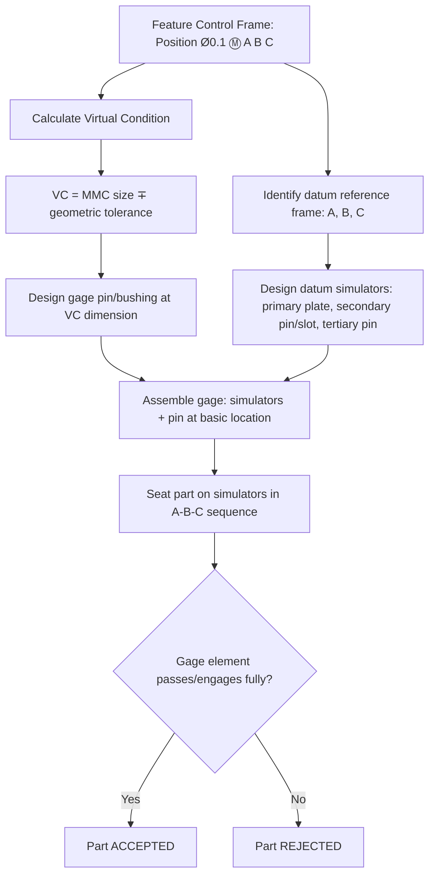

## Functional Gauging Concepts

### Overview

Functional gaging (also spelled functional gauging) is an inspection methodology that uses a fixed-limit gage designed to simulate the worst-case mating part boundary — the virtual condition — of a feature controlled by a geometric tolerance at MMC or LMC. Rather than measuring individual dimensions and calculating conformance mathematically, a functional gage physically verifies, in a single go/no-go check, that a part will assemble correctly with its mating component across every valid combination of size and geometric variation.

### Fundamental Principle

**Key Points**

- A functional gage's critical dimensions are set to the **virtual condition** of the feature(s) being checked, which represents the constant worst-case boundary regardless of the part's actual produced size
- If the gage passes (go) or fails to pass (no-go) appropriately, the part is accepted or rejected — no further calculation is required at the point of inspection
- Functional gaging is only applicable to geometric tolerances referenced at **MMC** (most common) or **LMC**; features controlled at RFS cannot use fixed functional gages because the allowable tolerance zone shifts with actual size, requiring variable measurement instead

### Why Functional Gaging Works

**Key Points**

- Because virtual condition combines the feature's material condition boundary with its full geometric tolerance into one fixed value, a gage built to that value inherently accounts for the trade-off between size error and geometric error (bonus tolerance) without needing to measure them separately
- This directly reflects the physical reality the tolerance is meant to guarantee: that the part will assemble with a mating feature of the specified virtual-condition size, regardless of exactly how the part's individual size and position/orientation errors combine

$$VC_{internal,MMC} = MMC_{size} - T_{geo}$$

$$VC_{external,MMC} = MMC_{size} + T_{geo}$$

### Gage Element Design

**Key Points**

- **Gage pin (for holes):** a cylindrical pin sized to the hole's virtual condition, checking that the hole's axis position and size combination never encroaches inside that boundary
- **Gage bushing/ring (for pins/shafts):** a bore sized to the shaft's virtual condition, checking that the shaft never exceeds that outer boundary at any point along its length
- **Datum feature simulators:** flat plates, V-blocks, or expanding mandrels that simulate the datum features referenced in the feature control frame, establishing the same datum reference frame used on the drawing
- **Gage body:** the structural fixture holding the pins, simulators, and locating elements in their correct basic-dimension positions relative to one another

### Example — Position Tolerance Gage

Feature control frame: `⌖ Ø0.1 Ⓜ A B C` applied to a hole, size limits $12.0$–$12.3$ mm.

$$VC = 12.0 - 0.1 = 11.9\text{ mm}$$

**Gage construction:**

- A flat datum simulator plate representing datum A (primary, three-point contact)
- A locating pin/slot representing datum B (secondary)
- A locating feature representing datum C (tertiary, removing final rotational freedom)
- A fixed gage pin of $11.9$ mm diameter, positioned at the basic (true position) location relative to the datum simulators

**Inspection procedure:** the part is seated on the datum simulators in proper sequence (A first, then B, then C), and the gage pin must pass fully through the hole. If it does, the part is accepted regardless of the actual hole size or exact position error, as long as both fall within their individually specified limits.

### Functional Gage Structure Diagram

### Datum Feature Simulators and Material Condition

**Key Points**

- When a datum feature itself carries a material condition modifier (e.g., `A Ⓜ`), the datum simulator is sized to the datum feature's virtual condition as well, and may allow the part to **shift** relative to the simulator as the datum feature departs from its own MMC/LMC size — this is a separate but related concept from bonus tolerance on the toleranced feature itself
- When no modifier is shown on a datum reference (implicitly RFS), the simulator must adjust to the actual datum feature surface at time of engagement (e.g., expanding chuck/mandrel simulating a hole datum), which is more complex and costly than a fixed simulator

### Advantages of Functional Gaging

- **Speed:** a single go/no-go check replaces multiple individual measurements and manual calculation of position, size, and bonus tolerance
- **Consistency:** removes operator-dependent calculation error and interpretation differences between inspectors
- **Direct functional representation:** verifies the part against the same worst-case condition the design tolerance was intended to guarantee, rather than an indirect proxy measurement
- **High-volume suitability:** well suited to production environments requiring fast, repeatable, low-skill-level inspection at the point of manufacture

### Limitations of Functional Gaging

- **No diagnostic data:** a functional gage indicates pass/fail only — it provides no information about the actual size, location, or orientation values of a rejected part, unlike a CMM, complicating root-cause analysis
- **Fixed to a single tolerance combination:** a gage built for one feature control frame cannot generally be reused if the tolerance, datum scheme, or basic dimensions change; a new or modified gage is required
- **Upfront tooling cost and lead time:** gage design, manufacture, and certification represent a fixed cost that must be justified by production volume — uneconomical for low-volume or prototype work
- **Only applicable to MMC/LMC-referenced tolerances:** cannot be used for RFS-referenced geometric tolerances, form tolerances without datums, or profile tolerances without a defined material-condition relationship

### Functional Gage vs. Variable (CMM) Inspection

| Aspect | Functional Gage | CMM / Variable Inspection |
| --- | --- | --- |
| Applicable modifiers | MMC, LMC only | RFS, MMC, LMC (all) |
| Output | Pass/fail only | Full dimensional data set |
| Speed | Very fast, single check | Slower, per-feature measurement + calculation |
| Upfront cost | High tooling cost | Lower per-part marginal cost, higher capital equipment cost |
| Diagnostic value | None | High — supports root cause and SPC data collection |
| Best suited for | High-volume production verification | Low-volume, prototyping, R&D, diagnostic inspection |

### Gage Tolerancing and Certification

**Key Points**

- Functional gages themselves require tolerances on their own critical dimensions, following standard gage design practice (e.g., ASME B89.3.1 or company-specific gage tolerance standards), typically allocated as a fraction of the part tolerance (commonly around 10%, per traditional gage-maker's rule practice)
- Gages require periodic calibration/certification against traceable standards to ensure continued accuracy, similar to any other precision measurement equipment
- [Inference] The specific gage tolerance allocation percentage and recertification interval vary by company quality system and industry standard; no single universal value applies across all applications.

### Common Applications

- Bolt-hole patterns and multi-hole assembly interfaces checked with fixed gage pin arrays
- Shaft/bore fits in high-volume automotive and industrial assembly production
- Injection-molded or stamped parts with position-toleranced features requiring rapid 100% or high-frequency sampling inspection
- Receiving inspection of purchased components where fast, unambiguous accept/reject decisions are required at incoming inspection

**Related Topics**

- Virtual condition and bonus tolerance
- Material condition modifiers (MMC, LMC, RFS)
- Position tolerance and datum reference frames
- Datum feature simulators and datum shift
- CMM-based variable inspection methods
- Gage design tolerancing standards (ASME B89.3.1)