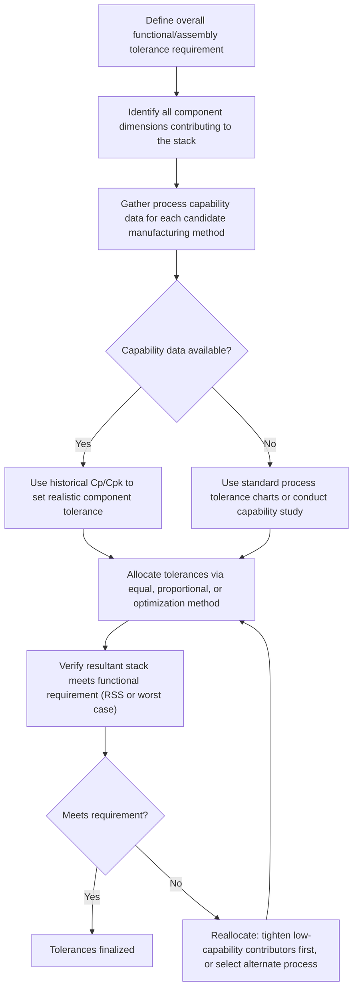
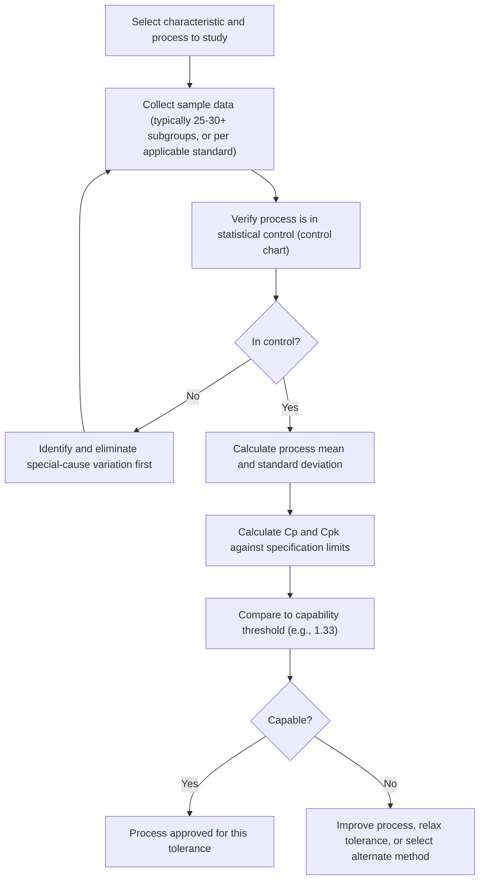

## Tolerance Allocation and Process Capability

### Overview

Tolerance allocation is the design process of distributing an overall assembly or functional tolerance requirement among individual component dimensions. Process capability is the quantitative measurement of a manufacturing process's ability to produce parts consistently within specified tolerance limits. The two concepts are tightly linked: effective tolerance allocation depends on knowing what tolerances individual processes can realistically and economically achieve, and process capability data provides the evidence needed to allocate tolerances intelligently rather than arbitrarily.

### Process Capability Fundamentals

**Definition:** Process capability quantifies how well a manufacturing process's natural variation fits within specified tolerance limits, typically expressed through the indices $C_p$ and $C_{pk}$.

**$C_p$ — Process Capability Index**

Compares the tolerance spread (specification width) to the actual process spread (natural variation), without regard to centering:

$$C_p = \frac{USL - LSL}{6\sigma}$$

where $USL$ and $LSL$ are the upper and lower specification limits, and $\sigma$ is the process standard deviation.

**$C_{pk}$ — Process Capability Index (Centering-Adjusted)**

Accounts for how well the process is centered within the tolerance band, using the closer of the two limits to the process mean $\mu$:

$$C_{pk} = \min\left(\frac{USL - \mu}{3\sigma}, \frac{\mu - LSL}{3\sigma}\right)$$

**Key Points**

- $C_p = C_{pk}$ only when the process is perfectly centered on the nominal target; any mean shift makes $C_{pk} < C_p$
- $C_{pk} \geq 1.33$ is a commonly cited industry threshold for a "capable" process (approximately equivalent to a process spread using only 90% of the tolerance band)
- $C_{pk} \geq 1.67$ or higher is often required for critical or safety-related characteristics
- $C_{pk} < 1.0$ indicates the process is producing some out-of-specification parts under normal (stable) operation

### Capability Index Interpretation Table

| $C_{pk}$ Value | Interpretation | Approx. Defect Rate (normal, centered) |
| --- | --- | --- |
| < 1.00 | Not capable — producing defects | > 0.27% |
| 1.00 – 1.33 | Marginally capable | 0.0063% – 0.27% |
| 1.33 – 1.67 | Capable | ~0.0063% down to ~0.00006% |
| > 1.67 | Highly capable | Negligible under stable conditions |

[Inference] These defect-rate approximations assume a stable, normally distributed process; actual observed defect rates in production can differ meaningfully if the process drifts, is non-normal, or is not in statistical control at the time of sampling.

### Relationship to Tolerance Allocation

**Key Points**

- Tolerance allocation should ideally be informed by *known* process capability for the manufacturing methods planned for each component, rather than allocated purely by engineering judgment or equal division
- Allocating a tolerance tighter than a process's demonstrated capability guarantees elevated scrap/rework rates or forces a more expensive process to be used
- Allocating a tolerance looser than necessary wastes available tolerance "budget" that could have been used to relax a more difficult-to-hold dimension elsewhere in the stack

### Allocation Methods

**Equal Tolerance Allocation**

Distributes tolerance equally among all $n$ components, without regard to differing process difficulty:

$$T_i = \frac{T_{target}}{\sqrt{n}} \quad \text{(for RSS stacking)} \qquad T_i = \frac{T_{target}}{n} \quad \text{(for worst-case stacking)}$$

- Simple to apply but often suboptimal — some features can easily hold tighter tolerances than others at similar cost, while some are inherently harder

**Proportional Scaling Allocation**

Allocates tolerance proportionally based on each dimension's nominal size, existing "natural" tolerance grade (e.g., ISO tolerance grades), or engineering judgment of relative difficulty, then scales the full set to meet the target resultant:

$$T_i = T_{i,initial} \times \frac{T_{target}}{T_{RSS,initial}}$$

- Better reflects real-world cost/difficulty differences than equal allocation, but still relies on judgment for the initial proportional weighting

**Cost-Optimized (Precision) Allocation**

Uses known or estimated cost-vs-tolerance relationships for each manufacturing process to allocate tolerance in a way that minimizes total manufacturing cost while still meeting the resultant functional requirement — typically solved as a constrained optimization problem.

- [Inference] Cost-tolerance relationships are process- and shop-specific; without company-specific cost data, generic cost-tolerance curves from tolerance handbooks are often used as a starting approximation rather than a precise cost model.

### Worked Example — Capability-Informed Allocation

A stack requires a resultant RSS tolerance of $0.15$ mm across three components, each producible by a different process with known capability:

| Component | Process | Demonstrated $C_{pk}$ at ±0.05mm tolerance | Natural process spread (6σ) |
| --- | --- | --- | --- |
| A | CNC turning | 1.67 | 0.030 mm |
| B | CNC milling | 1.20 | 0.042 mm |
| C | Stamping | 0.90 | 0.056 mm |

Since Component C's stamping process shows the lowest capability at the initially assumed $\pm 0.05$ mm tolerance, allocation strategy should relax C's tolerance (if functionally acceptable) and tighten A's tolerance instead, since turning has demonstrated capability well within its current allocation:

**Revised allocation:** $T_A = 0.03$, $T_B = 0.05$, $T_C = 0.08$ mm

$$T_{RSS} = \sqrt{0.03^2 + 0.05^2 + 0.08^2} = \sqrt{0.0009+0.0025+0.0064} = \sqrt{0.0098} \approx 0.099\text{ mm}$$

This revised allocation both meets the $0.15$ mm target with margin and better matches each process's demonstrated capability, reducing the likelihood of Component C driving scrap/rework.

### Capability Study Process

### Standard Process Tolerance References

**Key Points**

- When empirical capability data is unavailable (new process, new supplier, early design phase), standard tolerance capability charts — such as those found in machinery handbooks or ISO 2768 general tolerances — provide typical achievable tolerances by process type (turning, milling, grinding, casting, injection molding, stamping) as a starting allocation baseline
- These generic values should be treated as preliminary estimates and validated with actual capability studies once production tooling and processes are established, since actual shop-specific capability can differ meaningfully from generic handbook values

### Design for Manufacturability Implications

- Tolerance allocation decisions made early in design directly influence which manufacturing processes are economically viable — specifying a tolerance tighter than a low-cost process's capability forces selection of a more expensive process for that feature
- Iterative allocation (tightening high-capability, low-cost contributors while relaxing low-capability or high-cost contributors) is a standard cost-reduction strategy once initial capability data becomes available from pilot production or supplier qualification
- Cross-functional review between design and manufacturing engineering during tolerance allocation reduces the risk of specifying tolerances that are functionally sound on paper but economically or physically unachievable in production

**Related Topics**

- Statistical tolerance stack up and RSS method
- Worst case tolerance stacking
- Control charts and statistical process control (SPC)
- ISO tolerance grades and general tolerance standards (ISO 2768)
- Design for manufacturability (DFM) principles
- Six Sigma methodology and mean shift correction factors