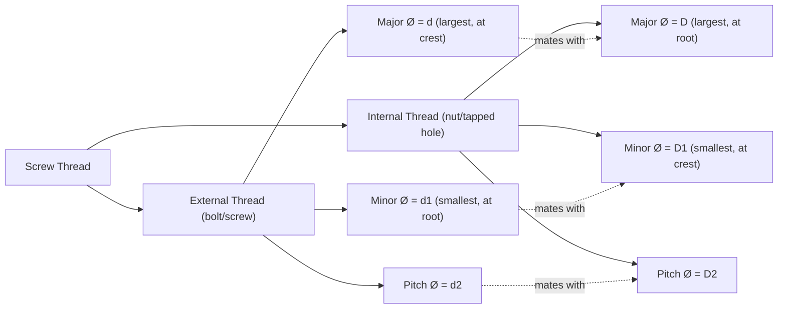

## Screw Thread Terminology and Elements

### Overview

Screw thread terminology defines the standardized vocabulary used to describe the geometric elements of a helical thread form. Precise understanding of these terms is foundational to thread metrology, since thread inspection and gaging (pitch diameter, functional diameter, thread gaging) all reference these defined elements. This content follows ASME B1.1 (Unified Inch Screw Threads) and ISO 68/ISO 965 (Metric Screw Threads) conventions, which share largely common terminology.

### Basic Thread Geometry Elements

**Key Points**

- **Major diameter ($d$ / $D$):** the largest diameter of the thread, measured at the crest of an external thread or the root of an internal thread
- **Minor diameter ($d_1$ / $D_1$):** the smallest diameter of the thread, measured at the root of an external thread or the crest of an internal thread
- **Pitch diameter ($d_2$ / $D_2$):** the diameter of an imaginary cylinder that passes through the thread profile at the point where the width of the thread and the width of the groove are equal — the single most functionally critical dimension for thread fit
- Lowercase letter designations ($d$, $d_1$, $d_2$) conventionally refer to **external** threads; uppercase ($D$, $D_1$, $D_2$) refer to **internal** threads

### Thread Profile Cross-Section (svg_diagram)

<svg xmlns="http://www.w3.org/2000/svg" viewBox="0 0 700 320" font-family="Arial, sans-serif">
<text x="350" y="20" text-anchor="middle" font-size="15" font-weight="bold">External Thread Profile Elements (svg_diagram)</text>
<path d="M60,80 L110,140 L60,200 L110,260 L60,300" stroke="#333" stroke-width="2" fill="none" />
<path d="M180,80 L130,140 L180,200 L130,260 L180,300" stroke="#333" stroke-width="2" fill="none" />
<line x1="60" y1="80" x2="180" y2="80" stroke="#999" stroke-dasharray="3,2" />
<line x1="60" y1="300" x2="180" y2="300" stroke="#999" stroke-dasharray="3,2" />
<line x1="30" y1="80" x2="30" y2="200" stroke="#c0392b" stroke-width="1.5" />
<text x="15" y="145" text-anchor="middle" font-size="9" transform="rotate(-90 15 145)">Major Ø (d)</text>
<line x1="220" y1="140" x2="220" y2="260" stroke="#2980b9" stroke-width="1.5" />
<text x="235" y="205" text-anchor="middle" font-size="9" transform="rotate(-90 235 205)">Minor Ø (d1)</text>
<line x1="250" y1="110" x2="250" y2="230" stroke="#27ae60" stroke-width="1.5" stroke-dasharray="2,2" />
<text x="270" y="170" text-anchor="middle" font-size="9" transform="rotate(-90 270 170)">Pitch Ø (d2)</text>
<line x1="60" y1="80" x2="130" y2="80" stroke="#8e44ad" stroke-width="2" />
<text x="95" y="70" text-anchor="middle" font-size="9">Pitch (P)</text>
<path d="M90,140 L110,140 L100,155 Z" fill="#e67e22" />
<text x="140" y="145" font-size="9">Crest</text>
<path d="M90,200 L130,200 L110,215 Z" fill="#e67e22" opacity="0.6" />
<text x="140" y="200" font-size="9">Root</text>
<line x1="90" y1="140" x2="130" y2="200" stroke="#e74c3c" stroke-width="1" />
<text x="145" y="170" font-size="9">Flank</text>
<line x1="350" y1="60" x2="350" y2="300" stroke="#2c3e50" stroke-width="1" stroke-dasharray="1,1" />
<text x="380" y="180" font-size="10">Thread axis</text>
</svg>

### Thread Form Elements

**Key Points**

- **Crest:** the topmost surface joining the two flanks of a thread — the peak of an external thread or the bottom of an internal thread groove
- **Root:** the bottommost surface joining the two flanks — the bottom of an external thread groove or the peak between internal threads
- **Flank:** the straight (or curved, for some thread forms) surface connecting the crest to the root, forming the thread's load-bearing angled face; each thread has two flanks (leading and trailing)
- **Thread angle:** the included angle between the flanks, measured in the axial plane (60° for Unified and Metric threads, 55° for Whitworth/BSW threads, 29° for Acme threads)
- **Half angle:** half the included thread angle, measured from the thread axis perpendicular — used in some gaging and inspection calculations

### Pitch and Lead

**Definition — Pitch ($P$):** the axial distance between corresponding points on adjacent thread forms, measured parallel to the thread axis. For a single-start thread, pitch equals lead.

**Definition — Lead ($L$):** the axial distance the thread advances in one complete 360° revolution.

$$L = n \times P$$

where $n$ is the number of thread starts.

**Key Points**

- **Single-start threads:** lead = pitch (the overwhelming majority of common fastener threads)
- **Multi-start threads:** lead = pitch × number of starts, used where faster axial travel per revolution is required (e.g., some lead screws, quick-adjust mechanisms) without excessively increasing thread depth
- **TPI (threads per inch):** the inch-system reciprocal convention, $TPI = 1/P$ (with $P$ in inches)

### Helix Angle

**Definition:** The angle between the thread helix and a plane perpendicular to the thread axis, calculated at the pitch diameter.

$$\psi = \arctan\left(\frac{L}{\pi d_2}\right)$$

**Example**

A thread with lead $L = 1.5$ mm and pitch diameter $d_2 = 8.0$ mm:

$$\psi = \arctan\left(\frac{1.5}{\pi \times 8.0}\right) = \arctan(0.0597) \approx 3.42°$$

**Key Points**

- Helix angle increases as pitch diameter decreases for a fixed lead — smaller-diameter, coarse-lead threads have a steeper helix angle
- Helix angle affects thread engagement geometry and is a factor in specialized calculations such as thread gaging corrections and certain friction/self-locking analyses

### Thread Series and Designation Elements

**Key Points**

- **Thread series:** a standardized combination of diameter and pitch/TPI (e.g., UNC — Unified Coarse, UNF — Unified Fine, UNEF — Unified Extra Fine; metric coarse and fine series per ISO 261)
- **Class of fit:** a designation of the allowable tolerance range for pitch diameter and other elements, indicating how loose or tight the mating fit will be (e.g., 1A/1B loose, 2A/2B general purpose, 3A/3B close tolerance for external/internal Unified threads; tolerance grades and positions for metric threads per ISO 965)
- **Thread designation format (Unified example):** `1/2-13 UNC-2A` indicates nominal diameter ($1/2$ in), TPI ($13$), series (UNC), and class of fit ($2A$, external)
- **Thread designation format (Metric example):** `M10 × 1.5-6g` indicates nominal diameter ($10$ mm), pitch ($1.5$ mm), and tolerance class ($6g$, external)

### Right-Hand vs. Left-Hand Threads

**Key Points**

- **Right-hand (RH) thread:** advances axially when rotated clockwise (viewed from the approaching end) — the standard/default convention unless otherwise specified
- **Left-hand (LH) thread:** advances axially when rotated counterclockwise — used in specific applications requiring reverse-rotation locking (e.g., left pedal threads on bicycles, some gas fitting standards for safety differentiation) and explicitly denoted on drawings and designations (e.g., "LH" suffix)

### Internal vs. External Thread Terminology Mapping

### Additional Functional Terms

**Key Points**

- **Depth of thread:** the radial distance between the major and minor diameters, $(d - d_1)/2$ for external threads
- **Addendum/dedendum (thread context):** the radial height of thread material above/below the pitch line, terminology borrowed from and analogous to gear tooth nomenclature
- **Runout/vanish thread:** the transition zone at the end of a threaded section where the thread form gradually diminishes to the unthreaded diameter, often adjacent to a thread relief groove
- **Thread relief (undercut):** a machined groove at the base of a thread allowing full-depth thread engagement up to a shoulder, and providing clearance for thread-cutting tool runout
- **Chamfer:** the angled lead-in at the start of a thread, easing initial engagement and reducing crest damage during assembly

### Pitch Diameter's Central Role in Metrology

- Pitch diameter is the primary functional dimension controlling thread fit, since it directly governs the engagement clearance/interference between mating internal and external threads
- Most thread gaging methods (three-wire method, thread micrometers, optical comparators, functional thread gages) are fundamentally oriented around measuring or verifying pitch diameter, either directly or as part of a composite functional check

**Related Topics**

- Thread gaging methods (three-wire method, functional gages, go/no-go gages)
- Pitch diameter measurement techniques
- Thread classes of fit (Unified and Metric systems)
- Gear tooth terminology (parallel nomenclature: addendum, dedendum, pitch circle)
- Helix angle calculations and their role in thread engagement
- ASME B1.1 and ISO 965 thread standards