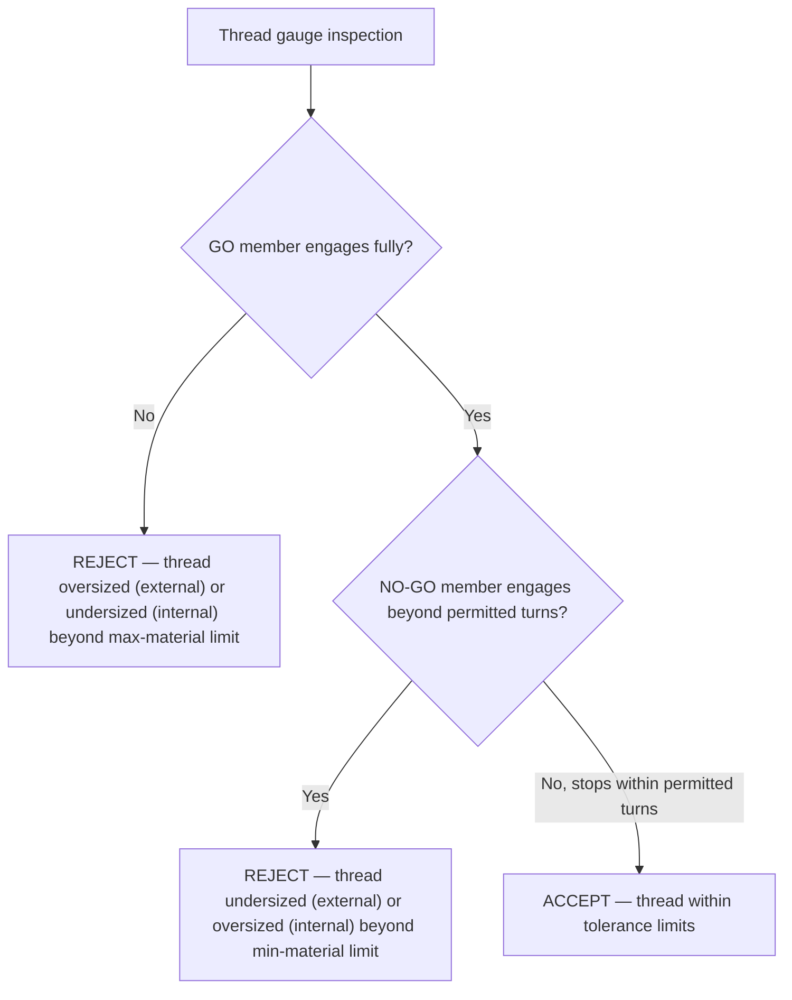

## Thread Plug and Ring Gauges

### Overview

Thread plug and ring gauges are fixed-limit functional gages used to inspect internal and external screw threads respectively, verifying that a thread's dimensional and geometric characteristics fall within specified limits through a direct go/no-go engagement check rather than individual dimensional measurement. They are the primary shop-floor tool for high-volume thread inspection, functioning on the same fixed-limit gaging principle as functional gages for GD&T-toleranced features.

### Basic Classification

| Gauge Type | Inspects | Applied To |
| --- | --- | --- |
| Thread plug gauge | Internal threads | Tapped holes, nuts, threaded bores |
| Thread ring gauge | External threads | Bolts, screws, threaded shafts |

### Go and No-Go Members

**Key Points**

- Every thread gauge set consists of two members: a **GO** member and a **NO-GO** (NOT GO) member, either as a double-ended single gauge or as two separate gauges
- **GO member:** sized at the maximum-material limit of the thread's tolerance range; it must thread fully onto (ring) or into (plug) the mating part through its complete length of engagement, verifying the thread is not oversized (external) or undersized (internal) beyond the maximum-material condition
- **NO-GO member:** sized at the minimum-material limit; it should NOT thread past a few turns (typically limited to 1–3 turns of engagement per relevant standard) onto/into the mating part, verifying the thread is not undersized (external) or oversized (internal) beyond the minimum-material condition
- A conforming part passes GO fully and fails NO-GO (beyond the permitted turns) — both conditions must be satisfied for acceptance

### GO/NO-GO Logic Diagram

### Thread Plug Gauge Construction

**Key Points**

- A cylindrical gauge body machined with the external thread form corresponding to the internal thread being checked
- **GO plug:** full-form thread, full engagement length, checks pitch diameter at maximum material (largest internal pitch diameter) combined with an effective check of major diameter and thread form
- **NO-GO plug:** typically a truncated or modified thread form (often with a reduced crest, sometimes just a few threads) designed to check minor pitch diameter limit specifically, minimizing interference from other thread elements
- Handle typically marked with thread designation, class of fit, and GO/NO-GO identification (often a groove around the NO-GO member per convention)

### Thread Ring Gauge Construction

**Key Points**

- An annular gauge with an internal thread form corresponding to the external thread being checked
- **GO ring:** full-form internal thread, checks that the external thread's pitch diameter, major diameter, and form fall within the maximum-material limit
- **NO-GO ring:** checks the minimum-material pitch diameter limit
- Ring gauges typically include a **setting mechanism** — most commonly a split ring body with an adjusting screw — allowing the gauge to be periodically calibrated/reset against a certified **thread setting plug** to compensate for wear, since ring gauge threads (being internal and enclosed) cannot be directly measured with conventional external measuring tools

### Thread Setting Plugs

**Key Points**

- A master reference gauge used specifically to calibrate/verify adjustable thread ring gauges, since a ring gauge's internal thread cannot be measured directly with standard external thread measurement tools (thread micrometers, three-wire method)
- Setting plugs are typically supplied in a matched GO/NO-GO pair corresponding to the ring gauge's GO/NO-GO limits, and are themselves calibrated against traceable standards
- Non-adjustable (solid) ring gauges do not use setting plugs for calibration but instead require full replacement or specialized optical/CMM-based thread measurement when wear exceeds tolerance, since they cannot be mechanically re-adjusted

### Wear Allowance

**Key Points**

- Thread gauges, like other fixed-limit gauges, are permitted a defined **wear allowance** beyond the nominal GO/NO-GO limits, recognizing that repeated engagement gradually wears the gauge thread surfaces
- Separate **New (unworn)** and **Wear** limits are specified per applicable standard (e.g., ASME B1.2 for Unified threads, ISO 1502 for metric threads), with the gauge remaining acceptable for use until it wears past the wear limit
- Periodic recalibration or replacement is required once a gauge's actual condition is measured (or, for adjustable rings, reset) to exceed its permitted wear allowance

### Class of Fit and Gauge Tolerance Classes

**Key Points**

- Gauge tolerance limits are specifically defined relative to the thread's class of fit (e.g., Unified 2A/2B, 3A/3B; Metric 6g/6H, etc.) — a gauge set is manufactured and specified for one particular class of fit and thread designation, not universally applicable across classes
- Tighter classes of fit (e.g., Class 3A/3B) require correspondingly tighter gauge tolerances, increasing gauge manufacturing cost and reducing available wear allowance relative to looser classes

### Example — Inspection Procedure

Inspecting a tapped hole specified as `1/2-13 UNC-2B`:

1. Select the GO plug gauge marked `1/2-13 UNC-2B GO`
2. Thread the GO plug into the tapped hole by hand — it must thread through the full depth of the hole without binding
3. Select the NO-GO plug gauge marked `1/2-13 UNC-2B NO-GO` (typically identified by an identification groove)
4. Attempt to thread the NO-GO plug into the hole — it should not advance beyond the permitted 1–3 turns (specific allowable turns per applicable standard)
5. If both conditions are satisfied, the tapped hole's thread is accepted as within the specified 2B tolerance class

### What Thread Gauges Verify (and Do Not)

**Key Points**

- Thread gauges primarily verify **pitch diameter** limits (the functionally dominant thread dimension) along with an implicit, composite check of thread form, lead accuracy, and major/minor diameter to the extent that gross errors in these elements would prevent proper GO engagement or allow excessive NO-GO engagement
- They do **not** provide precise numerical values for pitch diameter, lead error, or flank angle error — only pass/fail determination, similar to the diagnostic limitation of functional gages for GD&T features
- For detailed dimensional data (e.g., root-causing a thread manufacturing problem), variable methods such as the three-wire method, thread micrometers, or optical/CMM thread measurement are required instead

### Thread Gauge vs. Variable Thread Measurement

| Aspect | Thread Plug/Ring Gauge | Variable Measurement (3-wire, optical, CMM) |
| --- | --- | --- |
| Output | Pass/fail (GO/NO-GO) | Precise numerical dimensions |
| Speed | Very fast | Slower, more setup |
| Diagnostic value | None | High — supports root cause analysis |
| Cost per inspection | Low (after gauge purchase) | Higher (equipment time, skilled operator) |
| Best suited for | High-volume production, receiving inspection | Process development, troubleshooting, first-article inspection |

### Standards Governing Thread Gauges

**Key Points**

- **ASME B1.2:** Gauges and Gauging for Unified Inch Screw Threads — defines GO/NO-GO limits, wear allowances, and gauge design for UN/UNC/UNF/UNEF thread series
- **ISO 1502:** ISO general purpose metric screw threads — Gauges and gauging — defines corresponding requirements for metric (ISO 68/965) threads
- Both standards specify gauge tolerance classes correlated to the corresponding thread tolerance classes, along with permitted wear limits and calibration/setting practices

### Common Applications and Limitations

- Widely used in high-volume fastener manufacturing, receiving inspection of purchased threaded components, and production floor verification of tapped holes and threaded shafts
- Less suited to low-volume, prototype, or R&D work where the upfront gauge cost cannot be justified, or where detailed dimensional data (rather than pass/fail) is required for process development
- [Inference] As with other functional/fixed-limit gaging, the economic break-even point favoring gauge purchase over variable measurement generally shifts with production volume, though the specific volume threshold depends on gauge cost, part value, and inspection frequency in a given operation.

**Related Topics**

- Screw thread terminology and elements (pitch diameter, major/minor diameter)
- Three-wire method for thread measurement
- Functional gauging concepts (general GD&T parallel)
- Thread classes of fit (Unified and Metric systems)
- ASME B1.2 and ISO 1502 gauge standards
- Gauge calibration and wear allowance practices