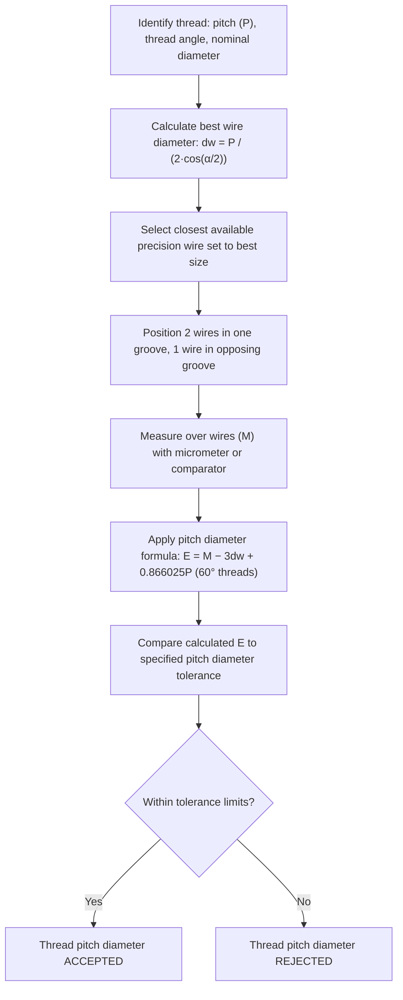

## Three Wire Method for Pitch Diameter

### Overview

The three wire method is a precision indirect measurement technique for determining the pitch diameter of an external screw thread, using three precision cylindrical wires of equal diameter positioned in the thread grooves and measured over their outer surfaces with a micrometer or comparator. It remains one of the most accurate and widely used traditional methods for verifying thread pitch diameter, providing a variable (numerical) result rather than the pass/fail output of a thread gauge.

### Fundamental Principle

**Key Points**

- Three wires of identical, precisely known diameter are placed in the thread groove — two wires in one groove on one side of the thread, and a single wire in the opposing groove on the other side, 180° apart
- The **measurement over the wires (M)** is taken with a micrometer or comparator across the outer tangent points of the wires
- Because the wire diameter, thread angle, and pitch are known, the pitch diameter can be calculated from the measurement over wires using a derived trigonometric formula
- This is a **three-wire** setup (most common and most accurate, since it self-centers on the thread axis); a **two-wire** variant exists but requires the wires to be manually held in alignment, making it less accurate and less commonly used for precision work

### Three Wire Setup Diagram (svg_diagram)

<svg xmlns="http://www.w3.org/2000/svg" viewBox="0 0 700 320" font-family="Arial, sans-serif">
<text x="350" y="20" text-anchor="middle" font-size="15" font-weight="bold">Three Wire Method Setup (svg_diagram)</text>
<path d="M100,80 L150,140 L100,200 L150,260 L100,300" stroke="#333" stroke-width="2" fill="none" />
<path d="M300,80 L250,140 L300,200 L250,260 L300,300" stroke="#333" stroke-width="2" fill="none" />
<circle cx="115" cy="105" r="16" fill="#2980b9" opacity="0.7" stroke="#1a5276" stroke-width="1.5" />
<circle cx="115" cy="225" r="16" fill="#2980b9" opacity="0.7" stroke="#1a5276" stroke-width="1.5" />
<circle cx="285" cy="165" r="16" fill="#c0392b" opacity="0.7" stroke="#922b21" stroke-width="1.5" />

<text x="115" y="70" text-anchor="middle" font-size="9">Wire 1</text>

<text x="115" y="255" text-anchor="middle" font-size="9">Wire 2</text>

<text x="330" y="170" text-anchor="middle" font-size="9">Wire 3 (opposite side)</text>

<line x1="60" y1="105" x2="60" y2="225" stroke="#27ae60" stroke-width="1.5" marker-start="url(#a)" marker-end="url(#a)" />
<line x1="60" y1="105" x2="330" y2="165" stroke="#8e44ad" stroke-width="1.5" stroke-dasharray="4,2" />
<text x="380" y="130" font-size="10" fill="#8e44ad">Measurement over wires (M)</text>
<line x1="200" y1="60" x2="200" y2="300" stroke="#2c3e50" stroke-width="1" stroke-dasharray="1,1" />
<text x="215" y="65" font-size="9">Thread axis</text>
</svg>

### Wire Diameter Selection — Best Wire Size

**Definition:** The "best wire size" is the wire diameter that contacts the thread flanks precisely at the pitch line, providing the most accurate measurement and minimizing sensitivity to flank angle error.

$$d_{w,best} = \frac{P}{2\cos(\alpha/2)}$$

where $P$ is the pitch and $\alpha$ is the full thread angle (60° for Unified/Metric threads).

**Example**

For a thread with pitch $P = 1.5$ mm, thread angle $\alpha = 60°$:

$$d_{w,best} = \frac{1.5}{2\cos(30°)} = \frac{1.5}{2 \times 0.8660} = \frac{1.5}{1.732} \approx 0.866\text{ mm}$$

**Key Points**

- Standard wire sets are manufactured in graduated sizes for common thread pitches, allowing selection of the closest available size to the calculated best-wire diameter
- Wires significantly smaller or larger than best-wire size increase measurement sensitivity to flank angle errors, reducing accuracy — usable wire size range is typically bounded (commonly cited practical range roughly $0.56P$ to $0.9P$, though [Inference] exact usable bounds vary by reference source and applied thread standard).

### Measurement Over Wires Formula — 60° Thread Form

For the standard 60° thread angle (Unified and Metric threads), the pitch diameter is calculated as:

$$E = M - 3d_w + \frac{3\sqrt{3}}{2}P$$

Wait — the standard, more precisely stated form used in practice:

$$E = M - 3d_w + 0.866025P$$

where:

- $E$ = pitch diameter (simple/functional, depending on measurement conditions)
- $M$ = measurement over the three wires
- $d_w$ = actual wire diameter used
- $P$ = thread pitch

**General Formula (any thread angle $\alpha$)**

$$E = M - d_w\left(1 + \frac{1}{\sin(\alpha/2)}\right) + \frac{P}{2}\cot(\alpha/2)$$

For $\alpha = 60°$, this general formula reduces to the standard 60°-specific formula above.

### Worked Example

A Unified thread `1/2-13 UNC` is measured using the three-wire method with best-size wires.

**Given:**

- $P = 1/13$ in $= 0.076923$ in
- Thread angle $\alpha = 60°$
- Best wire diameter: $d_w = \frac{P}{2\cos(30°)} = \frac{0.076923}{1.7320} \approx 0.04442$ in
- Measured $M = 0.5252$ in (measurement over wires, from micrometer reading)

**Calculation:**

$$E = M - 3d_w + 0.866025P$$

$$E = 0.5252 - 3(0.04442) + 0.866025(0.076923)$$

$$E = 0.5252 - 0.13326 + 0.06662$$

$$E = 0.45856\text{ in}$$

The calculated pitch diameter of approximately $0.4586$ in is then compared against the specified pitch diameter tolerance range for the `1/2-13 UNC-2A` class of fit to determine conformance.

### Measurement Calculation Flow

### Sources of Measurement Error

**Key Points**

- **Wire diameter error:** any deviation of the actual wire diameter from its certified/assumed value directly propagates into the pitch diameter calculation, since $d_w$ appears explicitly in the formula
- **Flank angle error:** if the thread's actual flank angle deviates from nominal (60°), non-best-size wires will contact the flanks away from the pitch line, introducing error — this sensitivity is minimized (though not eliminated) by using best-wire size
- **Micrometer/comparator accuracy and calibration:** standard sources of measurement uncertainty applicable to any precision length measurement
- **Wire cleanliness and seating:** debris, burrs, or improper wire seating in the thread groove introduces measurement error; wires must be clean and properly seated before each reading
- **Helix angle effects:** at larger helix angles (coarse pitch relative to diameter, or multi-start threads), the wires do not sit perfectly perpendicular to the thread axis, introducing a small geometric error; correction factors exist for cases where helix angle effects are significant

### Advantages and Limitations

**Advantages**

- High accuracy and repeatability when performed correctly with best-size wires and calibrated equipment
- Provides a precise numerical pitch diameter value, unlike gauge-based go/no-go inspection
- Well-established, standardized method with widely published formulas and reference wire size tables
- Suitable for verifying gauge calibration, first-article inspection, and process troubleshooting

**Limitations**

- Slower and requires more operator skill than functional gauge inspection — unsuitable for high-volume 100% production inspection
- Only measures external threads directly; internal threads cannot be measured with the three-wire method and require alternative techniques (e.g., specialized internal thread gauges, optical/CMM methods)
- Requires a matched set of precision wires appropriate to the specific pitch being measured, along with a calibrated micrometer or comparator capable of the required resolution

### Relationship to Simple vs. Functional Pitch Diameter

**Key Points**

- The three-wire method as described measures **simple pitch diameter** — the pitch diameter derived purely from the thread's actual profile geometry at a single cross-section
- It does not directly capture the composite effect of lead error, flank angle error, and taper across the full thread engagement length the way a functional (composite) thread gauge does
- [Inference] For applications where composite functional fit (accounting for cumulative lead and angle error over the engagement length) is the primary concern, functional thread gauging is generally considered complementary to, rather than a full substitute for, three-wire simple pitch diameter measurement — many practitioners use both together for a complete picture of thread quality.

**Related Topics**

- Screw thread terminology and elements (pitch diameter, thread angle, pitch)
- Thread plug and ring gauges (functional/composite thread inspection)
- Simple vs. functional diameter concepts
- Wire diameter selection tables for standard thread pitches
- Micrometer and comparator measurement techniques
- Helix angle and its effect on thread measurement accuracy