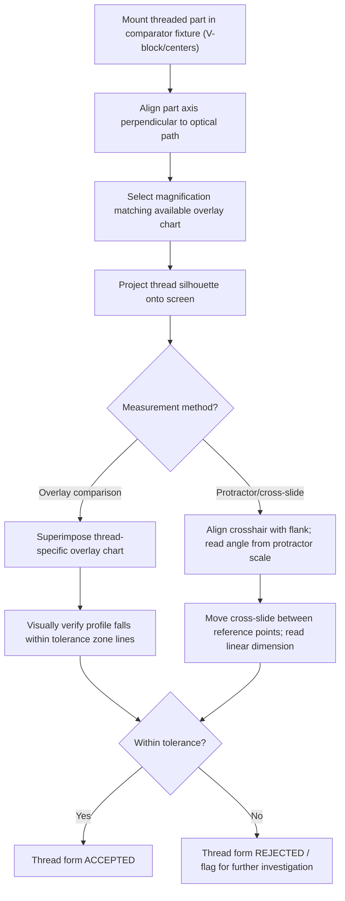

## Thread Profile Projection

### Overview

Thread profile projection is an optical inspection method that projects a magnified silhouette (shadow) of a screw thread onto a viewing screen or comparator chart, allowing direct visual and dimensional comparison of the actual thread form against an overlay chart or calibrated measurement system. It is one of the primary non-contact methods for verifying thread form, angle, pitch, and crest/root condition, commonly performed using an optical (profile) comparator.

### Fundamental Principle

**Key Points**

- A collimated light source projects a magnified shadow image of the thread's silhouette onto a ground-glass screen, using the optical comparator's lens system to achieve precise, distortion-controlled magnification (commonly 10×, 20×, 31.25×, 50×, or 100×, depending on the instrument and feature size)
- The thread is typically mounted between centers or in a V-block fixture, oriented so its axis is perpendicular to the optical path, projecting a true axial-plane profile
- The projected image is compared against a **thread form overlay chart** (a transparent template printed with the nominal thread profile, angle lines, and tolerance zones at the corresponding magnification) or measured directly using the comparator's cross-slide and protractor scales

### Optical Comparator Setup Diagram (svg_diagram)

<svg xmlns="http://www.w3.org/2000/svg" viewBox="0 0 780 300" font-family="Arial, sans-serif">
<text x="390" y="20" text-anchor="middle" font-size="15" font-weight="bold">Optical Profile Projection Setup (svg_diagram)</text>
<rect x="40" y="120" width="30" height="60" fill="#f1c40f" opacity="0.6" stroke="#333" />
<text x="55" y="200" text-anchor="middle" font-size="9">Light Source</text>
<path d="M70,130 L140,140 L140,160 L70,170 Z" fill="#f1c40f" opacity="0.3" />
<line x1="140" y1="110" x2="140" y2="190" stroke="#2c3e50" stroke-width="2" />
<path d="M140,140 L120,150 L140,160 L160,150 Z" fill="#7f8c8d" stroke="#333" />
<text x="140" y="205" text-anchor="middle" font-size="9">Threaded Part (in V-block)</text>
<rect x="220" y="80" width="60" height="120" fill="none" stroke="#333" stroke-width="2" rx="4" />
<text x="250" y="215" text-anchor="middle" font-size="9">Lens System</text>
<path d="M280,130 L500,90 L500,210 L280,170 Z" fill="#3498db" opacity="0.15" />
<rect x="500" y="60" width="200" height="180" fill="#ecf0f1" stroke="#333" stroke-width="2" />
<text x="600" y="55" text-anchor="middle" font-size="10" font-weight="bold">Viewing Screen</text>
<path d="M540,110 L570,150 L540,190 L570,150" stroke="#c0392b" stroke-width="2" fill="none" />
<line x1="540" y1="80" x2="540" y2="220" stroke="#8e44ad" stroke-width="1" stroke-dasharray="4,2" />
<text x="620" y="100" font-size="9">Overlay chart</text>
<text x="620" y="115" font-size="9">(angle lines,</text>
<text x="620" y="130" font-size="9">tolerance zones)</text>
</svg>

### Elements Verified by Profile Projection

**Key Points**

- **Thread (flank) angle:** the included angle between the two flanks, checked against the nominal angle lines on the overlay chart (e.g., 60° for Unified/Metric, 29° for Acme, 55° for Whitworth)
- **Half angle deviations:** asymmetry between the two flank angles relative to the thread axis, revealing form-cutting or tool-wear errors
- **Crest and root form:** flat, rounded, or truncated crest/root condition, verifying compliance with the specified thread form standard
- **Pitch (visual/approximate):** successive thread crest-to-crest spacing can be visually compared against the chart's pitch markings, though precise pitch measurement is typically better performed by other means (e.g., pitch measuring machines) for high-precision requirements
- **General thread form defects:** visible tool marks, burrs, chips, or gross form irregularities not necessarily captured by numerical dimensional checks alone

### Overlay Chart Method

**Key Points**

- A transparent overlay chart, printed at the same magnification as the projector, is superimposed over (or aligned with) the projected shadow image
- The chart contains the nominal thread profile along with tolerance zone boundary lines, allowing direct visual pass/fail assessment: if the projected thread profile falls within the tolerance lines on the chart, the form is acceptable
- Overlay charts are thread-form-specific and magnification-specific — a 60° Unified thread chart at 20× magnification cannot be used for a 55° Whitworth thread or at a different magnification without introducing gross error

### Rotating/Protractor Stage Measurement

**Key Points**

- Many optical comparators feature a rotating stage with a graduated protractor scale, allowing the operator to align a crosshair or reference line with a projected flank and directly read the flank angle in degrees
- This method provides a more precise numerical angle reading than pure visual overlay comparison, useful when documenting actual measured angle values rather than simple pass/fail
- Combined with the comparator's calibrated cross-slide (X-Y measuring table), linear dimensions such as thread depth, crest width, or root width can also be measured directly by moving the crosshair between reference points on the projected image

### Measurement Workflow

### Advantages

- **Non-contact:** avoids surface damage or wear on delicate or precision-finished thread surfaces that contact-based methods (three-wire, indicating gauges) might risk
- **Direct visual verification of form:** uniquely suited to catching form-related defects (crest/root condition, tool marks, chatter, flank straightness) that dimensional-only methods like the three-wire method do not directly reveal
- **Effective for both internal and external threads:** unlike the three-wire method, profile projection can be applied to internal threads by sectioning the part or using specialized internal-viewing attachments, though internal thread projection is inherently more limited by optical access
- **Good for first-article and root-cause inspection:** the visual nature makes it well suited to diagnosing the specific cause of a thread nonconformance (e.g., distinguishing a flank angle error from a pitch error at a glance)

### Limitations

- **Two-dimensional projection:** captures the thread profile only in the plane of projection (typically the axial plane at the point of tangency); does not directly capture pitch diameter or full 3D form the way three-wire measurement or CMM scanning does
- **Operator-dependent for visual overlay methods:** alignment and interpretation of overlay comparisons carry some subjectivity compared to fully numerical measurement methods
- **Requires part-specific and magnification-specific overlay charts:** a library of charts must be maintained for different thread forms and sizes, or reliance shifted to the rotating protractor/cross-slide method for less common thread types
- **Fixturing precision is critical:** any misalignment of the part axis relative to the optical path introduces distortion into the projected profile, potentially masking or exaggerating actual form errors
- **Sectioning required for detailed internal thread projection:** limits practicality for internal thread form inspection compared to external threads, where the full profile is directly accessible

### Profile Projection vs. Other Thread Inspection Methods

| Aspect | Profile Projection | Three-Wire Method | Thread Plug/Ring Gauge |
| --- | --- | --- | --- |
| Primary output | Visual form + angle verification | Numerical pitch diameter | Pass/fail (composite) |
| Contact | Non-contact | Contact (wires) | Contact (full engagement) |
| Best for | Form defects, angle verification, root cause | Precise pitch diameter value | High-volume production check |
| Internal threads | Limited (sectioning needed) | Not applicable | Directly applicable (plug gauge) |
| Speed | Moderate | Moderate to slow | Fast |

### Common Applications

- First-article and incoming inspection of precision threaded components (aerospace, medical device fasteners)
- Root-cause investigation of thread nonconformances flagged by gauge or three-wire inspection
- Verification of non-standard or specialty thread forms (Acme, buttress, worm) where standard fixed gauges may not be readily available
- Tool and die shop verification of thread-cutting tool form and wear

**Related Topics**

- Screw thread terminology and elements (thread angle, crest, root, flank)
- Three wire method for pitch diameter
- Thread plug and ring gauges
- Optical comparator general principles and magnification selection
- Pitch measuring machines for precision lead/pitch inspection
- Non-standard thread forms (Acme, buttress, worm threads)