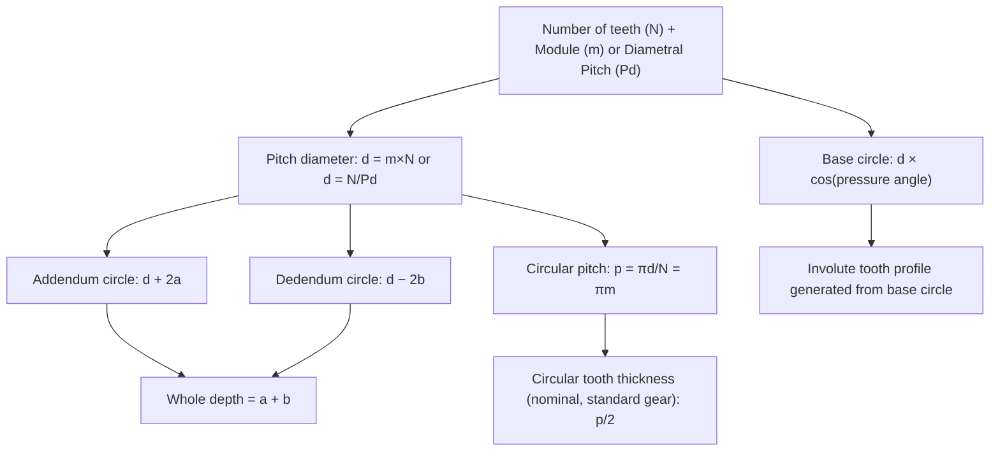

## Gear Terminology and Tooth Elements

### Overview

Gear terminology defines the standardized vocabulary describing gear tooth geometry, essential for gear design, manufacturing, and metrological inspection. This content follows AGMA (American Gear Manufacturers Association) and ISO 21771 conventions for involute spur and helical gear nomenclature, which form the basis for most gear inspection and gaging terminology.

### Primary Reference Circles

**Key Points**

- **Pitch circle:** the theoretical circle on which tooth thickness and spacing calculations are based, representing the imaginary rolling circle of the gear — the fundamental reference circle from which most gear dimensions derive
- **Base circle:** the circle from which the involute tooth profile curve is geometrically generated; the involute curve is mathematically defined as the path traced by a point on a taut string unwound from this circle
- **Addendum circle (outside diameter):** the circle bounding the outer tips of the teeth
- **Dedendum circle (root diameter):** the circle bounding the bottom of the tooth spaces (roots)
- **Clearance circle:** a circle representing the clearance between the addendum circle of one gear and the dedendum circle of its mate

### Gear Tooth Cross-Section (svg_diagram)

<svg xmlns="http://www.w3.org/2000/svg" viewBox="0 0 700 340" font-family="Arial, sans-serif">
<text x="350" y="20" text-anchor="middle" font-size="15" font-weight="bold">Gear Tooth Elements (svg_diagram)</text>
<circle cx="350" cy="180" r="140" fill="none" stroke="#c0392b" stroke-width="1" stroke-dasharray="2,2" />
<text x="500" y="80" font-size="9" fill="#c0392b">Addendum (outside) circle</text>
<circle cx="350" cy="180" r="110" fill="none" stroke="#2980b9" stroke-width="1.5" />
<text x="480" y="115" font-size="9" fill="#2980b9">Pitch circle</text>
<circle cx="350" cy="180" r="95" fill="none" stroke="#27ae60" stroke-width="1" stroke-dasharray="4,2" />
<text x="470" y="145" font-size="9" fill="#27ae60">Base circle</text>
<circle cx="350" cy="180" r="75" fill="none" stroke="#8e44ad" stroke-width="1" stroke-dasharray="2,2" />
<text x="460" y="175" font-size="9" fill="#8e44ad">Dedendum (root) circle</text>
<g transform="translate(350,180)">
<path d="M0,-140 L-8,-140 Q-12,-115 -10,-95 Q-8,-80 -6,-75 L-6,-75 L6,-75 Q8,-80 10,-95 Q12,-115 8,-140 Z" fill="#f39c12" opacity="0.5" stroke="#333" stroke-width="1.5" />
</g>

<text x="358" y="55" font-size="9">Tooth</text>

<line x1="358" y1="40" x2="352" y2="50" stroke="#333" stroke-width="1" />

<text x="250" y="80" font-size="9">Tooth space</text>

<line x1="350" y1="180" x2="350" y2="40" stroke="#555" stroke-width="1" stroke-dasharray="1,2" />
<line x1="350" y1="180" x2="350" y2="105" stroke="#e67e22" stroke-width="2" />
<text x="365" y="145" font-size="9">Addendum (a)</text>
<line x1="350" y1="180" x2="350" y2="255" stroke="#e74c3c" stroke-width="2" />
<text x="365" y="220" font-size="9">Dedendum (b)</text>
</svg>

### Tooth Height Elements

**Key Points**

- **Addendum ($a$):** the radial distance from the pitch circle to the addendum (outside) circle — the height of the tooth above the pitch line
- **Dedendum ($b$):** the radial distance from the pitch circle to the dedendum (root) circle — the depth of the tooth space below the pitch line
- **Whole depth ($h_t$):** the total tooth height, $h_t = a + b$
- **Working depth:** the depth of tooth engagement between two mating gears, typically equal to the sum of the two gears' addendums when both are standard
- **Clearance ($c$):** the radial distance between the addendum circle of one gear and the dedendum circle of its mate at the point of closest approach, preventing interference at the root

### Circular and Tooth Thickness Elements

**Key Points**

- **Circular pitch ($p$):** the arc distance along the pitch circle from a point on one tooth to the corresponding point on the adjacent tooth
- **Circular tooth thickness:** the arc length of a single tooth measured along the pitch circle
- **Tooth space:** the arc length of the gap between adjacent teeth measured along the pitch circle
- **Backlash:** the clearance between mating teeth measured along the pitch circle, allowing for lubrication film, thermal expansion, and manufacturing tolerance without binding

### Module and Diametral Pitch

**Definition — Module ($m$):** the metric-system size parameter, defined as the pitch diameter divided by the number of teeth.

$$m = \frac{d}{N}$$

**Definition — Diametral Pitch ($P_d$):** the inch-system size parameter, defined as the number of teeth divided by the pitch diameter.

$$P_d = \frac{N}{d}$$

**Key Points**

- Module and diametral pitch are reciprocal-related but not directly interchangeable by simple inversion due to unit differences: $m(\text{mm}) = 25.4/P_d$
- Both parameters express relative tooth size: larger module (or smaller diametral pitch) means larger, coarser teeth; smaller module (larger diametral pitch) means smaller, finer teeth
- Gears must share the same module (or diametral pitch) and pressure angle to mesh correctly

### Pressure Angle

**Definition:** The angle between the line of action (the common tangent to the base circles, along which contact force is transmitted between meshing teeth) and a line perpendicular to the line of centers at the pitch point.

**Key Points**

- Standard pressure angles are $20°$ (most common in modern gear design) and $14.5°$ (older standard, largely legacy)
- Pressure angle affects tooth strength, contact ratio, and the minimum number of teeth achievable without undercutting — higher pressure angles generally allow stronger teeth and fewer teeth before undercutting occurs, at the cost of higher radial (separating) forces on the gear shaft/bearings

### Gear Tooth Geometry Relationships

### Involute Profile

**Key Points**

- The **involute curve** is the geometric basis of nearly all modern gear tooth profiles, defined as the path traced by the end of a taut string as it unwinds from the base circle
- Involute gears maintain a constant velocity ratio between meshing gears despite small center-distance variations — a key practical advantage over other tooth profile geometries (e.g., cycloidal), which are largely obsolete for general power transmission use
- The line of action for an involute gear pair is always tangent to both gears' base circles, and its angle relative to the pitch-point tangent line equals the pressure angle

### Line of Action and Contact Ratio

**Key Points**

- **Line of action:** the straight line along which contact force is transmitted between meshing involute teeth, tangent to both base circles
- **Contact ratio:** the average number of teeth pairs in simultaneous contact during meshing, calculated from the length of the line of action divided by the base pitch; a contact ratio greater than 1.0 ensures continuous, smooth power transmission as one tooth pair disengages before the next fully engages
- [Inference] Higher contact ratios generally correlate with smoother, quieter operation and reduced per-tooth load, though the practically achievable contact ratio depends on the specific combination of tooth count, module, and pressure angle chosen in a given gear design.

### Helix Angle (Helical Gears)

**Key Points**

- For helical gears, the **helix angle** is the angle between the tooth's helical line and the gear's axis, introducing gradual tooth engagement (versus the abrupt full-face engagement of spur gears)
- Helical gears exhibit smoother, quieter operation and higher load capacity than equivalent spur gears, at the cost of introducing axial (thrust) loading that must be accommodated by appropriate bearing selection
- **Normal module/pitch** vs. **transverse module/pitch** distinction becomes necessary for helical gears, since tooth measurements differ depending on whether they are taken perpendicular to the tooth (normal plane) or perpendicular to the gear axis (transverse plane)

### Fillet and Root Fillet Radius

**Key Points**

- **Root fillet:** the curved transition between the tooth flank and the root circle, replacing a sharp corner to reduce stress concentration at the tooth root — a critical factor in gear tooth bending fatigue life
- Fillet radius is a controlled manufacturing parameter, particularly significant in hobbed or ground gears where cutter/grinding wheel geometry directly determines the resulting fillet shape

### Summary Table of Key Gear Parameters

| Parameter | Symbol | Definition |
| --- | --- | --- |
| Pitch diameter | $d$ | Diameter of the theoretical pitch circle |
| Module | $m$ | $d/N$ (metric size parameter) |
| Diametral pitch | $P_d$ | $N/d$ (inch size parameter) |
| Number of teeth | $N$ | Count of teeth on the gear |
| Pressure angle | $\phi$ | Angle of the line of action relative to pitch-point tangent |
| Addendum | $a$ | Radial height of tooth above pitch circle |
| Dedendum | $b$ | Radial depth of tooth below pitch circle |
| Circular pitch | $p$ | Arc distance between corresponding points on adjacent teeth |
| Backlash | — | Clearance between mating teeth at the pitch circle |

**Related Topics**

- Gear tooth measurement methods (over-pins/over-wires, gear tooth calipers)
- Involute profile checking and gear tooth profile inspection
- Helical gear normal vs. transverse plane measurements
- Backlash measurement and control
- AGMA and ISO gear accuracy classes
- Base pitch and contact ratio calculations