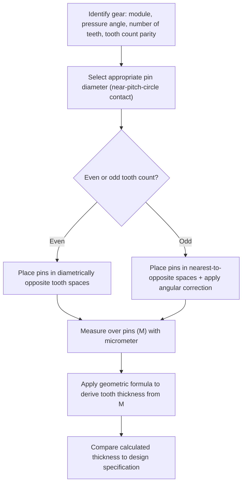

## Gear Tooth Thickness Measurement

### Overview

Gear tooth thickness measurement determines the circular or linear thickness of an individual gear tooth to verify conformance to design specifications and quantify backlash allowance. Because tooth thickness cannot generally be measured directly with simple calipers across a curved involute surface with sufficient accuracy, several specialized indirect methods have been developed: the gear tooth (chordal) caliper method, the span (base tangent) measurement method, and the over-pins/over-wires method.

### Why Direct Caliper Measurement Is Insufficient

**Key Points**

- A standard caliper measures a straight-line chordal distance, while gear tooth thickness is conventionally defined as an arc length along the pitch circle — a chordal measurement requires correction to relate it back to true circular (arc) tooth thickness
- Locating the exact pitch circle radius on a physical gear for caliper placement requires computed reference values (addendum), making the gear tooth caliper method dependent on prior calculation rather than a simple direct measurement
- These limitations motivate the alternative span measurement and over-pins methods, which avoid direct pitch-circle location and are generally more practical and repeatable for shop-floor use

### Method 1 — Gear Tooth (Chordal) Caliper

**Definition:** A specialized vernier caliper with two perpendicular scales — a vertical scale setting the depth from the tooth tip (addendum) at which measurement is taken, and a horizontal scale reading the chordal tooth thickness at that depth.

**Key Points**

- The vertical (depth) scale is set to the calculated addendum value, positioning the horizontal jaws at the pitch circle radius
- The horizontal jaws then measure the **chordal tooth thickness** — the straight-line distance between the two tooth flanks at the pitch circle, which is slightly less than the true circular (arc) tooth thickness

**Chordal Addendum and Chordal Thickness Formulas (spur gear, standard full-depth tooth)**

$$t_c = d\sin\left(\frac{90°}{N}\right)$$

$$a_c = a + \frac{d}{2}\left(1 - \cos\left(\frac{90°}{N}\right)\right)$$

where $t_c$ = chordal tooth thickness, $a_c$ = chordal addendum, $d$ = pitch diameter, $N$ = number of teeth, $a$ = addendum.

**Example**

A spur gear: module $m = 2$ mm, $N = 30$ teeth, standard addendum $a = m = 2$ mm.

$$d = mN = 2 \times 30 = 60\text{ mm}$$

$$t_c = 60\sin\left(\frac{90°}{30}\right) = 60\sin(3°) = 60 \times 0.05234 \approx 3.140\text{ mm}$$

$$a_c = 2 + \frac{60}{2}\left(1 - \cos(3°)\right) = 2 + 30(1 - 0.99863) = 2 + 30(0.00137) \approx 2.041\text{ mm}$$

The gear tooth caliper is set to a depth of $2.041$ mm, and the horizontal jaws should read approximately $3.140$ mm for a standard (theoretically perfect) tooth.

### Gear Tooth Caliper Setup Diagram (svg_diagram)

<svg xmlns="http://www.w3.org/2000/svg" viewBox="0 0 700 320" font-family="Arial, sans-serif">
<text x="350" y="20" text-anchor="middle" font-size="14" font-weight="bold">Chordal Tooth Thickness Measurement (svg_diagram)</text>
<circle cx="350" cy="180" r="130" fill="none" stroke="#2980b9" stroke-width="1" stroke-dasharray="3,2" />
<text x="480" y="90" font-size="9" fill="#2980b9">Pitch circle</text>
<g transform="translate(350,180)">
<path d="M0,-155 L-14,-130 Q-16,-105 -13,-80 L-13,-40 L13,-40 L13,-80 Q16,-105 14,-130 Z" fill="#f39c12" opacity="0.4" stroke="#333" stroke-width="1.5" />
</g>
<line x1="350" y1="50" x2="350" y2="180" stroke="#555" stroke-width="1" stroke-dasharray="1,2" />
<line x1="337" y1="50" x2="337" y2="78" stroke="#e74c3c" stroke-width="2" />
<text x="310" y="65" font-size="9" fill="#e74c3c">Chordal addendum (ac)</text>
<line x1="308" y1="78" x2="392" y2="78" stroke="#27ae60" stroke-width="2" />
<text x="350" y="70" text-anchor="middle" font-size="9" fill="#27ae60">Chordal tooth thickness (tc)</text>
<path d="M337,78 Q350,45 363,78" stroke="#8e44ad" stroke-width="1" stroke-dasharray="2,2" fill="none" />
<text x="400" y="55" font-size="8" fill="#8e44ad">true arc (slightly &gt; tc)</text>
</svg>

### Method 2 — Span Measurement (Base Tangent Method)

**Definition:** Measures the distance across a specified number of teeth using a flat-faced micrometer or caliper, contacting the involute flanks tangent to the base circle — avoiding the need to locate the pitch circle directly.

**Key Points**

- Because the measurement surfaces contact the involute flank along the line of action (tangent to the base circle), this method is **insensitive to radial positioning error**, making it more accurate and repeatable than the chordal caliper method for many applications
- The number of teeth spanned ($k$) must be selected appropriately for the gear's tooth count and pressure angle to ensure the measuring faces contact valid involute flank surfaces (not tip or root)

**Span Measurement Formula (spur gear, involute, standard)**

$$W = m\cos(\phi)\left[\pi(k - 0.5) + N\,\text{inv}(\phi)\right]$$

where $W$ = span measurement (base tangent length), $m$ = module, $\phi$ = pressure angle, $k$ = number of teeth spanned, $N$ = total number of teeth, and $\text{inv}(\phi) = \tan(\phi) - \phi$ (in radians) is the involute function.

**Recommended Number of Teeth Spanned**

$$k \approx \frac{N\phi}{180°} + 0.5$$

(rounded to the nearest whole number; standard reference tables are commonly used in practice rather than manual calculation)

**Example**

Spur gear: $m = 2$ mm, $N = 30$, $\phi = 20°$.

$$k \approx \frac{30 \times 20}{180} + 0.5 = 3.33 + 0.5 \approx 3.83 \rightarrow k = 4$$

$$\text{inv}(20°) = \tan(20°) - (20° \times \pi/180) = 0.36397 - 0.34907 = 0.01490$$

$$W = 2\cos(20°)\left[\pi(4 - 0.5) + 30(0.01490)\right]$$

$$W = 2(0.93969)\left[10.9956 + 0.4470\right] = 1.87939 \times 11.4426 \approx 21.50\text{ mm}$$

The span micrometer, set across 4 teeth, should read approximately $21.50$ mm for a standard tooth thickness.

### Method 3 — Over-Pins / Over-Wires Measurement

**Definition:** Precision pins or wires of known diameter are placed in diametrically opposite (even tooth count) or near-opposite (odd tooth count) tooth spaces, and the distance over the pins is measured with a micrometer, then converted to tooth thickness via a geometric formula.

**Key Points**

- Analogous in principle to the three-wire method for screw threads — indirect measurement via precision cylindrical elements contacting the involute flank
- **Even number of teeth:** pins are placed in diametrically opposite spaces; measurement over pins ($M$) is taken directly across the gear centerline
- **Odd number of teeth:** pins cannot be placed perfectly diametrically opposite; the measurement is taken over pins in the nearest-to-opposite spaces, requiring a trigonometric correction factor for the angular offset

**Pin Diameter Selection**

Best pin size is typically chosen so contact occurs near the pitch circle, similar in spirit to best-wire selection in thread measurement, using standard gear pin size reference tables or calculation based on module, pressure angle, and tooth count.

**Measurement Over Pins Flow**

### Method Comparison

| Method | Contact Type | Sensitivity to Radial Error | Equipment | Best Use Case |
| --- | --- | --- | --- | --- |
| Gear tooth (chordal) caliper | Tip-referenced, chordal | High — depends on accurate depth setting | Gear tooth vernier caliper | Quick shop-floor check, lower precision needs |
| Span (base tangent) | Involute flank, tangent to base circle | Low — insensitive to radial positioning | Flat-anvil micrometer/caliper | General precision inspection, most common industrial method |
| Over-pins/over-wires | Involute flank, near pitch circle | Low to moderate, depends on pin size selection | Precision pins + micrometer | High precision, verification/calibration cross-check |

### Key Sources of Error

**Key Points**

- **Chordal caliper method:** highly sensitive to correct depth-scale setting (addendum value); an incorrect depth setting shifts the measurement away from the pitch circle, introducing significant error even with a perfectly manufactured tooth
- **Span measurement:** errors in gear runout or eccentricity can affect which specific tooth pairs are measured across a full inspection, though the method itself is relatively insensitive to individual tooth radial position; profile (involute) form errors directly affect readings since measurement depends on true involute flank contact
- **Over-pins method:** pin diameter accuracy and proper seating in the tooth space (avoiding tip or root contact) are critical, analogous to wire seating concerns in thread three-wire measurement
- **Common to all methods:** backlash and manufacturing tolerance mean measured tooth thickness is compared against a specified tolerance range (not a single nominal value), reflecting the design's intended fit and backlash allowance

### Relationship to Backlash and Center Distance

**Key Points**

- Tooth thickness directly determines backlash when a gear is meshed at its specified (nominal) center distance — thinner-than-nominal teeth increase backlash; thicker-than-nominal teeth decrease it (and may cause binding if excessive)
- Tooth thickness tolerances are typically specified as a reduction from theoretical (zero-backlash) thickness, expressed either as a tolerance band on tooth thickness directly or, in some specifications, as an equivalent allowable backlash range at nominal center distance

### Helical Gear Considerations

**Key Points**

- For helical gears, tooth thickness and span measurements must distinguish between **normal plane** (perpendicular to the tooth helix) and **transverse plane** (perpendicular to the gear axis) values, since these differ due to the helix angle
- Span measurement formulas for helical gears incorporate the normal module and normal pressure angle, with the measurement itself typically still taken in a plane related to the normal section for consistency with the gear's cutting/generation reference

**Related Topics**

- Gear terminology and tooth elements (pitch circle, base circle, addendum, module)
- Involute profile checking and gear tooth profile inspection
- Backlash measurement and control
- Three wire method for pitch diameter (parallel indirect measurement principle)
- AGMA and ISO gear accuracy classes
- Helical gear normal vs. transverse plane measurement conventions