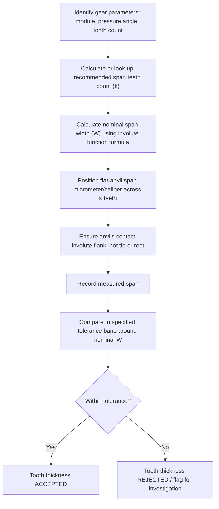

## Base Tangent Span Measurement

### Overview

Base tangent span measurement (also called the base tangent method or span measurement) is a precision technique for verifying involute gear tooth thickness by measuring the distance across multiple teeth using flat-faced measuring surfaces tangent to the involute flanks along the base circle. It is the most widely used method for precision gear tooth thickness inspection in industrial practice, favored for its insensitivity to radial positioning error compared to chordal or tip-referenced methods.

### Fundamental Principle

**Key Points**

- The measuring anvils of a span micrometer (or caliper with flat, parallel measuring faces) contact the involute tooth flanks at two points that lie along a common tangent line to the base circle — this tangent line coincides with the theoretical line of action of the involute gear
- Because the involute curve is generated as the locus of a point unwinding along a taut string from the base circle, any straight line tangent to the base circle intersects the involute profile at points whose separation is geometrically determined purely by the base circle geometry and the angular span — independent of exactly where along the tooth height the measurement anvils happen to contact
- This tangency property is what makes span measurement **insensitive to radial (in/out) positioning of the measuring instrument**, unlike the chordal (gear tooth caliper) method, which requires precise depth setting referenced from the tooth tip

### Why "Base Tangent"

**Key Points**

- The measured span ($W$) is fundamentally a length along a line tangent to the base circle — hence "base tangent" — rather than a chord or arc referenced to the pitch circle
- This distinguishes span measurement conceptually from the chordal tooth thickness method (pitch-circle referenced) and provides its principal metrological advantage: measurement accuracy does not depend on correctly locating the pitch circle radius on the physical part

### Base Tangent Measurement Setup (svg_diagram)

<svg xmlns="http://www.w3.org/2000/svg" viewBox="0 0 700 340" font-family="Arial, sans-serif">
<text x="350" y="20" text-anchor="middle" font-size="14" font-weight="bold">Base Tangent Span Across Multiple Teeth (svg_diagram)</text>
<circle cx="350" cy="190" r="130" fill="none" stroke="#27ae60" stroke-width="1" stroke-dasharray="3,2" />
<text x="500" y="100" font-size="9" fill="#27ae60">Base circle</text>
<circle cx="350" cy="190" r="150" fill="none" stroke="#2980b9" stroke-width="1" stroke-dasharray="2,2" opacity="0.6" />
<text x="520" y="75" font-size="9" fill="#2980b9">Pitch circle</text>
<g stroke="#333" stroke-width="1.2" fill="#f39c12" opacity="0.35">
<path d="M350,40 L342,65 Q340,90 344,110 L356,110 Q360,90 358,65 Z" />
<path d="M420,55 L405,78 Q398,100 398,120 L410,124 Q418,105 428,85 Z" transform="rotate(20 350 190)" />
<path d="M470,90 L448,105 Q436,125 432,145 L443,152 Q456,135 472,118 Z" transform="rotate(40 350 190)" />
<path d="M500,140 L472,145 Q456,160 448,178 L458,188 Q476,175 496,165 Z" transform="rotate(60 350 190)" />
</g>
<line x1="270" y1="70" x2="470" y2="220" stroke="#c0392b" stroke-width="2" />
<text x="480" y="230" font-size="9" fill="#c0392b">Tangent line to base circle</text>
<line x1="280" y1="80" x2="300" y2="65" stroke="#8e44ad" stroke-width="2" />
<line x1="440" y1="195" x2="460" y2="180" stroke="#8e44ad" stroke-width="2" />
<text x="360" y="130" text-anchor="middle" font-size="9" fill="#8e44ad">W (span over k teeth)</text>
</svg>

### Span Measurement Formula — Spur Gears

$$W = m\cos(\phi)\left[\pi(k - 0.5) + N\,\text{inv}(\phi)\right]$$

where:

- $W$ = base tangent span (measurement across $k$ teeth)
- $m$ = module
- $\phi$ = pressure angle
- $k$ = number of teeth spanned
- $N$ = total number of teeth on the gear
- $\text{inv}(\phi) = \tan(\phi) - \phi$ (involute function, $\phi$ in radians)

### Selecting the Number of Teeth Spanned

**Key Points**

- $k$ must be chosen so the measuring anvils contact valid involute flank surface on both sides — spanning too few teeth risks contact near the root (non-involute or undercut region); spanning too many risks contact near the tip
- A commonly used approximation for the appropriate span teeth count:

$$k \approx \frac{N\phi}{180°} + 0.5 \quad \text{(rounded to nearest whole number)}$$

- In practice, standard published span tables (correlating module, pressure angle, and tooth count to recommended $k$ and nominal $W$) are commonly used rather than manual calculation for routine inspection, though the underlying formula remains as shown

### Worked Example

Spur gear: module $m = 3$ mm, pressure angle $\phi = 20°$, number of teeth $N = 40$.

**Step 1 — Determine span teeth count**

$$k \approx \frac{40 \times 20}{180} + 0.5 = 4.44 + 0.5 \approx 4.94 \rightarrow k = 5$$

**Step 2 — Calculate involute function**

$$\text{inv}(20°) = \tan(20°) - (20 \times \pi/180) = 0.36397 - 0.34907 = 0.01490$$

**Step 3 — Calculate nominal span**

$$W = 3\cos(20°)\left[\pi(5-0.5) + 40(0.01490)\right]$$

$$W = 3(0.93969)\left[14.1372 + 0.5960\right]$$

$$W = 2.81907 \times 14.7332 \approx 41.53\text{ mm}$$

The span micrometer, positioned across 5 teeth, should read approximately $41.53$ mm on a gear with theoretically standard (zero-backlash-allowance) tooth thickness. Actual acceptable readings are compared against the specified tolerance band around this nominal value.

### Measurement Procedure

### Instrumentation

**Key Points**

- **Span (base tangent) micrometer:** a specialized micrometer with disc-shaped or specially profiled flat measuring anvils sized to reach across multiple teeth without interference from adjacent tooth tips
- **Vernier or digital caliper with sufficiently wide flat jaws:** usable for coarser-pitch gears where standard caliper jaw geometry can span the required number of teeth without interference
- Measurement equipment must have sufficiently flat, parallel measuring faces, since any deviation from true flatness directly compromises the tangency assumption underlying the method's accuracy

### Advantages Over Chordal (Tooth Caliper) Method

- **Radial positioning insensitivity:** no dependency on accurately setting a depth-from-tip reference, removing a significant source of chordal-method error
- **Generally faster and more repeatable** once the correct span teeth count and nominal value are established, since no separate depth-setting step is required
- **Better suited to gears with tip modifications or chamfers**, since the measurement does not rely on the exact tip (addendum circle) location the way chordal addendum setting does

### Limitations

- **Requires sufficient tooth count for valid span:** very low tooth-count gears or gears with a small number of teeth relative to the required span may not permit a valid multi-tooth span without anvil interference at the tip or root — alternative methods (over-pins) may be required in such cases
- **Sensitive to profile (involute) form errors:** since accuracy depends on true tangency to the base circle, deviations in the actual involute profile (rather than the exact tooth thickness) can influence readings
- **Internal gears cannot generally use external span micrometers directly** — measuring internal gear tooth thickness/space typically requires alternative methods (e.g., over-pins/over-balls adapted for internal gear geometry)
- **Helical gears require normal-plane parameters:** the span formula must use the normal module and normal pressure angle rather than transverse values, and physical measurement orientation must account for the helix angle

### Helical Gear Adaptation

**Key Points**

- For helical gears, the base tangent formula is applied using the **normal module** ($m_n$) and **normal pressure angle** ($\phi_n$) in place of the spur gear's module and pressure angle, since the involute geometry relevant to flank tangency is properly defined in the normal plane
- Physical span measurement on a helical gear is still typically performed with the measuring anvils oriented appropriately relative to the helix, per the specific instrument and standard practice being followed

### Relationship to Other Tooth Thickness Methods

| Aspect | Base Tangent Span | Chordal (Gear Tooth Caliper) | Over-Pins/Over-Wires |
| --- | --- | --- | --- |
| Reference geometry | Tangent to base circle | Chord at pitch circle | Contact near pitch circle via pins |
| Radial position sensitivity | Low | High | Low to moderate |
| Typical precision | High | Moderate | High |
| Common industrial use | Most common for precision spur/helical gears | Simpler shop-floor checks | Verification/cross-check, small tooth counts |

**Related Topics**

- Gear terminology and tooth elements (base circle, pitch circle, involute profile)
- Gear tooth thickness measurement (parent topic covering all three methods)
- Over-pins/over-wires gear measurement
- Involute function and its role in gear geometry calculations
- Helical gear normal vs. transverse plane conventions
- AGMA and ISO gear accuracy classes and tolerance standards