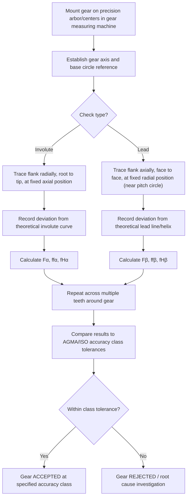

## Involute and Lead Profile Checking

### Overview

Involute and lead profile checking are precision gear inspection methods that measure the actual deviation of a tooth's flank geometry from its theoretical ideal form, performed on a dedicated gear checking machine (involute/lead tester) or a CNC gear measuring center. Involute checking evaluates the tooth profile in the transverse plane (perpendicular to the gear axis); lead checking evaluates the tooth trace along the face width (parallel to the gear axis), together forming the core of modern quantitative gear accuracy inspection per AGMA and ISO standards.

### Involute Profile Checking

**Definition:** Involute checking measures the deviation of the actual tooth flank profile, traced radially from root to tip at a fixed axial position, from the theoretical involute curve generated from the gear's base circle.

**Key Points**

- A stylus or probe traces the tooth flank along the involute direction (radially, following the theoretical curve) while the gear is rotated in a coordinated (synchronized) motion that keeps the probe tracking the true involute path
- The resulting trace is compared against the theoretical involute curve, and the deviation is plotted as a **profile chart** — typically a nearly straight line for a perfect involute, with deviations appearing as departures from that reference line
- Measurement is confined to the **usable profile length** — excluding the root fillet region (non-involute, generated by the cutting tool tip) and any tip chamfer/relief

### Involute Profile Chart Elements

**Key Points**

- **Total profile deviation ($F_\alpha$):** the total band width containing the entire measured profile trace across the evaluation range
- **Profile form deviation ($f_{f\alpha}$):** the deviation of the actual profile shape from the best-fit theoretical involute, after removing any consistent slope (angle) error — captures waviness, local irregularities, or curvature errors
- **Profile slope deviation ($f_{H\alpha}$):** the difference in pressure angle between the actual profile's best-fit straight line and the theoretical involute — a systematic angular error affecting the entire flank uniformly

### Involute Deviation Chart (svg_diagram)

<svg xmlns="http://www.w3.org/2000/svg" viewBox="0 0 700 300" font-family="Arial, sans-serif">
<text x="350" y="20" text-anchor="middle" font-size="14" font-weight="bold">Involute Profile Deviation Chart (svg_diagram)</text>
<line x1="80" y1="250" x2="620" y2="250" stroke="#333" stroke-width="1.5" />
<line x1="80" y1="250" x2="80" y2="60" stroke="#333" stroke-width="1.5" />
<text x="350" y="275" text-anchor="middle" font-size="10">Roll length / radius (root → tip)</text>
<text x="30" y="155" text-anchor="middle" font-size="10" transform="rotate(-90 30 155)">Deviation (μm)</text>
<line x1="80" y1="160" x2="620" y2="160" stroke="#999" stroke-dasharray="2,2" />
<text x="600" y="150" font-size="9">Zero (theoretical involute)</text>
<path d="M100,160 L150,155 L200,158 L250,150 L300,165 L350,140 L400,148 L450,120 L500,135 L550,100" stroke="#c0392b" stroke-width="2" fill="none" />
<line x1="100" y1="100" x2="620" y2="60" stroke="#2980b9" stroke-width="1" stroke-dasharray="4,2" />
<text x="500" y="55" font-size="9" fill="#2980b9">Best-fit slope line (fHα)</text>
<line x1="80" y1="100" x2="80" y2="160" stroke="#27ae60" stroke-width="2" />
<text x="20" y="130" font-size="9" fill="#27ae60">Fα</text>

<text x="130" y="225" font-size="9">Root (start)</text>

<text x="560" y="225" font-size="9">Tip (end)</text>

</svg>

### Lead (Helix) Profile Checking

**Definition:** Lead checking measures the deviation of the actual tooth trace along the face width (axial direction) from the theoretical lead line — a straight line for spur gears, or a true helical trace for helical gears.

**Key Points**

- A stylus traces the tooth flank axially, from one face of the gear to the other, at a fixed radial position (typically near the pitch circle)
- The resulting trace is compared against the theoretical lead (straight for spur gears; constant-helix-angle line for helical gears)
- Analogous deviation parameters to involute checking, but in the axial direction

**Lead Chart Elements**

- **Total lead deviation ($F_\beta$):** the total band width containing the entire measured lead trace across the face width evaluation range
- **Lead form deviation ($f_{f\beta}$):** deviation of the actual lead trace shape from the best-fit theoretical line, after removing systematic angle error — captures waviness or crowning irregularities
- **Lead slope deviation ($f_{H\beta}$):** the difference between the actual lead angle (helix angle for helical gears, or squareness to the gear axis for spur gears) and the theoretical value — a systematic angular error

### Lead Deviation Chart (svg_diagram)

<svg xmlns="http://www.w3.org/2000/svg" viewBox="0 0 700 300" font-family="Arial, sans-serif">
<text x="350" y="20" text-anchor="middle" font-size="14" font-weight="bold">Lead Profile Deviation Chart (svg_diagram)</text>
<line x1="80" y1="250" x2="620" y2="250" stroke="#333" stroke-width="1.5" />
<line x1="80" y1="250" x2="80" y2="60" stroke="#333" stroke-width="1.5" />
<text x="350" y="275" text-anchor="middle" font-size="10">Face width (front → back)</text>
<text x="30" y="155" text-anchor="middle" font-size="10" transform="rotate(-90 30 155)">Deviation (μm)</text>
<line x1="80" y1="160" x2="620" y2="160" stroke="#999" stroke-dasharray="2,2" />
<text x="600" y="150" font-size="9">Zero (theoretical lead)</text>
<path d="M100,158 L150,162 L200,155 L250,168 L300,145 L350,160 L400,138 L450,155 L500,130 L550,148" stroke="#c0392b" stroke-width="2" fill="none" />
<line x1="100" y1="105" x2="620" y2="85" stroke="#2980b9" stroke-width="1" stroke-dasharray="4,2" />
<text x="500" y="80" font-size="9" fill="#2980b9">Best-fit lead line (fHβ)</text>
<line x1="80" y1="105" x2="80" y2="168" stroke="#27ae60" stroke-width="2" />
<text x="20" y="140" font-size="9" fill="#27ae60">Fβ</text>

<text x="130" y="225" font-size="9">Front face</text>

<text x="560" y="225" font-size="9">Back face</text>

</svg>

### Measurement Machine Principle

**Key Points**

- Modern involute/lead checkers (often CNC-based gear measuring centers) use a precision stylus/probe combined with highly accurate rotary and linear axes, coordinated through servo control to trace the theoretical involute or lead path while recording actual position deviations
- Traditional mechanical involute testers used a base-circle disc and straight-edge mechanism to mechanically generate the theoretical involute motion, with a dial indicator or recorder capturing deviations — largely superseded by CNC gear measuring centers in modern precision inspection, though the underlying measurement concept remains the same
- Both involute and lead checks are typically performed on multiple teeth around the gear (not just one), since tooth-to-tooth variation is itself a significant accuracy parameter

### Inspection Workflow

### Relationship to Gear Accuracy Classes

**Key Points**

- Involute and lead deviation values ($F_\alpha$, $f_{f\alpha}$, $f_{H\alpha}$, $F_\beta$, $f_{f\beta}$, $f_{H\beta}$) are the primary quantitative parameters used to assign a gear's **accuracy class** per AGMA 2015 or ISO 1328, alongside pitch and runout measurements
- Tighter accuracy classes (lower AGMA quality number in older AGMA 2000-A88 convention, or lower ISO class number) require correspondingly smaller allowable deviation values
- [Inference] The specific numeric tolerance bands for each accuracy class are defined by the applicable standard and vary with module and pitch diameter; practitioners consult the relevant AGMA or ISO tolerance tables directly for the gear size and class in question rather than a fixed universal value.

### Causes of Involute and Lead Errors

**Involute (Profile) Error Causes**

- Hob or cutter tool wear or incorrect tool profile generation geometry
- Incorrect gear blank setup or indexing error during cutting/hobbing
- Insufficient stock removal or improper finishing pass (grinding/shaving) parameters
- Heat treatment distortion affecting tooth flank geometry

**Lead (Helix) Error Causes**

- Machine tool axis misalignment (hobbing or grinding machine table/spindle squareness)
- Incorrect helix angle setup on the cutting/grinding machine
- Workpiece deflection during machining (particularly for long, slender gear shafts)
- Fixture or arbor runout affecting axial tracking accuracy during cutting

### Importance in Gear Performance

**Key Points**

- Involute profile accuracy directly affects transmission smoothness, noise, and load distribution across the tooth contact zone — profile errors can cause impact loading as teeth engage/disengage, increasing noise and reducing fatigue life
- Lead accuracy directly affects the distribution of load across the face width — a lead error can concentrate load at one edge of the tooth, significantly reducing load capacity and increasing the risk of localized fatigue failure (edge loading)
- Both parameters are especially critical in high-speed, high-precision, or high-load gear applications (aerospace, automotive transmissions, precision servo systems), where even small deviations measurably affect noise, vibration, and service life

### Common Applications

- Quality verification of hobbed, shaped, shaved, or ground gears in production
- Root-cause diagnosis of gear noise, vibration, or premature wear/failure complaints
- Process capability studies for gear manufacturing operations
- First-article and periodic production verification against AGMA/ISO accuracy class requirements

**Related Topics**

- Gear terminology and tooth elements (base circle, involute profile, helix angle)
- Base tangent span measurement and tooth thickness inspection
- Gear tooth thickness measurement methods
- AGMA and ISO gear accuracy classes (AGMA 2015, ISO 1328)
- Pitch and runout measurement on gear measuring centers
- Gear manufacturing processes (hobbing, shaping, shaving, grinding) and their error signatures