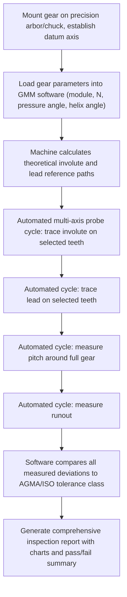

## Gear Measuring Machines

### Overview

Gear measuring machines (GMMs) are dedicated precision instruments that perform comprehensive, automated inspection of gear geometry — including involute profile, lead/helix, pitch, runout, and tooth thickness — in a single setup. Modern gear measuring machines are predominantly CNC-based coordinate measuring systems purpose-built for gear geometry, superseding the earlier generation of dedicated mechanical single-parameter testers (involute testers, lead testers, pitch measuring instruments) used historically.

### Machine Architecture

**Key Points**

- A gear measuring machine combines a precision rotary table (C-axis) carrying the workpiece, with linear axes (typically X, Y, Z) carrying a contact probe or non-contact sensor, all under coordinated CNC control
- The rotary table's angular position and the probe's linear position are continuously and precisely tracked, allowing the machine to synthesize any gear-specific measurement path (involute curve, helical lead trace, pitch spacing) through coordinated multi-axis motion rather than requiring a separate mechanical mechanism for each parameter
- High-resolution rotary and linear encoders (often interferometric or high-count optical encoders) provide the angular and linear position accuracy required for precision gear metrology, typically in the sub-micron and sub-arcsecond range for premium machines

### Gear Measuring Machine Layout (svg_diagram)

<svg xmlns="http://www.w3.org/2000/svg" viewBox="0 0 700 340" font-family="Arial, sans-serif">
<text x="350" y="20" text-anchor="middle" font-size="14" font-weight="bold">CNC Gear Measuring Machine — Basic Layout (svg_diagram)</text>
<rect x="80" y="240" width="540" height="30" fill="#95a5a6" stroke="#333" stroke-width="1.5" />
<text x="350" y="290" text-anchor="middle" font-size="10">Machine base</text>
<rect x="300" y="180" width="100" height="60" fill="#7f8c8d" stroke="#333" stroke-width="1.5" />
<ellipse cx="350" cy="180" rx="50" ry="14" fill="#bdc3c7" stroke="#333" stroke-width="1.5" />
<text x="350" y="270" text-anchor="middle" font-size="9">Rotary table (C-axis)</text>
<g transform="translate(350,175)">
<circle r="45" fill="none" stroke="#2980b9" stroke-width="1.5" />
<path d="M0,-45 L-6,-45 Q-8,-30 -7,-20 L7,-20 Q8,-30 6,-45 Z" fill="#f39c12" opacity="0.6" stroke="#333" />
</g>
<text x="440" y="150" font-size="9">Gear workpiece</text>
<line x1="350" y1="80" x2="350" y2="130" stroke="#333" stroke-width="3" />
<rect x="330" y="50" width="40" height="30" fill="#c0392b" stroke="#333" stroke-width="1.5" />
<circle cx="350" cy="130" r="6" fill="#2c3e50" />
<text x="400" y="70" font-size="9">Probe head (X/Y/Z)</text>
<line x1="200" y1="60" x2="200" y2="240" stroke="#999" stroke-dasharray="3,2" />
<text x="170" y="150" font-size="9" transform="rotate(-90 170 150)">Z-axis column</text>
<path d="M200,120 L280,120" stroke="#27ae60" stroke-width="1.5" marker-end="url(#a2)" />
<text x="230" y="112" font-size="8" fill="#27ae60">X</text>
</svg>

### Probe Technologies

**Key Points**

- **Contact (touch-trigger or scanning) probes:** a precision stylus ball physically contacts the tooth flank; scanning probes provide continuous contact-following data ideal for profile/lead tracing, while touch-trigger probes take discrete point measurements
- **Non-contact optical/laser probes:** increasingly used for high-speed inspection, soft or delicate surfaces, or in-process measurement where contact risk or cycle time is a concern; [Inference] optical methods generally trade some accuracy and surface-condition robustness for significant speed advantages compared to scanning contact probes, though the specific trade-off depends on the particular sensor technology and application.
- **Scanning contact probes** remain the dominant technology for high-precision profile and lead measurement due to their well-established accuracy and repeatability characteristics for these specific measurement types

### Measurement Capabilities

**Key Points**

A modern gear measuring machine typically performs, in a single automated cycle:

- **Involute profile** deviation ($F_\alpha$, $f_{f\alpha}$, $f_{H\alpha}$)
- **Lead/helix** deviation ($F_\beta$, $f_{f\beta}$, $f_{H\beta}$)
- **Pitch** measurements — single pitch deviation, pitch variation, and cumulative pitch deviation around the full gear
- **Runout** — radial runout of the gear teeth relative to the datum axis
- **Tooth thickness** — via span, over-pins, or chordal calculation methods integrated into the machine's software
- **Surface finish** on the tooth flank, on machines equipped with appropriate roughness measurement capability

### Automated Inspection Workflow

### Pitch Measurement on GMMs

**Key Points**

- **Single pitch deviation ($f_{pt}$):** the deviation between the actual and theoretical angular spacing of one tooth relative to the adjacent tooth
- **Pitch variation ($f_u$):** the difference between the maximum and minimum single pitch deviations around the gear
- **Cumulative pitch deviation ($F_p$):** the total accumulated deviation across all teeth around the full circumference, representing the largest difference between any two points on the cumulative pitch deviation curve
- Pitch measurement on a GMM uses the same rotary table encoder used for involute/lead measurement, providing highly precise angular position data for each tooth relative to a fixed reference

### Runout Measurement

**Key Points**

- Gear tooth runout is measured by probing a fixed reference point on each tooth (commonly at the pitch circle or using a ball/pin contact method) around the full circumference, revealing eccentricity of the tooth pattern relative to the datum axis
- Runout error is a significant contributor to gear noise and vibration, particularly at once-per-revolution frequency, and is tracked as a distinct accuracy parameter alongside profile, lead, and pitch

### Software and Data Analysis

**Key Points**

- GMM software packages calculate theoretical gear geometry directly from input parameters (module, number of teeth, pressure angle, helix angle, profile shift/addendum modification) and automatically generate the reference curves needed for deviation calculation — eliminating manual calculation of theoretical involute/lead paths
- Results are typically output as graphical deviation charts (as used in involute and lead profile checking) alongside numerical summary tables comparing measured values against the applicable AGMA 2015 or ISO 1328 accuracy class tolerances
- Many systems support **SPC (statistical process control) data logging**, trending measured deviations across production lots to identify process drift before parts fall out of tolerance

### CMM-Based Gear Measurement vs. Dedicated GMM

| Aspect | Dedicated Gear Measuring Machine | General-Purpose CMM with Gear Software |
| --- | --- | --- |
| Setup speed for gears | Fast — purpose-built fixturing and software | Slower — general fixturing, more setup per part |
| Measurement speed | Optimized for gear-specific motion paths | Generally slower for equivalent gear-specific cycles |
| Accuracy for gear parameters | Very high (purpose-built rotary/linear axes) | High, but dependent on general CMM accuracy specification |
| Flexibility for non-gear parts | Limited/none | High — can measure any general geometric feature |
| Typical use case | Dedicated gear production quality control | Mixed-part inspection labs, occasional gear inspection |

[Inference] The choice between a dedicated GMM and a general-purpose CMM with gear-measurement software typically depends on production volume of geared components: facilities with substantial ongoing gear production tend to favor dedicated GMMs for throughput and gear-specific accuracy, while lower-volume or mixed-product inspection environments may rely on CMM-based gear software instead, though the specific decision depends on individual facility economics and part mix.

### Calibration and Traceability

**Key Points**

- Gear measuring machines require periodic calibration using certified master gears (or master artifacts with known involute/lead/pitch characteristics) traceable to national metrology standards
- Both the rotary table's angular accuracy and the linear axes' positional accuracy must be independently verified, since gear-specific measurements depend on the coordinated accuracy of both systems simultaneously

### Common Applications

- Production quality control for automotive, aerospace, industrial gearbox, and precision motion-control gear manufacturing
- Process development and capability studies for hobbing, shaping, shaving, and grinding operations
- Root-cause investigation of gear noise, vibration, or premature failure issues
- Incoming inspection of purchased gear components against specification and accuracy class requirements

**Related Topics**

- Involute and lead profile checking (core measurement types performed by GMMs)
- Gear terminology and tooth elements
- Base tangent span measurement and gear tooth thickness measurement
- AGMA and ISO gear accuracy classes (AGMA 2015, ISO 1328)
- CMM (coordinate measuring machine) general principles
- Statistical process control (SPC) in precision manufacturing