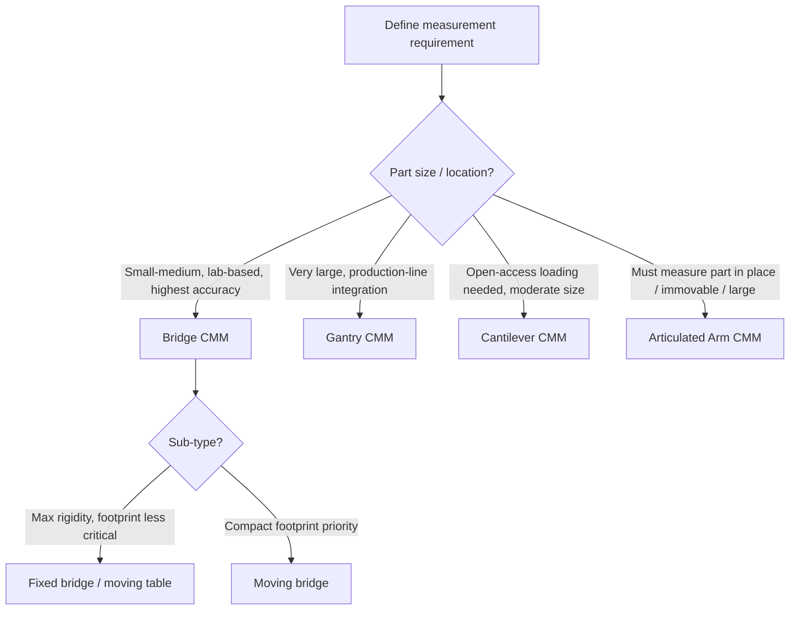

## Bridge, Gantry, Cantilever, and Arm CMM Architectures

### Overview

Coordinate measuring machines (CMMs) are built on several distinct mechanical architectures, each offering different trade-offs among accuracy, measuring volume, accessibility, footprint, and cost. The four primary architecture families covered here — bridge, gantry, cantilever, and articulated arm — represent the dominant configurations used across precision metrology labs and production floors.

### Bridge CMM

**Definition:** The most common CMM architecture, consisting of a moving bridge structure spanning the width of a fixed granite (or other stable material) worktable, with the probe carriage riding along the bridge's horizontal beam.

**Key Points**

- Three linear axes: the bridge moves along the table in the Y-axis (on two parallel guideways), the carriage moves horizontally along the bridge in the X-axis, and the quill/ram moves vertically in the Z-axis
- The workpiece remains stationary on the table while the bridge structure moves over it, providing good accessibility to the top and sides of the part within the machine's working envelope
- Offers a strong balance of accuracy, rigidity, and measuring volume, making it the default choice for general-purpose precision metrology labs and production quality control

**Sub-variants**

- **Fixed bridge / moving table:** the bridge remains stationary while the worktable itself moves in Y beneath it — offers higher structural rigidity (since the bridge does not need to move a heavy structure) at the cost of a larger overall footprint due to table travel
- **Moving bridge (most common):** the bridge itself translates along the table in Y, offering a more compact footprint relative to measuring volume

### Bridge CMM Diagram (svg_diagram)

<svg xmlns="http://www.w3.org/2000/svg" viewBox="0 0 700 320" font-family="Arial, sans-serif">
<text x="350" y="20" text-anchor="middle" font-size="14" font-weight="bold">Bridge CMM Architecture (svg_diagram)</text>
<rect x="80" y="240" width="540" height="30" fill="#95a5a6" stroke="#333" stroke-width="1.5" />
<text x="350" y="290" text-anchor="middle" font-size="10">Granite worktable</text>
<rect x="100" y="230" width="20" height="10" fill="#7f8c8d" />
<rect x="580" y="230" width="20" height="10" fill="#7f8c8d" />
<text x="110" y="225" font-size="8">Y-axis rail</text>
<line x1="120" y1="100" x2="120" y2="235" stroke="#2c3e50" stroke-width="8" />
<line x1="580" y1="100" x2="580" y2="235" stroke="#2c3e50" stroke-width="8" />
<rect x="110" y="90" width="490" height="18" fill="#34495e" />
<text x="350" y="80" text-anchor="middle" font-size="9">Bridge (spans Y-guideways)</text>
<rect x="330" y="108" width="40" height="16" fill="#c0392b" />
<text x="350" y="105" text-anchor="middle" font-size="8" fill="#c0392b">X-carriage</text>
<line x1="350" y1="124" x2="350" y2="180" stroke="#e67e22" stroke-width="6" />
<circle cx="350" cy="185" r="5" fill="#2c3e50" />
<text x="400" y="150" font-size="9">Z-quill + probe</text>
<path d="M330,300 Q350,310 370,300" fill="#bdc3c7" stroke="#333" />
<text x="350" y="315" text-anchor="middle" font-size="8">Workpiece</text>
</svg>

### Gantry CMM

**Definition:** A large-scale CMM architecture in which the entire bridge structure is elevated and supported by floor-mounted (or overhead-mounted) legs/columns spanning across or above a fixed worktable or workspace, rather than riding on a compact table-mounted rail system.

**Key Points**

- Designed for very large measuring volumes — automotive body-in-white inspection, aerospace structural components, large fabrications — where a bridge CMM's table-mounted rail approach becomes impractical
- The structure's legs typically run in floor-mounted rails on either side of the workspace, with the workpiece often left on the factory floor or a separate support structure rather than a dedicated CMM granite table
- Offers excellent accessibility for very large parts and can be integrated into a production line for in-process or near-line inspection, at the cost of reduced accuracy compared to smaller, more rigid bridge CMMs due to the longer structural spans involved

### Gantry CMM Diagram (svg_diagram)

<svg xmlns="http://www.w3.org/2000/svg" viewBox="0 0 700 320" font-family="Arial, sans-serif">
<text x="350" y="20" text-anchor="middle" font-size="14" font-weight="bold">Gantry CMM Architecture (svg_diagram)</text>
<line x1="0" y1="280" x2="700" y2="280" stroke="#7f8c8d" stroke-width="3" />
<text x="650" y="300" font-size="9">Factory floor</text>
<rect x="100" y="80" width="25" height="200" fill="#34495e" />
<rect x="575" y="80" width="25" height="200" fill="#34495e" />
<text x="112" y="70" text-anchor="middle" font-size="8">Column</text>
<rect x="90" y="60" width="520" height="22" fill="#2c3e50" />
<text x="350" y="50" text-anchor="middle" font-size="9">Gantry beam (spans overhead)</text>
<rect x="330" y="82" width="40" height="16" fill="#c0392b" />
<line x1="350" y1="98" x2="350" y2="200" stroke="#e67e22" stroke-width="6" />
<circle cx="350" cy="205" r="5" fill="#2c3e50" />
<text x="410" y="150" font-size="9">Z-axis probe assembly</text>
<path d="M270,260 L280,220 L420,220 L430,260 Z" fill="#95a5a6" opacity="0.6" stroke="#333" />
<text x="350" y="255" text-anchor="middle" font-size="9">Large workpiece (e.g., vehicle body)</text>
</svg>

### Cantilever CMM

**Definition:** An architecture in which the horizontal beam carrying the X-axis carriage is supported from only one side (cantilevered) rather than spanning fully across the table on both sides, leaving the front and one side of the table fully open and accessible.

**Key Points**

- Open access on three sides of the table makes it well suited for measuring long or awkwardly shaped parts, or for loading/unloading with overhead cranes or automated material handling without obstruction
- Generally offers a smaller working envelope (particularly in the Y direction) and reduced structural rigidity compared to a bridge CMM of similar table size, since the unsupported cantilever arm is more susceptible to deflection under load and over its travel range
- Commonly used for smaller precision parts, tool room inspection, and applications where open table access outweighs the accuracy/rigidity trade-off relative to a bridge design

### Cantilever CMM Diagram (svg_diagram)

<svg xmlns="http://www.w3.org/2000/svg" viewBox="0 0 700 300" font-family="Arial, sans-serif">
<text x="350" y="20" text-anchor="middle" font-size="14" font-weight="bold">Cantilever CMM Architecture (svg_diagram)</text>
<rect x="80" y="220" width="440" height="30" fill="#95a5a6" stroke="#333" stroke-width="1.5" />
<text x="300" y="270" text-anchor="middle" font-size="10">Worktable (open on 3 sides)</text>
<line x1="100" y1="90" x2="100" y2="215" stroke="#2c3e50" stroke-width="10" />
<text x="70" y="150" text-anchor="middle" font-size="9" transform="rotate(-90 70 150)">Single support column</text>
<rect x="100" y="80" width="420" height="18" fill="#34495e" />
<text x="310" y="70" text-anchor="middle" font-size="9">Cantilevered horizontal beam</text>
<rect x="330" y="98" width="35" height="14" fill="#c0392b" />
<line x1="347" y1="112" x2="347" y2="170" stroke="#e67e22" stroke-width="6" />
<circle cx="347" cy="175" r="5" fill="#2c3e50" />
<text x="400" y="140" font-size="9">Z-axis probe</text>

<text x="560" y="150" font-size="9">Open side —</text>

<text x="560" y="165" font-size="9">easy load access</text>

<path d="M520,150 L560,150" stroke="`#27ae60`" stroke-width="1.5" marker-end="url(#a3)" />

</svg>

### Articulated Arm CMM

**Definition:** A portable, multi-jointed (typically 6- or 7-axis) measuring arm with rotary encoders at each joint, held and manipulated manually by the operator to position a contact probe or scanner at the desired measurement point.

**Key Points**

- Unlike bridge, gantry, and cantilever CMMs, an arm CMM uses **rotary joints** rather than orthogonal linear axes; position is calculated through the kinematic chain of joint angles rather than direct linear measurement
- Fully portable — can be moved to the part rather than requiring the part to be brought to a fixed machine, making it well suited to large, immovable, or in-situ measurement applications (assembly line fixtures, large tooling, on-machine verification)
- Generally offers lower accuracy than fixed bridge/gantry CMMs of comparable measuring volume, since accuracy depends on the cumulative precision of multiple rotary joints through the kinematic chain rather than a smaller number of highly rigid linear axes
- Widely used with laser scanning attachments for rapid point-cloud capture in addition to traditional touch-probe contact measurement

### Articulated Arm CMM Diagram (svg_diagram)

<svg xmlns="http://www.w3.org/2000/svg" viewBox="0 0 700 300" font-family="Arial, sans-serif">
<text x="350" y="20" text-anchor="middle" font-size="14" font-weight="bold">Articulated Arm CMM Architecture (svg_diagram)</text>
<circle cx="150" cy="230" r="20" fill="#34495e" />
<text x="150" y="260" text-anchor="middle" font-size="9">Base mount</text>
<line x1="150" y1="230" x2="230" y2="170" stroke="#7f8c8d" stroke-width="8" />
<circle cx="230" cy="170" r="9" fill="#c0392b" />
<text x="245" y="165" font-size="8">Joint 1</text>
<line x1="230" y1="170" x2="330" y2="140" stroke="#7f8c8d" stroke-width="8" />
<circle cx="330" cy="140" r="9" fill="#c0392b" />
<text x="345" y="135" font-size="8">Joint 2</text>
<line x1="330" y1="140" x2="420" y2="100" stroke="#7f8c8d" stroke-width="7" />
<circle cx="420" cy="100" r="8" fill="#c0392b" />
<text x="435" y="95" font-size="8">Joint 3</text>
<line x1="420" y1="100" x2="500" y2="130" stroke="#7f8c8d" stroke-width="6" />
<circle cx="500" cy="130" r="7" fill="#c0392b" />
<text x="515" y="125" font-size="8">Wrist joints</text>
<circle cx="530" cy="150" r="6" fill="#2c3e50" />
<text x="540" y="170" font-size="9">Probe/scanner tip</text>
</svg>

### Architecture Comparison

| Architecture | Axes/Joints | Typical Accuracy | Measuring Volume | Portability | Best Suited For |
| --- | --- | --- | --- | --- | --- |
| Bridge | 3 linear (X,Y,Z) | High | Small to large | Fixed | General precision metrology labs |
| Gantry | 3 linear (X,Y,Z), large-scale | Moderate (lower than bridge at comparable precision) | Very large | Fixed | Automotive/aerospace large-part inspection |
| Cantilever | 3 linear (X,Y,Z), open-sided | Moderate to high (smaller volumes) | Small to medium | Fixed | Open-access loading, long/odd-shaped parts |
| Articulated Arm | 6-7 rotary joints | Lower than fixed CMMs, volume-dependent | Small to large (arm reach) | Fully portable | On-site, large fixtures, reverse engineering |

### Selection Logic

### Structural and Environmental Considerations

**Key Points**

- Fixed CMMs (bridge, gantry, cantilever) typically rely on granite or similar dimensionally stable materials for the worktable and often the structural members, minimizing thermal and mechanical distortion effects on measurement accuracy
- Environmental control (temperature-stabilized rooms, vibration isolation) is generally most critical for bridge CMMs used at the highest accuracy levels, while gantry and portable arm CMMs are more commonly deployed in less controlled shop-floor or field environments, accepting reduced accuracy as a trade-off for practicality
- [Inference] The degree of environmental sensitivity varies significantly by specific machine design, accuracy specification, and manufacturer thermal compensation technology, so generalized statements about relative robustness should be confirmed against the specific machine's published environmental specifications for critical applications.

### Common Applications by Architecture

- **Bridge:** precision machined components, mold and die inspection, general-purpose metrology lab work
- **Gantry:** automotive body-in-white, aerospace structural assemblies, large fabricated weldments
- **Cantilever:** tool room inspection, small-to-medium parts requiring frequent loading/unloading, crane-loaded workpieces
- **Articulated Arm:** on-site assembly verification, large tooling/fixture checks, reverse engineering, portable quality control

**Related Topics**

- CMM probe types (touch-trigger, scanning, optical)
- CMM accuracy specifications (MPEE, MPEP per ISO 10360)
- Laser scanning and structured light 3D measurement
- Environmental effects on precision measurement (temperature, vibration)
- CMM programming and part alignment (datum establishment)
- Portable metrology systems (laser trackers, photogrammetry)