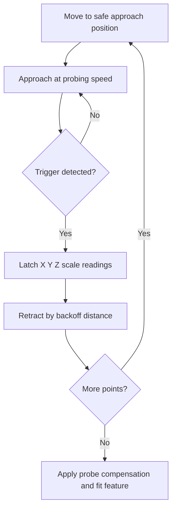
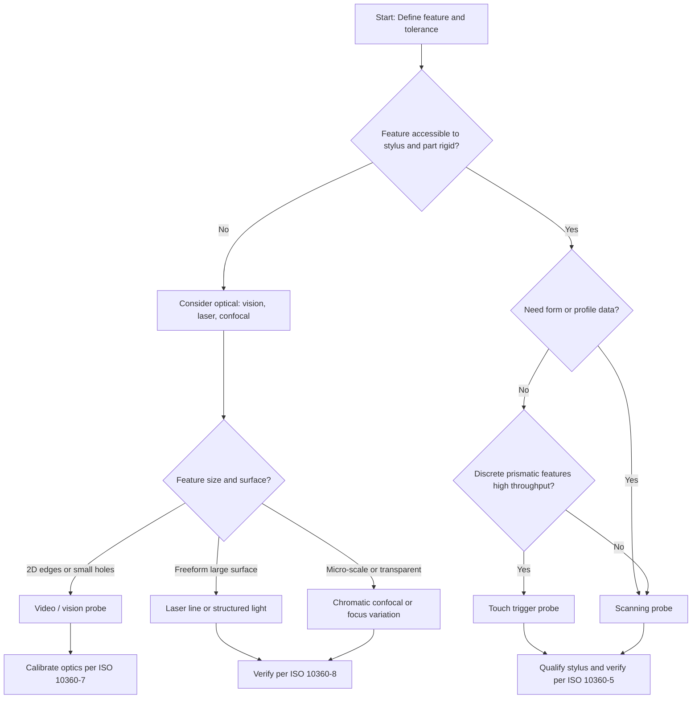

## Touch Trigger, Scanning, and Optical Probing Systems

### Overview and Role of the Probing System

The probing system is the sensing element of a coordinate measuring machine (CMM). It converts contact or proximity with a workpiece surface into a coordinate data point. Since the machine's geometric accuracy is only meaningful if the probe reliably reports where the surface is, the probe frequently dominates the uncertainty budget for a measurement task.

A complete probing system consists of:

- **Probe body / sensor**: contains the transducer (kinematic switch, strain gauge, LVDT, optical sensor, etc.)
- **Stylus assembly**: stem, extension, and tip (ruby ball, silicon nitride, ceramic, zirconia, or diamond-coated)
- **Probe head**: fixed, manually indexable, or motorized/continuously articulating (e.g., 5-axis)
- **Interface electronics**: signal conditioning, trigger latching, or analog/digital data streaming
- **Change rack / autojoint**: for automatic exchange of probes, styli, and modules

**Key Points**

- Probe technologies fall into three principal families: **touch trigger** (discrete point sensing), **scanning** (continuous contact sensing), and **optical/non-contact** (laser, white-light, vision, and chromatic confocal).
- Selection depends on feature type, material, required accuracy, point density, cycle time, and surface condition.
- The probe contributes directly to the maximum permissible error for probing ($MPE_P$) and scanning ($MPE_{THP}$) defined in ISO 10360.

### Coordinate Acquisition Principle

For any contact probe, the CMM records machine scale positions $(X_m, Y_m, Z_m)$ at the instant of surface detection. Because the tip is a sphere, the measured point is the **center of the stylus tip**, not the surface contact point. Software applies probe radius compensation along the estimated surface normal:

$$\vec{P}_{surface} = \vec{P}_{center} - r_{eff} \cdot \hat{n}$$

where $r_{eff}$ is the effective (calibrated) tip radius and $\hat{n}$ is the surface normal direction. The calibrated radius includes ball form error and probe response effects, so it is not the same as the nominal ball diameter.

### Touch Trigger Probing

#### Operating Principle

A touch trigger probe (TTP) is a **discrete-point** sensor. The stylus is held in a kinematic seat, and when the tip contacts the workpiece, the stylus lifts off the seat and breaks an electrical circuit (or changes a sensor signal), which produces a trigger pulse. The controller latches the machine scale positions at the trigger instant.

The classic **kinematic resistive** design uses three cylinders (or rods) each resting on two spheres (six contact points), forming a fully constrained kinematic mount. Contact resistance in series changes when any contact point lifts.

**Key Points**

- Six points of contact constrain all six degrees of freedom, giving repeatable re-seating after each trigger.
- The trigger occurs after a small **pre-travel** of the stylus, and this pre-travel is direction-dependent.
- Modern designs use strain gauges or piezoelectric sensors (e.g., silicon strain gauge probes) to detect contact with far lower and more uniform trigger force.

(svg_diagram)

<svg xmlns="http://www.w3.org/2000/svg" viewBox="0 0 640 360" width="640" height="360" font-family="Arial, sans-serif" font-size="13">
<title>Touch Trigger Probe Kinematic Seat (svg_diagram)</title>
<rect x="0" y="0" width="640" height="360" fill="#ffffff" stroke="#cccccc" />
<text x="320" y="24" text-anchor="middle" font-size="15" font-weight="bold">Touch Trigger Probe Kinematic Seat (svg_diagram)</text>

<rect x="200" y="50" width="240" height="120" fill="#e8eef5" stroke="#345" stroke-width="2" />
<text x="320" y="70" text-anchor="middle">Probe Housing</text>

<path d="M320 80 l-14 8 l28 8 l-28 8 l28 8 l-28 8 l14 8" fill="none" stroke="#a33" stroke-width="2" />
<text x="400" y="110" fill="#a33">Return spring</text>

<circle cx="240" cy="160" r="9" fill="#888" stroke="#333" />
<circle cx="290" cy="160" r="9" fill="#888" stroke="#333" />
<circle cx="350" cy="160" r="9" fill="#888" stroke="#333" />
<circle cx="400" cy="160" r="9" fill="#888" stroke="#333" />
<text x="320" y="152" text-anchor="middle" font-size="11">Seat spheres (6 contact points total)</text>

<rect x="225" y="172" width="80" height="12" rx="6" fill="#b9a26b" stroke="#543" />
<rect x="335" y="172" width="80" height="12" rx="6" fill="#b9a26b" stroke="#543" />

<rect x="312" y="184" width="16" height="80" fill="#c9c9c9" stroke="#333" />
<text x="345" y="230">Stylus stem</text>

<circle cx="320" cy="285" r="22" fill="#d33" stroke="#611" stroke-width="2" />
<text x="320" y="290" text-anchor="middle" fill="#fff" font-size="11">Ruby</text>

<rect x="180" y="315" width="280" height="24" fill="#9db7a0" stroke="#354" />
<text x="320" y="332" text-anchor="middle">Workpiece surface</text>

<line x1="320" y1="345" x2="320" y2="322" stroke="#000" stroke-width="1.5" />
<text x="560" y="290" text-anchor="end" font-size="11">Contact lifts a seat</text>
<text x="560" y="305" text-anchor="end" font-size="11">contact, breaking circuit</text>
</svg>

#### Measurement Cycle

1. Probe approaches the surface at a controlled **approach distance** and **probing speed**.
2. Stylus deflects on contact; trigger fires when deflection exceeds the threshold.
3. Controller latches scale positions.
4. Machine retracts by a **backoff/retract distance**.
5. Next point is taken.

#### Error Sources in Touch Trigger Probing

- **Pre-travel variation (lobing)**: the probe triggers at different deflections depending on approach direction relative to the three-lobe kinematic geometry. The resulting radial error pattern is a **three-lobed** form (in the XY plane), typically the largest single error for older kinematic probes.
- **Trigger force**: too high a force can deflect long styli or thin-walled parts.
- **Dynamic effects**: machine acceleration and vibration can cause false triggers if the probe is not properly isolated.
- **Stylus bending**: pre-travel grows with stylus length and reduced stiffness.
- **Approach speed**: contributes to latency error since the machine keeps moving between trigger and latch.

**Key Points**

- Lobing is mitigated through qualification: measuring the ball at many directions so the software computes an effective radius or directional compensation.
- Silicon strain-gauge based probes drastically reduce lobing because the sensor detects deflection electronically without the kinematic seat's uneven stiffness.

#### Typical Application Fit

Touch trigger probing suits:

- Prismatic parts (planes, bores, slots, cylinders) requiring discrete feature measurement.
- High-throughput inspection with well-defined point sets.
- Shop-floor and production environments where robustness is essential.
- Cost-sensitive systems.

It is less suitable for high-density form measurement (roundness, profile) because each point requires a discrete approach/retract cycle.

### Stylus Configuration and Qualification

#### Stylus Design Rules

- Use the **shortest, stiffest** stylus consistent with feature access.
- Use the **largest ball diameter** that can access the feature. A larger ball mechanically filters surface roughness and increases the effective ball contact area.
- Minimize the **number of joints** (each thread/interface adds compliance and potential shift).
- Prefer **ruby** for most materials; use **silicon nitride** for scanning aluminum (ruby adheres to aluminum by adhesive wear), and **zirconia** for scanning cast iron (ruby shows abrasive wear against cast iron).
- Use **carbon-fiber stems** for long stylus lengths to reduce weight and bending.
- Stems with **stepped diameters** reduce deflection.

**Approximate stylus material guidance**

| Application / Material | Suggested Tip | Rationale |
| --- | --- | --- |
| General steel, most metals | Ruby | Hard, low density, spherical, cost-effective |
| Aluminum (scanning) | Silicon nitride | Avoids aluminum adhesion to ruby |
| Cast iron (scanning) | Zirconia | Avoids abrasive wear pattern of ruby |
| Very abrasive/rough parts | Diamond-like coated | Improved wear resistance |
| Very small features | Small-diameter ruby or ceramic, fiber probes | Access into micro features |

#### Qualification (Calibration) of the Probe

Qualification determines the **effective tip radius** and the **tip center offset** relative to a reference stylus. It is done by measuring a **reference sphere** (calibration sphere) of known diameter and very low form error.

Procedure outline:

1. Mount and clean the reference sphere and stylus.
2. Take a defined number of points (often 5-25 for a trigger probe) distributed over the accessible sphere surface.
3. Fit a sphere to the measured centers; the difference between the fitted sphere diameter and the certified diameter yields the effective tip diameter.
4. Store the tip radius, tip center, and positional offsets.
5. Repeat for **every stylus angle and configuration** used.

**Key Points**

- Requalify after any stylus change, probe head reorientation, collision, temperature shift, or when the qualification sphere is moved.
- The qualification should use the **same probing speed and force** as the actual measurement.
- Sphere form error and thermal drift directly propagate to the qualified tip radius.

**Example**

A stylus with a nominal 3 mm ruby ball is qualified against a 25.0000 mm reference sphere. The fitted sphere center-to-center diameter is 28.0032 mm (tip center measurements). The effective tip diameter is:

$$d_{tip,eff} = d_{fit} - d_{ref} = 28.0032 - 25.0000 = 3.0032 \text{ mm}$$

The effective radius of $1.5016$ mm (larger than nominal 1.5 mm) absorbs the stylus pre-travel and mechanical effects, and this value, not the nominal one, is used in compensation.

### Scanning Probing Systems

#### Principle

A scanning probe keeps the stylus tip **in continuous contact** with the surface while the machine moves along a path, recording data at a high rate. Instead of trigger points, the probe has an **analog measuring transducer** (typically three orthogonal displacement sensors) that reports the stylus deflection vector $(\delta_x, \delta_y, \delta_z)$. The measured point is computed as the sum of the machine position and probe deflection:

$$\vec{P}_{tip} = \vec{P}_{machine} + \vec{\delta}_{probe}$$

Two major classes:

1. **Passive (analog) scanning probes**: spring-loaded, with a flexure-based or parallelogram spring stage and inductive/LVDT or optical displacement transducers. The machine controller regulates contact force through the *deflection setpoint*.
2. **Active scanning probes**: include actuators (e.g., voice coil or motor) that actively regulate the contact force independent of the stylus deflection.

Additionally, **high-speed scanning** may be enabled by specialized firmware that adapts path and speed to the local surface curvature.

#### Measuring Modes

- **Contact scanning**: continuous contact along a path (curve or grid).
- **Self-centering scanning**: probe follows unknown contours by adjusting the direction to maintain deflection (used for unknown profiles).
- **Nominal-path (CAD-based) scanning**: probe follows a pre-programmed nominal path with a small deflection window.
- **Point-to-point analog measurement**: single points measured with low force at controlled deflection, avoiding hard impact.

#### Transducer Technologies

| Transducer | Basic Principle | Comments |
| --- | --- | --- |
| Inductive (LVDT-like) | Core displacement modifies mutual inductance | Robust, high resolution, common in analog probes |
| Optical (light path) | Displacement modulates optical intensity or interferometric signal | Very high resolution, low hysteresis |
| Capacitive | Gap change modifies capacitance | High sensitivity, need clean environment |
| Strain gauge / piezo | Structural strain measurement | Fast response, used in force sensing |

#### Data Density and Speed

Scanning offers hundreds to thousands of points per second. Practical scan speeds depend on:

- Surface curvature and required tracking fidelity
- Stylus length and stiffness
- Machine dynamics (acceleration, structural resonance)
- Desired form accuracy

**Key Points**

- Scanning yields far higher point density, enabling **form** (roundness, cylindricity, flatness) and **profile** evaluation with better repeatability than sparse trigger measurement.
- Scanning probes have separate accuracy statements $MPE_{THP}$ and time $\tau$ specified in ISO 10360-5 (scanning probing error).
- Dynamic forces and frictional stick-slip can distort scan data at high speeds or on rough surfaces.

#### Scanning Error Sources

- **Dynamic error**: machine acceleration excites structure; probe deflection reports partially compensate but not fully.
- **Stylus bending** under scanning forces.
- **Friction and stick-slip** between tip and surface.
- **Surface adhesion** (tip material / workpiece material interaction).
- **Filtering and time delay** of the probe signal compared to the scale signal (synchronization error).
- **Path following error** at corners and small radii.

#### Scanning Speed Selection

For a circular scan of radius $R$ at tangential speed $v$, the centripetal acceleration is:

$$a = \frac{v^2}{R}$$

Because the machine's dynamic error grows with acceleration, the practical maximum scan speed for a required accuracy is bounded by:

$$v_{max} \approx \sqrt{a_{allowable} \cdot R}$$

**Example**

For a 20 mm radius bore and a maximum allowable lateral acceleration of $500 \text{ mm/s}^2$:

$$v_{max} = \sqrt{500 \times 20} = \sqrt{10000} = 100 \text{ mm/s}$$

Faster scans on smaller radii would produce disproportionately larger dynamic errors. [Inference] The actual allowable acceleration depends strongly on machine structure and controller compensation, so this value should be verified experimentally for each machine.

#### Comparison: Touch Trigger vs. Scanning

| Attribute | Touch Trigger | Analog Scanning |
| --- | --- | --- |
| Data type | Discrete points | Continuous or dense points |
| Point rate | Low (approach/retract cycle) | High (hundreds to thousands/s) |
| Form capability | Limited (few points) | Excellent |
| Stylus load | Impact-like contact | Continuous low force |
| Cost | Lower | Higher |
| Robustness | Very robust | More delicate/complex |
| Best use | Prismatic features, production | Form, profile, freeform, gear/threads |

### Probe Heads and Articulation

The probe head orients the probe/stylus to reach features without a stylus change.

- **Fixed head**: no articulation.
- **Manual indexing head**: operator changes orientation in discrete steps (e.g., $7.5°$ increments).
- **Motorized indexing head**: automated discrete positions (repeatable).
- **Continuous 5-axis**: dynamic head plus CMM three axes; rapid motion of both rotation axes during measurement, enabling faster measurement with lower machine acceleration.

**Key Points**

- Each discrete position must be qualified separately; indexing repeatability contributes to the uncertainty.
- Continuous articulation reduces the need for the CMM's slow-moving axes to accelerate; the lightweight head axes provide fast, high-fidelity motion.
- Extension bars increase reach but raise bending and thermal sensitivity.

### Probe Change Systems

- **Stylus change racks**: swap styli in a repeatable kinematic joint without losing qualification (subject to repeatability limits).
- **Probe change racks**: exchange between probe types (e.g., touch trigger to scanning) in automated cycles.
- **Multi-sensor systems**: exchange between contact probes and optical sensors on the same machine platform.

Repeatability of the change interface influences whether requalification is required after each exchange. [Unverified] Many suppliers claim requalification-free swapping to within a few tenths of a micrometer; verify on the specific hardware.

### Optical and Non-Contact Probing Systems

Optical probing avoids mechanical contact and is suitable for delicate, soft, thin, or micro-scale features, or where large-point-cloud acquisition is needed.

#### Main Technologies

1. **Laser triangulation (point and line)**
2. **Laser line scanners**
3. **White-light / structured-light (fringe projection)**
4. **Chromatic confocal sensors**
5. **Video / vision (image-based) systems**
6. **Focus variation and confocal microscopy sensors**
7. **Interferometric sensors (white-light interferometry)**
8. **Fiber and micro-probes (hybrid contact)**

#### Laser Triangulation

A laser diode projects a spot (or line) onto the surface. A camera at a known angle sees the spot's image position. The spot displacement on the sensor relates to the surface height (standoff distance) through triangulation:

$$z = \frac{b \cdot f}{x'} \quad \text{(simplified geometric relationship)}$$

where $b$ is the baseline between the laser and the receiver, $f$ is the focal length of the receiver lens, and $x'$ is the spot position on the detector. The full relation depends on the specific optical layout, so exact forms vary with sensor design.

**Advantages**

- Very fast acquisition (line scanners give thousands of points per line at hundreds of Hz)
- Large measuring volume (standoff of 20-100+ mm typical)

**Limitations**

- Surface reflectivity and color affect signal.
- Shiny or translucent surfaces can produce specular reflection, speckle, and subsurface scattering errors.
- Occlusion (shadowing) at steep flanks and edges.
- Typical uncertainty is generally larger than tactile scanning (often tens of micrometers down to a few micrometers). [Inference] Achievable values depend on sensor class and surface quality.

#### Laser Line Scanners

A cylindrical lens spreads the laser into a line; the camera captures the whole line profile per frame. When mounted on a CMM or articulating arm, sweeping the line over the part produces dense point clouds.

**Key Points**

- Excellent for freeform surfaces, sheet metal, castings, reverse engineering.
- Requires attention to **sensor orientation** relative to surface normal (incidence angle influences noise).
- Edge measurement is affected by edge diffraction and blooming.

#### Structured Light / Fringe Projection

Patterns (stripes, gray codes, phase-shifted sinusoids) are projected onto the part. Cameras capture deformed patterns; phase-shifting algorithms compute 3D coordinates.

The phase-shift computation for an $N$-step algorithm yields phase:

$$\phi(x,y) = \arctan\left(\frac{\sum_{k=0}^{N-1} I_k \sin(2\pi k / N)}{\sum_{k=0}^{N-1} I_k \cos(2\pi k / N)}\right)$$

with a negative sign convention depending on the derivation. The wrapped phase is then unwrapped and converted to height through system calibration.

**Advantages**: millions of points per shot, full-field acquisition.

**Limitations**: sensitive to ambient light, reflective surfaces, and field-of-view versus resolution trade-off.

#### Chromatic Confocal Sensors

A polychromatic (white) light is focused through a lens with **deliberate axial chromatic aberration**, so each wavelength focuses at a different height. Only the wavelength in focus on the surface returns through the confocal pinhole to the spectrometer, and the peak wavelength encodes the distance.

$$z = f(\lambda_{peak})$$

with the mapping determined through calibration (typically a nonlinear function, stored as a lookup table).

**Advantages**

- Extremely high axial resolution (nanometer scale possible)
- Works on many surface types including transparent, mirror-like, and rough
- Small spot size, suitable for micro features and steep flanks (due to on-axis measurement)
- Can measure glass thickness through transparent layers using multiple peaks

**Limitations**

- Small measuring range (typically hundreds of micrometers to a few millimeters)
- Slower area coverage than line scanners

#### Video / Vision Probing

A camera with telecentric or calibrated optics images the part. Edge detection algorithms locate features in a 2D image, and stage motion yields XY coordinates. Z is obtained through autofocus or a laser/height sensor.

Edge location uses sub-pixel interpolation:

$$x_{edge} = x_i + \frac{T - I_i}{I_{i+1} - I_i}$$

where $T$ is the threshold intensity, and $I_i$, $I_{i+1}$ are the intensities of adjacent pixels bracketing the threshold. This is one common simple approach; many systems use more advanced gradient or model fitting methods.

**Key Points**

- Ideal for 2D features: small holes, contours, PCBs, stamped parts, microfabricated features.
- Illumination strongly influences results (backlight, ring light, coaxial, programmable multi-zone).
- Edge definition depends on optical parameters: numerical aperture, depth of field, and lighting angle.
- Telecentric lenses reduce magnification errors with height variation.

**Example**

For a video system with a pixel size on the object of $2 \ \mu\text{m}$ and sub-pixel edge interpolation to $1/10$ pixel, the theoretical pixel-level location resolution is $0.2 \ \mu\text{m}$. [Inference] Practical uncertainty is significantly greater because of illumination, optics distortion, edge definition, and stage accuracy, typically several times the sub-pixel resolution.

#### Focus Variation and Confocal Microscopy

- **Focus variation**: the optic scans in Z, computing a local sharpness metric at each pixel; height is the Z position at peak sharpness. Suitable for rough, steep surfaces.
- **Laser scanning confocal**: a scanned point of light with a pinhole rejects out-of-focus signal, producing optical sectioning with high lateral and axial resolution.

Both are used in **areal surface texture** measurement per ISO 25178 and are frequently integrated into multi-sensor CMMs for micro-geometry measurement.

#### White-Light Interferometry (Coherence Scanning)

A broadband source produces interference fringes only near zero optical path difference. Scanning the reference/measurement path in Z produces a fringe envelope whose peak identifies the surface height at each pixel.

$$I(z) = I_0 \left[1 + \gamma(z) \cos\left(\frac{4\pi}{\lambda_0}(z - z_0)\right)\right]$$

where $\gamma(z)$ is the coherence envelope, $\lambda_0$ is the central wavelength, and $z_0$ is the surface height. Vertical resolution is sub-nanometer, which makes it suited for roughness, step height, and micro-form.

**Limitations**: small field of view and limited slope acceptance; typically used in a metrology lab or as a specialized sensor rather than on general-purpose CMMs.

#### Optical Sensor Effects on Measurement

Optical results depend on the interaction between light and the material:

- **Surface finish and reflectivity**: shiny surfaces cause saturation, dark surfaces reduce signal.
- **Translucency**: subsurface scattering displaces the apparent surface (common with plastics, ceramics, wax).
- **Edge and slope**: steep flanks or sharp edges cause diffraction, occlusion, and multipath reflection.
- **Ambient light**: influences sensors without narrowband filtering.
- **Temperature and airflow**: refractive index variations distort beam paths (especially at long standoff).
- **Dominant systematic differences vs. tactile**: optical sensors measure a filtered "optical surface," which may differ from the mechanical envelope obtained by a ball stylus, especially on rough surfaces. Discrepancies of several micrometers between optical and tactile measurements are not unusual. [Inference]

**Key Points**

- Optical and tactile results are not interchangeable without careful consideration of the **measurand** definition (mechanical filtering by the ball vs. optical filtering by the beam).
- Optical sensors require their own **calibration and traceability** approach, often using reference spheres, step gauges, and dedicated artefacts; ISO 10360-8 covers CMMs with optical distance sensors, and ISO 10360-7 covers CMMs equipped with imaging probing systems.

### Multi-Sensor Systems

Multi-sensor CMMs combine tactile probes, vision, laser, and other sensors on a single machine, with rack-based automatic exchange.

**Benefits**

- Use the best sensor per feature: optical for edges/thin parts, tactile for critical bores/datums.
- Single coordinate system reduces alignment errors between sensors.
- Better utilization of the machine and simplified workflows.

**Challenges**

- **Sensor-to-sensor offsets** must be calibrated with a common artefact (e.g., a reference sphere or a multi-sensor calibration artefact measurable by both).
- Different measurement principles need different uncertainty models.
- Thermal offsets between sensor mounts can degrade registration.

### Hybrid and Micro Probing

For micro-CMMs and small features (sub-millimeter):

- **Fiber probes**: a very thin optical fiber ends in a microsphere (tens of micrometers), and lateral deflection of the fiber changes the optical image of the ball, which is read by a camera.
- **Silicon micro-probes**: fabricated with MEMS techniques and strain sensing.
- **Vibrating probes / resonance probes**: sense proximity or contact through changes in resonance amplitude or frequency, enabling very low contact force.
- **Tactile-optical (video) probes**: the tip's location is imaged; used in micro-coordinate metrology.

**Key Points**

- At these scales, **surface forces** (adhesion, van der Waals, capillary) can be comparable to the trigger or contact force, and probing can become nonlinear.
- Tip diameters down to about 20-100 $\mu$m require special handling and qualification methods.

### Performance Verification (ISO 10360)

Probing performance is verified using the standardized tests in ISO 10360 (Geometrical product specifications — Acceptance and reverification tests for coordinate measuring machines). The parts relevant to probing include:

| Standard Part | Scope |
| --- | --- |
| ISO 10360-2 | CMMs used for measuring linear dimensions (length measurement error $E$) |
| ISO 10360-5 | CMMs using contact probing systems (probing form error $P_{Form}$, probing size error $P_{Size}$, probing location error $L_{Dia}$; scanning tests $THP$) |
| ISO 10360-7 | CMMs equipped with imaging probing systems |
| ISO 10360-8 | CMMs with optical distance sensors |
| ISO 10360-9 | CMMs with multiple probing systems |

#### Typical Contact Probing Test (ISO 10360-5)

A calibrated reference sphere (typically 10-50 mm diameter, low form error) is measured with a prescribed number of points (e.g., 25 points distributed over the sphere). The reported parameters include:

- **Probing size error** $P_{Size.Sph.1x25::ODS}$: the difference between the measured (least-squares) sphere diameter and the calibrated diameter.
- **Probing form error** $P_{Form.Sph.1x25::ODS}$: the range of radial distances of measured points from the fitted sphere center.
- **Probing dispersion** (also referenced as location value) for multi-stylus tests: the scatter in measured sphere center positions using multiple styli, indicating how the multi-stylus configuration affects location.

Scanning verification adds tests such as $THP$ (scanning probing error), where the scan is performed along defined paths at a stated scanning time $\tau$.

**Key Points**

- Names and abbreviations in ISO 10360-5 have changed across editions (e.g., 2000, 2010 revisions), so verify the exact designation used in the applicable edition.
- Acceptance tests use **maximum permissible error (MPE)** limits stated by the manufacturer; reverification uses the same procedures at intervals decided by the user's quality system.

### Probing Strategy in Practice

#### Point Selection

- **Trigger probe on a plane**: minimum 3 points, but 5-9 recommended; distribute across the feature to capture form deviation.
- **Circle/bore**: minimum 3 points; typically 6-12 for diameter, more for roundness.
- **Cylinder**: at least two levels (sections) with 4+ points each; ideally three levels.
- **Scanning**: define the scan pitch (point spacing) or scan time to cover the wavelength of form errors being characterized.

Undersampling can hide lobing or waviness; the **Nyquist limit** applies. If the highest waviness of interest has wavelength $\lambda_{min}$, the point spacing must satisfy:

$$\Delta s \leq \frac{\lambda_{min}}{2}$$

with a factor of about 4-5 samples per wavelength recommended in practice for reasonable amplitude fidelity.

#### Probing Direction and Approach

- Probe **normal to the surface** wherever possible to minimize cosine error and lobing.
- Avoid probing very close to edges (edge effects).
- Use a **consistent approach direction** for repeatability.
- Reduce probing speed when precision requirements are high; note that at very low speeds, drift and thermal effects grow relative to cycle time.

#### Filtering

For scanning data, filters (Gaussian, spline, or 2RC per ISO 16610 family) separate form, waviness, and roughness. The stylus ball itself performs a mechanical low-pass filter, and filter choice must match the specification (e.g., cutoff in undulations per revolution (UPR) for roundness).

#### Environmental and Thermal Considerations

- Standard reference temperature is $20 \ °C$ (ISO 1).
- Probe electronics can warm up; allow warm-up time before precision measurements.
- Stylus and workpiece thermal expansion:

$$\Delta L = \alpha \cdot L \cdot \Delta T$$

For a steel workpiece ($\alpha \approx 11.5 \times 10^{-6} \ \text{K}^{-1}$) 200 mm long at 1 K above 20 °C, the growth is $\Delta L = 11.5 \times 10^{-6} \times 200 \times 1 = 2.3 \ \mu\text{m}$.

### Uncertainty Considerations

The contribution of the probing system to the task-specific uncertainty typically includes:

- Probe repeatability and reproducibility
- Qualification uncertainty (reference sphere form and diameter uncertainty)
- Stylus bending and thermal drift
- Direction- and speed-dependent effects (pre-travel variation for trigger, dynamic effects for scanning)
- Contamination (oil, dust) on tip or workpiece
- Filtering and sampling effects

A simplified combined standard uncertainty (uncorrelated components) is:

$$u_c = \sqrt{\sum_{i=1}^{n} u_i^2}$$

Task-specific uncertainty is often evaluated using simulation software (e.g., virtual CMM approaches per the ISO 15530 series) or experimental methods using calibrated workpieces (ISO 15530-3). [Inference] For critical tolerances, an experimental substitution method with a calibrated part of the same geometry typically provides the most defensible uncertainty budget.

**Example: Simple Uncertainty Budget for a Bore Diameter Using a Trigger Probe**

| Component | Standard Uncertainty (μm) |
| --- | --- |
| Probing repeatability | 0.4 |
| Qualification (reference sphere) | 0.3 |
| Machine length error (E) | 0.8 |
| Thermal (workpiece, 0.5 K uncertainty) | 0.6 |
| Form/sampling (limited points) | 0.5 |

$$u_c = \sqrt{0.4^2 + 0.3^2 + 0.8^2 + 0.6^2 + 0.5^2} = \sqrt{0.16 + 0.09 + 0.64 + 0.36 + 0.25} = \sqrt{1.50} \approx 1.22 \ \mu\text{m}$$

Expanded uncertainty with coverage factor $k = 2$: $U = 2 \times 1.22 \approx 2.4 \ \mu\text{m}$. These figures are illustrative only and do not represent a specific machine.

### Sensor Selection Guide

| Criterion | Touch Trigger | Scanning | Laser Line | Vision | Chromatic Confocal |
| --- | --- | --- | --- | --- | --- |
| Point density | Low | High | Very high | Area (2D) | Medium |
| Typical accuracy level | Highest for prismatic | Highest for form | Moderate | High (2D) | Very high (local) |
| Speed | Moderate | Fast | Very fast | Fast (field) | Slow-moderate |
| Contact with part | Yes | Yes | No | No | No |
| Surface sensitivity | Low | Low | High | Moderate (edges) | Low |
| Soft/delicate parts | Risky | Possible | Excellent | Excellent | Excellent |
| Cost | Low | Medium-High | Medium-High | Medium | High |

### Common Pitfalls and Best Practices

**Key Points**

- **Do not mix qualification conditions**: qualify the stylus with the same speed, force, and orientation used for measurement.
- **Inspect and clean** the tip regularly; a small adhesion or dirt layer changes the effective radius by micrometers.
- **Avoid overly long or thin styli** for high-accuracy work.
- **Warm up** the machine and probe electronics.
- **Verify periodically** with a reference sphere or artefact; monitor trends (control charts) to detect drift or wear.
- **Match the sensor to the specification**: form tolerances specified per tactile conventions should be evaluated tactilely, or the optical/tactile differences must be assessed.
- **Beware of collisions**: a collision can shift the stylus/kinematic mounting, so qualification data becomes invalid.
- **Document** the probing strategy (number of points, sampling method, filter, speed) in the inspection plan so results are reproducible.

### Conclusion

Touch trigger probes provide robust, economical discrete-point measurement for prismatic features, and their principal weakness is direction-dependent pre-travel and low point density. Scanning probes address this by continuously tracking the surface with a measuring transducer, enabling dense form and profile evaluation at the price of higher complexity and sensitivity to dynamics. Optical probing systems (laser triangulation, structured light, chromatic confocal, vision, focus variation, interferometry) provide non-contact access for delicate, micro-scale, or freeform geometries but require careful attention to surface-light interaction, calibration, and the definition of the measurand. Effective CMM metrology depends on selecting the correct sensor, qualifying it properly, applying suitable filtering and sampling, and quantifying uncertainty according to ISO 10360 and ISO 15530 methods.

**Related Topics**

- Stylus qualification and reference sphere uncertainty
- ISO 10360 series acceptance and reverification tests (Parts 2, 5, 7, 8, 9)
- Probe head articulation and continuous 5-axis scanning strategies
- Multi-sensor CMM calibration and sensor-to-sensor registration
- Task-specific measurement uncertainty (ISO 15530 series, virtual CMM)
- Areal surface texture measurement (ISO 25178) with optical sensors
- Computed tomography (CT) as a coordinate measurement technique
- Filtering standards (ISO 16610) for scanning data
- Thermal compensation and environmental control for CMMs
- Probe collision protection and stylus change systems