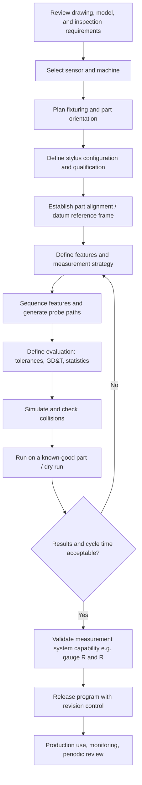

## CMM Part Programming


### Overview and Purpose

CMM part programming is the process of defining, sequencing, and automating the measurement of a workpiece on a coordinate measuring machine. A part program is a stored set of instructions that tells the machine which sensor to use, how to establish the workpiece coordinate system, which features to measure, where and how to probe them, how to evaluate the data against tolerances, and how to report the results.

A well-constructed part program delivers three outcomes:

- **Repeatability**: the same inspection method is executed identically on every part, removing operator-to-operator variation.
- **Efficiency**: optimized probe paths, stylus changes, and feature sequencing reduce cycle time.
- **Traceability**: the program, its revision, the qualification data, and the resulting report form a documented record of how a measurement was made.

**Key Points**

- A part program is not only a motion script. It encodes the **measurement strategy**, which strongly influences measurement uncertainty.
- Programs can be created online (teach-by-doing on the machine), offline (from CAD without machine time), or through automated feature extraction from annotated models.
- The program must be validated before release to production, including collision checks and a comparison against known-good results.

### Programming Methods

#### Manual (Teach-and-Repeat) Programming

The operator drives the machine with a joystick or jog box, probing features on a physical part. The software records the probe positions, feature types, and sequence, then stores them as a program. This is often called **online**, **learn mode**, or **teach** programming.

**Advantages**

- No CAD model required.
- Intuitive for simple parts and one-off jobs.
- Real-time confirmation that the probe can physically reach each feature.

**Limitations**

- Consumes machine time during programming.
- Program quality depends on the operator's skill.
- Nominal values come from the first-measured part rather than a design definition, so the sample part must be a good one. [Inference] This can bake an existing part's error into the nominal values if the operator does not correct them against the drawing.

#### CAD-Based Offline Programming

The programmer imports a CAD model (STEP, IGES, native formats, or JT) and defines features and paths in software without occupying the machine. The program is validated in a **virtual CMM** simulation and then downloaded.

**Advantages**

- Frees the machine for production measurement.
- Nominals are taken directly from the design model, removing transcription errors.
- Simulation reveals collisions and reachability problems before touching a real part.
- Supports **automatic feature recognition** and path generation in advanced software.

**Limitations**

- Requires an accurate CAD model and a correctly aligned fixture model.
- Simulation fidelity depends on the accuracy of the virtual machine, stylus, and fixture models.
- Real-part conditions (burrs, distortion, contamination) are not modeled.

#### Model-Based Definition (MBD) and PMI-Driven Programming

When the CAD model carries **product and manufacturing information (PMI)**, such as GD&T annotations, datum definitions, and tolerance zones, according to ASME Y14.5 or ISO GPS, the software can read these and build inspection plans automatically. Standards such as **QIF (Quality Information Framework, ANSI/DMSC QIF)** and **DMIS** provide neutral formats for exchanging features, measurement results, and plans.

**Key Points**

- PMI-driven programming reduces the manual interpretation of drawings and reduces mistakes in datum precedence and tolerance zone definition.
- The quality of the result depends on the completeness and semantic correctness of the PMI. Annotated models with only graphical (presentation) annotations, without semantic (machine-readable) PMI, cannot drive automatic programming.

#### Comparison of Programming Approaches

| Attribute | Online (Teach) | Offline (CAD-Based) | MBD / PMI-Automated |
| --- | --- | --- | --- |
| CAD required | No | Yes | Yes, with semantic PMI |
| Machine time used | High | Low | Low |
| Collision check before run | No (risk on first run) | Yes (simulation) | Yes (simulation) |
| Programming speed for complex parts | Slow | Moderate | Fast (once the model is ready) |
| Nominal source | Measured part | CAD | CAD/PMI |
| Best use | Simple/one-off parts | Production parts, complex geometry | High-volume families of parts with rich PMI |

### Programming Languages and Standards

#### Vendor-Native Programming

Most CMM software packages provide a graphical or icon-driven interface that stores programs in a proprietary format. Many also expose a scripting layer for loops, conditionals, and variable handling.

#### DMIS

**DMIS (Dimensional Measuring Interface Standard)** is a neutral, ASCII-based language (ISO 22093, ANSI/DMIS 105.x) that describes measurement instructions and results in a vendor-independent way. It enables portability of inspection programs across different CMM controllers and software, although in practice vendor-specific extensions can limit true portability. [Unverified] Portability in practice varies by vendor and version, so program transfer should always be verified on the target system.

DMIS statements typically include:

- Declarations of coordinate systems, feature nominals, and tolerances
- Sensor and stylus definitions
- Motion commands
- Measurement commands
- Evaluation and output commands

**Example: Simplified DMIS Fragment**

```plaintext
DMISMN/'EXAMPLE PART PROGRAM',05.2
UNITS/MM,ANGDEC
SNSDEF/PROBE,TRIGGER,0.0,0.0,0.0
FILNAM/'EXAMPLE'
F(BORE1)=FEAT/CIRCLE,INNER,CART,20.0,30.0,0.0,0.0,0.0,1.0,12.0
MODE/AUTO
GOTO/20.0,30.0,10.0
MEAS/CIRCLE,F(BORE1),4
ENDMES
OUTPUT/FA(BORE1)
ENDFIL
```

This example shows the general structure only. Exact syntax, required arguments, and permissible sensor definitions vary by DMIS version and by the controller's implementation, so verify against the specific system's documentation.

#### QIF

**QIF** is an XML-based standard that structures the entire quality information chain, including product definitions with PMI, measurement plans, measurement resources, measurement results, and statistics. It supports semantic linkage between a nominal feature, its tolerance, the measurement plan that inspects it, and the resulting measured value.

**Key Points**

- DMIS focuses mostly on **executable measurement instructions**, whereas QIF is broader and captures **plans, resources, and results** in a linked data model.
- Both standards reduce vendor lock-in but require software support on both the source and target sides.

### Part Program Development Workflow



#### Step 1: Requirements Analysis

Before any programming, determine:

- Which characteristics must be inspected (critical, major, minor)
- The tolerance values and the required **test uncertainty ratio** (commonly a 4:1 to 10:1 ratio between tolerance and measurement uncertainty is used as a guideline, and stricter or looser ratios may be set by internal or customer policy)
- The datum structure and datum precedence from the drawing
- Reporting and data output requirements (customer formats, SPC feed)
- Production volume, cycle time targets, and part variants

#### Step 2: Sensor and Stylus Selection

Choose the probing system as described in the probing systems topic: touch trigger for discrete prismatic features, scanning for form, or optical for delicate or micro-scale features. Then design the stylus:

- Select the shortest, stiffest stylus that reaches all required features.
- Plan the stylus orientations (probe head angles) and the number of qualifications required.
- Minimize the number of stylus changes because each change adds cycle time and qualification uncertainty.

#### Step 3: Fixturing and Part Orientation

Fixturing determines accessibility, rigidity, and repeatability.

- Hold the part without distorting it, since clamping stress can deform thin or flexible parts.
- Orient the part so that the maximum number of features can be reached with the fewest stylus orientations.
- Use modular fixturing systems with a known coordinate frame to allow quick repeat setup.
- Include the fixture model in the CAD simulation environment for collision avoidance.

**Key Points**

- Fixturing rigidity and thermal behavior directly influence measurement results.
- Let parts soak to the measurement room temperature before inspection, since dimensional results relate to the $20 \ °C$ reference temperature.

#### Step 4: Alignment and Datum Reference Frame

The **alignment** establishes the workpiece coordinate system (WCS) relative to the machine coordinate system (MCS). This is the single most consequential step in a part program because an incorrect alignment biases every subsequent result.

**Common Alignment Methods**

1. **3-2-1 alignment (plane-line-point)**:
   - Primary datum plane: constrains 3 degrees of freedom (one translation, two rotations)
   - Secondary datum line/plane: constrains 2 degrees of freedom (one translation, one rotation)
   - Tertiary datum point/plane: constrains the last translational degree of freedom
   - Follows the datum precedence in the drawing (A|B|C).
2. **Feature-based alignment (datum reference frame)**: uses features such as a plane, a bore axis, and a slot as datums, matching GD&T datum reference frames (DRF), including material condition modifiers where applicable.
3. **Best-fit (RPS) alignment**: uses registration points, and the software finds the rigid transform minimizing the distances between measured points and the nominal model. Common for freeform and sheet-metal parts.
4. **Iterative alignment**: refines a coarse alignment by repeating measurements of alignment features after each transform to improve accuracy.

The rigid transform from machine coordinates $\vec{p}_m$ to workpiece coordinates $\vec{p}_w$ is:

$$\vec{p}_w = R \, (\vec{p}_m - \vec{t})$$

where $R$ is the $3 \times 3$ rotation matrix (orthonormal, $R^T R = I$, $\det R = 1$) and $\vec{t}$ is the translation vector defining the origin of the WCS in machine coordinates.

A best-fit registration minimizes:

$$\min_{R, \vec{t}} \sum_{i=1}^{N} \left\| R \, \vec{p}_{m,i} + \vec{t} - \vec{q}_i \right\|^2$$

where $\vec{q}_i$ are the nominal (CAD) points corresponding to the measured points $\vec{p}_{m,i}$. This is a standard least-squares rigid registration problem, often solved with an SVD-based approach or iterative closest point (ICP) methods when correspondences are unknown.

**Example: 3-2-1 Alignment**

For a rectangular block:

1. Probe 4-6 points on the top face (datum A) and set that plane's normal as the +Z axis. This removes rotation about X and Y and fixes the Z origin.
2. Probe 2-3 points on one side face (datum B) and rotate about Z so that the face's normal aligns with $\pm$X or $\pm$Y. This fixes rotation about Z and the X origin.
3. Probe 1-2 points on an end face (datum C) and set the last origin component (Y).

The resulting coordinate system origin is at the intersection of the three datum features, matching the drawing.

**Key Points**

- Use enough points on each alignment feature to average out form error. A plane defined by only three points is highly sensitive to local surface deviations.
- Spread alignment points across the feature as widely as practical, because the angular uncertainty of a fitted plane or line improves with a larger point spread.
- Use **datum features from the drawing** and follow the datum precedence, otherwise the results may not represent the functional requirement.

#### Step 5: Feature Definition and Measurement Strategy

Each feature (plane, line, circle, cylinder, cone, sphere, slot, point, distance, curve, surface) is defined with:

- **Nominal geometry**: position, orientation, size (from CAD or drawing)
- **Tolerance**: size, form, orientation, position, profile, runout
- **Probing strategy**: number of points, distribution, probing direction, scan versus discrete
- **Evaluation method**: fitting algorithm (least squares, minimum zone, maximum inscribed, minimum circumscribed) and filter settings

**Number of Points per Feature (Practical Guidance)**

| Feature | Minimum Points (math) | Recommended (typical practice) |
| --- | --- | --- |
| Point | 1 | 1 (with defined vector) |
| Line | 2 | 4-6 |
| Plane | 3 | 6-12 or more for form |
| Circle | 3 | 8-16 (more for roundness) |
| Sphere | 4 | 9-20 |
| Cylinder | 5 | 3 levels x 6-8 points |
| Cone | 6 | 3 levels x 6-8 points |

These are general starting points, and the appropriate count depends on the form tolerance, the expected form error, and the required uncertainty. [Inference] Tighter form tolerances generally require more points, and scanning is often more efficient than many discrete points.

**Fitting Algorithms**

- **Least squares (Gaussian)**: minimizes the sum of squared residuals. It is the default for most size and location evaluation and is well-behaved statistically.
- **Minimum zone (Chebyshev)**: minimizes the maximum deviation and is used to evaluate form error, matching the tolerance zone definition for flatness, roundness, and similar.
- **Maximum inscribed / minimum circumscribed**: used for fitting the largest inscribed cylinder in a bore, or the smallest circumscribed cylinder around a shaft, matching functional (gauging) interpretations and material condition requirements.

For a circle fit with least squares, the algebraic objective is:

$$\min_{x_c, y_c, r} \sum_{i=1}^{N} \left( \sqrt{(x_i - x_c)^2 + (y_i - y_c)^2} - r \right)^2$$

**Key Points**

- The fitting algorithm must match the specification's requirement (e.g., the drawing may state a fitting method, or ISO 1101 / ASME Y14.5 conventions apply). A mismatch can produce results that differ by several micrometers on the same points.
- Outlier handling (rejection criteria) must be defined and documented, since silent removal of points can hide real defects.

#### Step 6: Probe Path Planning and Sequencing

Path planning defines the **motions** between measurements.

**Path Planning Principles**

- **Safe plane / clearance plane**: move to a defined safe height or surface offset before lateral moves, to avoid collisions.
- **Approach and retract distances**: use adequate approach distance so the machine reaches probing speed before contact, and retract sufficiently to clear the surface.
- **Probing speed**: set according to the probe and machine specification; too fast raises dynamic error, too slow wastes time and can increase thermal drift influence.
- **Approach direction**: approach along the surface normal wherever possible.
- **Feature sequencing**: group features by stylus orientation and by proximity to minimize stylus changes and travel distance.

Feature sequencing is a variant of the **traveling salesman problem** with constraints (stylus orientation grouping, collision avoidance). Most software uses heuristics rather than exact optimization. [Inference] Manual review of an automatically generated sequence often finds further savings, especially for stylus change ordering.

**Example: Sequencing Logic**

For a part with 20 features requiring three stylus orientations (A: vertical, B: 90 degrees, C: 45 degrees):

1. Measure alignment features with the vertical stylus (A).
2. Measure all features accessible with A.
3. Change to orientation B, measure all B features.
4. Change to orientation C, measure all C features.
5. Return to A only if needed for re-check features.

This ordering incurs two orientation changes rather than the potentially many that a purely geometric sequence would produce.

#### Step 7: Evaluation, Tolerancing, and Reporting

The program defines how measurement results are compared with tolerances.

- **Dimensional tolerances**: size (diameter, width), distance, angle.
- **Geometric tolerances**: form (flatness, straightness, circularity, cylindricity), orientation (parallelism, perpendicularity, angularity), location (position, concentricity, symmetry), runout (circular, total), profile (line, surface).
- **Datum references and material condition modifiers** (MMC, LMC, RFS) for position tolerances.

**True Position Calculation**

For a hole with nominal location $(x_n, y_n)$ and measured location $(x_m, y_m)$, the deviations are $\Delta x = x_m - x_n$ and $\Delta y = y_m - y_n$. The position deviation for a cylindrical tolerance zone is:

$$\text{Position} = 2\sqrt{\Delta x^2 + \Delta y^2}$$

This value (a diameter) is compared against the specified position tolerance zone diameter $T$. When an MMC modifier applies, a bonus tolerance is added:

$$T_{allowed} = T + (D_{actual} - D_{MMC}) \quad \text{(for an internal feature, where } D_{MMC} \text{ is the smallest allowed hole diameter)}$$

For an external feature such as a pin, the bonus is $D_{MMC} - D_{actual}$ where $D_{MMC}$ is the largest allowed pin diameter.

**Example: Position with MMC Bonus**

A hole is toleranced as $\varnothing 10.00 \pm 0.05$ with position $\varnothing 0.10 \ \text{M}$ relative to datums A|B|C. The MMC size (smallest hole) is $9.95$ mm. The measured actual diameter is $10.03$ mm, and the measured deviations are $\Delta x = 0.04$ mm and $\Delta y = 0.03$ mm.

- Position deviation: $2\sqrt{0.04^2 + 0.03^2} = 2 \times 0.05 = 0.10$ mm
- Bonus tolerance: $10.03 - 9.95 = 0.08$ mm
- Allowed position tolerance: $0.10 + 0.08 = 0.18$ mm

The hole passes, because $0.10 \le 0.18$.

**Output and Reporting**

- Feature-level results: nominal, actual, deviation, tolerance, pass/fail status.
- Graphical reports: balloon-annotated drawings, deviation color maps, form plots.
- Statistical outputs: Cp, Cpk, mean, standard deviation, control charts.
- Data export: CSV, QIF, and direct feeds to SPC/MES/QMS systems.

Process capability indices for a characteristic with tolerance limits USL and LSL, mean $\mu$, and standard deviation $\sigma$:

$$C_p = \frac{USL - LSL}{6\sigma}, \qquad C_{pk} = \min\left(\frac{USL - \mu}{3\sigma}, \frac{\mu - LSL}{3\sigma}\right)$$

### Program Structure and Programming Constructs

Advanced part programs use programming constructs beyond linear feature lists.

- **Variables and parameters**: store nominal values, tolerances, counts, and results so that one program can support a part family.
- **Loops**: repeat measurement for patterns (bolt circles, arrays of holes, multiple sections along a shaft).
- **Conditionals**: change behavior depending on measured results (e.g., re-probe if a point is an outlier, skip features that do not exist on a variant).
- **Subroutines/macros**: reusable modules for common tasks such as alignment, stylus qualification, or report generation.
- **User input and barcodes**: prompt for serial numbers or read them from a scanner to name result files.
- **External interfaces**: communication with PLCs, robots, and databases in automated cells.

**Example: Pseudocode for a Bolt-Circle Loop**

```plaintext
SET N_HOLES = 8
SET PCD = 100.0
SET START_ANGLE = 0.0
FOR i = 0 TO N_HOLES - 1
    angle = START_ANGLE + i * (360.0 / N_HOLES)
    x_nom = (PCD / 2) * COS(angle)
    y_nom = (PCD / 2) * SIN(angle)
    MOVE TO (x_nom, y_nom, SAFE_Z)
    MEASURE CIRCLE "HOLE_" + i AT (x_nom, y_nom, 0) DIAMETER 8.0 POINTS 8
    EVALUATE POSITION "HOLE_" + i TOL 0.15 DATUMS A|B|C
NEXT i
```

This is generic pseudocode illustrating the logic, not the syntax of a particular CMM package.

### Simulation, Verification, and Collision Avoidance

Before running a new program on a real part:

1. **Offline simulation**: check that the stylus, probe head, and machine structure do not collide with the part or fixture.
2. **Dry run** at reduced speed with the override control limited and an operator ready at the emergency stop.
3. **Trial run on a known-good or reference part**, comparing results with an independent measurement or a previous validated program.
4. **Repeatability check**: measure the same part several times to check the program's repeatability, and reposition the part between runs to check reproducibility.

**Key Points**

- The first physical execution of a new program is the highest collision risk. Reduced speed and careful observation are standard practice.
- Model accuracy matters: an incomplete fixture model or incorrect stylus geometry in the simulation can give false confidence.
- Keep a **program validation record** documenting who validated it, when, on which part, and what the results were.

### Measurement System Analysis for Programs

A part program should be evaluated as part of the complete measurement system.

- **Gauge repeatability and reproducibility (Gauge R&R)**: assess the variation from repeated measurements of the same parts by multiple operators or setups. For an automated CMM the appraiser factor may be replaced by setup or fixture reloading.
- **Bias and linearity studies**: compare the results against calibrated reference parts.
- **Measurement uncertainty evaluation**: per the ISO 15530 series, using experimental or simulation-based methods.

For a Gauge R&R study, the total variance decomposes as:

$$\sigma_{total}^2 = \sigma_{part}^2 + \sigma_{repeatability}^2 + \sigma_{reproducibility}^2$$

and the percentage of tolerance consumed by the measurement system is often expressed as:

$$\%GRR_{tol} = \frac{6 \, \sigma_{GRR}}{USL - LSL} \times 100\%$$

Common guidance (for example, from the AIAG MSA manual) treats under 10% as acceptable, 10 to 30% as conditionally acceptable depending on the application, and over 30% as generally unacceptable. Company or customer requirements may differ.

### Automation and Advanced Programming Topics

#### Automatic Feature Recognition and Path Generation

Modern software can detect features from a CAD model (holes, planes, slots) and automatically generate probing strategies with default point counts and paths. Results should always be reviewed, since default strategies may not match the drawing's tolerance requirements or the actual accessibility.

#### Scanning Path Programming

For scanning, define:

- **Scan type**: open line, closed curve (circle), patch (grid), or freeform surface path.
- **Point spacing or scan speed**: high enough to capture the shortest wavelength of interest, following the sampling criterion $\Delta s \le \lambda_{min}/2$ (with 4-5 samples per wavelength preferred).
- **Deflection setpoint (nominal force)**: within the probe's linear measuring range.
- **Entry and exit moves**: approach vectors that avoid impact and edge effects.

#### Adaptive and Intelligent Measurement

- **Adaptive point sampling**: increase the number of points where deviation is high or unexpected.
- **Re-measure on failure**: automatically repeat a feature if it fails or is flagged as an outlier, to distinguish real nonconformance from a probing error.
- **Dynamic alignment update**: recompute alignment from measured datum features on each part, accommodating fixture positioning variation.

#### Automated Cells and Integration

- **Robotic loading** and **pallet systems** allow lights-out operation.
- **Barcode / RFID** identification chooses the correct program automatically.
- **Statistical process control feedback**: measurement data can be fed back to machining centers for tool-offset correction. [Unverified] The effectiveness of closed-loop correction depends on the stability of the machining process and the latency of the feedback loop.

#### Program Revision Control and Governance

- Assign **unique program identifiers** linked to part number and drawing revision.
- Use **change control** to record modifications, reasons, approvals, and validation.
- Store master copies in a controlled repository and restrict edit permissions.
- Keep the **software version** used to create and validate the program on record, since software updates can alter behavior. Behavior may vary between software versions, so re-validate programs after major upgrades.

### Common Errors and Troubleshooting

| Symptom | Likely Cause | Corrective Action |
| --- | --- | --- |
| Results differ between operators | Manual alignment variation, fixture positioning | Automate alignment, standardize the fixture and loading procedure |
| Position results drift over a shift | Thermal drift, part not soaked | Control temperature, allow soak time, use compensation |
| Consistent bias on all features | Incorrect stylus qualification, wrong tip radius | Requalify stylus under measurement conditions |
| Occasional false triggers | Vibration, dirty tip, excessive machine acceleration | Reduce speed, clean the stylus, isolate the machine |
| Collision on first run | Missing fixture model, wrong stylus in simulation | Verify models, use reduced-speed dry run |
| Form error varies with the number of points | Undersampling, filter settings | Increase points or use scanning, define the filter explicitly |
| Program fails on a part variant | Hardcoded nominals or paths | Use parameters, conditionals, and variant-handling logic |
| Poor correlation with another CMM or gauge | Different alignment, fit algorithm, or filtering | Align strategies, compare with a common artefact |

### Best Practices

**Key Points**

- Start with the drawing's **datum structure** and follow it exactly in the alignment.
- Keep a **consistent measurement strategy** (points, filters, fit) documented per feature.
- Use **parameterization** so that programs remain maintainable and reusable.
- **Qualify styli** in conditions that match the measurement, and record the qualification results.
- Design for the **minimum number of stylus changes** and travel moves.
- **Simulate and dry-run** every new or edited program before production release.
- Perform **MSA/uncertainty evaluation** for critical characteristics, rather than assuming the CMM is adequate.
- Maintain **revision control** and traceability for every released program.
- Review programs periodically, especially after changes to the machine, probe, software, fixture, or drawing.

### Conclusion

CMM part programming turns a drawing or model into a repeatable, validated measurement procedure. It combines alignment, feature definition, probing strategy, path planning, evaluation logic, and reporting into a controlled program whose quality determines the trustworthiness of the measured results. Effective programs are built from the drawing's datum structure and tolerance requirements, use appropriate sensors and stylus configurations, define fitting and filtering explicitly, are verified through simulation and trial runs, and are governed by revision control and measurement system analysis. Standards such as DMIS and QIF support portability and data continuity, while model-based definition and automated path generation continue to shift programming effort from manual teaching toward model-driven workflows.

**Related Topics**

- Datum reference frames and GD&T evaluation on CMMs
- Alignment methods: best-fit, RPS, and iterative alignment
- Feature fitting algorithms and filtering (ISO 16610)
- Virtual CMM and task-specific uncertainty (ISO 15530 series)
- DMIS and QIF data exchange standards
- Freeform surface and profile measurement strategies
- Measurement System Analysis (Gauge R&R) for CMM programs
- Automated CMM cells, robotic loading, and SPC integration
- Thermal effects and environmental compensation in CMM programs
- Probe qualification and multi-sensor program design