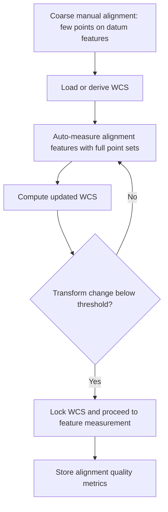

## Datum Setup and Alignment

### Overview and Purpose

Datum setup and alignment is the process of establishing a **workpiece coordinate system (WCS)** on a coordinate measuring machine so that every subsequent measurement is expressed relative to the datums defined on the engineering drawing or CAD model. A CMM natively reports positions in its own **machine coordinate system (MCS)**, defined by the machine's scales and axes. The workpiece, however, sits at an arbitrary position and orientation on the table. Alignment mathematically relates the two systems, and datum setup defines *which features* of the part anchor that relationship.

Alignment errors are systematic: they bias every feature evaluated in the WCS, so they are typically more damaging than random probing noise. A small rotation error in the primary datum, for example, produces position errors that grow with distance from the origin.

**Key Points**

- The alignment must **reproduce the functional datum reference frame (DRF)** specified by the drawing (ASME Y14.5 or ISO GPS, ISO 5459), not merely a convenient coordinate system.
- Datum precedence (primary, secondary, tertiary) determines which degrees of freedom each datum constrains and in what order.
- The datums on a drawing are **theoretically exact, ideal geometric elements**, whereas the **datum features** on the part are real, imperfect surfaces. The CMM must simulate the ideal datum from the real datum feature using the rules of the standard.
- Alignment quality depends on point count, point spread, probing strategy, fitting algorithm, and stylus qualification.

### Coordinate Systems and Degrees of Freedom

#### Machine Coordinate System

The MCS is a right-handed Cartesian system fixed to the machine, with origin defined by the machine's reference marks (home position). Scale readings give probe center positions in the MCS.

#### Workpiece Coordinate System

The WCS is a right-handed Cartesian system attached to the part, with origin and axes defined by datum features. Several WCS definitions can coexist in one program (for example, one per fixture position or per stage of manufacturing), and the software manages transformations between them.

#### Six Degrees of Freedom

A rigid body has six degrees of freedom (DOF): three translations ($T_x, T_y, T_z$) and three rotations ($R_x, R_y, R_z$). A complete datum reference frame must constrain all six, which is why the classical scheme is called **3-2-1**.

| Datum | Typical Feature | DOF Constrained | Count |
| --- | --- | --- | --- |
| Primary | Plane | $T_z, R_x, R_y$ | 3 |
| Secondary | Plane, line, or axis | $T_x, R_z$ | 2 |
| Tertiary | Plane or point | $T_y$ | 1 |

The mapping of specific axes to datums depends on the orientation chosen. The table shows the common case in which the primary plane normal is the $Z$ axis.

(svg_diagram)

<svg xmlns="http://www.w3.org/2000/svg" viewBox="0 0 640 380" width="640" height="380" font-family="Arial, sans-serif" font-size="13">
<title>3-2-1 Datum Constraint Scheme (svg_diagram)</title>
<rect x="0" y="0" width="640" height="380" fill="#ffffff" stroke="#cccccc" />
<text x="320" y="24" text-anchor="middle" font-size="15" font-weight="bold">3-2-1 Datum Constraint Scheme (svg_diagram)</text>

<polygon points="180,250 400,250 460,210 240,210" fill="#dfe8f2" stroke="#345" stroke-width="2" />
<polygon points="180,250 400,250 400,300 180,300" fill="#c7d5e6" stroke="#345" stroke-width="2" />
<polygon points="400,250 460,210 460,260 400,300" fill="#b3c4da" stroke="#345" stroke-width="2" />

<circle cx="230" cy="285" r="6" fill="#d33" />
<circle cx="350" cy="285" r="6" fill="#d33" />
<circle cx="290" cy="225" r="6" fill="#d33" />
<text x="120" y="330" fill="#d33">Primary A: 3 points (plane)</text>

<circle cx="220" cy="270" r="0" fill="none" />

<circle cx="430" cy="245" r="6" fill="#28a" />
<circle cx="430" cy="275" r="6" fill="#28a" />
<text x="470" y="300" fill="#28a">Secondary B: 2 points</text>

<circle cx="340" cy="230" r="6" fill="#3a3" />
<text x="470" y="200" fill="#3a3">Tertiary C: 1 point</text>

<line x1="180" y1="250" x2="180" y2="150" stroke="#000" stroke-width="2" />
<text x="188" y="150">Z</text>
<line x1="180" y1="250" x2="90" y2="250" stroke="#000" stroke-width="2" />
<text x="80" y="245">X</text>
<line x1="180" y1="250" x2="140" y2="225" stroke="#000" stroke-width="2" />
<text x="120" y="222">Y</text>
<text x="320" y="360" text-anchor="middle" font-size="11">Point counts indicate the minimum constraint; real alignments use more points.</text>
</svg>

### Datum Concepts from GD&T

#### Datum, Datum Feature, and Datum Feature Simulator

- **Datum**: a theoretically exact plane, axis, or point derived from the true geometric counterpart of a datum feature.
- **Datum feature**: the actual physical feature on the part that establishes the datum.
- **Datum feature simulator**: a physical or mathematical surface that contacts the datum feature (in a gauge, the fixture surface; on a CMM, a computed geometric element from a fitting rule).

On a CMM, the datum feature simulator is a *mathematical* construct computed from the measured points. The fitting rule used must correspond to the standard's simulator definition, otherwise the result deviates from the functional intent.

#### Datum Fitting Rules (Simulator Definitions)

For a planar datum feature, the standard's simulator is a plane that contacts the high points of the surface, typically resting on at least three high points, such that the material of the part lies on one side and rocking is minimized. A least-squares plane is not the same thing, and the two can differ by an amount comparable to the flatness error of the datum feature.

| Feature Type | Simulator Concept | Common CMM Fit |
| --- | --- | --- |
| Plane | Tangent plane on the high points, stable contact | Minimum-zone-based tangent plane or least-squares (as permitted) |
| Internal cylinder (hole) | Largest inscribed cylinder (MMB/actual mating envelope) | Maximum inscribed |
| External cylinder (pin) | Smallest circumscribed cylinder | Minimum circumscribed |
| Width (slot/tab) | Parallel-plane pair at contact | Maximum inscribed / minimum circumscribed pair |

**Key Points**

- ISO GPS (ISO 5459 with ISO 14405 and ISO 1101) and ASME Y14.5 differ in how they treat fit and filtering defaults. Check the drawing's governing standard and any stated modifiers before selecting the fit method.
- If the drawing does not specify a rule, many organizations document a default (for example, least-squares for size evaluation), and that default should be recorded in the inspection plan. [Inference] Where the datum feature has significant form error, the choice of simulator method can change downstream results by more than the measurement uncertainty.

### Datum Reference Frame Construction

#### Datum Precedence

Datum precedence is read left to right in the feature control frame, for example `A | B | C`. Each datum is built in that order, and each subsequent datum is constrained by those before it (orientation is inherited from the primary, and so on).

The construction sequence is:

1. **Primary datum A**: fit the datum feature simulator to the measured data. This fixes its normal direction (or axis direction) and a location along that normal.
2. **Secondary datum B**: fit to the datum feature while constraining its orientation to be perpendicular (or otherwise specified) to A.
3. **Tertiary datum C**: fit to the datum feature while constraining its orientation relative to A and B.

This is why alignment is not the same as measuring three independent planes and intersecting them: the secondary and tertiary simulators are **constrained** by the primary, and orientation errors of the secondary feature relative to the primary are not allowed to rotate the frame.

#### Common Alignment Approaches

##### Plane-Line-Point (3-2-1)

The classical manual approach:

1. Measure the primary plane (at least 3 points, typically 6 or more), and set its normal as an axis, for example $+Z$. Set the plane's location as the Z origin.
2. Measure a secondary feature (a plane or a line projected into the primary plane) and rotate about Z so that its direction aligns with an axis, for example $X$ or $Y$. Set the origin along the perpendicular axis.
3. Measure the tertiary feature (a plane or point) and set the remaining origin component.

**Example: Rectangular Block**

The drawing specifies datums A (bottom face), B (long side face), C (end face).

1. Probe 6 points on face A, spread across the surface. Fit a plane and set its normal to $+Z$, origin $Z = 0$ on the plane.
2. Probe 4 points on face B, spread along the length. Project into the plane $Z = 0$ to form a line, and rotate about Z so the line is parallel to X. Set $Y = 0$ on the line.
3. Probe 3 points on face C. Fit a plane, and set $X = 0$ on that plane (or project a single point).

The resulting WCS origin is at the intersection of A, B, and C, and its axes follow the drawing.

##### Feature-Based Alignment with Cylinders

For parts with datums defined by bores and faces (very common in machined housings):

- **Primary A**: a plane (face).
- **Secondary B**: a bore whose axis defines two translations (X and Y position of the axis in the primary plane).
- **Tertiary C**: a second bore, slot, or pin defining rotation about the axis of B (via the direction from B to C).

In this case the origin is on the axis of B at the primary plane, and the rotation about Z is set by the direction from the center of B to the center of C.

**Example: Two-Hole Alignment**

1. Plane A: measure 8 points on the mounting face. Set $Z$ axis normal, $Z = 0$.
2. Bore B: measure a circle at each of two depths (or scan), fit a cylinder with the maximum inscribed rule if MMB applies, and project its axis onto plane A. Set the projected point as the origin $(X, Y) = (0, 0)$.
3. Bore C: measure similarly, and project its axis point onto plane A. Rotate about Z so that the line from B to C aligns with the $X$ axis.

Rotation uncertainty about Z is inversely related to the distance between B and C, so a larger separation gives a better rotational alignment.

##### Best-Fit (RPS) Alignment

Used for freeform, sheet-metal, castings, and composites, where no simple geometric datum exists. The software finds the rigid-body transform that minimizes the distance between measured points and the nominal CAD surface, sometimes with **reference point system (RPS)** weights and constraints that restrict certain DOF.

The registration minimizes:

$$\min_{R, \vec{t}} \sum_{i=1}^{N} w_i \, d^2\!\left(R\,\vec{p}_i + \vec{t},\; S\right)$$

where $\vec{p}_i$ are the measured points, $S$ is the nominal surface, $d(\cdot, S)$ is the point-to-surface distance, and $w_i$ are weights.

For known point correspondences $\vec{p}_i \leftrightarrow \vec{q}_i$, the closed-form SVD solution is:

1. Compute centroids $\bar{p}$ and $\bar{q}$, and centered vectors $\vec{p}_i' = \vec{p}_i - \bar{p}$ and $\vec{q}_i' = \vec{q}_i - \bar{q}$.
2. Form the covariance matrix $H = \sum_i \vec{p}_i' \, \vec{q}_i'^{\,T}$.
3. Compute the SVD $H = U \Sigma V^T$.
4. The rotation is $R = V \, \text{diag}(1, 1, \det(V U^T)) \, U^T$, which prevents reflections.
5. The translation is $\vec{t} = \bar{q} - R \, \bar{p}$.

When correspondences are unknown (point-to-surface), iterative closest point (ICP) or a Gauss-Newton scheme refines the alignment iteratively.

**Key Points**

- Best-fit alignment distributes error across the whole surface, which can mask a localized defect or shift the errors into a different region. It should only be used when the drawing permits it, since a datum-based specification requires a datum-based alignment.
- A best-fit alignment that allows all 6 DOF to float may hide a systematic offset of the entire part. Constrained best-fit (locking certain axes) is often more appropriate.

##### Iterative Alignment

Since the WCS is initially determined from a rough alignment, features measured at the coarse stage are located with some error. The **iterative alignment** repeats the alignment measurement using the updated coordinate system (probing along the new normals and at positions relative to the improved origin) until the transform converges within a tolerance.

The procedure:

1. Perform a coarse (manual or few-point) alignment.
2. Re-measure the alignment features using the automatically generated paths in the coarse WCS.
3. Recompute the alignment.
4. Repeat until the change in the transform parameters falls below a threshold (for example, translation change less than a fraction of the required uncertainty).

This is essentially a fixed-point iteration, and it typically converges in two to four iterations when the initial error is small relative to the surface features.

### Mathematical Framework

#### Rigid Transformation

The transformation from machine coordinates $\vec{p}_m$ to workpiece coordinates $\vec{p}_w$:

$$\vec{p}_w = R \, (\vec{p}_m - \vec{t})$$

where $R$ is a $3 \times 3$ orthonormal rotation matrix ($R^T R = I$, $\det R = 1$), and $\vec{t}$ is the WCS origin expressed in the MCS.

In homogeneous coordinates:

$$\begin{bmatrix} \vec{p}_w \\ 1 \end{bmatrix} = \begin{bmatrix} R & -R\,\vec{t} \\ \vec{0}^T & 1 \end{bmatrix} \begin{bmatrix} \vec{p}_m \\ 1 \end{bmatrix}$$

The rotation matrix columns (or rows, depending on convention) are the unit vectors of the WCS axes expressed in the MCS. These are formed directly from the datum features:

- $\hat{z}$ = normal of the primary plane
- $\hat{x}$ = normalized component of the secondary direction perpendicular to $\hat{z}$
- $\hat{y}$ = $\hat{z} \times \hat{x}$

For a secondary direction vector $\vec{d}$ (for example the direction of the line formed by the secondary plane intersected with the primary), the Gram-Schmidt step is:

$$\hat{x} = \frac{\vec{d} - (\vec{d} \cdot \hat{z}) \hat{z}}{\left\| \vec{d} - (\vec{d} \cdot \hat{z}) \hat{z} \right\|}$$

$$\hat{y} = \hat{z} \times \hat{x}$$

and $R$ has $\hat{x}$, $\hat{y}$, $\hat{z}$ as its rows (mapping MCS to WCS).

#### Plane Fitting

For a set of measured points $\vec{p}_i$, the least-squares plane passes through the centroid $\bar{p}$, and its normal $\hat{n}$ is the eigenvector of the covariance matrix corresponding to the smallest eigenvalue:

$$C = \sum_{i=1}^{N} (\vec{p}_i - \bar{p})(\vec{p}_i - \bar{p})^T$$

The residuals $r_i = \hat{n} \cdot (\vec{p}_i - \bar{p})$ give the form deviations, and the flatness under a least-squares fit is $\max r_i - \min r_i$ (this is not the same as the minimum-zone flatness, which is generally smaller or equal).

#### Angular Uncertainty of a Fitted Plane or Line

For a line fitted through $N$ points spread over a length $L$, with independent point standard uncertainty $\sigma$, the angular standard uncertainty of the line direction is approximately:

$$\sigma_\theta \approx \frac{\sigma}{L} \cdot \sqrt{\frac{12}{N}}$$

for points uniformly distributed over the length (small-angle approximation, ignoring higher-order terms). This shows the two levers for improving rotational alignment: increasing point spread $L$ and, more weakly, the number of points $N$.

**Example: Effect of Datum Feature Length**

With $\sigma = 2 \ \mu\text{m}$ and $N = 4$ points:

- $L = 20$ mm: $\sigma_\theta \approx \dfrac{0.002}{20}\sqrt{3} \approx 1.7 \times 10^{-4}$ rad
- $L = 100$ mm: $\sigma_\theta \approx \dfrac{0.002}{100}\sqrt{3} \approx 3.5 \times 10^{-5}$ rad

At a distance of 200 mm from the origin, the position error induced by the rotation is $200 \times 1.7 \times 10^{-4} = 34 \ \mu\text{m}$ for the short datum line versus $200 \times 3.5 \times 10^{-5} = 7 \ \mu\text{m}$ for the long one. This illustrates why a short datum feature should not be used to control the rotation of a large part when a longer alternative exists.

#### Lever-Arm Effect

Any angular alignment error $\delta\theta$ produces a linear position error at a feature located at distance $r$ from the rotation center:

$$\delta x \approx r \cdot \delta\theta$$

This is the reason alignment errors scale with part size and why the primary datum (which controls two rotations) should be the largest, most stable surface.

### Probing Strategy for Datum Features

#### Point Count and Distribution

| Datum Feature | Minimum | Recommended Practice |
| --- | --- | --- |
| Plane | 3 | 6-12 or more; spread near the corners and across the surface |
| Line (from plane intersection) | 2 | 4-6; spread along the length |
| Bore (circle) | 3 | 6-12 per section; two or more sections for the axis |
| Cylinder | 5 | 3 levels x 6-8 points |
| Slot (width) | 2 per side | 3-4 per side, spread along the length |

Points for a plane should not be arranged collinearly, because the plane's orientation about the line of points would be undefined, and near-collinear arrangements yield poor conditioning. Spread the points across the surface as broadly as feasible while avoiding edges.

#### Probing Direction

- Probe normal to the surface (cosine error and lobing effects are minimized).
- Use a consistent stylus orientation for the datum features, or requalify and align if the stylus changes.
- Avoid probing within a few millimeters of edges, where burrs, chamfers, and edge-rounding effects arise.

#### Handling Datum Feature Form Error

If the datum feature has appreciable form error (for example, a warped plate or a cast surface), the choice of point locations and count changes the result. Strategies include:

- Using more points or scanning to characterize the surface.
- Applying the standard's simulator rule (tangent plane on high points).
- Locating the probing points at the **contact positions** specified by the drawing (for example, datum targets).

#### Datum Targets

For irregular or cast surfaces, **datum targets** (points, lines, or areas) specify exactly where on the surface the datum is to be established (ASME Y14.5 and ISO 5459). The CMM measures the prescribed target locations, for instance, three target points for the primary plane, with the datum plane defined through the target points rather than the entire surface.

**Key Points**

- When datum targets are specified, the measurement must be made at those target locations, with the target size or area as defined on the drawing.
- Datum target points are usually placed with a nominal position (basic dimensions) from other datums or edges.

### Material Condition and Movable Datums

#### Datum Modifiers

Datum features of size (holes, pins, slots, tabs) can be referenced at **RFS (regardless of feature size)**, **MMB (maximum material boundary)**, or **LMB (least material boundary)** (ASME Y14.5 terms; ISO GPS uses the (M) and (L) modifiers with related definitions).

- **RFS**: the datum axis is derived from the actual mating envelope and does not shift. The datum is fixed, no allowance for movement.
- **MMB**: the datum feature simulator has a fixed size at the maximum material boundary, so the actual feature can shift or rotate within the difference between its actual size and the MMB. This is the **datum shift** (or movable datum).

#### Datum Shift

When a datum feature of size is referenced at MMB, and the feature departs from MMB, the part can shift within the simulator. The allowed shift is:

$$\text{Shift}_{max} = \left| D_{actual} - D_{MMB} \right|$$

(in diameter, or per side equivalently in radius terms depending on how it is defined).

Evaluating datum shift on a CMM requires the software to construct the fixed-size simulator and to compute the measured feature's position relative to the simulator, accounting for the allowed shift. This is more complex than a simple axis alignment and is sometimes referred to as **functional gauging** or **virtual gauge** evaluation.

**Example: Datum Feature B at MMB**

A bore is dimensioned $\varnothing 20.00^{+0.05}_{0}$. MMB is the smallest allowed diameter, $20.00$ mm. The measured actual size is $20.04$ mm. The available datum shift (diameter) is $20.04 - 20.00 = 0.04$ mm, so a part positioned on a fixed $\varnothing 20.00$ pin gauge could shift by up to $0.02$ mm radially. A CMM evaluation that used an RFS axis instead of the MMB simulator would neglect this allowance and could reject parts that a functional gauge would accept.

**Key Points**

- Verify whether each datum feature of size on the drawing carries a modifier before choosing the alignment method.
- Not all CMM software handles datum shift automatically; where the software does not, a functional gauge simulation or a documented manual calculation is necessary. [Unverified] Capabilities vary by software package and version, so verify against the actual software documentation.

### Alignment in Different Part Types

#### Prismatic Parts

Use datum planes and bores according to the drawing; 3-2-1 or feature-based alignment. Iterative alignment typically improves the results when the part is initially misaligned.

#### Rotational Parts (Shafts, Turbine Discs)

Datum axes are often defined by two journals or bearing surfaces (a common axis A-B). The alignment defines the Z axis along the datum axis, with the origin at a shoulder face or a specified plane.

Construction of a common axis from two cylinders A and B:

- Fit a cylinder to each datum feature.
- The datum axis is the line through the two fitted cylinder centers (for a strict "common axis" definition), or the axis of a combined fit through both cylinders' points, according to the standard's rule.

Rotation about the datum axis is then defined by an angular reference such as a keyway, a hole, or a flat.

**Key Points**

- Use widely spaced datum cylinders for better axis definition (lever-arm effect).
- Runout evaluations reference the datum axis, so poor axis alignment directly biases runout results.

#### Freeform, Sheet-Metal, and Composite Parts

- Use RPS or datum-target-based alignment as defined by the drawing or engineering standard.
- Constrained best-fit (for example, to locking-hole and slot features) may reproduce the assembly condition more faithfully than an unconstrained best-fit.
- Flexible parts may require **fixturing that simulates the assembly clamped state**, since free-state measurement can differ significantly. Free-state and restrained-state requirements should be checked against the drawing note.

#### Multi-Setup and Multi-Orientation Parts

For parts requiring more than one setup (for example, inspection of both sides), establish a **common reference** across setups, such as:

- Alignment features accessible in both setups (for example, holes through the part).
- Fixture-mounted reference spheres or artefacts.
- Best-fit registration of overlapping measured regions.

Each re-alignment introduces additional uncertainty, so the number of setups should be minimized.

### Fixturing and Alignment Interaction

- **Repeatable fixturing** (locating pins, dowels, kinematic mounts) allows a stored alignment to be reused, reducing per-part alignment time. The fixture position itself must then be established (measured with a reference artefact) and periodically verified.
- **Part-to-fixture repeatability** contributes directly to the reproducibility of results, unless the part alignment is re-measured on every part.
- **Clamping distortion** alters the part shape and hence the datum features. Clamp at points that do not deflect the datum features, and verify by measuring with different clamp forces if in doubt.

### Alignment Verification and Quality Metrics

After an alignment is computed, verify it before trusting subsequent measurements.

- **Residuals of datum feature fits**: unexpectedly large form error on a datum plane may indicate a probing problem, contamination, or a non-flat datum.
- **Repeat alignment test**: re-measure the alignment features and confirm that the transform parameters agree within the expected uncertainty.
- **Check features**: measure a feature whose position relative to the datums is well known (from a calibrated reference part or a prior validated measurement) and compare.
- **Alignment reproducibility**: reload the part several times, re-run the alignment, and evaluate the spread of a selected feature position. This can be part of a Gauge R&R study.
- **Best-fit quality**: report root mean square (RMS) and maximum deviation after best-fit alignment, and check that the RMS is consistent with expected form and probing errors.

RMS deviation:

$$\text{RMS} = \sqrt{\frac{1}{N} \sum_{i=1}^{N} d_i^2}$$

**Example: Alignment Reproducibility Check**

A part is reloaded 10 times and aligned each time. The position of a reference bore in X has a standard deviation of $3 \ \mu\text{m}$. If the position tolerance zone half-width is $50 \ \mu\text{m}$, the alignment reproducibility consumes $6\sigma = 18 \ \mu\text{m}$ of the $100 \ \mu\text{m}$ zone, or 18%. Whether this is acceptable depends on the organization's criteria, but it should be recorded and combined with other uncertainty contributions.

### Uncertainty Contributions from Alignment

Alignment contributes to the task-specific uncertainty of every dependent measurement. Typical contributors:

- Datum feature form error and the fitting rule applied
- Probing errors on datum features (probe qualification, repeatability)
- Number and distribution of points
- Machine geometric errors over the datum feature extent
- Thermal expansion of the part between datum features
- Fixture instability or clamping distortion

The first-order propagation for a position measured at distance $r$ from the alignment center, with translation uncertainty $u_t$ and angular uncertainty $u_\theta$, is:

$$u_{pos} \approx \sqrt{u_t^2 + (r \, u_\theta)^2}$$

which combines the two contributions in quadrature under the assumption of independence.

### Common Errors and Troubleshooting

| Symptom | Likely Cause | Corrective Action |
| --- | --- | --- |
| Positions consistently off by an increasing amount with distance | Rotation error in alignment (short or poorly distributed datum features) | Use widely spaced points, larger datum features, or iterate the alignment |
| Results differ between operators | Manual alignment with different point locations | Standardize the probing pattern, automate alignment |
| Alignment residuals unusually large | Contaminated or damaged datum surface, wrong feature type | Clean the part, inspect the datum feature, check the program |
| Good parts fail position on MMB datum features | RFS datum used where MMB is specified (datum shift ignored) | Apply movable datum or functional gauging evaluation |
| Results change when the part is reloaded | Poor fixturing repeatability, clamping distortion | Improve the fixture, use kinematic location, and reduce clamping force |
| Best-fit results hide local errors | Unconstrained best-fit with all DOF floating | Use constrained best-fit or datum-based alignment as per the drawing |
| Frame flips or axes mirrored | Left-handed coordinate system created by wrong axis order | Verify axis definitions and right-hand rule ($\hat{z} = \hat{x} \times \hat{y}$) |
| Alignment good but position errors remain | Stylus qualification error, wrong tip radius | Requalify the stylus and repeat |

### Best Practices

**Key Points**

- Read the **datum structure and modifiers** on the drawing first, and reproduce the DRF exactly, including precedence and material condition.
- Choose **large, stable, well-separated datum features** for the primary and secondary constraints wherever the drawing permits.
- Use **enough well-distributed points** on datum features and probe normal to the surface.
- **Qualify the stylus** under the conditions used for alignment and keep the same stylus for the alignment features where possible.
- Apply an **iterative alignment** when the initial part position is uncertain, and lock the alignment before feature measurement.
- Document the **fitting rules** (least-squares, tangent plane, maximum inscribed) and any filtering, and ensure they match the drawing standard.
- Verify the alignment with **check features** or **reload tests**, and record alignment residuals.
- Minimize the **number of setups**, and use common reference artefacts when multiple setups are unavoidable.
- Use **parameterized alignment routines** in part programs to keep the method consistent across part variants.
- Re-validate alignment routines after changes to the fixture, probe, software version, or drawing revision.

### Conclusion

Datum setup and alignment translate the drawing's datum reference frame into a workpiece coordinate system on the CMM. A correct alignment constrains all six degrees of freedom in the order of datum precedence, uses fitting rules that reproduce the standard's datum feature simulators, and applies material condition modifiers and datum targets as specified. Because alignment errors are systematic and scale with distance through the lever-arm effect, they must be controlled through sound feature selection, adequate point count and spread, iterative refinement, and verification. Best-fit and RPS methods extend alignment to freeform parts, while datum shift and functional gauging address movable datums. A documented, verified alignment strategy is one of the most effective ways to improve the accuracy and reproducibility of every measurement that follows.

**Related Topics**

- Datum reference frames and datum precedence in GD&T (ASME Y14.5, ISO 5459)
- Datum targets and datum feature simulators
- Movable datums, material condition modifiers, and functional gauging
- Best-fit, RPS, and ICP registration algorithms
- Fixturing design and kinematic location for CMM inspection
- Feature fitting algorithms: least squares, minimum zone, maximum inscribed, minimum circumscribed
- Task-specific measurement uncertainty and alignment contribution (ISO 15530 series)
- Multi-setup and multi-sensor registration strategies
- Alignment of rotational parts and common-axis datums
- Gauge R&R and reproducibility studies for CMM alignment