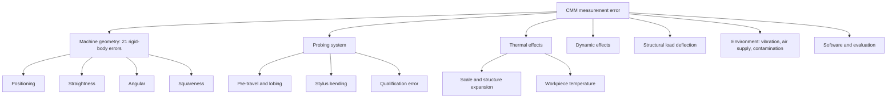
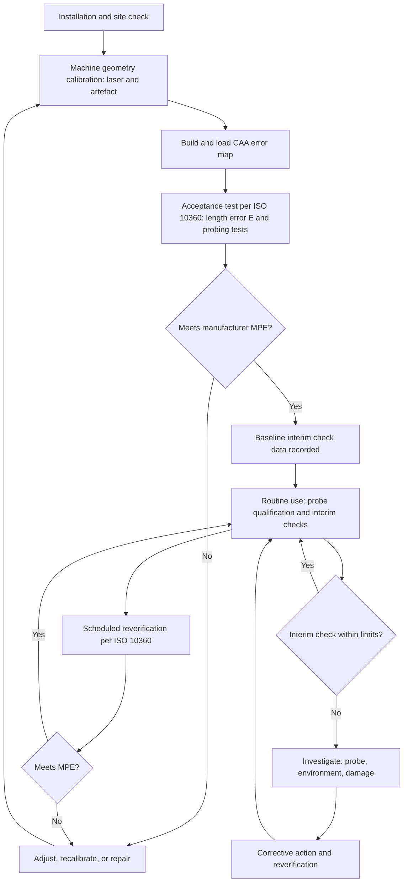

## CMM Calibration and Performance Verification

### Overview and Terminology

A coordinate measuring machine is a complex, multi-axis measuring system whose accuracy depends on its geometry, scales, probing system, structure, thermal behavior, software error mapping, and environment. **Calibration** and **performance verification** are the activities that quantify and maintain this accuracy over the machine's life. Although the terms are often used interchangeably in workshop practice, they have distinct meanings.

| Term | Meaning | Typical Outcome |
| --- | --- | --- |
| **Calibration (of the machine)** | Determination of the machine's geometric errors, usually to build or update a **computer-aided accuracy (CAA)** error map applied in the controller | Error-correction tables (volumetric compensation) |
| **Acceptance test** | Test performed at installation to demonstrate that the machine meets the manufacturer's stated **maximum permissible errors (MPE)** | Pass/fail against the manufacturer's specification |
| **Reverification (periodic test)** | Repeat of a subset of the acceptance test at intervals to confirm continued conformity | Pass/fail against the MPE, or against the user's chosen limits |
| **Interim check** | Quick, frequent check between reverifications using a simple artefact | Trend data, early detection of drift or damage |
| **Probe qualification** | Determination of the effective stylus tip radius and location for use in compensation | Stored tip parameters |
| **Task-specific uncertainty evaluation** | Determination of the uncertainty of a particular measurement task | Uncertainty statement per feature or characteristic |

**Key Points**

- Machine calibration (error mapping) corrects systematic geometric errors, whereas performance verification **demonstrates** that the residual errors are within the specified limits.
- Verification results are stated in terms of **MPE**, and a passing result does not equal a zero-error machine. It shows that the errors lie within the specified limit, under the test conditions.
- Traceability to the SI meter is established through calibrated artefacts and instruments (gauge blocks, step gauges, ball plates, laser interferometers), each with a documented calibration chain and uncertainty.
- Verification reports the machine's performance on the **test artefacts**, which are typically simple geometries. Task-specific uncertainty must be evaluated separately for complex measurements.

### Sources of CMM Error

Understanding the error sources clarifies what each calibration and verification method is designed to detect.

#### Geometric Errors of a Cartesian CMM

A three-axis Cartesian machine has **21 rigid-body geometric errors**:

- **18 axis-related errors**: for each of the three axes, six errors (one positioning error, two straightness errors, and three angular errors: pitch, yaw, and roll).
- **3 squareness errors** between axis pairs (XY, XZ, YZ).

| Error Class | Count | Description |
| --- | --- | --- |
| Linear positioning | 3 | Scale error along each axis |
| Straightness | 6 | Two orthogonal straightness deviations per axis |
| Angular | 9 | Pitch, yaw, and roll per axis |
| Squareness | 3 | Non-orthogonality between axis pairs |
| **Total** | **21** |  |

The volumetric error vector at a point is the sum of the contributions of all 21 errors (with Abbe and lever-arm effects). To first order, using small-angle approximations, the position error of the probe at coordinates $(x, y, z)$ can be described as:

$$\vec{E}(x,y,z) = \vec{E}_X(x) + \vec{E}_Y(y) + \vec{E}_Z(z) + \vec{\Theta}_X(x) \times \vec{r}_X + \vec{\Theta}_Y(y) \times \vec{r}_Y + \vec{\Theta}_Z(z) \times \vec{r}_Z + \text{squareness terms}$$

where $\vec{E}_i$ are the translational errors of axis $i$ (positioning and two straightness), $\vec{\Theta}_i$ are the angular errors of axis $i$, and $\vec{r}_i$ are the lever arms from the axis reference to the probe tip. The exact form depends on the machine's kinematic chain, so this expression is a schematic representation rather than a machine-specific model.

#### Other Error Sources

- **Probing system errors**: pre-travel variation, stylus bending, qualification errors, dynamic effects.
- **Thermal errors**: scale and structure expansion, thermal gradients, workpiece temperature deviation from $20 \ °C$.
- **Dynamic errors**: structural vibration, acceleration-induced deflection.
- **Structural deformation**: deflection due to the workpiece mass, machine weight distribution, and table loading.
- **Environmental influences**: vibration, air pressure (for air-bearing machines), humidity, and contamination.
- **Software and data-processing errors**: fitting algorithm implementation, filtering, alignment, and rounding.

### Traceability and Reference Standards

Traceability requires an unbroken chain of calibrations from the CMM result to the SI definition of the meter, each step with a stated uncertainty.

#### Common Reference Artefacts

| Artefact | Use | Key Properties |
| --- | --- | --- |
| **Gauge blocks** | Length measurement error tests, calibration of step gauges | Very low uncertainty (tens of nanometers for high grades), stable, low thermal expansion options (e.g., ceramic, steel) |
| **Step gauges** | Length error along an axis, multiple lengths in one setup | Multiple calibrated step positions, often ceramic or steel |
| **Ball bars (ball beams)** | Length error in various orientations | Two precision spheres at a calibrated separation, low-CTE stem (carbon fiber or Invar) |
| **Ball plates / hole plates** | Volumetric error assessment, multi-position checks | Grid of calibrated spheres or holes, calibrated coordinates |
| **Reference spheres (calibration spheres)** | Probe qualification, probing error tests | Low form error, calibrated diameter, mounted on a rigid stem |
| **Ring gauges and plug gauges** | Diameter checks, bore probing verification | Calibrated diameter and roundness |
| **Laser interferometer** | Axis positioning error, straightness, angular, squareness | Wavelength-based traceability, environmental compensation required |
| **Autocollimator / electronic levels** | Angular and squareness measurements | High angular resolution |
| **Straightedge / optical square** | Squareness and straightness references | Calibrated geometry |

#### Calibration Hierarchy

1. National metrology institute (primary realization of the meter).
2. Accredited calibration laboratory (ISO/IEC 17025) provides calibrated artefacts with stated uncertainty.
3. In-house reference artefacts calibrated against the accredited lab's artefacts.
4. Working artefacts and interim check standards used on the shop floor.

**Key Points**

- The uncertainty of the reference artefact must be small compared with the MPE it is used to verify. ISO 10360 and general practice require that the artefact's calibration uncertainty be a small fraction of the tolerance being tested (a common guideline is one-fourth or less of the MPE being tested, though the specific requirement is set in the applicable standard and by the accreditation body). [Inference] In practice, many laboratories aim for a larger margin to leave room for the other uncertainty components of the test.
- Artefact thermal expansion coefficient and measured temperature must be included in the test calculation (see the thermal correction below).

### ISO 10360 Series: Acceptance and Reverification Tests

The ISO 10360 series defines standard procedures and terminology for testing CMMs, enabling comparison among machines and manufacturers. The series comprises multiple parts, each addressing a different type of machine or sensor.

| Part | Scope |
| --- | --- |
| ISO 10360-1 | Vocabulary |
| ISO 10360-2 | CMMs used for measuring linear dimensions |
| ISO 10360-3 | CMMs with the axis of a rotary table as the fourth axis |
| ISO 10360-4 | CMMs used in scanning measuring mode |
| ISO 10360-5 | CMMs using contact probing systems |
| ISO 10360-6 | Estimation of errors in computing Gaussian associated features (software verification) |
| ISO 10360-7 | CMMs equipped with imaging probing systems |
| ISO 10360-8 | CMMs with optical distance sensors |
| ISO 10360-9 | CMMs with multiple probing systems |
| ISO 10360-10 | Laser trackers for measuring point-to-point distances |
| ISO 10360-11 | CMMs using computed tomography (X-ray CT) |
| ISO 10360-12 | Articulated arm CMMs |

The specific part numbering and scope have been revised across editions (for example, scanning tests were moved from part 4 into part 5 in the 2010 revision). The exact designations in force depend on the edition applied, so verify against the edition cited in the contract or accreditation scope.

#### ISO 10360-2: Length Measurement Error

The central test of a CMM's volumetric performance. The parameter is the **length measurement error** $E_{L}$ (in earlier editions, $E_0$ or $E$), determined by measuring calibrated lengths in multiple positions and orientations.

**Test Procedure (Outline)**

1. Use **five calibrated lengths** (for example, gauge blocks, step gauge, or ball bar), spanning a range of approximately up to 66% of the machine's longest space diagonal (the exact requirement is set in the standard).
2. Measure each length **three times** in each of **seven positions/orientations** in the measuring volume. The seven positions typically include the three axes parallel to the machine axes and four space diagonals (or equivalent positions defined in the standard).
3. This produces $5 \times 3 \times 7 = 105$ measurements.
4. For each measurement, the **length measurement error** is the difference between the indicated (measured) length and the calibrated (reference) length, after applying the thermal correction:

$$E_{L,i} = L_{measured,i} - L_{reference,i}$$

5. Compare each error $E_{L,i}$ to the **MPE** stated by the manufacturer, which is typically of the form:

$$E_{L,MPE} = \pm \left( A + \frac{L}{K} \right) \quad \text{but not exceeding } \pm B$$

where $A$ is a constant term (for example, in micrometers), $L$ is the measured length (for example, in millimeters), $K$ is a dimensionless divisor, and $B$ is an upper limit. For example, a specification of $E_{L,MPE} = \pm (1.9 + L/300) \ \mu\text{m}$ (with $L$ in mm) for a machine would allow $\pm 2.9 \ \mu\text{m}$ at $L = 300$ mm.

The acceptance rule in ISO 10360 allows a limited number of measurements to exceed the MPE (typically up to a small number of the 105 measurements, and re-measurement of the exceeding length is permitted in some editions, with the rule specified in the standard). Some versions of the standard also incorporate consideration of the measurement uncertainty in the decision rule (per ISO 14253-1). The exact acceptance rule depends on the edition and any contractual agreement.

**Key Points**

- The **seven test positions** are chosen to reveal errors along the axes and along the diagonals, where the combined effect of squareness and straightness errors is largest.
- The parameter $E_{0,MPE}$ (in some editions) refers to the length error for a very short length, extracted from a specific test on short gauge blocks, which mainly reflects probing-related errors and the machine's local repeatability.
- The MPE specification form can vary in presentation (for example, bidirectional and unidirectional variants, with the letter designations $E_{Bi}$ and $E_{Uni}$ used in some editions). Verify against the applicable edition.

**Example: Evaluating a Length Test Point**

A step gauge segment has a calibrated length of $500.0012$ mm (at $20 \ °C$). The CMM measures $500.0031$ mm, with the artefact at $20.3 \ °C$. Steel artefact, coefficient of thermal expansion $\alpha = 11.5 \times 10^{-6} \ \text{K}^{-1}$.

Thermal correction of the artefact length to $20 \ °C$:

$$L_{20} = L_{T} \left[1 - \alpha (T - 20)\right]$$

Since the CMM measures the length at the actual temperature (the CMM scales are corrected to $20 \ °C$ in the controller, assuming compensation), the reference length at the measured temperature is:

$$L_{ref,T} = 500.0012 \times [1 + 11.5 \times 10^{-6} \times 0.3] = 500.0012 + 0.0017 = 500.0029 \text{ mm}$$

The length measurement error is $E_L = 500.0031 - 500.0029 = +0.0002$ mm $= +0.2 \ \mu\text{m}$, which is well within a typical MPE for this length (for example, $\pm (1.9 + 500/300) = \pm 3.6 \ \mu\text{m}$). This is illustrative and depends on whether the CMM applies scale temperature compensation and how the artefact temperature is corrected. The precise correction procedure is defined in the test standard and depends on the machine and artefact setup.

#### ISO 10360-5: Probing Error Tests

Probing tests isolate the contribution of the probing system by measuring a calibrated reference sphere.

**Test Procedure for Contact Probing (Outline)**

1. Qualify the stylus using the reference sphere in the normal way.
2. Measure **25 points** distributed over at least a hemisphere of the reference sphere (the pole and four groups of points at prescribed angular positions).
3. Fit a Gaussian (least-squares) sphere to the 25 points.
4. Evaluate the three probing parameters:

| Parameter | Description |
| --- | --- |
| **Probing size error** ($P_{Size}$) | Difference between the fitted sphere diameter and the calibrated diameter |
| **Probing form error** ($P_{Form}$) | Range of radial distances of the 25 points from the fitted sphere center |
| **Probing location error** ($L_{Dia}$) | Difference between the fitted center and a reference position, evaluated via multi-stylus tests |

Formally:

$$P_{Size} = d_{fit} - d_{cal}$$

$$P_{Form} = \max_i(r_i) - \min_i(r_i), \quad r_i = \left\| \vec{p}_i - \vec{c}_{fit} \right\|$$

where $\vec{p}_i$ are the compensated measured points and $\vec{c}_{fit}$ is the fitted center.

Additional tests include:

- **Multi-stylus tests** (for probes with multiple stylus orientations or heads): location error from measuring the same sphere using different styli or head angles, giving the location value.
- **Scanning tests** (in ISO 10360-5:2010 and later): the scanning probing error ($THP$) with a specified scan time $\tau$, obtained by scanning along defined paths on the sphere and evaluating the range of the radial deviation (form-like parameter) alongside the scan duration.

The MPE symbols follow the pattern $P_{Form.Sph.1x25::SS:Tact}$ (probing form error) and similar strings encoding the test type, the number of points, and the probing system type. The specific designation syntax changed across editions, so confirm against the edition applied.

**Key Points**

- The probing test is performed with a sphere of **typically 10 to 50 mm** diameter, low form error, and a specified stylus length (for example, 50 mm) as stated by the manufacturer.
- The result is valid only for the tested probing configuration (probe, stylus length, orientation, speed, and so on). Different configurations should be tested where they are critical for use.
- A large form error in this test frequently points to a damaged or contaminated stylus tip, a loose stylus joint, or a probe fault.

#### ISO 10360-8 and Other Sensor-Specific Parts

- **ISO 10360-7** verifies imaging (video) probing systems using calibrated artefacts such as glass grids, reference spheres, and specific test procedures, with probing parameters including probing size and form error and length error for the imaging system.
- **ISO 10360-8** addresses optical distance sensors (laser line, confocal, and others) with probing and length error tests using calibrated spheres, step gauges, and other artefacts, and may include material-dependent or surface-dependent testing.
- **ISO 10360-9** addresses multi-sensor and multi-probe systems, evaluating the coherence among sensors (for example, differences between sensor locations after sensor changes).
- **ISO 10360-11** covers CT-based CMMs, with tests on calibrated spheres, ball bars, and other artefacts.

Because these parts are newer and less universally implemented, the exact test requirements and MPE symbols should be verified in the published edition in force. [Unverified] Some details, including the number of test points and artefact specifications for these parts, differ by edition and are not reproduced here.

### Calibration Methods for Geometric Errors

The following methods determine the individual or combined geometric errors of the machine and are commonly used by manufacturers and service providers to produce the error map.

#### Laser Interferometer Measurements

A laser interferometer measures displacement by counting interference fringes of a stabilized laser with a known wavelength, and is the primary tool for calibrating linear positioning accuracy.

The displacement is determined from the fringe count $N$ and the wavelength in air $\lambda_{air}$:

$$\Delta L = \frac{N \lambda_{vac}}{2 \, n_{air}}$$

where $\lambda_{vac}$ is the vacuum wavelength of the laser, $n_{air}$ is the refractive index of air (depends on temperature, pressure, humidity, and CO$_2$ content), and the factor 2 arises from the double pass in a standard Michelson interferometer configuration. Environmental compensation of $n_{air}$ (from measured temperature, pressure, and humidity) is essential for traceable results, since a 1 ppm change in refractive index corresponds to 1 micrometer per meter.

Typical measurements with laser interferometry:

- **Linear positioning error** along each axis, at a series of target positions in both directions (bidirectional), giving accuracy, repeatability, and reversal error (backlash).
- **Straightness** using a straightness optics kit (Wollaston prism and reflector).
- **Angular errors (pitch, yaw)** using angular optics.
- **Squareness** using a straightness setup with an optical square and comparing the straightness reference between two axes.
- **Roll** typically measured with an electronic level or a specialized roll measurement system, since roll is difficult to measure with a standard laser setup.

**Key Points**

- Laser measurements are performed at discrete positions along the axis with dwell time to allow stable readings. The step interval should be small enough to capture local scale errors (for example, at the scale pitch or at regular intervals such as every 25 to 50 mm, though the choice depends on the machine and the intended use).
- The axes are measured in **both directions** to characterize backlash and hysteresis.
- The 21-error laser calibration is time-consuming, often requiring many hours to days, and is normally done by the manufacturer or specialized service.

#### Artefact-Based Methods

Instead of measuring each error individually, artefact-based methods measure a calibrated artefact in multiple positions and orientations, and then use the deviations to estimate the combination of errors (or to validate the corrections).

- **Ball plate methods**: a plate carrying an array of calibrated spheres is measured at multiple positions and orientations. The differences between measured and calibrated sphere coordinates are analyzed, with the **reversal or multi-orientation** approach separating machine errors from the plate's own errors (self-calibration).
- **Ball bar (ball beam) methods**: a rigid bar with two spheres at a calibrated distance is measured in many positions and orientations across the volume.
- **Hole plate methods**: similar to ball plates but using holes and a ring or pin probe.
- **Tetrahedron or multi-sphere artefacts**: used for probing multi-orientation checks and rapid interim checks.

Artefact methods measure the **combined effect** of the errors at the tested positions, so they are excellent for verifying performance but are less suited to isolating individual error components without a numerical model.

#### Self-Calibration and Reversal Techniques

Reversal methods measure an artefact in two positions (for example, flipped or rotated) so that the machine error and the artefact error can be separated mathematically. The classic straightness reversal, for example, subtracts the artefact's own straightness error by measuring the artefact in a normal and a reversed orientation.

For a straightness reversal with the artefact's error profile $a(x)$ and the machine's error $m(x)$:

$$\text{Normal:} \quad s_1(x) = m(x) + a(x)$$

$$\text{Reversed:} \quad s_2(x) = m(x) - a(x)$$

so that $m(x) = \dfrac{s_1(x) + s_2(x)}{2}$ and $a(x) = \dfrac{s_1(x) - s_2(x)}{2}$. The reversed configuration assumes that the reversal flips the sign of the artefact error while leaving the machine error unchanged, which holds for ideal setups and requires care in practice.

#### Multi-Line and Volumetric Laser Techniques

- **Laser tracker or laser tracer** approaches measure the distance between a reference point and the probe position from multiple tracker positions (multilateration), yielding the volumetric error directly. Tracer-type (self-tracking) instruments can determine the position of the machine's probe in three dimensions from distance measurements only, providing the volumetric map through a mathematical model.
- **Body-diagonal (vector) laser measurements** along the four space diagonals provide a quick check of the combined effect of squareness, straightness, and positioning errors, and are a common method for verifying the machine's volumetric performance. [Inference] They do not resolve individual error components, and results are usually interpreted using the diagonal-displacement-test approach described in standards for machine tools and CMMs.

### Computer-Aided Accuracy (CAA) and Error Mapping

Modern CMMs store an **error map** in the controller that compensates the measured positions in real time. The error map is obtained from the calibration measurements (laser and artefact) and models the 21 rigid-body errors as functions of axis position, and possibly temperature.

The corrected coordinates are:

$$\vec{p}_{corr} = \vec{p}_{scale} - \vec{E}(\vec{p}_{scale}, T)$$

where $\vec{E}$ is the modeled geometric error evaluated at the scale reading and temperature $T$.

Typical features:

- **Lookup tables** for each error component versus axis position, with interpolation.
- **Thermal compensation** using temperature sensors on the scales, the structure, and the workpiece, applying the linear expansion correction to the scale reading:

$$L_{corr} = L_{meas} \left[1 - \alpha_{scale} (T_{scale} - 20)\right]$$

- **Load compensation** for structural deformation when the workpiece mass is known (optional, machine-dependent).
- **Dynamic compensation** for acceleration-related deflections in high-speed scanning (machine-dependent).

**Key Points**

- The compensation quality is limited by the resolution and repeatability of the calibration data, and the residual errors after compensation determine the verified MPE.
- The error map is valid for the machine state at calibration time. Events such as a crash, relocation, foundation change, or scale replacement can invalidate it.
- Non-rigid-body errors (for example, from thermal gradients or dynamic loads) are not fully corrected by a static error map.

### Probe Qualification and Probing Calibration

Probe qualification is the routine calibration performed by the user for each stylus configuration. It determines the effective tip radius and location relative to a reference, using a reference sphere.

**Procedure Outline**

1. Mount the stylus and check tightness.
2. Clean the tip and the reference sphere (for example, with isopropyl alcohol and lint-free wipes).
3. Ensure thermal stability (allow the probe, stylus, and sphere to reach equilibrium).
4. Measure the sphere with the specified number and distribution of points, typically 5 to 25 for trigger probes, more for scanning probes.
5. Fit a sphere and compute the effective tip diameter and the tip center offset.
6. Repeat for each stylus orientation and configuration used.
7. Review the qualification statistics (form error, standard deviation), and reject or investigate the result if it exceeds the expected limits.

The effective tip diameter is:

$$d_{tip,eff} = d_{fit,center} - d_{sphere,cal}$$

where $d_{fit,center}$ is the diameter of the sphere fitted to the recorded tip-center coordinates.

**Key Points**

- Qualification should be repeated after every stylus change, head reorientation, collision, or when the probe is moved, and periodically as a process check.
- The qualification results include the probe's directional effects, so measuring under the same speed and force as the actual task is important.
- Log qualification results over time. A trend in the effective tip radius or the form error is a good early indicator of stylus wear, contamination, or loosening.

### Interim Checks and Monitoring

Between the annual (or other periodic) reverifications, interim checks provide evidence that the machine remains in a good state.

#### Typical Interim Check Artefacts

- **Reference sphere and stylus check**: measure the sphere and record the diameter, form, and location.
- **Ball bar or ball plate**: measure at a standard set of positions.
- **Small step gauge or gauge block**: measure a known length along each axis.
- **Ring gauge**: check bore measurement.
- **Check part**: a stable workpiece with values established at validation time.

#### Frequency

The frequency is chosen by the user, based on the machine's stability history, the criticality of measurements, the environment, and the requirements of the quality system. A common pattern includes a daily or per-shift probe check, a weekly or monthly artefact check, and an annual full reverification. [Inference] The optimal interval depends on the observed drift and risk, and a machine with a documented stable history may justify longer intervals under the applicable quality system rules.

#### Statistical Monitoring

Plot the interim check results on control charts (for example, individuals and moving-range charts) with control limits derived from the baseline data. Investigate signals such as points beyond limits, trends, or shifts.

For an individuals chart with baseline mean $\bar{x}$ and average moving range $\overline{MR}$:

$$UCL = \bar{x} + 2.66 \, \overline{MR}, \qquad LCL = \bar{x} - 2.66 \, \overline{MR}$$

where the constant $2.66 = 3/d_2$ with $d_2 = 1.128$ for moving ranges of two consecutive points.

### Environmental Requirements

CMM performance specifications apply only within a specified environment.

| Parameter | Typical Specification Concept |
| --- | --- |
| **Temperature** | Reference of $20 \ °C$. Operating range (for example, 18-22 °C or tighter for high accuracy) stated by the manufacturer |
| **Temperature gradient (spatial)** | Maximum gradient per meter, for example a limit on the difference between the top and bottom of the machine |
| **Temperature variation (time)** | Maximum rate of change per hour and per 24 hours |
| **Vibration** | Maximum amplitude and frequency spectrum at the machine foundation, or requirement for isolation |
| **Humidity** | Range that prevents condensation and static charge, and protects granite/ceramics and optics |
| **Air supply (air-bearing machines)** | Clean, dry, oil-free compressed air at specified pressure and flow |
| **Contamination** | Dust, oil mist, and coolant vapor control |

Specific numerical limits vary among manufacturers and machine classes, so verify against the machine's specification document. When the environment falls outside the specified range, the stated MPE does not apply, and the uncertainty of measurements must consider the environmental influence.

**Key Points**

- **Thermal soak**: allow workpieces, artefacts, and fixtures to reach thermal equilibrium in the measurement room before use. A large steel part may require many hours.
- The **temperature of the artefact** used in verification must be measured, and the appropriate correction applied.
- Vibration should be assessed during commissioning, with active or passive isolation if needed.

### Calibration and Verification Workflow

### Decision Rules and Measurement Uncertainty of the Test

#### Conformance Decision

Verification decisions should consider the uncertainty of the test itself. **ISO 14253-1** defines decision rules for proving conformance or non-conformance with a specification, taking measurement uncertainty into account:

- **Proof of conformance**: the result plus its expanded uncertainty lies wholly within the specification zone (the specification zone is reduced by the uncertainty at each end).
- **Proof of non-conformance**: the result minus its expanded uncertainty lies wholly outside the specification zone (or the result is beyond the limit by more than the uncertainty).
- **Uncertainty zone**: results near the limit, where neither conformance nor non-conformance can be proven.

For an upper MPE limit, the conformance zone for a measured error $E$ with expanded uncertainty $U$ is:

$$|E| + U \le MPE$$

and the non-conformance zone is:

$$|E| - U > MPE$$

The standard ISO 10360 acceptance tests are typically stated to use a simple acceptance rule based on the measured errors compared with the MPE, and the influence of the test uncertainty is handled through the requirement that the artefact and test uncertainties be small. Contracts may specify the rule to use. Verify which decision rule applies before an acceptance or reverification.

#### Uncertainty of the Length Error Test

The combined standard uncertainty of a length measurement error evaluation includes:

- Calibration uncertainty of the reference length $u_{cal}$
- Uncertainty of the thermal correction (temperature measurement and CTE) $u_{T}$
- Alignment and setup uncertainty $u_{align}$
- Probing repeatability during the test $u_{rep}$
- Contribution of the CMM's own repeatability

$$u_c = \sqrt{u_{cal}^2 + u_{T}^2 + u_{align}^2 + u_{rep}^2}$$

**Example: Thermal Uncertainty Contribution**

For a $1000$ mm steel step gauge, temperature uncertainty $u(T) = 0.2$ K, and CTE uncertainty $u(\alpha) = 1 \times 10^{-6} \ \text{K}^{-1}$ at a temperature deviation $\Delta T = 0.5$ K from $20 \ °C$:

$$u_{T,\text{from }T} = \alpha L \, u(T) = 11.5 \times 10^{-6} \times 1000 \times 0.2 = 2.3 \ \mu\text{m}$$

$$u_{T,\text{from }\alpha} = L \, \Delta T \, u(\alpha) = 1000 \times 0.5 \times 1 \times 10^{-6} = 0.5 \ \mu\text{m}$$

Combined thermal contribution: $\sqrt{2.3^2 + 0.5^2} \approx 2.35 \ \mu\text{m}$. This is comparable to the MPE for a high-accuracy CMM at this length, illustrating why artefact temperature measurement and thermal stability are central to a credible verification. The values are illustrative.

### Software Verification

CMM results depend on the algorithms in the evaluation software.

- **ISO 10360-6** (and the corresponding software-verification methods from national institutes, for example PTB or NIST reference datasets) specifies tests for the fitting algorithms, using reference data sets with known reference results.
- Verification covers the least-squares fits for standard geometric elements (plane, circle, sphere, cylinder, cone), and can extend to minimum-zone, maximum-inscribed, and minimum-circumscribed fits.
- Software should be **re-verified** after major updates, since fitting, filtering, or compensation changes may alter results. Behavior may vary between software versions.

**Key Points**

- The software test isolates numerical algorithm errors from machine errors by using synthetic (noise-free or defined-noise) data.
- Differences in the default fitting or filtering settings between programs frequently explain disagreements between machines that pass their individual verifications.

### Task-Specific Measurement Uncertainty

A CMM that passes ISO 10360 tests is capable of measuring simple artefacts within its MPE. The uncertainty of a particular measurement on a real part must additionally consider the feature geometry, the probing strategy, the alignment, part form error, temperature, and the fixture. The **ISO 15530** series addresses this evaluation.

| Method | Description |
| --- | --- |
| **Substitution method** (ISO 15530-3) | Measure a calibrated workpiece (or reference part) of the same geometry under the same conditions as the production parts, and use the deviations from its calibrated values to establish uncertainty and correct bias |
| **Simulation method** (ISO 15530-4) | Use a virtual CMM (Monte Carlo simulation of the machine's error model, probing, and workpiece) to estimate the uncertainty for the task |
| **Expert judgment / GUM-based budget** | Analytical uncertainty budget based on the ISO GUM approach, with contributors identified and estimated by the metrologist |
| **Empirical (repeatability/reproducibility) approach** | Estimate from repeated measurements, for example through a gauge R&R study with reference parts |

**Key Points**

- For critical tolerances, the substitution method with a calibrated part of matching geometry is often the most defensible experimentally, since it captures all effects present in the actual measurement.
- The MPE values from ISO 10360 are **not** the measurement uncertainty for a specific task. They are a performance specification for the machine on defined tests.
- Where the measurement uncertainty is large relative to the tolerance, the decision rule (ISO 14253-1) and the test uncertainty ratio should be considered before accepting or rejecting parts near the limits.

### Documentation, Records, and Quality System Requirements

A verification program should produce records that demonstrate the machine's fitness for use.

- **Calibration certificates** of reference artefacts, with traceability and uncertainty statements.
- **Verification reports**: test date, environment (temperature, humidity), artefacts and serial numbers, probe configuration, raw data, computed errors, MPE comparison, decision, and the identity of the person and the equipment.
- **Probe qualification logs** and interim check charts.
- **Maintenance and repair records**, crash reports, and relocation events.
- **Software versions** and configuration (compensation tables, fitting settings) at the time of verification.
- **Status labeling** of the machine (calibrated, restricted use, out of service) and the next due date.

Where accredited under **ISO/IEC 17025** (for calibration laboratories) or operating under **ISO 9001**, **IATF 16949**, **AS9100**, or similar systems, requirements for calibration intervals, traceability, out-of-tolerance handling (assessing the impact on previously measured parts), and record retention apply. The out-of-tolerance handling is especially significant: when a reverification finds the machine outside its MPE, the organization must evaluate the potentially affected measurements since the last successful verification.

### Common Problems and Troubleshooting

| Symptom | Likely Cause | Corrective Action |
| --- | --- | --- |
| Length error grows with length | Scale error, thermal expansion, or wrong scale correction | Check the scale calibration, temperature compensation, and CTE settings |
| Errors differ by direction | Backlash, hysteresis, or squareness error | Check the axis drive, perform laser reversal analysis, and check the squareness |
| Diagonal errors larger than axial errors | Squareness or straightness errors | Recalibrate the squareness, review the CAA map |
| Large probing form error | Dirty or damaged stylus tip, loose stylus, probe fault | Clean, retighten, replace the stylus, and requalify |
| Qualification results drifting | Thermal instability, stylus wear, adhesion on the tip | Allow thermal soak, inspect the tip, and check the trend |
| Results change after a crash | Kinematic shift, probe damage, mechanical distortion | Inspect the probe, requalify, and run the full verification if the machine was damaged |
| Errors vary with the time of day | Thermal gradients, HVAC cycling | Log temperatures, improve environmental control, and apply thermal compensation |
| Passing verification but disagreeing with another CMM | Different alignment, fit algorithm, filter, or fixturing | Compare methods on a common calibrated artefact, and harmonize strategies |
| Errors at the machine limits only | Local scale or rail defects, end-of-travel effects | Local laser calibration, inspect the guideways and the scale |
| Noise in the scale readings | Contamination on the scale, electrical noise, air bearing issue | Clean the scales, check the grounding and shielding, and check the air supply |

### Best Practices

**Key Points**

- Establish a documented **verification plan** that combines the periodic ISO 10360 tests, interim checks, and probe qualification, with the frequency justified by risk and stability history.
- Use artefacts with **calibration uncertainty small relative to the MPE** being verified, and measure and correct for artefact temperature.
- Verify the machine **in the configurations actually used** (probe, stylus lengths, head angles, speeds) in addition to the standard configuration, since the manufacturer's MPE applies to the tested configurations.
- Maintain **environmental control** and keep temperature logs alongside verification records.
- **Trend and chart** interim check results to detect drift before it exceeds the specification.
- Protect the machine's calibration state: after a crash, relocation, major repair, or scale change, perform verification before returning the machine to service.
- Do not confuse **machine accuracy (MPE)** with **task-specific uncertainty**. Evaluate task-specific uncertainty for critical or tight-tolerance characteristics.
- Apply the **decision rule** consistently and document how the measurement uncertainty is considered in conformance decisions.
- Define the **out-of-tolerance response** in advance, including the impact assessment on previously measured parts.
- Verify the **evaluation software** after updates, using reference data sets.
- Keep **records complete and retrievable**, linking each measurement report back to the verification status at the time of measurement.

### Conclusion

CMM calibration and performance verification form a layered system that starts with the traceable determination of the machine's geometric errors and their compensation, continues with standardized acceptance and reverification tests under ISO 10360 to demonstrate conformance with the MPE, and is sustained by probe qualification, interim checks, environmental control, and statistical monitoring. The length measurement error test and the probing tests characterize the machine's volumetric and probing performance, while laser interferometry, artefact methods, and reversal techniques supply the detailed data required for error mapping. Because verification results describe the machine's behavior on standard artefacts, complex or tight-tolerance measurements require a task-specific uncertainty evaluation under the ISO 15530 series, and conformance decisions should account for uncertainty through a documented decision rule such as that of ISO 14253-1. A disciplined program of calibration, verification, monitoring, and record keeping keeps the CMM's stated accuracy reliable and its measurement results defensible.

**Related Topics**

- ISO 10360 series: detailed test procedures, MPE designations, and edition differences
- Laser interferometer setup, environmental compensation, and 21-error calibration
- Ball plate, ball bar, and hole plate artefact methods
- Computer-aided accuracy (CAA) error mapping and thermal compensation
- Probe qualification and stylus calibration strategies
- ISO 15530 task-specific uncertainty: substitution and simulation methods
- Decision rules and guard banding (ISO 14253-1)
- Reference software and fitting algorithm verification (ISO 10360-6)
- Environmental control and thermal management in metrology laboratories
- Calibration interval analysis and control charting of interim checks
- ISO/IEC 17025 accreditation and traceability requirements