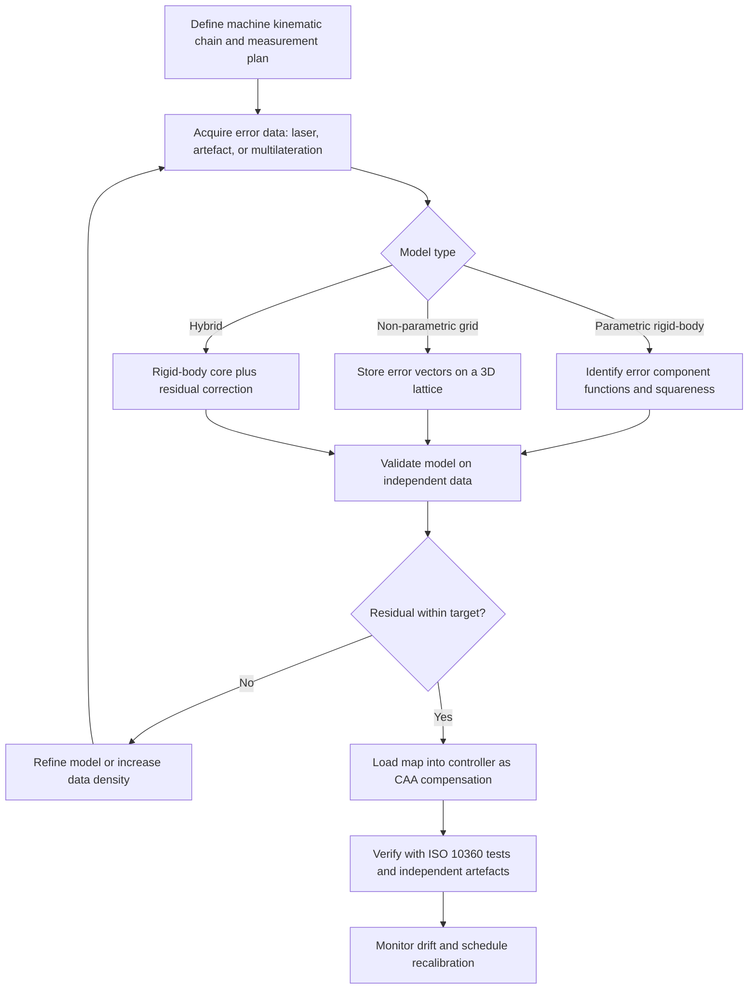

## Volumetric Error Compensation

### Overview and Purpose

Volumetric error compensation is the practice of measuring, modeling, and numerically correcting the position error of a machine's tool center point or probe tip throughout its **entire working volume**, rather than along individual axes or at a few test positions. On a coordinate measuring machine (CMM), the goal is to reduce the residual difference between the position reported by the scales and the true position of the probe tip in space, so that the machine's actual accuracy approaches the repeatability and resolution limits of its hardware.

The word *volumetric* distinguishes this approach from earlier, purely axis-wise compensation (for example, a linear positioning table for each axis). A CMM's error at a point depends on the combined effect of positioning, straightness, angular, and squareness errors, and on the lever arms through which angular errors act. Only a model that treats these errors together, as functions of the full three-dimensional position, can predict and remove the resulting volumetric error vector.

**Key Points**

- Compensation corrects **repeatable (systematic) errors**. Random errors, hysteresis that varies unpredictably, and errors that change after calibration cannot be removed by a static map.
- Compensation is applied in the controller or software, typically as part of **computer-aided accuracy (CAA)**, and is applied to every reported coordinate in real time or in post-processing.
- The achievable improvement is bounded by the repeatability of the machine, the uncertainty of the calibration measurements, and the fidelity of the error model.
- Compensation does not replace good mechanical design, rigid structure, and environmental control. It reduces the residual systematic error left over after these are in place.

### Error Sources and the Rigid-Body Model

#### The 21 Rigid-Body Errors

A three-axis Cartesian machine, treated as a chain of rigid bodies, has 21 geometric error components:

| Error Type | Per Axis | Total | Notation (axis $i$) |
| --- | --- | --- | --- |
| Linear positioning | 1 | 3 | $\delta_{ii}(i)$ |
| Straightness | 2 | 6 | $\delta_{ji}(i)$, $\delta_{ki}(i)$ |
| Angular (roll, pitch, yaw) | 3 | 9 | $\varepsilon_{ii}(i)$, $\varepsilon_{ji}(i)$, $\varepsilon_{ki}(i)$ |
| Squareness |  | 3 | $S_{XY}$, $S_{XZ}$, $S_{YZ}$ |
| **Total** |  | **21** |  |

The notation $\delta_{ji}(i)$ is commonly read as *the translational error in direction $j$ when moving along axis $i$*, and $\varepsilon_{ji}(i)$ as *the rotation about axis $j$ when moving along axis $i$*. Notation conventions vary among texts and standards (ISO 230-1 uses a related but differently formatted scheme), so confirm the convention before combining data from different sources.

Each translational and angular error is a **function of the position along its own axis** (and, in practice, may also depend weakly on the positions of other axes, temperature, and load, which is one reason volumetric compensation is an approximation).

#### Additional Error Sources

Beyond the 21 rigid-body errors, the position error at the probe tip depends on:

- **Thermal errors**: expansion of scales, structure, and workpiece, and thermal distortion of the machine geometry.
- **Load-dependent errors**: structural deformation from workpiece mass or moving-part position.
- **Dynamic errors**: acceleration-induced deflection and vibration.
- **Probing errors**: pre-travel, stylus bending, and qualification uncertainty (handled by probe compensation, not by the volumetric map).
- **Non-rigid-body errors**: local flexure of moving members, which the rigid-body model does not represent.

**Key Points**

- The rigid-body model assumes that each machine component is perfectly stiff. It is a good approximation for well-designed CMMs, but non-rigid effects set a floor on what compensation can achieve. [Inference] The size of that floor depends strongly on machine design and is best estimated from residual errors measured after compensation.

### Kinematic Error Model

#### Homogeneous Transformation Approach

The standard mathematical tool is a chain of **homogeneous transformation matrices (HTMs)**, one for each axis and one for each error-free nominal motion, combined with small-error matrices for each error component.

For an ideal (error-free) machine, the probe tip position in workpiece coordinates is obtained by multiplying the nominal axis translation matrices. For a real machine, each axis carries an error matrix:

$$T_{axis}^{actual} = T_{axis}^{nominal} \cdot E_{axis}$$

where $E_{axis}$ is the $4 \times 4$ error matrix that includes small rotations and translations for that axis:

$$E = \begin{bmatrix} 1 & -\varepsilon_z & \varepsilon_y & \delta_x \\ \varepsilon_z & 1 & -\varepsilon_x & \delta_y \\ -\varepsilon_y & \varepsilon_x & 1 & \delta_z \\ 0 & 0 & 0 & 1 \end{bmatrix}$$

Here the small-angle approximation is used ($\sin\varepsilon \approx \varepsilon$, $\cos\varepsilon \approx 1$, and products of small quantities are neglected). The matrix maps a point in the axis's local frame to its true position in the parent frame.

The actual probe tip position is the product of the chain of these matrices, applied to the tip offset vector. The **volumetric error vector** is the difference between the actual and the nominal (indicated) position:

$$\vec{E}_{vol}(x, y, z) = \vec{P}_{actual} - \vec{P}_{nominal}$$

#### Explicit First-Order Model for a Bridge-Type CMM

The exact expressions depend on the machine's kinematic chain (which axis carries which, and the order X, Y, Z from the base to the probe). For a generic chain in which the three axes are stacked in a fixed order, the first-order volumetric error components at position $(x, y, z)$ with probe offset $(a, b, c)$ are often written as:

$$E_x = \delta_{xx}(x) + \delta_{xy}(y) + \delta_{xz}(z) - y\,\varepsilon_{zx}(x) + z\,\varepsilon_{yx}(x) + \ldots$$

$$E_y = \delta_{yx}(x) + \delta_{yy}(y) + \delta_{yz}(z) + \ldots$$

$$E_z = \delta_{zx}(x) + \delta_{zy}(y) + \delta_{zz}(z) + \ldots$$

The ellipsis stands for the remaining angular-error lever-arm terms and the squareness terms, which depend on the machine layout. The specific signs and the set of terms that appear differ between machine configurations (bridge, gantry, horizontal-arm, cantilever), and the complete expressions should be derived from the machine's own kinematic chain rather than copied from another configuration.

The physical meaning of the lever-arm terms is the important point to retain. An angular error $\varepsilon$ of an axis produces a linear position error equal to the angle multiplied by the perpendicular distance from the axis's reference point to the probe tip (the **Abbe offset** or lever arm):

$$\delta_{lever} \approx \varepsilon \cdot r$$

**Example: Abbe Error from a Pitch Error**

A Z carriage has a pitch error of $2 \ \mu\text{rad}$ (about 0.4 arcsec) at a given X position, and the probe tip is $400$ mm below the carriage's reference point in Z. The resulting position error in the direction perpendicular to the lever arm is:

$$\delta = 2 \times 10^{-6} \times 400 \ \text{mm} = 0.8 \ \mu\text{m}$$

An error this small in angle produces a sub-micrometer position error, and the same angle acting over a $1000$ mm lever arm would produce $2 \ \mu\text{m}$. Because angular errors are amplified by the lever arm, extending the stylus or moving the probe far from the axis reference raises the volumetric error.

#### Squareness Contribution

A squareness error $S_{XY}$ between X and Y (a small angle in radians) makes the Y axis not perpendicular to X. A point at coordinate $y$ along Y is displaced in X by:

$$\delta_x = S_{XY} \cdot y$$

Similarly for the other squareness errors. Squareness errors are constant angles (independent of position), but their effect on position grows linearly with distance along the tilted axis.

(svg_diagram)

<svg xmlns="http://www.w3.org/2000/svg" viewBox="0 0 640 400" width="640" height="400" font-family="Arial, sans-serif" font-size="13">
<title>Volumetric Error from Angular Error and Lever Arm (svg_diagram)</title>
<rect x="0" y="0" width="640" height="400" fill="#ffffff" stroke="#cccccc" />
<text x="320" y="24" text-anchor="middle" font-size="15" font-weight="bold">Volumetric Error from Angular Error and Lever Arm (svg_diagram)</text>

<line x1="200" y1="60" x2="200" y2="340" stroke="#888" stroke-width="2" stroke-dasharray="6,4" />
<text x="208" y="75" fill="#666">Nominal Z axis</text>

<line x1="200" y1="60" x2="240" y2="340" stroke="#d33" stroke-width="3" />
<text x="250" y="130" fill="#d33">Actual axis (tilted by error angle)</text>

<circle cx="200" cy="60" r="6" fill="#345" />
<text x="214" y="58">Reference point</text>

<circle cx="200" cy="340" r="7" fill="#888" />
<text x="120" y="360" fill="#666">Nominal tip</text>

<circle cx="240" cy="340" r="7" fill="#d33" />
<text x="252" y="360" fill="#d33">Actual tip</text>

<line x1="204" y1="322" x2="236" y2="322" stroke="#2a7" stroke-width="2" />
<text x="300" y="325" fill="#2a7">Position error = angle x lever arm</text>

<line x1="150" y1="60" x2="150" y2="340" stroke="#000" stroke-width="1" />
<line x1="145" y1="60" x2="155" y2="60" stroke="#000" />
<line x1="145" y1="340" x2="155" y2="340" stroke="#000" />
<text x="60" y="205">Lever arm r</text>

<path d="M200 100 A40 40 0 0 1 206 100" fill="none" stroke="#d33" stroke-width="2" />
<text x="180" y="120" fill="#d33">error angle</text>
<text x="320" y="392" text-anchor="middle" font-size="11">Angle exaggerated for clarity. Real errors are on the order of microradians.</text>
</svg>

### Measurement Methods for Compensation Data

Volumetric compensation requires measurements that either determine the 21 error components individually or determine the volumetric error field directly. The two families are complementary.

#### Direct (Component-Based) Measurement

Each error component is measured with a dedicated instrument along its axis, and the components are then assembled through the kinematic model.

| Error | Typical Instrument |
| --- | --- |
| Linear positioning | Laser interferometer (linear optics) |
| Straightness (2 per axis) | Laser with straightness optics, or straightedge with reversal |
| Pitch and yaw | Laser with angular optics, or autocollimator |
| Roll | Electronic level, or a specialized roll measurement kit |
| Squareness | Optical square with straightness setup, or a precision square artefact |

**Advantages**: individually identified errors are physically meaningful, enabling targeted mechanical correction; the data are traceable through the instrument calibration.

**Limitations**: long measurement time (the full 21-error set can require many hours to days); roll is difficult to measure; the set-up alignment errors of the instruments feed into the results; the method captures errors only along the measurement lines (typically axis lines) and assumes that errors do not vary with the other axes' positions.

#### Indirect (Artefact-Based) Measurement

A calibrated artefact (ball plate, ball bar, hole plate, or a lattice of spheres) is measured in many positions and orientations, and the deviations from the calibrated coordinates or lengths are used to identify the error model's parameters through numerical fitting.

**Advantages**: faster, samples the interior of the volume, and aligns with the way the machine is used in practice.

**Limitations**: the artefact's own errors must be known or eliminated (for example, through reversal or multi-orientation self-calibration); parameters can be poorly separated from each other (parameter correlation), so the identified parameters may not correspond to physical errors even if the fitted map is accurate.

#### Multilateration and Tracking Methods

Instruments that measure **distance only** (a tracking laser interferometer or laser tracer, or a laser tracker used in multilateration mode) are placed at several fixed positions in or around the machine. Each measures the distance to a reflector carried by the machine at a grid of positions. Because distance measurements from at least four non-coplanar known points determine a position in space, the machine's true position at each grid point can be computed and compared with the indicated position. The distance measurements do not require the instrument's own angular axes, which reduces the influence of angular encoder errors of the instrument.

The multilateration equation for a target at unknown position $\vec{p}$, measured from stations at positions $\vec{s}_k$ with distances $d_k$, is:

$$\left\| \vec{p} - \vec{s}_k \right\| = d_k + \Delta_k, \qquad k = 1, \ldots, K$$

where $\Delta_k$ is the measurement error (including any unknown offset) of station $k$. With $K \ge 4$ stations the unknowns can be solved by least squares, and using $K > 4$ (redundancy) permits the station positions themselves to be estimated in a self-calibrating manner (this is called self-calibrating multilateration).

**Key Points**

- Multilateration yields the **volumetric error vector directly** at each grid point without assuming a specific kinematic model, but the accuracy depends on the geometry of the station layout (well-spread stations improve conditioning) and on the environmental compensation of the interferometer's refractive index.
- The measurement takes hours and requires moving the tracker or reflector, and results are influenced by air temperature gradients across the measurement path.

#### Diagonal (Vector) Measurements

The four **body diagonals** and, optionally, the **face diagonals** of the working volume are measured with a laser interferometer or a ball bar. A displacement test along a diagonal reveals the combined effect of positioning, straightness, and squareness errors, since a diagonal motion involves all three axes at once.

- Body-diagonal tests are fast and provide a useful check of volumetric performance, and have been used as a quick assessment method in machine tool standards (ISO 230-6).
- They do not separate the individual errors, and a good diagonal result can hide compensating errors (for example, two errors that cancel along the diagonal but not elsewhere). [Inference] They are best treated as a verification tool and a partial data source, not a complete identification method.

#### Comparison of Data Acquisition Methods

| Method | Data Type | Time | Isolates Individual Errors | Interior Coverage | Typical Use |
| --- | --- | --- | --- | --- | --- |
| Laser component measurements (21-error) | Direct, per component | Very long | Yes | Along axis lines only | OEM calibration, diagnosis |
| Ball plate / hole plate | Indirect, positional | Moderate | Partial | Planes within the volume | Verification, rapid recalibration |
| Ball bar in many orientations | Indirect, length | Moderate | Partial | Good | Verification, model fitting |
| Multilateration (laser tracker or tracer) | Direct volumetric | Moderate to long | No (measures the total) | Full grid | Volumetric mapping, model-free compensation |
| Body diagonals | Combined | Short | No | Diagonals only | Quick checks |

### Building the Compensation Model

#### Parametric (Kinematic) Model Approach

The errors are represented as functions of axis position through a chosen parametrization, and the coefficients are determined from the measured data.

Common parametrizations for each error component along its axis $u$:

- **Lookup table with interpolation**: values at discrete positions (for example, at a fixed pitch), with linear or spline interpolation between them. This is common for CAA maps because it directly stores the measured data.
- **Polynomial**: $\delta(u) = \sum_{n=0}^{N} a_n u^n$, with the order chosen to capture the systematic trend without overfitting.
- **Spline (cubic or B-spline)**: smooth interpolation with local control of the curve.
- **Fourier or periodic terms**: used when the error has a periodic component, for example from a scale or a rack-and-pinion drive with a known pitch. Scale-related periodic errors have a period equal to the scale pitch or its subdivisions.

The identified coefficients are found by minimizing the difference between the model's predicted volumetric error and the measured data:

$$\min_{\vec{\theta}} \sum_{m=1}^{M} \left\| \vec{E}_{meas}(\vec{p}_m) - \vec{E}_{model}(\vec{p}_m; \vec{\theta}) \right\|^2$$

where $\vec{\theta}$ collects the parameters of all error components. Because $\vec{E}_{model}$ is (to first order) linear in the parameters for a lookup-table or polynomial representation, the problem can be written as a linear least-squares problem:

$$\vec{e} = J \, \vec{\theta} + \vec{r}$$

with $\vec{e}$ the stacked measured error vector, $J$ the Jacobian (design) matrix built from the kinematic model, and $\vec{r}$ the residuals. The least-squares solution is:

$$\hat{\vec{\theta}} = \left( J^T J \right)^{-1} J^T \vec{e}$$

In practice, $J^T J$ can be ill-conditioned when parameters are correlated (for example, when a straightness error and an angular error produce nearly indistinguishable effects for the measured positions), so regularization (ridge or truncated singular value decomposition) is typically applied, and the design of the measurement positions is chosen to make $J$ well-conditioned.

**Key Points**

- **Observability**: a parameter can only be identified if the measurement positions excite it distinctively. Poorly designed measurement grids lead to parameters that are numerically unresolved.
- **Parameter correlation** means that the identified parameter values may not equal the physical errors even though the combined predicted error field is accurate. This is acceptable for compensation, but not if the individual parameters are to be used for diagnosis.

#### Non-Parametric (Model-Free) Interpolation Approach

Instead of a physical model, the volumetric error is stored on a **three-dimensional grid** (a lattice of measured error vectors at regular positions) and interpolated (trilinear, tricubic, or radial basis functions) for arbitrary positions:

$$\vec{E}(x,y,z) = \sum_{i,j,k} w_{ijk}(x,y,z) \, \vec{E}_{ijk}$$

with $w_{ijk}$ the interpolation weights and $\vec{E}_{ijk}$ the stored error vectors at the grid nodes.

**Advantages**: no kinematic model needed, captures any repeatable error including those not modeled by rigid-body theory.

**Limitations**: requires dense measurement (grid density trades off against measurement time), and the error between nodes is only as good as the interpolation; extrapolation outside the grid is unreliable; the map does not extend to variations with temperature or load unless additional measurements are made.

#### Hybrid Approaches

Practical systems often combine a parametric rigid-body core with a model-free or neural-network-based residual correction, or use a **Gaussian process** or **radial basis function** correction to absorb what the physical model fails to capture. [Unverified] Reported gains from data-driven residual models vary considerably across studies and machines, so any claimed improvement should be confirmed by an independent verification measurement on the specific machine.

### Applying the Compensation

#### Forward and Inverse Compensation

The compensation problem is usually stated as an **inverse** problem. The machine controller must find the scale reading to command so that the true tip position equals the desired position. For a CMM used as a measuring device, the more common operation is a **forward correction of the reported coordinates**: the scale reading gives an indicated position $\vec{p}_{ind}$, and the software subtracts the modeled error to report the corrected position:

$$\vec{p}_{corr} = \vec{p}_{ind} - \vec{E}_{vol}(\vec{p}_{ind})$$

Because $\vec{E}_{vol}$ is small relative to the position, evaluating it at $\vec{p}_{ind}$ rather than at the true position is a good approximation (the error introduced is a second-order effect, the product of the error and the gradient of the error field). Where higher fidelity is required, one iteration can be used:

$$\vec{p}_{corr}^{(1)} = \vec{p}_{ind} - \vec{E}_{vol}\left( \vec{p}_{ind} - \vec{E}_{vol}(\vec{p}_{ind}) \right)$$

For drive compensation (correcting commanded positions so the machine moves to the right place), the same map is applied in the opposite sense, and the controller adds the correction to the commanded axis targets.

#### Where Compensation Is Applied

- **In the controller firmware or real-time layer**: corrections applied to every scale reading, so all downstream software receives corrected coordinates.
- **In the measurement software**: corrections applied as a post-process to the recorded points (used when the controller does not support the map or for software-based compensation add-ons).
- **Both**: care must be taken to avoid **double compensation**, which occurs when a map is applied in the controller and again in the software.

**Key Points**

- Verify after loading a new map that compensation is applied **exactly once**. Double correction or a sign error doubles the error rather than removing it.
- Keep the map version, date, calibration data source, and the machine state (probe, temperature) recorded, and tie them to the machine's verification records.

### Thermal Compensation

Thermal effects are handled with a **separate compensation layer** because they vary with time and are not captured by a static map at $20 \ °C$.

#### Scale Temperature Compensation

Each axis scale is fitted with one or more temperature sensors, and the reading is corrected for scale expansion:

$$L_{corr} = L_{meas} \left[ 1 - \alpha_{scale} \, (T_{scale} - 20) \right]$$

where $\alpha_{scale}$ is the linear thermal expansion coefficient of the scale material (for example, glass-ceramic scales with a very low coefficient, or steel scales with $\alpha \approx 11.5 \times 10^{-6} \ \text{K}^{-1}$).

#### Structure Temperature Compensation

The structure (for example, aluminum or granite members) expands and distorts with temperature and thermal gradients. Compensation models predict the resulting axis errors from multiple temperature sensors placed on the structure, often as a linear combination:

$$\Delta \vec{E}_{thermal} = \sum_{k=1}^{K} \vec{c}_k \, (T_k - T_{k,ref})$$

where $T_k$ are sensor readings, $T_{k,ref}$ their reference values at calibration, and $\vec{c}_k$ coefficients determined by regression on data collected while the machine is deliberately exposed to temperature changes. More advanced models include time lags (first-order transfer functions), since a structure responds to a sensor reading with a delay.

#### Workpiece Temperature Compensation

The workpiece's expansion is corrected to the $20 \ °C$ reference using its measured temperature and known expansion coefficient:

$$\Delta L = \alpha_{wp} \, L \, (T_{wp} - 20)$$

This correction is only as good as the knowledge of $\alpha_{wp}$ (which can vary by several percent for a given alloy) and the accuracy of the temperature measurement (which requires attaching sensors to the part with good thermal contact and allowing equilibrium).

**Example: Uncertainty Amplification for Workpiece Temperature**

A $500$ mm aluminum part ($\alpha \approx 23 \times 10^{-6} \ \text{K}^{-1}$) has a measured temperature of $21.0 \ °C$ with standard uncertainty $0.1$ K, and the expansion coefficient has a standard uncertainty of $1.0 \times 10^{-6} \ \text{K}^{-1}$.

- Correction magnitude: $23 \times 10^{-6} \times 500 \times 1.0 = 11.5 \ \mu\text{m}$
- Contribution from temperature uncertainty: $23 \times 10^{-6} \times 500 \times 0.1 = 1.15 \ \mu\text{m}$
- Contribution from CTE uncertainty: $1.0 \times 10^{-6} \times 500 \times 1.0 = 0.5 \ \mu\text{m}$
- Combined: $\sqrt{1.15^2 + 0.5^2} \approx 1.25 \ \mu\text{m}$

The correction removes an $11.5 \ \mu\text{m}$ systematic effect but leaves about $1.25 \ \mu\text{m}$ of uncertainty, showing that compensation reduces bias but does not eliminate the uncertainty contribution. The values are illustrative.

**Key Points**

- Thermal compensation models are typically **valid only for the range of conditions** used to train them. Extrapolation beyond that range is unreliable.
- Thermal drift often dominates the residual error of a compensated machine in an uncontrolled environment, so environmental control remains the first line of defense.

### Validation of the Compensation

A compensation map is only trustworthy after it has been validated **with data not used to build it**.

#### Validation Procedures

1. **Independent artefact test**: measure a calibrated artefact (ball plate, ball bar, step gauge) in positions that were not part of the identification set, and compare the compensated results to the calibrated values.
2. **ISO 10360 length measurement error test**: run the standard acceptance test after loading the map to demonstrate conformance with the MPE.
3. **Diagonal checks**: laser or ball-bar measurements along the body diagonals, which act as a sensitive check on combined squareness and straightness compensation.
4. **Before-and-after comparison**: report the residual volumetric error statistics with and without compensation, to document the improvement.
5. **Repeatability check**: repeat the validation at a later date to confirm map stability.

#### Metrics

For a set of $M$ validation points with residual error vectors $\vec{r}_m$ after compensation:

$$\text{RMS}_{vol} = \sqrt{\frac{1}{M} \sum_{m=1}^{M} \left\| \vec{r}_m \right\|^2}$$

$$E_{max} = \max_m \left\| \vec{r}_m \right\|$$

The improvement ratio compares the uncompensated and compensated values:

$$\text{Improvement} = \frac{\text{RMS}_{vol,uncomp}}{\text{RMS}_{vol,comp}}$$

**Example: Validation Summary**

A machine is measured at 125 positions on a ball-plate grid.

| Condition | RMS Volumetric Error | Maximum Error |
| --- | --- | --- |
| Uncompensated | $9.8 \ \mu\text{m}$ | $21.4 \ \mu\text{m}$ |
| Compensated | $2.1 \ \mu\text{m}$ | $5.6 \ \mu\text{m}$ |

The improvement ratio is $9.8 / 2.1 \approx 4.7$. The residual is dominated by repeatability and non-modeled effects, and the values are illustrative rather than representative of a specific machine.

**Key Points**

- **Separate identification and validation datasets.** A model tested only on its training data will overstate its accuracy because a flexible model can fit the training points closely without predicting the machine well elsewhere.
- Check that the compensation improves the machine **throughout the volume**, including near the edges, where error gradients are often larger and interpolation is less reliable.
- The measurement uncertainty of the validation itself limits the smallest residual that can be demonstrated. A residual smaller than the validation uncertainty is not meaningfully resolved.

### Uncertainty of the Compensation

Compensation removes the estimated error, but the estimate itself has an uncertainty that becomes part of the machine's residual uncertainty. Contributors include:

- Uncertainty of the calibration instrument and artefact (traceability chain).
- Environmental influences during calibration (refractive index for laser measurements, temperature).
- Repeatability of the machine during the calibration measurements.
- Model error (what the model cannot represent).
- Interpolation error between calibration positions.
- Parameter estimation uncertainty from the fitting process.

The combined standard uncertainty of the compensated position is:

$$u_c = \sqrt{u_{cal}^2 + u_{env}^2 + u_{rep}^2 + u_{model}^2 + u_{interp}^2 + u_{fit}^2}$$

assuming independent contributions. The propagation of the parameter covariance through the model to a given point $\vec{p}$ can be written using the Jacobian $J_p$ of the model at that point:

$$\Sigma_{E}(\vec{p}) = J_p \, \Sigma_{\theta} \, J_p^T, \qquad \Sigma_\theta = \sigma^2 \left( J^T J \right)^{-1}$$

where $\sigma^2$ is the residual variance from the fit. This formula assumes independent, identically distributed residuals and a linear model, so it is an approximation, and it typically underestimates the true uncertainty when residuals are correlated or the model is incomplete. [Inference] In practice, a Monte Carlo simulation or an experimental validation gives a more reliable uncertainty estimate.

### Stability, Drift, and Recalibration

A compensation map represents the machine's state at the time of calibration. Several factors cause the true errors to depart from the map over time:

- **Long-term drift** from foundation settling, wear of guideways and bearings, and aging of scales and structure.
- **Thermal history**: the machine's thermal state during calibration may differ from working conditions.
- **Events**: collisions, moves, major repairs, replacement of scales or bearings, changes in air supply pressure.
- **Software or controller changes**: firmware updates may alter how the map is applied.

**Key Points**

- Define a **recalibration trigger policy** that combines a time interval with condition-based triggers (interim check results outside control limits, crash events, relocation).
- Interim checks with a stable artefact provide a low-cost indicator of map validity. A trend in the residuals signals drift before the ISO 10360 limits are exceeded.
- Store the **calibration data and model** alongside the map so that it can be re-fitted or updated (for example, partial recalibration of one axis) rather than always repeating the full procedure.

### Compensation Beyond the CMM

The same principles apply to other machines with Cartesian or articulated kinematics, and knowledge transfer is common.

- **Machine tools**: volumetric compensation of machining centers uses the same error model, with standards in the ISO 230 series (for example, ISO 230-1 for geometric accuracy, ISO 230-2 for positioning, and ISO 230-6 for diagonal tests, with related guidance on volumetric performance).
- **Articulated arm CMMs and robots**: kinematic parameter identification (for example, Denavit-Hartenberg parameters) plays the role of the error map.
- **Hexapods and parallel kinematic machines**: compensation is applied through the inverse kinematics with identified geometric parameters.
- **Rotary axes and multi-axis CMMs (with a rotary table)**: additional error components (position and orientation of the rotation axis, wobble, runout) extend the model, as described in ISO 10360-3 for the rotary table testing.

### Common Problems and Troubleshooting

| Symptom | Likely Cause | Corrective Action |
| --- | --- | --- |
| Errors doubled after loading a map | Double compensation (controller and software), or sign convention mismatch | Verify that the map is applied once, and confirm sign conventions with a test measurement |
| Good on the calibration grid, poor elsewhere | Overfitted model or coarse interpolation | Validate with independent positions, increase the grid density or reduce the model flexibility |
| Improvement in axis directions but not on diagonals | Squareness or straightness not properly modeled | Re-identify squareness, run diagonal tests, and check the kinematic model |
| Map degrades over weeks | Thermal drift, foundation movement, or wear | Improve environmental control, add thermal compensation, and schedule recalibration |
| Residual errors correlated with temperature | Insufficient thermal model | Add or reposition temperature sensors, retrain the thermal model |
| Individual parameter values look physically implausible | Parameter correlation or poor observability | Use regularization, improve the measurement design, and interpret the parameters only through the combined error field |
| Calibration results not repeatable | Unstable machine, environment, or artefact mounting | Check the machine for looseness, control the temperature, and improve the artefact fixturing |
| Laser-based results inconsistent | Refractive index compensation error, misaligned optics (cosine error) | Verify the environmental sensors, realign the optics, and check the dead-path correction |
| Errors at the edges of the volume | Extrapolation, end-of-travel effects, and non-rigid-body flex | Extend the calibration grid beyond the working range, and inspect the mechanical condition |

### Best Practices

**Key Points**

- Establish the **mechanical and environmental baseline first**. Compensation cannot recover accuracy lost to loose components, poor foundations, or uncontrolled temperature.
- Choose the **measurement strategy** (component, artefact, multilateration, or a combination) according to the goal: diagnosis favors component measurements, while fast recalibration favors artefact methods.
- Design the measurement positions for **observability** so that all model parameters are excited and the fit is well-conditioned.
- Use **redundant data** and independent validation to guard against overfitting and to estimate the residual uncertainty realistically.
- Keep the **thermal model** separate from the geometric map, and verify it under the range of temperatures the machine will experience.
- Ensure the map is applied **exactly once**, with the correct sign, and confirm this with a post-load test.
- Verify with **ISO 10360** tests and independent artefacts after every map update, and record the results.
- Maintain complete **records**: the calibration data, model version, environmental conditions, instrument certificates, and validation results.
- Monitor **drift** through interim checks, and set the recalibration policy on evidence rather than on a fixed interval alone.
- Treat the map as **valid only for the configuration** it was built for (probe system, loading conditions, temperature range), and re-verify after major changes.

### Conclusion

Volumetric error compensation combines a physical or numerical model of the machine's geometric errors with calibration data collected by laser, artefact, or multilateration methods, and applies the resulting error field to correct every measured coordinate. The 21 rigid-body errors, acting through lever arms and squareness relationships, form the basis of the parametric approach, while grid-based interpolation and hybrid models handle the errors that a rigid-body theory does not represent. Because the correction removes only repeatable errors, its benefit is bounded by machine repeatability, calibration uncertainty, thermal stability, and model fidelity, and it must be validated with independent data and verified against ISO 10360 tests. Effective practice pairs compensation with environmental control, thermal modeling, careful application to avoid double correction, drift monitoring, and a recalibration policy grounded in evidence, so that the improved accuracy is sustained throughout the machine's service life.

**Related Topics**

- The 21-error rigid-body model and homogeneous transformation matrices
- Laser interferometer calibration and environmental (refractive index) compensation
- Ball plate, ball bar, and hole plate artefact-based calibration
- Multilateration and self-calibrating laser tracker methods
- Thermal error modeling and temperature sensor placement
- Non-rigid-body error, load, and dynamic compensation
- Computer-aided accuracy (CAA) map formats and controller implementation
- Regularization and observability in parameter identification
- ISO 230 series (geometric accuracy, positioning, diagonal tests) and ISO 10360 verification
- Drift monitoring and recalibration interval policy
- Volumetric compensation for machine tools, robots, and articulated arm CMMs