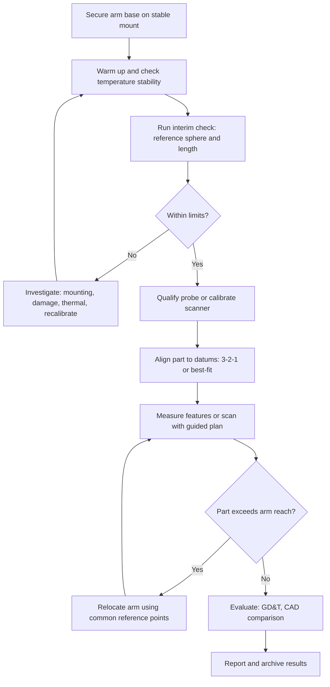

## Portable Measuring Arms

### Overview and Purpose

A portable measuring arm, formally an **articulated arm coordinate measuring machine (AACMM)**, is a hand-positioned coordinate measuring system built from rigid tubular segments joined by rotary joints, each fitted with an angular encoder. The operator moves a probe or scanner at the distal end to a point of interest. The controller reads all joint angles and computes the probe position by **forward kinematics** from the known link lengths and offsets. Portable arms are typically clamped or magnetically mounted to a bench, a machine tool, a fixture, or a granite plate, and can be carried to the part rather than requiring the part to be brought to a laboratory.

The defining trade-off is **portability and access versus accuracy**. A bridge CMM measures with three linear scales on a rigid Cartesian structure, whereas an arm measures with several rotary encoders whose angular errors are multiplied by link lengths (the lever-arm effect). As a result, arms generally achieve lower accuracy than a good bridge CMM of comparable working volume, but they reach into positions no fixed machine can and can be deployed on the shop floor.

**Key Points**

- An arm is a **serial kinematic chain**: each joint's angular error propagates through every link that follows it, so joints near the base contribute the largest position errors for a given angular error.
- Arms are commonly built with **6 or 7 axes**. Six axes provide full position and orientation of the probe, and a seventh axis (usually rotation near the handle) provides extra access for line scanners and comfortable hand positioning.
- Typical applications include first-article and in-process inspection, reverse engineering, tool and fixture alignment, large-part inspection, and measurement in confined or awkward spaces.
- Performance is specified under ISO 10360-12 (articulated arm CMMs), and results depend on operator technique, temperature, and mounting rigidity, so a stated specification must be interpreted in light of these factors.

### Architecture and Components

#### Mechanical Structure

The arm consists of a base, a series of links (segments), rotary joints, and a probe or scanner mount. Segments are usually made of **carbon fiber** or aluminum, chosen for stiffness, low weight, and low thermal expansion (carbon fiber offers a low coefficient of thermal expansion along the fiber direction, which helps thermal stability).

| Component | Function |
| --- | --- |
| Base | Mounts to a stable surface (magnetic, vacuum, threaded, or clamped) and houses the first joint |
| Links (segments) | Rigid tubes of defined length connecting joints |
| Joints | Rotary bearings with angular encoders, usually arranged in shoulder, elbow, and wrist groups |
| Counterbalance | Spring or pneumatic mechanism that offsets arm weight so the operator feels near-neutral load |
| Probe or scanner mount | Kinematic or quick-change interface for touch probes, hard probes, and laser scanners |
| Controller and electronics | Encoder signal processing, temperature sensing, communication, and often onboard batteries and wireless |

#### Joint Arrangement and Degrees of Freedom

A 6-axis arm is typically arranged as a **shoulder** (2 rotations), **elbow** (2 rotations), and **wrist** (2 rotations), often described as a 2-2-2 layout. A 7-axis arm adds an additional rotation, commonly a 2-2-3 layout, where the extra rotation lies at the wrist and lets the operator rotate a scanner around its own axis without changing the wrist position.

Some joints are **continuous** (unlimited rotation) and others have limited travel. Joint types alternate between **swivel** (rotation about the link's own axis, roll) and **hinge** (rotation about an axis perpendicular to the link, pitch) motions.

(svg_diagram)

<svg xmlns="http://www.w3.org/2000/svg" viewBox="0 0 680 380" width="680" height="380" font-family="Arial, sans-serif" font-size="13">
<title>Articulated Arm CMM Kinematic Chain, 7-Axis Layout (svg_diagram)</title>
<rect x="0" y="0" width="680" height="380" fill="#ffffff" stroke="#cccccc" />
<text x="340" y="24" text-anchor="middle" font-size="15" font-weight="bold">Articulated Arm CMM Kinematic Chain, 7-Axis Layout (svg_diagram)</text>

<rect x="40" y="300" width="90" height="26" fill="#9aa9b8" stroke="#345" stroke-width="2" />
<text x="85" y="345" text-anchor="middle">Base (mount)</text>

<line x1="85" y1="300" x2="85" y2="215" stroke="#345" stroke-width="10" stroke-linecap="round" />

<circle cx="85" cy="300" r="10" fill="#d33" />
<circle cx="85" cy="215" r="10" fill="#d33" />
<text x="105" y="262" fill="#d33">J1 J2 shoulder</text>

<line x1="85" y1="215" x2="270" y2="130" stroke="#345" stroke-width="10" stroke-linecap="round" />

<circle cx="270" cy="130" r="10" fill="#28a" />
<text x="235" y="108" fill="#28a">J3 J4 elbow</text>

<line x1="270" y1="130" x2="470" y2="200" stroke="#345" stroke-width="10" stroke-linecap="round" />

<circle cx="470" cy="200" r="10" fill="#3a3" />
<circle cx="520" cy="225" r="10" fill="#3a3" />
<circle cx="555" cy="250" r="10" fill="#3a3" />
<text x="440" y="180" fill="#3a3">J5 J6 J7 wrist</text>

<line x1="555" y1="250" x2="600" y2="300" stroke="#555" stroke-width="5" stroke-linecap="round" />
<circle cx="606" cy="308" r="9" fill="#d33" stroke="#611" />
<text x="620" y="335" text-anchor="end">Probe tip</text>

<text x="340" y="365" text-anchor="middle" font-size="11">Each joint carries an angular encoder. Encoder errors act through the downstream link lengths.</text>
</svg>

#### Angular Encoders

Each joint contains a high-resolution rotary encoder, typically an optical circular-scale encoder with interpolation, though other technologies exist. Encoder accuracy, resolution, eccentricity (mounting offset of the scale relative to the bearing axis), and thermal behavior are central to arm accuracy. Many arms use **multiple read heads** per joint to average out eccentricity and graduation errors, and may include on-board joint temperature sensors.

#### Counterbalance and Ergonomics

The counterbalance keeps the arm from drooping and reduces operator effort. It also affects measurement quality because uneven or excessive contact forces deflect the links and the probe. Arms are designed to be used with a **light, consistent touch**, since operator-applied force introduces link bending and joint bearing deflection that the kinematic model does not capture.

### Kinematic Model and Coordinate Computation

#### Forward Kinematics

The probe tip position is computed by chaining one homogeneous transformation per joint. The widely used **Denavit-Hartenberg (DH)** convention describes each link with four parameters: link length $a_i$, link twist $\alpha_i$, link offset $d_i$, and joint angle $\theta_i$. The transformation from frame $i-1$ to frame $i$ is:

$$T_{i-1}^{i} = \begin{bmatrix} \cos\theta_i & -\sin\theta_i \cos\alpha_i & \sin\theta_i \sin\alpha_i & a_i \cos\theta_i \\ \sin\theta_i & \cos\theta_i \cos\alpha_i & -\cos\theta_i \sin\alpha_i & a_i \sin\theta_i \\ 0 & \sin\alpha_i & \cos\alpha_i & d_i \\ 0 & 0 & 0 & 1 \end{bmatrix}$$

The tip position in the base frame is obtained by multiplying the joint transforms and the probe offset:

$$\begin{bmatrix} \vec{p}_{tip} \\ 1 \end{bmatrix} = T_0^1(\theta_1) \, T_1^2(\theta_2) \cdots T_{n-1}^n(\theta_n) \begin{bmatrix} \vec{p}_{probe} \\ 1 \end{bmatrix}$$

where $\vec{p}_{probe}$ is the probe tip offset in the last link frame, and $n$ is the number of joints (6 or 7). The DH convention is one common parametrization, and manufacturers may use modified DH or other schemes (for example, the Hayati-Mirmirani modification to handle near-parallel adjacent joint axes). Nominal versus identified parameter values differ, and the identified values are stored in the arm's calibration file.

#### Error Propagation from Joint Angles

For a small angular error $\delta\theta_i$ at joint $i$, the resulting tip position error is approximately the cross product of the joint's rotation axis with the vector from the joint to the tip:

$$\delta \vec{p} \approx \delta\theta_i \, \hat{z}_i \times \left( \vec{p}_{tip} - \vec{p}_i \right)$$

The magnitude is therefore $\delta\theta_i \cdot r_i \cdot \sin\phi_i$, where $r_i$ is the distance from joint $i$ to the tip and $\phi_i$ is the angle between the joint axis and that vector. This is the source of the lever-arm effect.

**Example: Encoder Error Contribution**

A joint near the base has an angular error of $2$ arcseconds (about $9.7 \ \mu\text{rad}$), and the tip is $1.2$ m from that joint, perpendicular to the joint axis:

$$\delta p = 9.7 \times 10^{-6} \times 1200 \ \text{mm} \approx 11.6 \ \mu\text{m}$$

A wrist joint with the same angular error and a $0.15$ m lever arm contributes only about $1.5 \ \mu\text{m}$. This illustrates why base-joint encoders dominate the error budget and why measurements are more accurate when the probe is close to the base.

#### Combined Uncertainty from Multiple Joints

Assuming independent joint errors, the tip position variance in a given direction is approximately the sum of the contributions from each joint:

$$\sigma_p^2 \approx \sum_{i=1}^{n} \left( \sigma_{\theta_i} \, r_i \sin\phi_i \right)^2 + \sigma_{other}^2$$

where $\sigma_{other}^2$ collects link-length, temperature, and mechanical (bearing, flexure) contributions. This is a first-order approximation, since real errors are correlated (for example, through shared temperature effects) and depend on the arm's pose.

### Probing and Sensing Systems

#### Contact Probes

| Probe Type | Description | Typical Use |
| --- | --- | --- |
| **Hard (fixed) probe** | A rigid stylus with a ball tip. The operator presses the tip against the surface and captures a point with a button or foot pedal | Simple, robust, no trigger mechanism. Point quality depends on the operator's touch |
| **Touch-trigger probe** | Kinematic-seat probe that emits a trigger on contact, capturing the joint angles at the trigger instant | More consistent point capture than a hard probe, less dependent on operator force |
| **Analog or scanning contact probe** | Continuous contact sensing (less common on arms) | Form measurement |

With a hard probe, contact force and direction are controlled by hand, which is a significant contributor to point-to-point variation. A touch-trigger probe reduces this effect by triggering at a defined contact force, though the operator must still approach in a controlled manner.

The tip is a sphere, so the same **probe compensation** used on bridge CMMs applies: the software offsets the measured tip center by the effective tip radius along the surface normal.

$$\vec{P}_{surface} = \vec{P}_{center} - r_{eff} \, \hat{n}$$

#### Laser Line Scanners

A laser line scanner is often mounted on the arm's wrist and captures thousands of points per line at high frame rates as the operator sweeps it over the surface. The scanner geometry relates the imaged laser line to 3D coordinates by triangulation, and the arm supplies the scanner's pose so that each line's points are transformed into the arm's coordinate system.

**Key Points**

- The overall scanning accuracy combines the **arm's pose accuracy** and the **scanner's own accuracy**, so it is worse than either alone. Manufacturers usually quote a separate scanning system accuracy figure.
- Scanner performance depends on surface reflectivity, color, angle of incidence, and stand-off distance. Shiny or dark surfaces can degrade data or require a matte spray. [Inference] Coatings add thickness (usually a few micrometers), which can matter for tight-tolerance work.
- The scanner-to-arm calibration (determining the scanner's frame relative to the arm's end frame) is a critical step, and its residual error appears as a systematic offset in scanned data.

The sensor combination is verified using ISO 10360-8 (optical distance sensors) principles, together with arm-specific parts, and the exact test procedures depend on the standard's edition.

#### Other Sensors

- **Non-contact spot sensors** (for example, chromatic confocal or laser point sensors) for small features.
- **Structured-light or video sensors** on some platforms.
- **Tracking or hybrid systems**, where an arm is combined with a laser tracker or photogrammetry to extend the measuring volume or improve accuracy.

Sensor change interfaces (quick-connect couplings with kinematic repeatability) allow the operator to swap probes and scanners, with re-calibration or a repeatable interface reducing the need for full requalification.

### Calibration of the Arm

#### Kinematic Parameter Identification

Nominal link lengths and joint offsets are known only approximately after manufacturing. Calibration identifies the **actual kinematic parameters** (link lengths, offsets, axis misalignments, encoder eccentricity, and often bearing runout terms) by measuring known reference geometry in many arm configurations, then optimizing the parameters so that the computed positions agree with the reference.

A common formulation minimizes the difference between the kinematic model's predicted tip positions (or predicted distances) and the reference values:

$$\min_{\vec{\kappa}} \sum_{m=1}^{M} \left\| \vec{p}_{ref,m} - f\left(\vec{\theta}_m; \vec{\kappa}\right) \right\|^2$$

where $\vec{\kappa}$ is the vector of kinematic parameters, $\vec{\theta}_m$ are the joint readings for the $m$-th measurement, and $f$ is the forward kinematic function. The problem is nonlinear in $\vec{\kappa}$ and is solved iteratively (for example, by Levenberg-Marquardt), with linearization giving the **Jacobian** of the model with respect to parameters.

The iterative update is:

$$\Delta \vec{\kappa} = \left( J^T J + \lambda I \right)^{-1} J^T \vec{r}$$

with $\vec{r}$ the residual vector, $J$ the Jacobian, and $\lambda$ the damping parameter.

**Reference Geometry Used**

| Reference | Principle |
| --- | --- |
| **Single reference sphere or a fixed point (a cone or cup) probed from many orientations** | The arm measures the same physical point from many joint configurations. The distribution of computed positions reveals kinematic errors, since in an ideal model the computed point would be constant (**point-to-point self-consistency**) |
| **Ball bar or a calibrated length artefact** | Measured length compared with the calibrated length in many positions and orientations |
| **Multiple spheres at known separation (ball plate)** | Provides many known distances and positions |
| **Laser tracker or other external reference** | Independent measurement of the tip position for absolute error mapping |

**Key Points**

- The **point-to-point (single-point) test** is sensitive to joint-related errors but blind to some scale errors, such as an error in one link length that shifts all computed points consistently. A length test with a calibrated bar provides the complementary information.
- Both self-consistency and traceable length artefacts are used, because a purely self-consistent calibration cannot determine the absolute scale.
- Calibration is generally carried out by the manufacturer or an accredited service provider, with the resulting parameters stored in the arm's memory or a calibration file.

#### Temperature Compensation

Arms usually contain **temperature sensors** distributed along the links and joints. The software corrects link lengths for thermal expansion:

$$L_{corr,i} = L_{0,i} \left[ 1 + \alpha_i \, (T_i - T_{ref}) \right]$$

where $\alpha_i$ is the thermal expansion coefficient of link $i$, $T_i$ its measured temperature, and $T_{ref}$ the reference (calibration) temperature, often $20 \ °C$. Carbon-fiber links have a low longitudinal expansion coefficient, while joints, bearing housings, and aluminum parts expand more, so thermal compensation is only partial. Rapid ambient temperature changes cause **thermal gradients** that the sensors and model cannot fully capture, and these produce errors that are difficult to predict.

**Key Points**

- Allow the arm to reach **thermal equilibrium** after switching on and after moving between environments (often stated as a warm-up period by the manufacturer).
- Avoid direct sunlight, drafts, heat sources, and localized temperature gradients around the arm.
- Workpiece temperature must also be considered, and part temperature correction applies as for any dimensional measurement.

### Accuracy Specification and Verification

#### ISO 10360-12

**ISO 10360-12** specifies acceptance and reverification tests for articulated arm CMMs. The standard defines the tests, and the manufacturer specifies MPE values. Typical test elements include:

| Test | Description | Characterizes |
| --- | --- | --- |
| **Probing form error ($P_{Form}$)** | Measure a reference sphere at a defined number of points from a defined set of arm orientations | Local repeatability and form of the probing |
| **Probing size error ($P_{Size}$)** | Difference between the measured and the calibrated sphere diameter | Size accuracy of the probing system |
| **Probing dispersion or location error ($L_{Dia}$)** | Spread in the measured sphere center when the sphere is probed with the arm in different configurations | Kinematic consistency (point-to-point repeatability) |
| **Length measurement error ($E$)** | Measure calibrated lengths (for example, a ball bar or step gauge) in a range of positions and orientations | Volumetric length accuracy |
| **Scanning probing tests (for scanners)** | Measure a reference sphere or artefact with the scanner | Scanner accuracy as a system on the arm |

Specific parameter names, numbers of positions, and acceptance rules depend on the edition and on the manufacturer's stated MPE, so verify against the edition cited. [Unverified] Details of the required test geometry and the number of orientations should be checked against the current published standard before performing an acceptance test.

**Interpreting Specifications**

Arm accuracy is often quoted as one or more numbers such as a **point repeatability** (the spread of a single point measured from various arm orientations) and a **volumetric accuracy** (the maximum length error over the working volume). These differ in meaning and magnitude:

- **Single-point articulation performance** is generally the tightest number, describing kinematic self-consistency.
- **Volumetric length accuracy** is larger, because it includes scale-type errors and errors that vary across the volume.
- **Scanning system accuracy** combines the arm with the scanner and is larger again.

**Key Points**

- Compare specifications only when they refer to the **same test definition** (for example, the same edition of the standard and the same probing configuration).
- Manufacturers' figures represent performance under **specified conditions** (temperature range, operator technique, mounting, stylus length), and real-world results may be worse if these are not met.
- The accuracy quoted for the arm does not equal the uncertainty of a particular measurement task, which requires a task-specific evaluation.

#### Interim Checks

Frequent checks between formal verifications include:

- **Reference sphere check**: measure a calibrated sphere (or a "certificate" artefact provided with the arm) from several orientations, and monitor the diameter, form, and center dispersion.
- **Length check** with a ball bar or step gauge across the volume.
- **Trend charting** of results to detect drift or damage early, particularly after a knock or a drop.

Arms are also verified after any **impact or drop**, since a hard shock can alter joint alignment, bearing preload, or encoder mounting.

### Measurement Technique and Operator Effects

Because the arm is hand-guided, operator technique is a first-order influence on the result. Good practice includes:

- **Consistent, light contact force** and a smooth approach to the surface, particularly with hard probes.
- **Normal approach** to the surface, reducing errors from tip lateral sliding and stylus bending.
- **Measuring within a favorable pose**: avoid extreme joint angles, fully stretched positions, and near-singular configurations, where small angular errors give large tip displacements.
- **Keeping the arm close to the base** where possible, since the lever arm is shorter.
- **Repositioning the arm** (moving the base or using a leapfrog method) rather than stretching to the limit of its reach.
- **Avoiding leaning on the arm** or the part, which deflects the structure.
- **Minimizing the time between the reference measurement and the feature measurements**, to reduce thermal drift effects.

#### Extending the Measuring Volume: Leapfrogging and Relocation

When the part exceeds the arm's reach, the arm (or the part) is moved, and the coordinate systems are related through **common reference points**, often fixed reference spheres or target holes measured from both positions. The process (leapfrogging) chains the transformations from position to position:

$$T_{total} = T_{1} \cdot T_{2} \cdots T_{k}$$

Each relocation adds registration uncertainty, and errors accumulate along the chain. [Inference] The accumulated uncertainty depends on the number, spread, and quality of the common points, so using well-distributed reference points with low measurement noise and a small number of relocations improves the result.

Registration between two arm positions uses the same rigid-transform estimation as any point-set alignment, minimizing:

$$\min_{R, \vec{t}} \sum_{i=1}^{N} \left\| R \, \vec{a}_i + \vec{t} - \vec{b}_i \right\|^2$$

where $\vec{a}_i$ and $\vec{b}_i$ are the coordinates of the $i$-th common reference point as measured from the first and second arm positions, respectively. At least three non-collinear points are required, and more (well distributed) improve the estimate of the rotation.

### Mounting, Stability, and Environment

#### Mounting

- Mount on a **rigid, stable** base: a granite table, a heavy steel plate, a machine bed, or a purpose-made stand. A flexible or vibrating base directly degrades results.
- Common mounting options: magnetic base, vacuum base, bolted interface, and portable tripod or roller stand.
- Verify that the base is tightly secured and that no movement occurs during use, since base movement changes the whole coordinate system.
- **Vibration** from nearby machinery is a common problem on the shop floor, so use isolation where practical, or measure when the machinery is idle.

#### Environmental Conditions

Manufacturers specify an **operating temperature range** (often a wider range than for a laboratory CMM, reflecting shop-floor use) and a **temperature rate-of-change limit**. Arms can be used in less controlled environments than a bridge CMM, but the accuracy specification holds only within its stated conditions, and performance degrades outside them.

### Software, Data Handling, and Workflow

- **Feature measurement**: the arm's software supports the same basic geometry features (planes, circles, cylinders, spheres, cones) and alignment methods as CMM software, including 3-2-1 and best-fit alignments.
- **Guided inspection**: many packages provide a step-by-step display that guides the operator through the measurement plan, with on-screen prompts and audio or visual feedback when a point is captured.
- **CAD comparison**: scanned or probed data are compared with the nominal CAD model, producing color deviation maps and GD&T evaluations.
- **Point cloud and mesh processing**: filtering, decimation, meshing, and export to standard formats for reverse engineering.
- **Reporting and integration**: reports, statistical output, and export to quality systems.

Datum alignment and fitting follow the same principles as for other CMMs (see the topics on datum setup and part programming). The main difference is that the **operator** provides the motion, so manual point capture and path selection replace automatic path generation, though semi-automated and robot-mounted arm solutions exist.

### Comparison with Other Measuring Systems

| Attribute | Bridge CMM | Portable Arm | Laser Tracker |
| --- | --- | --- | --- |
| Portability | Fixed installation | High | High |
| Typical working volume | Small to medium | Small to medium (roughly up to a few meters reach) | Large (tens of meters range) |
| Typical accuracy level | Highest | Moderate | Good over large volumes (micrometer-level per meter scale, depending on model) |
| Access to hidden features | Limited by stylus and head | Very good | Requires line of sight |
| Environment tolerance | Requires a controlled environment | Tolerates shop-floor conditions better | Sensitive to air conditions over long paths |
| Operator dependence | Low (automated) | Higher (hand-guided) | Moderate |
| Scanning capability | Contact and optical | Laser line scanners common | Typically point-based, with scanning accessories |
| Cost | High | Moderate | Moderate to high |

Numerical accuracy comparisons depend heavily on model and configuration, so the table describes general relationships rather than specific values.

### Uncertainty Considerations

A task-specific uncertainty for an arm measurement includes:

- **Arm kinematic accuracy** (encoder, link, and joint errors as calibrated and residual).
- **Probing or scanning system error** (tip form and size, scanner noise, surface interaction).
- **Operator and contact effects** (force, direction, approach).
- **Temperature effects** (arm, part, and gradients).
- **Mounting and stability** (base movement, vibration).
- **Alignment and registration** (datum feature quality, number of relocations).
- **Sampling and fitting** (number and distribution of points, form error of the feature).
- **Software and evaluation effects** (fitting algorithm, filtering).

A simplified combination of independent components is:

$$u_c = \sqrt{u_{arm}^2 + u_{probe}^2 + u_{operator}^2 + u_{temp}^2 + u_{mount}^2 + u_{align}^2 + u_{sampling}^2}$$

Because operator and pose effects are hard to model analytically, **experimental methods** are often preferred: repeated measurements by multiple operators (a gauge R&R study), and the substitution method with a calibrated reference part of similar geometry (in the spirit of ISO 15530-3). The ISO 15530 series addresses task-specific uncertainty for CMMs, and its applicability to arms depends on how the method is adapted, so confirm the intended use.

**Example: Gauge R&R Consideration**

If a bore diameter tolerance is $\pm 0.05$ mm (total tolerance band $0.10$ mm) and a repeatability and reproducibility study on the arm yields a measurement system standard deviation $\sigma_{GRR} = 8 \ \mu\text{m}$, the fraction of the tolerance consumed is:

$$\%GRR_{tol} = \frac{6 \times 8 \ \mu\text{m}}{100 \ \mu\text{m}} \times 100\% = 48\%$$

This would typically be considered unsuitable for the characteristic under common acceptance guidelines (for example, thresholds of 10% and 30% used in some quality manuals). The arm may still be appropriate for looser tolerances, or a different instrument may be needed. The values are illustrative.

### Common Problems and Troubleshooting

| Symptom | Likely Cause | Corrective Action |
| --- | --- | --- |
| Inconsistent point positions from different arm poses | Kinematic parameter drift, damaged joint, loose stylus | Run the reference sphere check, tighten fittings, and recalibrate if needed |
| Results shift during a session | Base movement, thermal drift, or a loosened mount | Re-secure the base, allow warm-up, check the environment |
| Larger errors at full extension | Lever-arm effect, structural deflection | Reposition the arm closer to the feature, use a shorter reach |
| Scanner data show step offsets between passes | Scanner calibration error, arm pose error, or thermal change | Recalibrate the scanner, check temperature, and reduce the scan volume per setup |
| Noisy or missing scanner points | Reflective or dark surface, incorrect stand-off or angle | Adjust the angle and distance, apply a matting coating if allowed |
| Probe results vary with operator | Inconsistent contact force and approach direction | Standardize technique, use a touch-trigger probe, and provide training |
| Accuracy degraded after a drop | Joint or encoder misalignment, bearing damage | Perform a full verification and a service recalibration |
| Registration error after relocation | Poor common points, insufficient spread, or movement of references | Use more well-distributed, stable reference points |
| Communication dropouts (wireless) | Interference, low battery, or cable fault | Check connections and power, and test with a cable if available |
| Feature results differ from a bridge CMM | Different alignment, fitting, filtering, and inherent accuracy | Compare using a common calibrated artefact and harmonize methods |

### Best Practices

**Key Points**

- Mount the arm on a **rigid, stable, vibration-free** base and confirm it is secure before each session.
- Allow a **warm-up and thermal stabilization** period, and avoid drafts, sunlight, and rapid temperature changes.
- Perform a **daily or per-use check** with a reference sphere or a calibrated artefact, and record and chart the results.
- Use **light, consistent contact** and a normal approach to the surface, and use a touch-trigger probe where the tolerance demands better point consistency.
- Keep the probe **close to the arm's base** and avoid fully extended or awkward poses when accuracy matters.
- **Qualify the probe** and calibrate the scanner as required, and repeat after any stylus change or impact.
- Minimize **arm relocations**, and use well-distributed, stable common reference points when relocation is necessary.
- Choose the arm and sensor to match the **tolerance**, and confirm suitability with a gauge R&R or reference-part study rather than relying only on the datasheet figure.
- **Handle the arm carefully**: use the transport case, lock the joints as directed, and avoid drops and knocks.
- Maintain a **verification and recalibration schedule** according to the manufacturer's recommendation and the quality system, and reverify after any incident.
- Document the **measurement method** (probe, points, alignment, operator, environment) so that results are reproducible and auditable.

### Conclusion

Portable measuring arms bring coordinate measurement to the part by chaining rotary joints and encoders into a hand-positioned serial kinematic system, with the probe position computed through a calibrated forward kinematic model. Their strengths are portability, access to awkward geometry, and tolerance of shop-floor conditions, while their limitations arise from the lever-arm amplification of angular errors, thermal sensitivity, structural flexibility, and dependence on operator technique. Accuracy is characterized by ISO 10360-12 style probing, dispersion, and length error tests, and is sustained through kinematic calibration, temperature compensation, frequent interim checks, and disciplined measurement practice. Because operator and pose effects are difficult to model, task suitability is best confirmed experimentally, and results on tight-tolerance features should be evaluated against a documented uncertainty and decision rule.

**Related Topics**

- ISO 10360-12: acceptance and reverification tests for articulated arm CMMs
- Denavit-Hartenberg kinematic modeling and parameter identification
- Encoder errors, eccentricity, and lever-arm error propagation
- Laser line scanner calibration and scanner-to-arm registration
- Laser trackers and hybrid arm-tracker systems
- Multi-position registration, leapfrogging, and reference point strategies
- Temperature compensation and thermal behavior of carbon-fiber structures
- Task-specific uncertainty and gauge R&R for portable measurement
- Reverse engineering workflows using arm-mounted scanners
- Arm mounting, fixturing, and vibration control on the shop floor